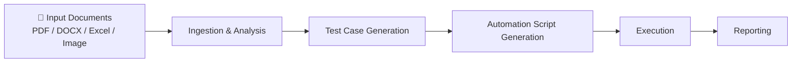
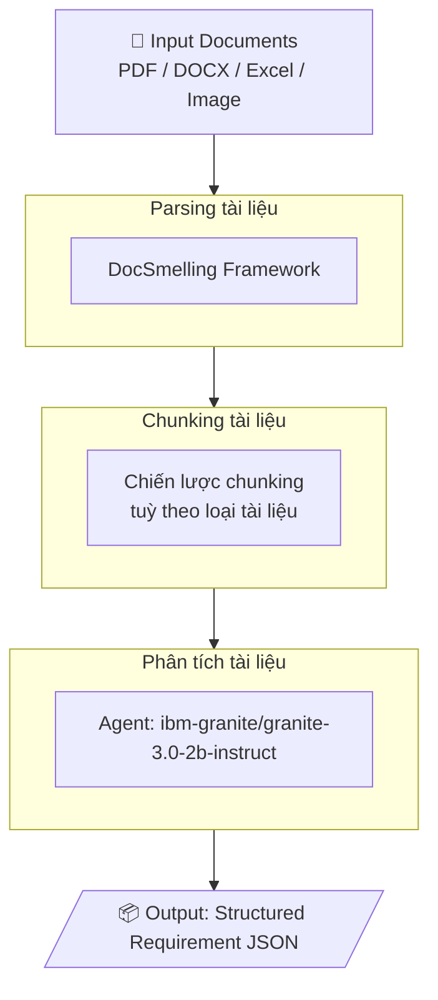
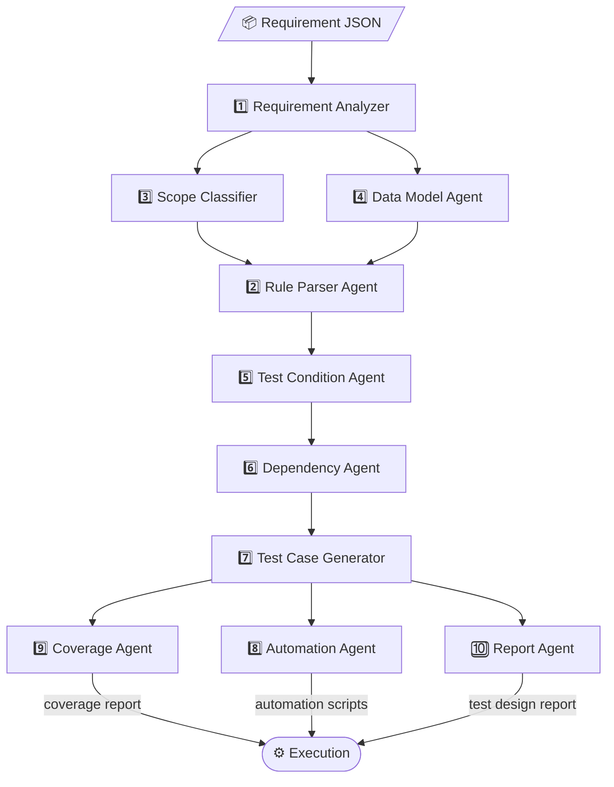
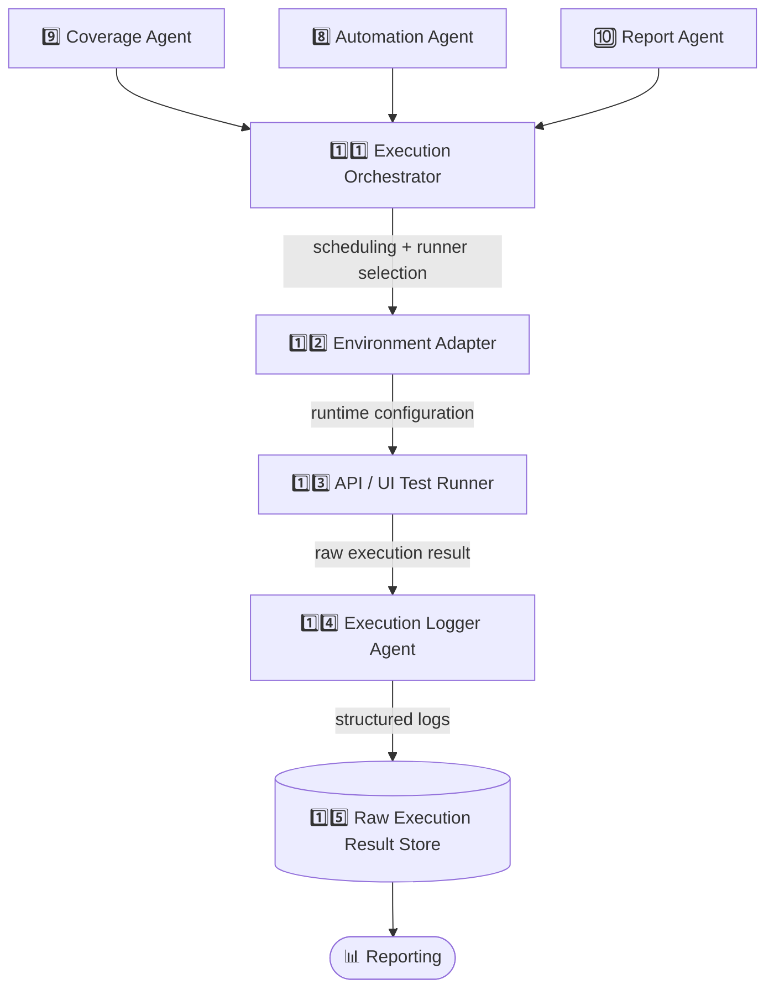
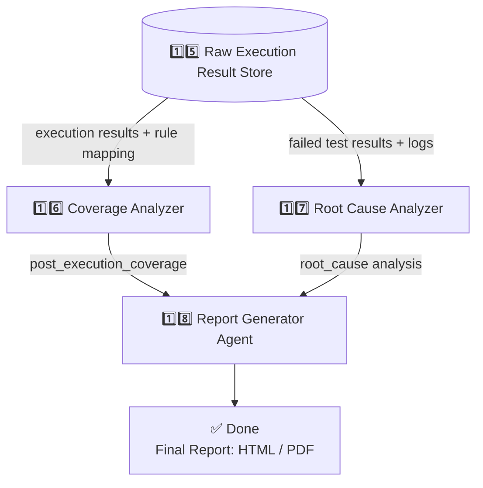
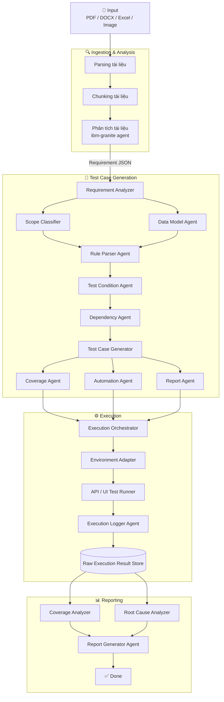

# Auto AT – Flowchart Documentation

---

## Table of Contents

1. [System Pipeline](#1-system-pipeline)
2. [Ingestion & Analysis](#2-ingestion--analysis)
3. [Test Case Generation](#3-test-case-generation)
4. [Execution](#4-execution)
5. [Reporting](#5-reporting)
6. [Full System Summary](#6-full-system-summary)
7. [Agents Purpose – Chi tiết](#7-agents-purpose--chi-tiết)

---

## 1. System Pipeline

Luồng tổng quan của toàn bộ hệ thống tự động hoá kiểm thử.



---

## 2. Ingestion & Analysis

Giai đoạn tiếp nhận và phân tích tài liệu đầu vào.



**Output mẫu:**

```json
{
  "requirement_id": "REQ-LOGIN-01",
  "type": "API",
  "description": "User login",
  "rules": [
    "username is required",
    "password is required"
  ]
}
```

---

## 3. Test Case Generation

Giai đoạn chuyển requirement thành kịch bản kiểm thử.

**Mục tiêu:**
- Chuyển requirement → kịch bản kiểm thử
- Tiêu chí đánh giá: độ bao phủ, có tính hệ thống, không trùng lặp, tách biệt FE và BE



---

## 4. Execution

Giai đoạn thực thi automation test trên hệ thống thật.



---

## 5. Reporting

Giai đoạn phân tích kết quả và sinh báo cáo cuối.



---

## 6. Full System Summary

Toàn bộ luồng hệ thống từ đầu đến cuối.



---

## 7. Agents Purpose – Chi tiết

### Agent 1 – Requirement Analyzer

| | |
|---|---|
| **Mục tiêu** | Hiểu ý định nghiệp vụ và ngữ cảnh của requirement, làm cơ sở cho các bước phân tích tiếp theo |
| **Input** | Requirement (text hoặc JSON) |
| **Process** | Trích xuất intent, domain; Chuẩn hoá metadata của requirement |
| **Output** | `{ "requirement_id": "REQ-LOGIN-01", "intent": "User authentication", "domain": "Security" }` |

---

### Agent 2 – Rule Parser Agent

| | |
|---|---|
| **Mục tiêu** | Chuyển rule dạng ngôn ngữ tự nhiên thành constraint máy hiểu được |
| **Input** | Rule text |
| **Process** | NLP parsing; Ánh xạ rule → constraint template |
| **Output** | `{ "field": "username", "constraint": "required" }` |

---

### Agent 3 – Scope Classifier

| | |
|---|---|
| **Mục tiêu** | Xác định phạm vi kiểm thử và loại test cần sinh |
| **Input** | Requirement metadata, Parsed rules |
| **Process** | Classification (API/UI, positive/negative); Risk tagging |
| **Output** | `{ "test_type": "API", "categories": ["validation", "negative"] }` |

---

### Agent 4 – Data Model Agent

| | |
|---|---|
| **Mục tiêu** | Xây dựng mô hình dữ liệu test dựa trên input schema |
| **Input** | API schema / UI form, Constraints |
| **Process** | Phân tích field; Sinh dữ liệu hợp lệ & không hợp lệ |
| **Output** | `{ "username": ["valid", "", null], "password": ["valid", "", null] }` |

---

### Agent 5 – Test Condition Agent

| | |
|---|---|
| **Mục tiêu** | Sinh các điều kiện test từ constraint |
| **Input** | Constraints, Data model |
| **Process** | Equivalence partitioning; Boundary value analysis |
| **Output** | `["username is null", "username is empty"]` |

---

### Agent 6 – Dependency Agent

| | |
|---|---|
| **Mục tiêu** | Xử lý phụ thuộc và kết hợp các điều kiện test |
| **Input** | Test conditions |
| **Process** | Dependency detection; Pairwise / t-wise combination |
| **Output** | `[{"username": "null", "password": "valid"}, {"username": "valid", "password": "null"}]` |

---

### Agent 7 – Test Case Generator

| | |
|---|---|
| **Mục tiêu** | Sinh test case hoàn chỉnh, có thể trace ngược về rule |
| **Input** | Combined test conditions |
| **Process** | Natural Language Generation; Chuẩn hoá cấu trúc test case |
| **Output** | `{ "test_case_id": "TC-001", "steps": ["Send login request"], "expected_result": "400 Bad Request" }` |

---

### Agent 8 – Automation Agent

| | |
|---|---|
| **Mục tiêu** | Chuyển test case thành script automation |
| **Input** | Test cases, Framework config |
| **Process** | Mapping test step → API/UI action; Sinh code/template |
| **Output** | `POST /login → expect 400` |

---

### Agent 9 – Coverage Agent *(Pre-execution)*

| | |
|---|---|
| **Mục tiêu** | Đánh giá độ bao phủ kiểm thử **trước** khi chạy test |
| **Input** | Test cases, Rules |
| **Process** | Traceability mapping; Coverage calculation |
| **Output** | `{ "coverage": "100%" }` |

---

### Agent 10 – Report Agent *(Pre-execution)*

| | |
|---|---|
| **Mục tiêu** | Sinh báo cáo thiết kế test (pre-execution) |
| **Input** | Test cases, Coverage data |
| **Process** | Tổng hợp; Chuẩn hoá báo cáo |
| **Output** | Test design report |

---

### Agent 11 – Execution Orchestrator

| | |
|---|---|
| **Mục tiêu** | Điều phối việc thực thi test |
| **Input** | Test suite, Environment info |
| **Process** | Scheduling; Runner selection |
| **Output** | `{ "execution_id": "EXEC-001" }` |

---

### Agent 12 – Environment Adapter

| | |
|---|---|
| **Mục tiêu** | Chuẩn hoá cấu hình môi trường chạy test |
| **Input** | Environment name |
| **Process** | Load config; Inject variable |
| **Output** | Runtime configuration |

---

### Agent 13 – API / UI Test Runner

| | |
|---|---|
| **Mục tiêu** | Thực thi automation test trên hệ thống thật |
| **Input** | Automation script, Runtime config |
| **Process** | Execute test; Capture response / UI state |
| **Output** | Raw execution result |

---

### Agent 14 – Execution Logger Agent

| | |
|---|---|
| **Mục tiêu** | Ghi nhận kết quả thực thi dạng có cấu trúc |
| **Input** | Execution events |
| **Process** | Normalize log; Attach evidence |
| **Output** | `{ "test_case_id": "TC-001", "result": "FAIL" }` |

---

### Agent 15 – Raw Execution Result Store

| | |
|---|---|
| **Mục tiêu** | Lưu trữ dữ liệu thực thi để phân tích sau |
| **Input** | Structured execution logs |
| **Process** | Persist; Indexing |
| **Output** | Execution dataset |

---

### Agent 16 – Coverage Analyzer *(Post-execution)*

| | |
|---|---|
| **Mục tiêu** | Đánh giá coverage **sau** khi test chạy |
| **Input** | Execution results, Rule mapping |
| **Process** | Coverage recomputation; Gap detection |
| **Output** | `{ "post_execution_coverage": "90%" }` |

---

### Agent 17 – Root Cause Analyzer

| | |
|---|---|
| **Mục tiêu** | Phân tích nguyên nhân gây lỗi test |
| **Input** | Failed test results, Logs |
| **Process** | Failure pattern analysis; Heuristic / ML-based reasoning |
| **Output** | `{ "root_cause": "Missing backend validation" }` |

---

### Agent 18 – Report Generator Agent

| | |
|---|---|
| **Mục tiêu** | Sinh báo cáo cuối cho QA/Dev |
| **Input** | Analysis results, Coverage metrics |
| **Process** | Report synthesis; Visualization |
| **Output** | Final test report (HTML/PDF) |