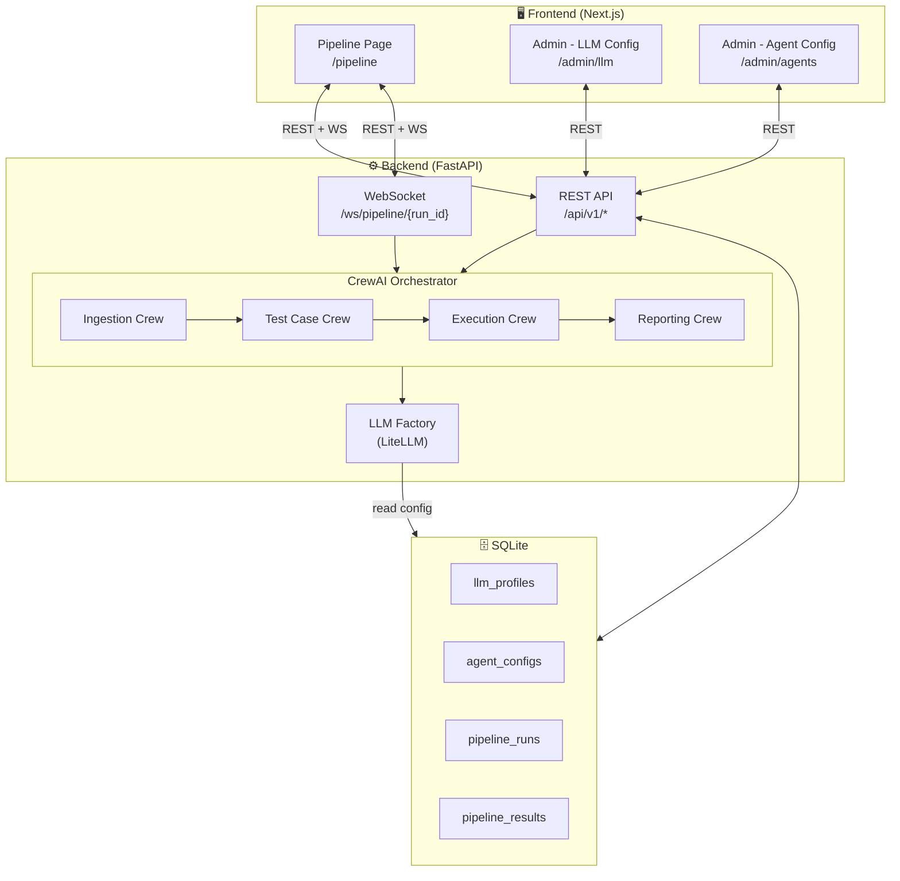

# Auto-AT – Implementation Plan
> CrewAI Multi-Agent System + Full-Stack Web Application

---

## Table of Contents

1. [Overview](#1-overview)
2. [Requirements](#2-requirements)
3. [Tech Stack](#3-tech-stack)
4. [System Architecture](#4-system-architecture)
5. [Folder Structure](#5-folder-structure)
6. [Data Models & Schemas](#6-data-models--schemas)
7. [LLM Config Strategy](#7-llm-config-strategy)
8. [CrewAI Agent Mapping](#8-crewai-agent-mapping)
9. [Crew Grouping](#9-crew-grouping)
10. [API Endpoints](#10-api-endpoints)
11. [WebSocket Events](#11-websocket-events)
12. [Frontend Pages](#12-frontend-pages)
13. [Database Schema](#13-database-schema)
14. [Environment Variables](#14-environment-variables)
15. [Implementation Phases](#15-implementation-phases)

---

## 1. Overview

Hệ thống **Auto-AT** là một pipeline kiểm thử tự động dựa trên Multi-Agent AI, bao gồm:

- **18 agents** được tổ chức thành 4 giai đoạn: Ingestion → Test Case Generation → Execution → Reporting
- **Backend** Python: CrewAI orchestration + FastAPI REST/WebSocket
- **Frontend** Next.js: trang chạy pipeline + trang admin cấu hình agent/LLM
- **LLM hoán đổi được** tại runtime thông qua UI — không cần sửa code

---

## 2. Requirements

| # | Yêu cầu | Ghi chú |
|---|---------|---------|
| R1 | Chạy toàn bộ pipeline từ giao diện web | Upload tài liệu → kết quả |
| R2 | Thay đổi LLM provider/model cho **toàn bộ** agents qua config | Global config |
| R3 | Thay đổi LLM provider/model cho **từng** agent riêng lẻ | Per-agent override |
| R4 | Admin page: quản lý LLM profiles (CRUD) | Lưu vào DB |
| R5 | Admin page: quản lý cấu hình từng agent | role, goal, backstory, LLM |
| R6 | Hiển thị tiến trình pipeline real-time | WebSocket |
| R7 | Xem lại kết quả của từng run | Lưu vào DB |
| R8 | Hỗ trợ nhiều LLM provider | OpenAI, Anthropic, Ollama, HuggingFace |

---

## 3. Tech Stack

### Backend

| Thành phần | Công nghệ | Lý do |
|---|---|---|
| Multi-agent | **CrewAI** | Role-based, dễ prototype |
| API server | **FastAPI** | Async, WebSocket native, Pydantic |
| ORM | **SQLAlchemy 2** + **SQLite** | Đơn giản, không cần setup server |
| Schema validation | **Pydantic v2** | Tương thích CrewAI + FastAPI |
| Document parsing | **pdfplumber, python-docx, docling** | Tái sử dụng code hiện có |
| LLM abstraction | **LiteLLM** (via CrewAI) | Hỗ trợ 100+ providers |
| Task queue | **asyncio + BackgroundTasks** | Đủ dùng cho scope hiện tại |
| Package manager | **uv** | Đang dùng trong project |

### Frontend

| Thành phần | Công nghệ | Lý do |
|---|---|---|
| Framework | **Next.js 14** (App Router) | SSR, routing dễ |
| Language | **TypeScript** | Type-safe |
| UI components | **shadcn/ui** + **Tailwind CSS** | Đẹp, customizable |
| State | **Zustand** | Nhẹ, đơn giản |
| API client | **TanStack Query (React Query)** | Cache, refetch, mutation |
| WebSocket | **native WebSocket** | Hiển thị real-time progress |
| Form | **React Hook Form** + **Zod** | Validate form admin |
| Charts | **Recharts** | Hiển thị coverage report |

---

## 4. System Architecture



---

## 5. Folder Structure

```
auto-at/
├── backend/
│   ├── app/
│   │   ├── main.py                    # FastAPI app entry point
│   │   ├── api/
│   │   │   └── v1/
│   │   │       ├── __init__.py
│   │   │       ├── pipeline.py        # POST /pipeline/run, GET /pipeline/{id}
│   │   │       ├── llm_profiles.py    # CRUD /admin/llm-profiles
│   │   │       ├── agent_configs.py   # CRUD /admin/agent-configs
│   │   │       └── websocket.py       # WS /ws/pipeline/{run_id}
│   │   │
│   │   ├── core/
│   │   │   ├── llm_factory.py         # Build CrewAI LLM object từ config
│   │   │   ├── agent_factory.py       # Build CrewAI Agent từ DB config
│   │   │   └── events.py              # Event bus cho WebSocket broadcast
│   │   │
│   │   ├── crews/
│   │   │   ├── __init__.py
│   │   │   ├── ingestion_crew.py      # Crew giai đoạn 1
│   │   │   ├── testcase_crew.py       # Crew giai đoạn 2
│   │   │   ├── execution_crew.py      # Crew giai đoạn 3
│   │   │   └── reporting_crew.py      # Crew giai đoạn 4
│   │   │
│   │   ├── agents/
│   │   │   ├── ingestion/
│   │   │   │   ├── parsing_agent.py
│   │   │   │   ├── chunking_agent.py
│   │   │   │   └── analysis_agent.py
│   │   │   ├── testcase/
│   │   │   │   ├── requirement_analyzer.py
│   │   │   │   ├── rule_parser.py
│   │   │   │   ├── scope_classifier.py
│   │   │   │   ├── data_model_agent.py
│   │   │   │   ├── test_condition_agent.py
│   │   │   │   ├── dependency_agent.py
│   │   │   │   ├── test_case_generator.py
│   │   │   │   ├── automation_agent.py
│   │   │   │   ├── coverage_agent.py
│   │   │   │   └── report_agent.py
│   │   │   ├── execution/
│   │   │   │   ├── orchestrator_agent.py
│   │   │   │   ├── env_adapter_agent.py
│   │   │   │   ├── test_runner_agent.py
│   │   │   │   ├── logger_agent.py
│   │   │   │   └── result_store_agent.py
│   │   │   └── reporting/
│   │   │       ├── coverage_analyzer_agent.py
│   │   │       ├── root_cause_agent.py
│   │   │       └── report_generator_agent.py
│   │   │
│   │   ├── tasks/
│   │   │   ├── ingestion_tasks.py     # CrewAI Task definitions cho Ingestion Crew
│   │   │   ├── testcase_tasks.py
│   │   │   ├── execution_tasks.py
│   │   │   └── reporting_tasks.py
│   │   │
│   │   ├── tools/
│   │   │   ├── document_tools.py      # parse_pdf, parse_docx, parse_image
│   │   │   ├── chunking_tools.py      # chunk_text
│   │   │   └── api_runner_tools.py    # gọi API thật để test
│   │   │
│   │   ├── db/
│   │   │   ├── database.py            # SQLAlchemy engine + session
│   │   │   ├── models.py              # ORM models
│   │   │   └── crud.py                # DB helpers
│   │   │
│   │   ├── schemas/
│   │   │   ├── llm_profile.py         # Pydantic schemas
│   │   │   ├── agent_config.py
│   │   │   └── pipeline.py
│   │   │
│   │   └── config.py                  # App settings (env vars)
│   │
│   ├── alembic/                        # DB migrations
│   ├── tests/
│   ├── pyproject.toml
│   └── .env.example
│
├── frontend/
│   ├── src/
│   │   ├── app/
│   │   │   ├── layout.tsx
│   │   │   ├── page.tsx               # Redirect → /pipeline
│   │   │   ├── pipeline/
│   │   │   │   ├── page.tsx           # Upload + Run page
│   │   │   │   └── [runId]/
│   │   │   │       └── page.tsx       # Run detail + results
│   │   │   └── admin/
│   │   │       ├── layout.tsx         # Admin sidebar layout
│   │   │       ├── page.tsx           # Redirect → /admin/llm
│   │   │       ├── llm/
│   │   │       │   └── page.tsx       # LLM Profiles manager
│   │   │       └── agents/
│   │   │           └── page.tsx       # Agent configs manager
│   │   │
│   │   ├── components/
│   │   │   ├── layout/
│   │   │   │   ├── Navbar.tsx
│   │   │   │   └── Sidebar.tsx
│   │   │   ├── pipeline/
│   │   │   │   ├── DocumentUpload.tsx
│   │   │   │   ├── PipelineProgress.tsx  # WebSocket progress
│   │   │   │   ├── AgentStatusCard.tsx
│   │   │   │   ├── ResultsViewer.tsx
│   │   │   │   └── RunHistory.tsx
│   │   │   └── admin/
│   │   │       ├── LLMProfileForm.tsx
│   │   │       ├── LLMProfileList.tsx
│   │   │       ├── AgentConfigForm.tsx
│   │   │       ├── AgentConfigList.tsx
│   │   │       └── LLMTestButton.tsx    # Test connection
│   │   │
│   │   ├── lib/
│   │   │   ├── api.ts                 # Axios/fetch wrappers
│   │   │   ├── websocket.ts           # WS hook
│   │   │   └── utils.ts
│   │   │
│   │   ├── store/
│   │   │   ├── pipelineStore.ts       # Zustand: run state
│   │   │   └── configStore.ts         # Zustand: active LLM profile
│   │   │
│   │   └── types/
│   │       ├── llm.ts
│   │       ├── agent.ts
│   │       └── pipeline.ts
│   │
│   ├── package.json
│   ├── tailwind.config.ts
│   └── tsconfig.json
│
├── Flow/
│   ├── FlowChart.drawio
│   ├── FlowChart.md
│   └── PLAN.md                        # ← file này
│
└── docker-compose.yml                 # Optional: containerize cả stack
```

---

## 6. Data Models & Schemas

### 6.1 LLM Profile

```python
# schemas/llm_profile.py

class LLMProvider(str, Enum):
    OPENAI      = "openai"
    ANTHROPIC   = "anthropic"
    OLLAMA      = "ollama"
    HUGGINGFACE = "huggingface"
    AZURE       = "azure_openai"
    GROQ        = "groq"

class LLMProfileBase(BaseModel):
    name: str                          # "GPT-4o Production", "Granite Local"
    provider: LLMProvider
    model: str                         # "gpt-4o", "claude-3-5-sonnet", "llama3"
    api_key: Optional[str] = None      # masked khi trả về FE
    base_url: Optional[str] = None     # cho Ollama, LM Studio, Azure
    temperature: float = 0.1
    max_tokens: int = 2048
    is_default: bool = False           # profile mặc định cho toàn bộ agents

class LLMProfileCreate(LLMProfileBase): ...
class LLMProfileUpdate(LLMProfileBase): ...
class LLMProfileResponse(LLMProfileBase):
    id: int
    api_key: Optional[str] = None      # luôn None khi trả về FE (bảo mật)
    created_at: datetime
    updated_at: datetime
```

### 6.2 Agent Config

```python
# schemas/agent_config.py

class AgentConfigBase(BaseModel):
    agent_id: str                      # "requirement_analyzer", "rule_parser", ...
    display_name: str                  # "Requirement Analyzer"
    stage: str                         # "ingestion" | "testcase" | "execution" | "reporting"
    role: str                          # CrewAI role prompt
    goal: str                          # CrewAI goal prompt
    backstory: str                     # CrewAI backstory prompt
    llm_profile_id: Optional[int] = None   # None → dùng default profile
    enabled: bool = True
    verbose: bool = False
    max_iter: int = 5

class AgentConfigResponse(AgentConfigBase):
    id: int
    llm_profile: Optional[LLMProfileResponse] = None   # joined
    created_at: datetime
    updated_at: datetime
```

### 6.3 Pipeline Run

```python
# schemas/pipeline.py

class PipelineStatus(str, Enum):
    PENDING   = "pending"
    RUNNING   = "running"
    COMPLETED = "completed"
    FAILED    = "failed"

class AgentRunStatus(str, Enum):
    WAITING = "waiting"
    RUNNING = "running"
    DONE    = "done"
    SKIPPED = "skipped"
    ERROR   = "error"

class PipelineRunCreate(BaseModel):
    document_name: str
    llm_profile_id: Optional[int] = None   # override global cho run này

class PipelineRunResponse(BaseModel):
    id: str                            # UUID
    document_name: str
    status: PipelineStatus
    agent_statuses: dict[str, AgentRunStatus]
    result: Optional[dict] = None
    error: Optional[str] = None
    created_at: datetime
    finished_at: Optional[datetime] = None
```

---

## 7. LLM Config Strategy

### Thứ tự ưu tiên (Override Hierarchy)

```
Run-level override
      │ (nếu không có)
      ▼
Per-agent LLM profile  (agent_configs.llm_profile_id)
      │ (nếu không có)
      ▼
Global default profile  (llm_profiles.is_default = true)
      │ (nếu không có)
      ▼
Environment variable    (DEFAULT_LLM_PROVIDER, DEFAULT_LLM_MODEL)
```

### LLM Factory

```python
# core/llm_factory.py

def build_llm(profile: LLMProfileResponse) -> LLM:
    """
    Trả về CrewAI-compatible LLM object từ LLMProfile.
    CrewAI dùng LiteLLM format: "provider/model"
    """
    model_string = {
        "openai":       f"openai/{profile.model}",
        "anthropic":    f"anthropic/{profile.model}",
        "ollama":       f"ollama/{profile.model}",
        "azure_openai": f"azure/{profile.model}",
        "groq":         f"groq/{profile.model}",
        "huggingface":  f"huggingface/{profile.model}",
    }[profile.provider]

    return LLM(
        model=model_string,
        api_key=profile.api_key,
        base_url=profile.base_url,
        temperature=profile.temperature,
        max_tokens=profile.max_tokens,
    )
```

### Agent Factory

```python
# core/agent_factory.py

def build_agent(config: AgentConfigResponse, fallback_profile: LLMProfileResponse) -> Agent:
    """
    Build CrewAI Agent từ DB config.
    Dùng per-agent LLM nếu có, fallback về global default.
    """
    profile = config.llm_profile or fallback_profile
    return Agent(
        role=config.role,
        goal=config.goal,
        backstory=config.backstory,
        llm=build_llm(profile),
        verbose=config.verbose,
        max_iter=config.max_iter,
    )
```

---

## 8. CrewAI Agent Mapping

Bảng mapping 18 agents từ flowchart → CrewAI Agent definition:

| # | Agent ID | Stage | CrewAI Role | Có Tool |
|---|---|---|---|---|
| 1 | `requirement_analyzer` | testcase | Requirement Analyst | ❌ |
| 2 | `rule_parser` | testcase | Rule Parser | ❌ |
| 3 | `scope_classifier` | testcase | Scope Classifier | ❌ |
| 4 | `data_model_agent` | testcase | Data Model Engineer | ❌ |
| 5 | `test_condition_agent` | testcase | Test Condition Analyst | ❌ |
| 6 | `dependency_agent` | testcase | Dependency Analyst | ❌ |
| 7 | `test_case_generator` | testcase | Test Case Engineer | ❌ |
| 8 | `automation_agent` | testcase | Automation Engineer | ❌ |
| 9 | `coverage_agent_pre` | testcase | Coverage Analyst | ❌ |
| 10 | `report_agent_pre` | testcase | Test Design Reporter | ❌ |
| 11 | `execution_orchestrator` | execution | Execution Orchestrator | ✅ api_runner |
| 12 | `env_adapter` | execution | Environment Adapter | ✅ config_loader |
| 13 | `test_runner` | execution | Test Runner | ✅ api_runner |
| 14 | `execution_logger` | execution | Execution Logger | ❌ |
| 15 | `result_store` | execution | Result Store Manager | ❌ |
| 16 | `coverage_analyzer` | reporting | Coverage Analyzer | ❌ |
| 17 | `root_cause_analyzer` | reporting | Root Cause Analyst | ❌ |
| 18 | `report_generator` | reporting | Report Generator | ❌ |

> **Lưu ý về Ingestion:** Giai đoạn Parsing → Chunking → Analysis được xử lý bằng **Python tools** (tái sử dụng code hiện có từ `automationtestingmultiagent.py`) và không cần dùng CrewAI Agent. Output là Requirement JSON làm đầu vào cho Test Case Crew.

---

## 9. Crew Grouping

### Crew 1 – Ingestion (Python Pipeline, không dùng CrewAI Agent)

```
Input: file upload (PDF/DOCX/Excel/Image)
  → parse_document()      ← tool: pdfplumber / docling
  → chunk_document()      ← tool: text splitter
  → analyze_chunk()       ← LLM call trực tiếp (ibm-granite hoặc config)
Output: List[RequirementJSON]
```

### Crew 2 – Test Case Generation (`Sequential Process`)

```
[requirement_analyzer]
    → [scope_classifier]
    → [data_model_agent]
    → [rule_parser]
    → [test_condition_agent]
    → [dependency_agent]
    → [test_case_generator]
    → [automation_agent]    ─┐
    → [coverage_agent_pre]  ─┼→  kết quả gộp lại
    → [report_agent_pre]    ─┘
```

> Dùng `Process.sequential` của CrewAI, context truyền tự động qua từng task.

### Crew 3 – Execution (`Sequential Process`)

```
[execution_orchestrator]
    → [env_adapter]
    → [test_runner]         ← có tool gọi API thật
    → [execution_logger]
    → [result_store]
```

### Crew 4 – Reporting (`Sequential Process`)

```
[coverage_analyzer]   ─┐
[root_cause_analyzer] ─┼→  [report_generator]  →  Done
```

> `coverage_analyzer` và `root_cause_analyzer` chạy song song bằng `Process.hierarchical` hoặc tạo 2 task tuần tự với context shared.

---

## 10. API Endpoints

### Pipeline

| Method | Path | Mô tả |
|---|---|---|
| `POST` | `/api/v1/pipeline/run` | Upload file + start pipeline run |
| `GET` | `/api/v1/pipeline/runs` | Danh sách các run (paginated) |
| `GET` | `/api/v1/pipeline/runs/{run_id}` | Chi tiết 1 run + kết quả |
| `DELETE` | `/api/v1/pipeline/runs/{run_id}` | Xóa run |
| `POST` | `/api/v1/pipeline/runs/{run_id}/cancel` | Hủy run đang chạy |

### Admin – LLM Profiles

| Method | Path | Mô tả |
|---|---|---|
| `GET` | `/api/v1/admin/llm-profiles` | List tất cả LLM profiles |
| `POST` | `/api/v1/admin/llm-profiles` | Tạo LLM profile mới |
| `GET` | `/api/v1/admin/llm-profiles/{id}` | Chi tiết 1 profile |
| `PUT` | `/api/v1/admin/llm-profiles/{id}` | Cập nhật profile |
| `DELETE` | `/api/v1/admin/llm-profiles/{id}` | Xóa profile |
| `POST` | `/api/v1/admin/llm-profiles/{id}/set-default` | Đặt làm default |
| `POST` | `/api/v1/admin/llm-profiles/{id}/test` | Test kết nối LLM |

### Admin – Agent Configs

| Method | Path | Mô tả |
|---|---|---|
| `GET` | `/api/v1/admin/agent-configs` | List tất cả agent configs |
| `GET` | `/api/v1/admin/agent-configs/{agent_id}` | Chi tiết 1 agent |
| `PUT` | `/api/v1/admin/agent-configs/{agent_id}` | Cập nhật agent config |
| `POST` | `/api/v1/admin/agent-configs/{agent_id}/reset` | Reset về default |
| `POST` | `/api/v1/admin/agent-configs/reset-all` | Reset toàn bộ agents |

### WebSocket

| Path | Mô tả |
|---|---|
| `WS /ws/pipeline/{run_id}` | Stream progress events của 1 pipeline run |

---

## 11. WebSocket Events

Sau khi `POST /pipeline/run` trả về `run_id`, frontend connect vào WS để nhận events:

### Event Format

```typescript
// types/pipeline.ts
interface WSEvent {
  event: EventType
  run_id: string
  timestamp: string
  data: Record<string, unknown>
}

type EventType =
  | "run.started"
  | "stage.started"
  | "agent.started"
  | "agent.completed"
  | "agent.failed"
  | "stage.completed"
  | "run.completed"
  | "run.failed"
  | "log"
```

### Event Examples

```json
// agent bắt đầu chạy
{
  "event": "agent.started",
  "run_id": "abc-123",
  "timestamp": "2025-01-01T10:00:01Z",
  "data": {
    "agent_id": "requirement_analyzer",
    "stage": "testcase",
    "display_name": "Requirement Analyzer"
  }
}

// agent hoàn thành
{
  "event": "agent.completed",
  "run_id": "abc-123",
  "timestamp": "2025-01-01T10:00:05Z",
  "data": {
    "agent_id": "requirement_analyzer",
    "output_preview": "Extracted 3 requirements: REQ-001, REQ-002..."
  }
}

// pipeline hoàn thành
{
  "event": "run.completed",
  "run_id": "abc-123",
  "timestamp": "2025-01-01T10:01:30Z",
  "data": {
    "total_agents": 18,
    "duration_seconds": 89,
    "result_url": "/api/v1/pipeline/runs/abc-123"
  }
}
```

---

## 12. Frontend Pages

### 12.1 Pipeline Page – `/pipeline`

```
┌─────────────────────────────────────────────────────────────────┐
│  🚀 Auto-AT Pipeline                              [Run History] │
├─────────────────────────────────────────────────────────────────┤
│                                                                  │
│  📄 Upload Document                                             │
│  ┌──────────────────────────────────────────┐                  │
│  │  Drag & drop or click to upload          │                  │
│  │  Supported: PDF, DOCX, Excel, Image      │                  │
│  └──────────────────────────────────────────┘                  │
│                                                                  │
│  ⚙️ LLM Profile (cho run này)                                  │
│  ┌──────────────────────────────────────────┐                  │
│  │  [GPT-4o Production ▼]  (Default)        │                  │
│  └──────────────────────────────────────────┘                  │
│                                                                  │
│  [▶ Run Pipeline]                                               │
│                                                                  │
├─────────────────────────────────────────────────────────────────┤
│  📊 Progress  (live via WebSocket)                              │
│                                                                  │
│  Stage 1: Ingestion & Analysis    ████████████ 100% ✅          │
│  Stage 2: Test Case Generation    ████████░░░░  67% 🔄          │
│    ├ Requirement Analyzer         ✅ done                       │
│    ├ Rule Parser                  ✅ done                       │
│    ├ Scope Classifier             ✅ done                       │
│    ├ Data Model Agent             🔄 running...                 │
│    ├ Test Condition Agent         ⏳ waiting                    │
│    └ ...                                                        │
│  Stage 3: Execution               ░░░░░░░░░░░░  0%  ⏳          │
│  Stage 4: Reporting               ░░░░░░░░░░░░  0%  ⏳          │
│                                                                  │
├─────────────────────────────────────────────────────────────────┤
│  📋 Results                                                      │
│  [Test Cases tab] [Coverage tab] [Report tab]                   │
│  ...                                                            │
└─────────────────────────────────────────────────────────────────┘
```

### 12.2 Admin – LLM Profiles – `/admin/llm`

```
┌─────────────────────────────────────────────────────────────────┐
│  ⚙️ Admin                                                       │
│  [LLM Profiles]  [Agent Configs]                                │
├─────────────────────────────────────────────────────────────────┤
│  LLM Profiles                              [+ New Profile]      │
│                                                                  │
│  ┌────────────────────────────────────────────────────────────┐ │
│  │ ⭐ GPT-4o Production    openai / gpt-4o          [DEFAULT] │ │
│  │    T=0.1  tokens=2048                  [Edit] [Delete]     │ │
│  ├────────────────────────────────────────────────────────────┤ │
│  │ Claude Sonnet           anthropic / claude-...             │ │
│  │    T=0.0  tokens=4096          [Set Default] [Edit] [Del]  │ │
│  ├────────────────────────────────────────────────────────────┤ │
│  │ Granite Local           ollama / granite-3.0-2b            │ │
│  │    T=0.2  tokens=1024   localhost:11434  [Set Default]...  │ │
│  └────────────────────────────────────────────────────────────┘ │
│                                                                  │
│  [Edit/Create Dialog]                                           │
│  ┌────────────────────────────┐                                 │
│  │ Name:     [____________]   │                                 │
│  │ Provider: [OpenAI      ▼]  │                                 │
│  │ Model:    [gpt-4o      ▼]  │                                 │
│  │ API Key:  [sk-••••••••]    │                                 │
│  │ Base URL: [____________]   │  (chỉ hiện cho Ollama/Azure)   │
│  │ Temp:     [0.1]            │                                 │
│  │ Max tokens:[2048]          │                                 │
│  │ [Test Connection] [Save]   │                                 │
│  └────────────────────────────┘                                 │
└─────────────────────────────────────────────────────────────────┘
```

### 12.3 Admin – Agent Configs – `/admin/agents`

```
┌─────────────────────────────────────────────────────────────────┐
│  ⚙️ Admin                                                       │
│  [LLM Profiles]  [Agent Configs]                                │
├─────────────────────────────────────────────────────────────────┤
│  Agent Configurations                    [Reset All to Default] │
│                                                                  │
│  Filter: [All Stages ▼]  [Search agent name...]                 │
│                                                                  │
│  ── Stage: Test Case Generation ─────────────────────────────── │
│  ┌────────────────────────────────────────────────────────────┐ │
│  │ 1. Requirement Analyzer               LLM: [DEFAULT ▼]    │ │
│  │    [●] Enabled   verbose: □           [Edit] [Reset]       │ │
│  ├────────────────────────────────────────────────────────────┤ │
│  │ 2. Rule Parser Agent                  LLM: [Claude ▼]     │ │
│  │    [●] Enabled   verbose: ✓           [Edit] [Reset]       │ │
│  └────────────────────────────────────────────────────────────┘ │
│                                                                  │
│  [Edit Dialog]                                                  │
│  ┌────────────────────────────────────┐                         │
│  │ Display Name: [Requirement Analyzer│                         │
│  │ LLM Profile:  [GPT-4o Production ▼]│                         │
│  │ Role:         [________________]   │                         │
│  │ Goal:         [________________]   │                         │
│  │ Backstory:    [________________]   │                         │
│  │ Max Iter:     [5]                  │                         │
│  │ Enabled:      [✓]   Verbose: [ ]  │                         │
│  │ [Save]  [Cancel]                   │                         │
│  └────────────────────────────────────┘                         │
└─────────────────────────────────────────────────────────────────┘
```

---

## 13. Database Schema

```sql
-- LLM Profiles
CREATE TABLE llm_profiles (
    id          INTEGER PRIMARY KEY AUTOINCREMENT,
    name        TEXT NOT NULL UNIQUE,
    provider    TEXT NOT NULL,              -- openai | anthropic | ollama | ...
    model       TEXT NOT NULL,
    api_key     TEXT,                       -- encrypted at rest
    base_url    TEXT,
    temperature REAL NOT NULL DEFAULT 0.1,
    max_tokens  INTEGER NOT NULL DEFAULT 2048,
    is_default  INTEGER NOT NULL DEFAULT 0, -- boolean
    created_at  TEXT NOT NULL DEFAULT (datetime('now')),
    updated_at  TEXT NOT NULL DEFAULT (datetime('now'))
);

-- Agent Configurations
CREATE TABLE agent_configs (
    id              INTEGER PRIMARY KEY AUTOINCREMENT,
    agent_id        TEXT NOT NULL UNIQUE,   -- "requirement_analyzer"
    display_name    TEXT NOT NULL,
    stage           TEXT NOT NULL,          -- "ingestion" | "testcase" | ...
    role            TEXT NOT NULL,
    goal            TEXT NOT NULL,
    backstory       TEXT NOT NULL,
    llm_profile_id  INTEGER REFERENCES llm_profiles(id) ON DELETE SET NULL,
    enabled         INTEGER NOT NULL DEFAULT 1,
    verbose         INTEGER NOT NULL DEFAULT 0,
    max_iter        INTEGER NOT NULL DEFAULT 5,
    created_at      TEXT NOT NULL DEFAULT (datetime('now')),
    updated_at      TEXT NOT NULL DEFAULT (datetime('now'))
);

-- Pipeline Runs
CREATE TABLE pipeline_runs (
    id              TEXT PRIMARY KEY,       -- UUID
    document_name   TEXT NOT NULL,
    document_path   TEXT NOT NULL,          -- tmp file path
    llm_profile_id  INTEGER REFERENCES llm_profiles(id) ON DELETE SET NULL,
    status          TEXT NOT NULL DEFAULT 'pending',
    agent_statuses  TEXT NOT NULL DEFAULT '{}',  -- JSON blob
    error           TEXT,
    created_at      TEXT NOT NULL DEFAULT (datetime('now')),
    finished_at     TEXT
);

-- Pipeline Results
CREATE TABLE pipeline_results (
    id              INTEGER PRIMARY KEY AUTOINCREMENT,
    run_id          TEXT NOT NULL REFERENCES pipeline_runs(id) ON DELETE CASCADE,
    stage           TEXT NOT NULL,          -- "ingestion" | "testcase" | ...
    agent_id        TEXT NOT NULL,
    output          TEXT NOT NULL,          -- JSON blob
    created_at      TEXT NOT NULL DEFAULT (datetime('now'))
);
```

---

## 14. Environment Variables

### Backend – `.env.example`

```bash
# App
APP_ENV=development
APP_PORT=8000
ALLOWED_ORIGINS=http://localhost:3000

# Database
DATABASE_URL=sqlite:///./auto_at.db

# Default LLM fallback (nếu không có profile nào là default)
DEFAULT_LLM_PROVIDER=openai
DEFAULT_LLM_MODEL=gpt-4o
DEFAULT_LLM_API_KEY=sk-...

# File upload
UPLOAD_DIR=./uploads
MAX_FILE_SIZE_MB=50

# Security
SECRET_KEY=change-me-in-production
ENCRYPT_API_KEYS=true
```

### Frontend – `.env.local.example`

```bash
NEXT_PUBLIC_API_BASE_URL=http://localhost:8000
NEXT_PUBLIC_WS_BASE_URL=ws://localhost:8000
```

---

## 15. Implementation Phases

### Phase 1 – Foundation (Backend Core) `~2 ngày`

- [x] Setup project: `uv init backend`, thêm dependencies vào `pyproject.toml`
- [x] `db/models.py` + `db/database.py` + Alembic migration
- [x] `db/crud.py`: CRUD cho `llm_profiles` và `agent_configs`
- [x] `schemas/`: Pydantic models cho tất cả entities
- [x] `core/llm_factory.py`: build LLM từ profile
- [x] Seed DB: insert default LLM profile + 18 agent configs mặc định
- [x] Unit test factory

### Phase 2 – CrewAI Agents & Crews `~3 ngày`

- [x] `agents/`: agent sub-packages (ingestion/testcase/execution/reporting) với `__init__.py`
- [x] `tasks/`: Task factory functions cho 18 agents (`testcase_tasks.py`, `execution_tasks.py`, `reporting_tasks.py`)
- [x] `core/agent_factory.py`: build Agent từ DB config ✅ (Phase 1)
- [x] `crews/base_crew.py`: BaseCrew abstract class + JSON parser + progress callbacks
- [x] `crews/ingestion_crew.py`: Pure-Python pipeline (parse → chunk → LLM extract) + mock fallback
- [x] `crews/testcase_crew.py`: 10-agent CrewAI Sequential crew + mock mode
- [x] `crews/execution_crew.py`: 5-agent CrewAI Sequential crew + deterministic mock mode
- [x] `crews/reporting_crew.py`: 3-agent CrewAI Sequential crew + mock mode
- [x] `core/pipeline_runner.py`: Orchestrator điều phối 4 crews + DB checkpointing + WS events
- [x] `tools/`: document_parser, text_chunker, api_runner (CrewAI BaseTool), config_loader (CrewAI BaseTool)
- [x] `schemas/pipeline_io.py`: Pydantic I/O schemas cho tất cả 4 stages
- [x] Integration test: `tests/test_phase2.py` — 85 tests, chạy toàn bộ 4 crews end-to-end (mock mode)
- [x] Tất cả 208 tests pass (Phase 1 + Phase 2 combined)

### Phase 3 – FastAPI Layer `~2 ngày`

- [x] `main.py`: FastAPI app + middleware + CORS ✅
- [x] `api/v1/pipeline.py`: upload, run, list, get run, delete, cancel ✅
- [x] `api/v1/llm_profiles.py`: CRUD + test connection endpoint ✅
- [x] `api/v1/agent_configs.py`: list (flat + grouped), update, reset, reset-all ✅
- [x] `api/v1/websocket.py`: WS endpoint + ConnectionManager broadcaster ✅
- [x] Background task: chạy pipeline async + broadcast WS events ✅
- [x] `api/v1/deps.py`: shared FastAPI dependency (get_db) ✅
- [x] Fix `LLMProfileResponse` ORM masking validator ✅
- [x] Integration test: `tests/test_phase3.py` — 113 tests, tất cả endpoints + WS ✅
- [x] Tất cả 321 tests pass (Phase 1 + Phase 2 + Phase 3 combined) ✅

### Phase 4 – Frontend Admin `~2 ngày`

- [x] Setup Next.js 15 + Tailwind v4 + custom UI components
- [x] Layout: Navbar + Sidebar (collapsible, breadcrumb, mobile overlay)
- [x] `/admin/llm`: LLM Profile list + Create/Edit/Delete form + Test Connection button
- [x] `/admin/agents`: Agent list (grouped by stage) + Edit form + inline toggles + Reset
- [x] API integration với TanStack Query v5 (query key factories, optimistic cache updates)
- [x] Form validation với React Hook Form + Zod

### Phase 5 – Frontend Pipeline `~2 ngày`

- [x] `/pipeline`: Document upload component (`DocumentUpload.tsx` — drag & drop, type/size validation)
- [x] LLM Profile selector (dropdown) (`LLMProfileSelector.tsx` — System Default + all profiles)
- [x] Run button + gọi `POST /api/v1/pipeline/run` (`PipelinePage.tsx` — useStartPipeline mutation)
- [x] WebSocket hook: connect + parse events (`usePipelineWebSocket.ts` — auto-reconnect, agent status map)
- [x] `PipelineProgress` component: stage progress bars + agent status list
- [x] `ResultsViewer` component: tab view (Test Cases / Coverage / Report)
- [x] Run history list (`RunHistory.tsx` — paginated, delete, highlight selected)
- [x] `src/app/pipeline/layout.tsx` + `page.tsx` — route + shell layout
- [x] `src/app/page.tsx` redirect → `/pipeline`
- [x] `usePipeline.ts` — TanStack Query hooks (list/detail/start/cancel/delete)

### Phase 6 – Polish & Integration `~1 ngày`

- [x] Error handling toàn bộ flow (upload fail, LLM error, agent timeout) — toast.error + inline error states + ErrorBoundary component
- [x] Loading states + toast notifications — skeleton loaders + Skeleton.tsx + toast throughout all mutations
- [x] API key masking (không lộ key ra FE) — already handled in backend + `api_key` field masked in LLMProfileResponse
- [x] `docker-compose.yml` cho backend + frontend — với healthcheck, volumes, env vars
- [x] `backend/Dockerfile` + `frontend/Dockerfile` — multi-stage Next.js build + uv Python build
- [x] README hướng dẫn setup — `backend/README.md` + `frontend/README.md` overwritten with full docs
- [x] `ErrorBoundary.tsx` + `withErrorBoundary` HOC — React class error boundary
- [x] `Skeleton.tsx` — Skeleton, SkeletonText, SkeletonCard, SkeletonTable components
- [ ] Smoke test end-to-end

---

## Dependencies Summary

### Backend `pyproject.toml`

```toml
[project]
name = "auto-at-backend"
requires-python = ">=3.11"
dependencies = [
    "crewai>=0.80.0",
    "fastapi>=0.115.0",
    "uvicorn[standard]>=0.30.0",
    "sqlalchemy>=2.0.0",
    "alembic>=1.13.0",
    "pydantic>=2.0.0",
    "pydantic-settings>=2.0.0",
    "python-multipart>=0.0.9",
    "websockets>=12.0",
    "pdfplumber>=0.11.0",
    "python-docx>=1.1.0",
    "docling>=2.0.0",
    "litellm>=1.50.0",
    "cryptography>=42.0.0",   # encrypt API keys in DB
    "python-dotenv>=1.0.0",
    "aiofiles>=23.0.0",
]
```

### Frontend `package.json`

```json
{
  "dependencies": {
    "next": "^14.0.0",
    "react": "^18.0.0",
    "react-dom": "^18.0.0",
    "@tanstack/react-query": "^5.0.0",
    "zustand": "^4.0.0",
    "react-hook-form": "^7.0.0",
    "zod": "^3.0.0",
    "@hookform/resolvers": "^3.0.0",
    "axios": "^1.6.0",
    "recharts": "^2.0.0",
    "lucide-react": "^0.400.0",
    "tailwindcss": "^3.0.0",
    "class-variance-authority": "^0.7.0",
    "clsx": "^2.0.0"
  }
}
```

---

> **Tổng thời gian ước tính:** ~12 ngày làm việc (1 dev)
>
> Thứ tự ưu tiên implement: **Phase 1 → 2 → 3 → 4 → 5 → 6**
>
> Bắt đầu từ Phase nào? → Gõ `/start phase-1` 🚀
```

Now let me actually save this properly:
