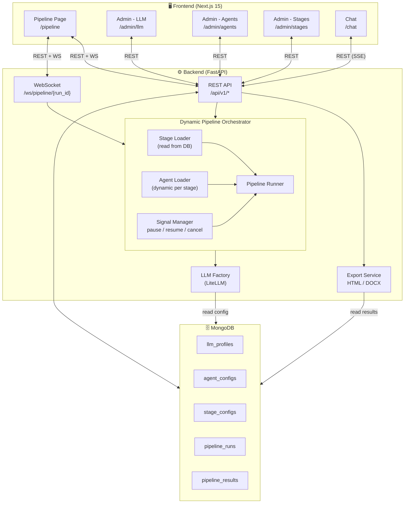

# Auto-AT – Implementation Plan V2

> CrewAI Multi-Agent System + Full-Stack Web Application
> **V2 – Dynamic Pipeline, MongoDB, Report Export, Pause/Resume**

---

## Table of Contents

1. [V1 Recap – What Already Exists](#1-v1-recap--what-already-exists)
2. [V2 Requirements – New Features](#2-v2-requirements--new-features)
3. [Tech Stack Changes](#3-tech-stack-changes)
4. [System Architecture V2](#4-system-architecture-v2)
5. [Feature 1 – Report Export (HTML / DOCX)](#5-feature-1--report-export-html--docx)
6. [Feature 2 – Per-Stage Results Display in Frontend](#6-feature-2--per-stage-results-display-in-frontend)
7. [Feature 3 – Persistent Pipeline Session Across Pages](#7-feature-3--persistent-pipeline-session-across-pages)
8. [Feature 4 – MongoDB Migration](#8-feature-4--mongodb-migration)
9. [Feature 5 – Dynamic Agent Management (Add / Remove)](#9-feature-5--dynamic-agent-management-add--remove)
10. [Feature 6 – Dynamic Stage & Flow Configuration](#10-feature-6--dynamic-stage--flow-configuration)
11. [Feature 7 – Pause / Resume / Cancel Pipeline](#11-feature-7--pause--resume--cancel-pipeline)
12. [Updated Data Models](#12-updated-data-models)
13. [Updated API Endpoints](#13-updated-api-endpoints)
14. [Updated WebSocket Events](#14-updated-websocket-events)
15. [Updated Frontend Pages & Components](#15-updated-frontend-pages--components)
16. [Updated Database Schema (MongoDB)](#16-updated-database-schema-mongodb)
17. [Updated Environment Variables](#17-updated-environment-variables)
18. [Updated Folder Structure](#18-updated-folder-structure)
19. [Migration Guide (V1 → V2)](#19-migration-guide-v1--v2)
20. [Implementation Phases](#20-implementation-phases)
21. [Updated Dependencies](#21-updated-dependencies)

---

## 1. V1 Recap – What Already Exists

### Hệ thống hiện tại (đã hoàn thành)

| Layer | Đã triển khai |
|-------|--------------|
| **Backend** | FastAPI + SQLAlchemy/SQLite + CrewAI 4-crew pipeline |
| **Frontend** | Next.js 15 + React 19 + Tailwind CSS v4 + TanStack Query v5 |
| **Pipeline** | 4 fixed stages: Ingestion (pure Python) → Test Case (10 agents) → Execution (5 agents) → Reporting (3 agents) |
| **Real-time** | WebSocket progress streaming |
| **Admin** | LLM Profile CRUD + Agent Config CRUD (update/reset only) |
| **Chat** | SSE streaming chat with LLM profiles |
| **Docker** | docker-compose for backend + frontend |

### Các giới hạn của V1

| # | Giới hạn | Ảnh hưởng |
|---|----------|-----------|
| L1 | Không thể tải report (HTML/DOCX) | User phải copy-paste kết quả |
| L2 | Chỉ hiển thị kết quả cuối cùng, không hiển thị intermediate results | Không biết stage trước đã tạo ra gì |
| L3 | Chuyển trang → mất trạng thái pipeline đang chạy | WebSocket bị disconnect, mất progress |
| L4 | SQLite không scale, không support concurrent writes tốt | Bottleneck khi nhiều pipeline chạy đồng thời |
| L5 | Không thể thêm/xoá agent trong stage | Agent list cố định, seed lúc khởi động |
| L6 | 4 stages cố định, không thể thêm stage hay đổi thứ tự | Không flexible cho use case khác nhau |
| L7 | Cancel chỉ đánh dấu FAILED, không có pause/resume | Pipeline không dừng thực sự, không resume được |

---

## 2. V2 Requirements – New Features

| # | Yêu cầu | Mô tả | Liên quan |
|---|---------|-------|-----------|
| **F1** | Report Export | Tải file report dưới dạng **HTML** hoặc **DOCX** | L1 |
| **F2** | Per-Stage Results | Hiển thị kết quả cho **mỗi stage** ngay khi hoàn thành trên FE | L2 |
| **F3** | Persistent Session | **Không mất session** pipeline khi chuyển trang; WebSocket tự reconnect | L3 |
| **F4** | MongoDB | Sử dụng **MongoDB** thay cho SQLite; hỗ trợ JSON-native, scale tốt hơn | L4 |
| **F5** | Dynamic Agents | Cho phép **thêm hoặc xoá** agent trong từng stage qua Agent Config admin | L5 |
| **F6** | Dynamic Stages | Cho phép **thêm stage** mới và **điều chỉnh luồng** (thứ tự, bật/tắt) | L6 |
| **F7** | Pause / Resume / Cancel | Cho phép **tạm dừng**, **tiếp tục**, hoặc **huỷ** pipeline khi người dùng yêu cầu | L7 |

---

## 3. Tech Stack Changes

### Backend – Thay đổi so với V1

| Thành phần | V1 | V2 | Lý do |
|---|---|---|---|
| Database | SQLAlchemy 2 + **SQLite** | **Motor** (async) + **Beanie** ODM + **MongoDB** | JSON-native, scale tốt, document-oriented phù hợp pipeline output |
| Report export | _(không có)_ | **Jinja2** + **python-docx** | Sinh HTML template và DOCX file |
| Pipeline control | `asyncio.BackgroundTasks` | **asyncio + threading.Event** signals | Hỗ trợ pause/resume/cancel qua signal flags |
| Migrations | Alembic | _(không cần — MongoDB schemaless)_ | Beanie tự quản lý index |

### Frontend – Thay đổi so với V1

| Thành phần | V1 | V2 | Lý do |
|---|---|---|---|
| Pipeline state | React local state (mất khi unmount) | **Zustand** store + `persist` middleware | Giữ session pipeline khi chuyển trang |
| WebSocket | Hook per-component | **Global singleton** WebSocket manager trong Zustand | Không bị ngắt khi route change |
| Stage results | Chỉ hiển thị khi pipeline xong | **Progressive render** — show per-stage results ngay khi có | Cải thiện UX, không phải chờ toàn bộ |
| Report download | _(không có)_ | **Download buttons** (HTML / DOCX) | F1 |
| Stage admin | _(không có)_ | **Stage Config page** `/admin/stages` | F6 |

---

## 4. System Architecture V2



### Pipeline Flow V2 (Dynamic)

```
┌──────────────────┐
│  Stage Configs    │  ← Đọc từ MongoDB, sắp xếp theo `order`
│  (enabled only)   │
└────────┬─────────┘
         │
         ▼
   ┌─────────────┐     ┌─────────────┐            ┌─────────────┐
   │  Stage N=1  │────▶│  Stage N=2  │───▶ ... ──▶│  Stage N=K  │
   │  (agents    │     │  (agents    │            │  (agents    │
   │   from DB)  │     │   from DB)  │            │   from DB)  │
   └──────┬──────┘     └──────┬──────┘            └──────┬──────┘
          │                   │                          │
    ╔═════╧═══════╗    ╔═════╧═══════╗           ╔═════╧═══════╗
    ║ Check signal║    ║ Check signal║           ║ Check signal║
    ║ pause/cancel║    ║ pause/cancel║           ║ pause/cancel║
    ╚═════════════╝    ╚═════════════╝           ╚═════════════╝
```

> **Key change:** Pipeline Runner không hardcode 4 stages nữa.
> Nó đọc `stage_configs` collection từ DB, lấy danh sách stages **enabled** và sắp theo `order`,
> rồi chạy tuần tự. Giữa mỗi stage, nó check signal flag để pause/resume/cancel.

---

## 5. Feature 1 – Report Export (HTML / DOCX)

### Mục tiêu

Cho phép người dùng **tải file báo cáo** kết quả pipeline dưới dạng:
- **HTML** — mở được trong browser, in ấn dễ
- **DOCX** — mở bằng Microsoft Word / Google Docs

### Backend

#### Export Service (`app/services/export_service.py`)

```python
class ExportService:
    """Sinh file report từ PipelineRunResult."""

    def __init__(self, run_id: str, db: AsyncIOMotorDatabase):
        self._run_id = run_id
        self._db = db

    async def export_html(self) -> bytes:
        """Render Jinja2 template → HTML bytes."""
        data = await self._load_run_data()
        template = jinja_env.get_template("report.html.j2")
        html = template.render(**data)
        return html.encode("utf-8")

    async def export_docx(self) -> bytes:
        """Build python-docx Document → bytes buffer."""
        data = await self._load_run_data()
        doc = Document()
        # ... build sections: Executive Summary, Coverage, Test Cases,
        #     Execution Results, Root Cause Analysis, Recommendations
        buffer = BytesIO()
        doc.save(buffer)
        return buffer.getvalue()

    async def _load_run_data(self) -> dict:
        """Load all pipeline results + run metadata from MongoDB."""
        ...
```

#### Jinja2 HTML Template (`app/templates/report.html.j2`)

```html
<!DOCTYPE html>
<html lang="en">
<head>
    <meta charset="UTF-8">
    <title>Auto-AT Report — {{ document_name }}</title>
    <style>
        /* Self-contained CSS — no external dependencies */
        body { font-family: 'Segoe UI', sans-serif; max-width: 960px; margin: 0 auto; }
        .badge-pass { background: #22c55e; color: white; }
        .badge-fail { background: #ef4444; color: white; }
        table { width: 100%; border-collapse: collapse; }
        th, td { border: 1px solid #ddd; padding: 8px; text-align: left; }
        /* ... */
    </style>
</head>
<body>
    <h1>{{ document_name }} — Test Report</h1>

    <!-- Executive Summary -->
    <section id="summary">
        <h2>Executive Summary</h2>
        <p>{{ executive_summary }}</p>
        <div class="metrics-grid">
            <div>Pass Rate: <strong>{{ pass_rate }}%</strong></div>
            <div>Coverage: <strong>{{ coverage_percentage }}%</strong></div>
            <div>Total Tests: <strong>{{ total_test_cases }}</strong></div>
        </div>
    </section>

    <!-- Coverage Analysis -->
    <section id="coverage">...</section>

    <!-- Test Cases Table -->
    <section id="testcases">
        <h2>Test Cases ({{ test_cases | length }})</h2>
        <table>
            <thead><tr><th>ID</th><th>Title</th><th>Req</th><th>Type</th><th>Result</th></tr></thead>
            <tbody>
            
                <tr>
                    <td>{{ tc.id }}</td>
                    <td>{{ tc.title }}</td>
                    <td>{{ tc.requirement_id }}</td>
                    <td>{{ tc.test_type }}</td>
                    <td class="badge-{{ tc.execution_status }}">{{ tc.execution_status }}</td>
                </tr>
            
            </tbody>
        </table>
    </section>

    <!-- Execution Results -->
    <section id="execution">...</section>

    <!-- Root Cause Analysis -->
    <section id="rootcause">...</section>

    <!-- Recommendations -->
    <section id="recommendations">...</section>

    <footer>
        <p>Generated by Auto-AT at {{ generated_at }} | Run ID: {{ run_id }}</p>
    </footer>
</body>
</html>
```

#### DOCX Builder (`app/services/docx_builder.py`)

```python
from docx import Document
from docx.shared import Inches, Pt, RGBColor
from docx.enum.text import WD_ALIGN_PARAGRAPH

class DocxReportBuilder:
    """Xây dựng file DOCX report từ pipeline results."""

    def __init__(self):
        self.doc = Document()
        self._setup_styles()

    def _setup_styles(self):
        """Thiết lập styles cho headings, tables, badges."""
        ...

    def add_title_page(self, document_name: str, run_id: str, generated_at: str):
        """Trang bìa: tên tài liệu, run ID, ngày tạo."""
        ...

    def add_executive_summary(self, summary: str, metrics: dict):
        """Executive summary + metrics grid."""
        ...

    def add_coverage_section(self, coverage: PostExecutionCoverage):
        """Coverage analysis table + chart placeholder."""
        ...

    def add_test_cases_table(self, test_cases: list[TestCase], results: list[TestExecutionResult]):
        """Bảng test cases với kết quả execution join."""
        ...

    def add_root_cause_section(self, root_causes: list[RootCause]):
        """Root cause analysis entries."""
        ...

    def add_recommendations(self, recommendations: list[str], risks: list[str]):
        """Recommendations + risk items."""
        ...

    def build(self) -> bytes:
        """Return DOCX as bytes."""
        buffer = BytesIO()
        self.doc.save(buffer)
        return buffer.getvalue()
```

#### API Endpoints (New)

| Method | Path | Mô tả |
|--------|------|-------|
| `GET` | `/api/v1/pipeline/runs/{run_id}/export/html` | Tải report dạng HTML |
| `GET` | `/api/v1/pipeline/runs/{run_id}/export/docx` | Tải report dạng DOCX |

```python
# api/v1/pipeline.py — thêm 2 endpoints

@router.get("/pipeline/runs/{run_id}/export/html")
async def export_report_html(run_id: str):
    """Download pipeline report as HTML file."""
    service = ExportService(run_id, db)
    html_bytes = await service.export_html()
    filename = f"auto-at-report-{run_id[:8]}.html"
    return Response(
        content=html_bytes,
        media_type="text/html",
        headers={"Content-Disposition": f'attachment; filename="{filename}"'},
    )

@router.get("/pipeline/runs/{run_id}/export/docx")
async def export_report_docx(run_id: str):
    """Download pipeline report as DOCX file."""
    service = ExportService(run_id, db)
    docx_bytes = await service.export_docx()
    filename = f"auto-at-report-{run_id[:8]}.docx"
    return Response(
        content=docx_bytes,
        media_type="application/vnd.openxmlformats-officedocument.wordprocessingml.document",
        headers={"Content-Disposition": f'attachment; filename="{filename}"'},
    )
```

### Frontend

#### ResultsViewer — Download Buttons

```tsx
// components/pipeline/ResultsViewer.tsx — thêm download buttons

function ExportButtons({ runId }: { runId: string }) {
    const apiUrl = process.env.NEXT_PUBLIC_API_URL ?? "http://localhost:8000";

    return (
        <div className="flex gap-2">
            <Button
                variant="secondary"
                size="sm"
                onClick={() => window.open(`${apiUrl}/api/v1/pipeline/runs/${runId}/export/html`)}
            >
                <FileDown className="h-4 w-4 mr-1" />
                Download HTML
            </Button>
            <Button
                variant="secondary"
                size="sm"
                onClick={() => window.open(`${apiUrl}/api/v1/pipeline/runs/${runId}/export/docx`)}
            >
                <FileText className="h-4 w-4 mr-1" />
                Download DOCX
            </Button>
        </div>
    );
}
```

---

## 6. Feature 2 – Per-Stage Results Display in Frontend

### Mục tiêu

Hiển thị **kết quả từng stage** ngay khi stage đó hoàn thành, thay vì phải chờ toàn bộ pipeline chạy xong.

### Cơ chế hoạt động

```
Stage 1 hoàn thành
    │
    ├── Backend: save PipelineResult(stage="ingestion") vào MongoDB
    ├── Backend: emit WS event "stage.completed" kèm { stage, output_preview }
    │
    └── Frontend: nhận WS event → fetch GET /runs/{id}/results?stage=ingestion
                  → render IngestionResults tab ngay lập tức
```

### Backend Changes

#### WebSocket Event Enhancement

Khi mỗi stage hoàn thành, emit event kèm `stage_output_summary`:

```python
# core/pipeline_runner.py — enhanced _emit_stage_completed

def _emit_stage_completed(self, stage: str, output: dict):
    """Emit stage.completed với output preview."""
    summary = self._build_stage_summary(stage, output)
    self._emit("stage.completed", {
        "stage": stage,
        "status": "completed",
        "summary": summary,           # ← NEW: inline summary
        "has_full_results": True,      # ← hint cho FE fetch full data
    })

def _build_stage_summary(self, stage: str, output: dict) -> dict:
    """Tạo lightweight summary cho mỗi stage."""
    if stage == "ingestion":
        return {
            "total_requirements": output.get("total_requirements", 0),
            "chunks_processed": output.get("chunks_processed", 0),
        }
    elif stage == "testcase":
        return {
            "total_test_cases": output.get("total_test_cases", 0),
            "coverage_percentage": output.get("coverage_summary", {}).get("coverage_percentage", 0),
        }
    elif stage == "execution":
        summary = output.get("summary", {})
        return {
            "total": summary.get("total", 0),
            "passed": summary.get("passed", 0),
            "failed": summary.get("failed", 0),
            "pass_rate": summary.get("pass_rate", 0),
        }
    elif stage == "reporting":
        return {
            "coverage_percentage": output.get("coverage_percentage", 0),
            "pass_rate": output.get("pass_rate", 0),
        }
    return {}
```

#### GET Results Endpoint — Stage Filter

Đã có `GET /api/v1/pipeline/runs/{run_id}/results?stage=xxx` từ V1 — không cần thay đổi.

### Frontend Changes

#### Zustand Store — Stage Results Cache

```typescript
// store/pipelineStore.ts — stage results slice

interface StageResultsSlice {
    stageResults: Record<string, Record<string, unknown>>;  // { ingestion: {...}, testcase: {...} }
    stageSummaries: Record<string, Record<string, unknown>>;

    setStageResult: (stage: string, data: Record<string, unknown>) => void;
    setStageSummary: (stage: string, summary: Record<string, unknown>) => void;
    clearStageResults: () => void;
}
```

#### StageResultsPanel Component (New)

```tsx
// components/pipeline/StageResultsPanel.tsx

interface StageResultsPanelProps {
    runId: string;
    completedStages: string[];
}

export function StageResultsPanel({ runId, completedStages }: StageResultsPanelProps) {
    return (
        <div className="space-y-4">
            {completedStages.map(stage => (
                <StageResultCard key={stage} runId={runId} stage={stage} />
            ))}
        </div>
    );
}

function StageResultCard({ runId, stage }: { runId: string; stage: string }) {
    const { data, isLoading } = useStageResults(runId, stage);

    if (isLoading) return <SkeletonCard />;

    return (
        <div className="border border-border rounded-lg p-4">
            <div className="flex items-center justify-between mb-3">
                <h3 className="font-semibold text-text-primary">
                    {stageLabels[stage]} Results
                </h3>
                <Badge variant="success">Completed</Badge>
            </div>

            {stage === "ingestion"   && <IngestionResults data={data} />}
            {stage === "testcase"    && <TestCaseResults data={data} />}
            {stage === "execution"   && <ExecutionResults data={data} />}
            {stage === "reporting"   && <ReportingResults data={data} />}

            {/* Custom stage results — dynamic rendering */}
            {!DEFAULT_STAGES.includes(stage) && <GenericStageResults data={data} />}
        </div>
    );
}
```

#### IngestionResults Sub-Component

```tsx
function IngestionResults({ data }: { data: IngestionOutput }) {
    return (
        <div>
            <div className="grid grid-cols-3 gap-4 mb-4">
                <MetricCard label="Requirements Found" value={data.total_requirements} />
                <MetricCard label="Chunks Processed" value={data.chunks_processed} />
                <MetricCard label="Processing Notes" value={data.processing_notes.length} />
            </div>
            <details>
                <summary className="cursor-pointer text-text-secondary">
                    View {data.requirements.length} requirements
                </summary>
                <RequirementsTable requirements={data.requirements} />
            </details>
        </div>
    );
}
```

#### Progressive Rendering Flow

```
Pipeline starts
    │
    ├── Stage 1 running → show progress spinner
    ├── Stage 1 done    → instantly show IngestionResults
    │                      (expand collapsible to reveal requirement list)
    ├── Stage 2 running → show progress spinner below IngestionResults
    ├── Stage 2 done    → append TestCaseResults below
    │                      (test case table + coverage summary)
    ├── Stage 3 running → ...
    ├── Stage 3 done    → append ExecutionResults
    │                      (pass/fail chart + results table)
    ├── Stage 4 done    → append ReportingResults
    │                      (executive summary + download buttons)
    │
    └── Pipeline complete → show full ResultsViewer with all tabs
```

---

## 7. Feature 3 – Persistent Pipeline Session Across Pages

### Mục tiêu

Khi người dùng đang xem pipeline chạy rồi chuyển sang `/admin/llm` hoặc `/chat`, pipeline session **không bị mất**. Khi quay lại `/pipeline`, trạng thái hiện tại vẫn còn nguyên.

### Giải pháp: Zustand Global Store + Singleton WebSocket

#### Architecture

```
┌─────────────────────────────────────────────────┐
│  Root Layout (layout.tsx)                        │
│                                                   │
│  ┌──────────────────────────────────────────────┐│
│  │  <PipelineSessionProvider />                  ││  ← Zustand store + WS manager
│  │                                                ││     khởi tạo ở root, sống suốt app
│  │  ┌──────────────────────────────────────────┐ ││
│  │  │  Page content (route-dependent)          │ ││
│  │  │                                          │ ││
│  │  │  /pipeline → reads from store            │ ││
│  │  │  /admin    → store vẫn giữ WS connection │ ││
│  │  │  /chat     → store vẫn giữ WS connection │ ││
│  │  └──────────────────────────────────────────┘ ││
│  └──────────────────────────────────────────────┘│
└─────────────────────────────────────────────────┘
```

#### Zustand Pipeline Store (`store/pipelineStore.ts`)

```typescript
import { create } from 'zustand';
import { persist, createJSONStorage } from 'zustand/middleware';

interface PipelineSession {
    activeRunId: string | null;
    activeRunStatus: PipelineStatus | null;
    agentStatuses: Record<string, AgentRunStatus>;
    agentProgress: Record<string, { pct: number; message: string }>;
    currentStage: string | null;
    completedStages: string[];
    stageResults: Record<string, unknown>;
    logMessages: string[];
    events: WSEvent[];
    isTerminal: boolean;
}

interface PipelineStoreState extends PipelineSession {
    // Actions
    startSession: (runId: string) => void;
    clearSession: () => void;
    updateFromWSEvent: (event: WSEvent) => void;
    setStageResult: (stage: string, data: unknown) => void;

    // WebSocket manager
    wsStatus: 'disconnected' | 'connecting' | 'connected' | 'error';
    connectWebSocket: (runId: string) => void;
    disconnectWebSocket: () => void;
}

export const usePipelineStore = create<PipelineStoreState>()(
    persist(
        (set, get) => ({
            // ── Initial state ──────────────────────────────────
            activeRunId: null,
            activeRunStatus: null,
            agentStatuses: {},
            agentProgress: {},
            currentStage: null,
            completedStages: [],
            stageResults: {},
            logMessages: [],
            events: [],
            isTerminal: false,
            wsStatus: 'disconnected',

            // ── Actions ────────────────────────────────────────
            startSession: (runId) => {
                // Reset all state, start fresh session
                set({
                    activeRunId: runId,
                    activeRunStatus: 'running',
                    agentStatuses: {},
                    agentProgress: {},
                    currentStage: null,
                    completedStages: [],
                    stageResults: {},
                    logMessages: [],
                    events: [],
                    isTerminal: false,
                });
                // Connect WebSocket
                get().connectWebSocket(runId);
            },

            clearSession: () => {
                get().disconnectWebSocket();
                set({
                    activeRunId: null,
                    activeRunStatus: null,
                    agentStatuses: {},
                    agentProgress: {},
                    currentStage: null,
                    completedStages: [],
                    stageResults: {},
                    logMessages: [],
                    events: [],
                    isTerminal: false,
                });
            },

            updateFromWSEvent: (event) => {
                // ... same logic as usePipelineWebSocket hook but writes to store
            },

            setStageResult: (stage, data) => {
                set((s) => ({
                    stageResults: { ...s.stageResults, [stage]: data },
                }));
            },

            // ── WebSocket singleton manager ────────────────────
            connectWebSocket: (runId) => {
                // Implemented via a module-level singleton — see below
                wsManager.connect(runId, (event) => get().updateFromWSEvent(event));
                set({ wsStatus: 'connecting' });
            },

            disconnectWebSocket: () => {
                wsManager.disconnect();
                set({ wsStatus: 'disconnected' });
            },
        }),
        {
            name: 'auto-at-pipeline-session',
            storage: createJSONStorage(() => sessionStorage),
            // Chỉ persist một subset (không persist WS connection, events quá lớn)
            partialize: (state) => ({
                activeRunId: state.activeRunId,
                activeRunStatus: state.activeRunStatus,
                agentStatuses: state.agentStatuses,
                currentStage: state.currentStage,
                completedStages: state.completedStages,
                isTerminal: state.isTerminal,
            }),
        },
    ),
);
```

#### Singleton WebSocket Manager (`lib/wsManager.ts`)

```typescript
/**
 * Module-level singleton WebSocket manager.
 * Lives outside React — survives route changes.
 * Zustand store calls connect/disconnect; WS events flow back via callback.
 */

const WS_BASE_URL = process.env.NEXT_PUBLIC_WS_URL ?? "ws://localhost:8000";
const MAX_RETRIES = 5;

class WSManager {
    private ws: WebSocket | null = null;
    private runId: string | null = null;
    private onEvent: ((event: WSEvent) => void) | null = null;
    private retryCount = 0;
    private retryTimer: ReturnType<typeof setTimeout> | null = null;
    private isTerminal = false;

    connect(runId: string, onEvent: (event: WSEvent) => void) {
        this.disconnect();  // clean up previous
        this.runId = runId;
        this.onEvent = onEvent;
        this.retryCount = 0;
        this.isTerminal = false;
        this._open();
    }

    disconnect() {
        if (this.retryTimer) clearTimeout(this.retryTimer);
        if (this.ws) {
            this.ws.onclose = null;
            this.ws.close();
        }
        this.ws = null;
        this.runId = null;
        this.onEvent = null;
    }

    private _open() {
        if (!this.runId) return;
        const ws = new WebSocket(`${WS_BASE_URL}/ws/pipeline/${this.runId}`);

        ws.onopen = () => { this.retryCount = 0; };

        ws.onmessage = (e) => {
            try {
                const event = JSON.parse(e.data) as WSEvent;
                this.onEvent?.(event);

                if (event.event === 'run.completed' || event.event === 'run.failed') {
                    this.isTerminal = true;
                    ws.close();
                }
            } catch { /* ignore */ }
        };

        ws.onclose = () => {
            this.ws = null;
            if (this.isTerminal) return;
            if (this.retryCount < MAX_RETRIES) {
                const delay = 1000 * 2 ** this.retryCount;
                this.retryCount++;
                this.retryTimer = setTimeout(() => this._open(), delay);
            }
        };

        this.ws = ws;
    }
}

export const wsManager = new WSManager();
```

#### Rehydration on Route Return

Khi user quay lại `/pipeline`:

```typescript
// pipeline/page.tsx

export default function PipelinePage() {
    const { activeRunId, activeRunStatus, isTerminal, wsStatus } = usePipelineStore();

    // Nếu có active session và chưa terminal → reconnect WS
    useEffect(() => {
        if (activeRunId && !isTerminal && wsStatus === 'disconnected') {
            usePipelineStore.getState().connectWebSocket(activeRunId);
        }
    }, [activeRunId, isTerminal, wsStatus]);

    // Nếu có active session → fetch current run state để sync
    const { data: runData } = usePipelineRun(activeRunId ?? '', {
        enabled: !!activeRunId,
        refetchInterval: activeRunStatus === 'running' ? 5000 : false,
    });

    // ...
}
```

### Pipeline Status Indicator (Global)

Thêm indicator nhỏ vào **Sidebar** để user luôn biết pipeline đang chạy:

```tsx
// components/layout/Sidebar.tsx — thêm pipeline status badge

function PipelineStatusBadge() {
    const { activeRunId, activeRunStatus, currentStage } = usePipelineStore();

    if (!activeRunId || activeRunStatus !== 'running') return null;

    return (
        <div className="mx-2 mb-2 px-3 py-2 rounded-lg bg-primary/10 border border-primary/20">
            <div className="flex items-center gap-2">
                <span className="h-2 w-2 rounded-full bg-primary animate-pulse" />
                <span className="text-xs text-text-secondary truncate">
                    Pipeline running{currentStage ? `: ${currentStage}` : ''}
                </span>
            </div>
        </div>
    );
}
```

---

## 8. Feature 4 – MongoDB Migration

### Mục tiêu

Thay thế SQLite + SQLAlchemy bằng **MongoDB** + **Beanie** ODM (built on Motor async driver).

### Lý do chọn Beanie

| Tiêu chí | SQLAlchemy + SQLite (V1) | Beanie + MongoDB (V2) |
|---|---|---|
| JSON storage | Text column + manual json.loads/dumps | **Native BSON documents** — query, index, partial update trực tiếp |
| Async | Sync session (chạy trong thread pool) | **Fully async** — native Motor driver |
| Pydantic integration | Separate ORM models + Pydantic schemas | **Beanie Document IS Pydantic BaseModel** — single source of truth |
| Schema evolution | Alembic migrations bắt buộc | **Schemaless** — thêm field mới tự do |
| Concurrent writes | SQLite single-writer lock | **MongoDB WiredTiger** — concurrent writes tốt |
| Scaling | Single-file DB | **Replica set / Atlas** — horizontal scale |

### MongoDB Connection Setup

```python
# app/db/database.py (V2 — rewrite)

from beanie import init_beanie
from motor.motor_asyncio import AsyncIOMotorClient

from app.config import settings
from app.db.models import (
    LLMProfileDocument,
    AgentConfigDocument,
    StageConfigDocument,
    PipelineRunDocument,
    PipelineResultDocument,
)

_client: AsyncIOMotorClient | None = None

async def init_db():
    """Initialize MongoDB connection and Beanie ODM."""
    global _client
    _client = AsyncIOMotorClient(settings.MONGODB_URI)
    db = _client[settings.MONGODB_DB_NAME]

    await init_beanie(
        database=db,
        document_models=[
            LLMProfileDocument,
            AgentConfigDocument,
            StageConfigDocument,
            PipelineRunDocument,
            PipelineResultDocument,
        ],
    )

async def close_db():
    """Close MongoDB connection."""
    global _client
    if _client:
        _client.close()
        _client = None

def get_db() -> AsyncIOMotorClient:
    """Get the active Motor client."""
    if _client is None:
        raise RuntimeError("Database not initialized")
    return _client
```

### Beanie Document Models

```python
# app/db/models.py (V2 — rewrite)

from beanie import Document, Indexed
from pydantic import Field
from datetime import datetime, timezone
from typing import Optional, Any

def _now():
    return datetime.now(timezone.utc)


class LLMProfileDocument(Document):
    """MongoDB document for LLM provider profiles."""

    name: Indexed(str, unique=True)
    provider: str                           # openai | anthropic | ollama | ...
    model: str
    api_key: Optional[str] = None
    base_url: Optional[str] = None
    temperature: float = 0.1
    max_tokens: int = 2048
    is_default: bool = False
    created_at: datetime = Field(default_factory=_now)
    updated_at: datetime = Field(default_factory=_now)

    class Settings:
        name = "llm_profiles"
        indexes = [
            "provider",
            [("is_default", 1)],
        ]


class AgentConfigDocument(Document):
    """MongoDB document for agent configurations."""

    agent_id: Indexed(str, unique=True)
    display_name: str
    stage: Indexed(str)
    role: str
    goal: str
    backstory: str
    llm_profile_id: Optional[str] = None   # ObjectId as string → ref to LLMProfileDocument
    enabled: bool = True
    verbose: bool = False
    max_iter: int = 5
    is_custom: bool = False                 # ← NEW: True nếu user tạo, False nếu seeded
    created_at: datetime = Field(default_factory=_now)
    updated_at: datetime = Field(default_factory=_now)

    class Settings:
        name = "agent_configs"
        indexes = [
            "stage",
            [("stage", 1), ("enabled", 1)],
        ]


class StageConfigDocument(Document):
    """MongoDB document for pipeline stage configurations."""

    stage_id: Indexed(str, unique=True)     # "ingestion", "testcase", "execution", "reporting", "custom_xxx"
    display_name: str
    description: str = ""
    order: int                              # thứ tự chạy trong pipeline
    enabled: bool = True
    crew_type: str = "crewai_sequential"    # "pure_python" | "crewai_sequential" | "crewai_hierarchical"
    timeout_seconds: int = 300
    is_builtin: bool = True                 # True cho 4 stages mặc định, False cho user-created
    input_schema: Optional[dict] = None     # JSON schema mô tả expected input
    output_schema: Optional[dict] = None    # JSON schema mô tả expected output
    created_at: datetime = Field(default_factory=_now)
    updated_at: datetime = Field(default_factory=_now)

    class Settings:
        name = "stage_configs"
        indexes = [
            [("order", 1)],
            [("enabled", 1), ("order", 1)],
        ]


class PipelineRunDocument(Document):
    """MongoDB document for pipeline run records."""

    run_id: Indexed(str, unique=True)       # UUID string
    document_name: str
    document_path: str
    llm_profile_id: Optional[str] = None
    status: Indexed(str) = "pending"        # pending | running | paused | completed | failed | cancelled
    current_stage: Optional[str] = None     # ← NEW: track which stage is active
    completed_stages: list[str] = Field(default_factory=list)   # ← NEW
    agent_statuses: dict[str, str] = Field(default_factory=dict)
    stage_results_summary: dict[str, dict] = Field(default_factory=dict)  # ← NEW: per-stage summaries
    error: Optional[str] = None
    pause_reason: Optional[str] = None      # ← NEW: why pipeline was paused
    created_at: datetime = Field(default_factory=_now)
    started_at: Optional[datetime] = None
    paused_at: Optional[datetime] = None    # ← NEW
    resumed_at: Optional[datetime] = None   # ← NEW
    finished_at: Optional[datetime] = None

    class Settings:
        name = "pipeline_runs"
        indexes = [
            "status",
            [("created_at", -1)],
        ]


class PipelineResultDocument(Document):
    """MongoDB document for per-stage pipeline results."""

    run_id: Indexed(str)
    stage: str
    agent_id: str
    output: Any                             # ← Trực tiếp lưu dict/list — không cần json.dumps
    created_at: datetime = Field(default_factory=_now)

    class Settings:
        name = "pipeline_results"
        indexes = [
            [("run_id", 1), ("stage", 1)],
            [("run_id", 1), ("agent_id", 1)],
        ]
```

### CRUD Layer — Async Rewrite

```python
# app/db/crud.py (V2 — rewrite using Beanie)

from beanie import PydanticObjectId
from app.db.models import (
    LLMProfileDocument,
    AgentConfigDocument,
    StageConfigDocument,
    PipelineRunDocument,
    PipelineResultDocument,
)


# ── LLM Profiles ────────────────────────────────────────────────

async def get_llm_profile(profile_id: str) -> LLMProfileDocument | None:
    return await LLMProfileDocument.get(profile_id)

async def get_llm_profile_by_name(name: str) -> LLMProfileDocument | None:
    return await LLMProfileDocument.find_one(LLMProfileDocument.name == name)

async def get_default_llm_profile() -> LLMProfileDocument | None:
    return await LLMProfileDocument.find_one(LLMProfileDocument.is_default == True)

async def get_all_llm_profiles(skip: int = 0, limit: int = 50) -> list[LLMProfileDocument]:
    return await LLMProfileDocument.find_all().skip(skip).limit(limit).to_list()

async def create_llm_profile(data: dict) -> LLMProfileDocument:
    doc = LLMProfileDocument(**data)
    await doc.insert()
    return doc

async def set_default_llm_profile(profile_id: str):
    # Unset all defaults
    await LLMProfileDocument.find(LLMProfileDocument.is_default == True).update(
        {"$set": {"is_default": False}}
    )
    # Set the target
    await LLMProfileDocument.find_one(LLMProfileDocument.id == profile_id).update(
        {"$set": {"is_default": True}}
    )


# ── Agent Configs ────────────────────────────────────────────────

async def get_agent_configs_for_stage(stage: str, enabled_only: bool = True):
    query = AgentConfigDocument.find(AgentConfigDocument.stage == stage)
    if enabled_only:
        query = query.find(AgentConfigDocument.enabled == True)
    return await query.to_list()

async def create_agent_config(data: dict) -> AgentConfigDocument:
    """Tạo agent config mới (F5: dynamic agent management)."""
    data["is_custom"] = True
    doc = AgentConfigDocument(**data)
    await doc.insert()
    return doc

async def delete_agent_config(agent_id: str) -> bool:
    """Xoá agent config (chỉ cho phép xoá custom agents, không xoá builtin)."""
    doc = await AgentConfigDocument.find_one(AgentConfigDocument.agent_id == agent_id)
    if not doc:
        return False
    if not doc.is_custom:
        raise ValueError(f"Cannot delete builtin agent: {agent_id}")
    await doc.delete()
    return True


# ── Stage Configs ────────────────────────────────────────────────

async def get_all_stage_configs(enabled_only: bool = False) -> list[StageConfigDocument]:
    query = StageConfigDocument.find_all()
    if enabled_only:
        query = StageConfigDocument.find(StageConfigDocument.enabled == True)
    return await query.sort("+order").to_list()

async def create_stage_config(data: dict) -> StageConfigDocument:
    """Tạo stage mới (F6: dynamic stages)."""
    data["is_builtin"] = False
    doc = StageConfigDocument(**data)
    await doc.insert()
    return doc

async def reorder_stages(stage_orders: list[dict[str, int]]):
    """Cập nhật thứ tự stages. Input: [{"stage_id": "xxx", "order": 1}, ...]"""
    for item in stage_orders:
        await StageConfigDocument.find_one(
            StageConfigDocument.stage_id == item["stage_id"]
        ).update({"$set": {"order": item["order"]}})


# ── Pipeline Runs ────────────────────────────────────────────────

async def update_pipeline_status(run_id: str, status: str, **kwargs):
    update_data = {"status": status, **kwargs}
    await PipelineRunDocument.find_one(
        PipelineRunDocument.run_id == run_id
    ).update({"$set": update_data})


# ── Pipeline Results ─────────────────────────────────────────────

async def save_pipeline_result(run_id: str, stage: str, agent_id: str, output: Any):
    doc = PipelineResultDocument(
        run_id=run_id, stage=stage, agent_id=agent_id, output=output,
    )
    await doc.insert()
    return doc

async def get_stage_results(run_id: str, stage: str) -> list[PipelineResultDocument]:
    return await PipelineResultDocument.find(
        PipelineResultDocument.run_id == run_id,
        PipelineResultDocument.stage == stage,
    ).to_list()
```

### Docker Compose — Add MongoDB

```yaml
# docker-compose.yml (V2)

services:
  mongodb:
    image: mongo:7
    ports:
      - "27017:27017"
    environment:
      MONGO_INITDB_ROOT_USERNAME: admin
      MONGO_INITDB_ROOT_PASSWORD: ${MONGO_PASSWORD:-changeme}
      MONGO_INITDB_DATABASE: auto_at
    volumes:
      - mongo_data:/data/db
    restart: unless-stopped
    healthcheck:
      test: ["CMD", "mongosh", "--eval", "db.adminCommand('ping')"]
      interval: 10s
      timeout: 5s
      retries: 5

  backend:
    build:
      context: ./backend
      dockerfile: Dockerfile
    ports:
      - "8000:8000"
    environment:
      - APP_ENV=production
      - MONGODB_URI=mongodb://admin:${MONGO_PASSWORD:-changeme}@mongodb:27017/auto_at?authSource=admin
      - MONGODB_DB_NAME=auto_at
      - UPLOAD_DIR=./uploads
    volumes:
      - backend_uploads:/app/uploads
    depends_on:
      mongodb:
        condition: service_healthy
    restart: unless-stopped
    healthcheck:
      test: ["CMD", "python", "-c", "import urllib.request; urllib.request.urlopen('http://localhost:8000/health')"]
      interval: 30s
      timeout: 10s
      retries: 3
      start_period: 15s

  frontend:
    build:
      context: ./frontend
      dockerfile: Dockerfile
    ports:
      - "3000:3000"
    environment:
      - NEXT_PUBLIC_API_URL=http://backend:8000
      - NEXT_PUBLIC_WS_URL=ws://backend:8000
    depends_on:
      backend:
        condition: service_healthy
    restart: unless-stopped

volumes:
  mongo_data:
  backend_uploads:
```

---

## 9. Feature 5 – Dynamic Agent Management (Add / Remove)

### Mục tiêu

Cho phép user **thêm agent mới** hoặc **xoá agent** trong bất kỳ stage nào qua Admin UI, không chỉ edit agents đã được seed.

### Quy tắc

| Loại agent | Thêm? | Xoá? | Edit? | Reset? |
|---|---|---|---|---|
| **Builtin** (seeded) | — | ❌ Không cho phép xoá | ✅ | ✅ Reset về factory |
| **Custom** (user tạo) | ✅ | ✅ | ✅ | ❌ Không có factory default |

### Backend API — New Endpoints

| Method | Path | Mô tả |
|--------|------|-------|
| `POST` | `/api/v1/admin/agent-configs` | **Tạo** agent mới trong một stage |
| `DELETE` | `/api/v1/admin/agent-configs/{agent_id}` | **Xoá** agent (chỉ custom agents) |

#### Create Agent Schema

```python
# schemas/agent_config.py — thêm

class AgentConfigCreate(BaseModel):
    """Schema tạo agent mới."""
    agent_id: str = Field(
        ...,
        pattern=r'^[a-z][a-z0-9_]{2,49}$',
        description="Unique snake_case identifier (3-50 chars)"
    )
    display_name: str = Field(..., min_length=2, max_length=150)
    stage: str                              # phải match một stage_id đã tồn tại
    role: str = Field(..., min_length=10)
    goal: str = Field(..., min_length=10)
    backstory: str = Field(..., min_length=10)
    llm_profile_id: Optional[str] = None
    enabled: bool = True
    verbose: bool = False
    max_iter: int = Field(default=5, ge=1, le=50)
```

#### API Handler

```python
# api/v1/agent_configs.py — thêm

@router.post("/admin/agent-configs", status_code=201)
async def create_agent_config(body: AgentConfigCreate):
    """Create a new custom agent in a stage."""
    # Validate stage exists
    stage = await crud.get_stage_config(body.stage)
    if not stage:
        raise HTTPException(404, f"Stage '{body.stage}' not found")

    # Check agent_id uniqueness
    existing = await crud.get_agent_config(body.agent_id)
    if existing:
        raise HTTPException(409, f"Agent '{body.agent_id}' already exists")

    agent = await crud.create_agent_config(body.model_dump())
    return AgentConfigResponse.model_validate(agent)


@router.delete("/admin/agent-configs/{agent_id}")
async def delete_agent_config(agent_id: str):
    """Delete a custom agent. Builtin agents cannot be deleted."""
    agent = await crud.get_agent_config(agent_id)
    if not agent:
        raise HTTPException(404, f"Agent '{agent_id}' not found")
    if not agent.is_custom:
        raise HTTPException(403, "Cannot delete builtin agent. Disable it instead.")

    await crud.delete_agent_config(agent_id)
    return {"deleted": agent_id}
```

### Frontend — Agent Admin UI Changes

#### AgentList.tsx — Thêm nút "Add Agent"

```tsx
// components/admin/agents/AgentList.tsx — thêm

function AddAgentButton({ stages }: { stages: StageConfig[] }) {
    const [open, setOpen] = useState(false);

    return (
        <>
            <Button variant="primary" onClick={() => setOpen(true)}>
                <Plus className="h-4 w-4 mr-1" />
                Add Agent
            </Button>
            {open && (
                <AddAgentDialog
                    stages={stages}
                    onClose={() => setOpen(false)}
                />
            )}
        </>
    );
}
```

#### AddAgentDialog.tsx (New Component)

```tsx
// components/admin/agents/AddAgentDialog.tsx

const createAgentSchema = z.object({
    agent_id: z.string()
        .min(3).max(50)
        .regex(/^[a-z][a-z0-9_]+$/, "Must be snake_case"),
    display_name: z.string().min(2).max(150),
    stage: z.string().min(1, "Select a stage"),
    role: z.string().min(10, "Role must be at least 10 characters"),
    goal: z.string().min(10, "Goal must be at least 10 characters"),
    backstory: z.string().min(10, "Backstory must be at least 10 characters"),
    llm_profile_id: z.string().optional(),
    max_iter: z.number().min(1).max(50).default(5),
});

export function AddAgentDialog({ stages, onClose }) {
    const form = useForm({ resolver: zodResolver(createAgentSchema) });
    const createMutation = useCreateAgentConfig();

    const onSubmit = async (data) => {
        await createMutation.mutateAsync(data);
        toast.success("Agent created", `${data.display_name} added to ${data.stage}`);
        onClose();
    };

    return (
        <Modal open onClose={onClose}>
            <ModalHeader>Create New Agent</ModalHeader>
            <ModalBody>
                {/* form fields: agent_id, display_name, stage (select), role, goal, backstory, LLM profile, max_iter */}
            </ModalBody>
            <ModalFooter>
                <Button variant="ghost" onClick={onClose}>Cancel</Button>
                <Button variant="primary" onClick={form.handleSubmit(onSubmit)}>
                    Create Agent
                </Button>
            </ModalFooter>
        </Modal>
    );
}
```

#### AgentCard.tsx — Delete Button cho Custom Agents

```tsx
// components/admin/agents/AgentCard.tsx — thêm delete button

{agent.is_custom && (
    <Button
        variant="danger"
        size="xs"
        onClick={() => setShowDeleteConfirm(true)}
    >
        <Trash2 className="h-3 w-3" />
    </Button>
)}
```

### Pipeline Runner — Dynamic Agent Loading

```python
# crews/base_crew.py — thay đổi

class BaseCrew(ABC):
    """V2: agent_ids không còn hardcoded, đọc từ DB."""

    async def _load_agents_from_db(self) -> list[AgentConfigDocument]:
        """Load enabled agents cho stage này từ MongoDB."""
        return await crud.get_agent_configs_for_stage(
            stage=self.stage,
            enabled_only=True,
        )
```

---

## 10. Feature 6 – Dynamic Stage & Flow Configuration

### Mục tiêu

Cho phép:
1. **Thêm stage mới** vào pipeline
2. **Tắt/bật** stage (skip stage mà không xoá)
3. **Thay đổi thứ tự** chạy các stages
4. Mỗi stage có metadata: crew_type, timeout, input/output schema

### StageConfig Collection

Đã định nghĩa ở [Section 8](#8-feature-4--mongodb-migration) — `StageConfigDocument`.

### Default Stages (Seeded)

```python
# db/seed.py — seed 4 stages mặc định

DEFAULT_STAGES = [
    {
        "stage_id": "ingestion",
        "display_name": "Document Ingestion",
        "description": "Parse uploaded document and extract structured requirements",
        "order": 100,
        "enabled": True,
        "crew_type": "pure_python",
        "timeout_seconds": 120,
        "is_builtin": True,
    },
    {
        "stage_id": "testcase",
        "display_name": "Test Case Generation",
        "description": "Generate detailed test cases from requirements using 10 specialized AI agents",
        "order": 200,
        "enabled": True,
        "crew_type": "crewai_sequential",
        "timeout_seconds": 600,
        "is_builtin": True,
    },
    {
        "stage_id": "execution",
        "display_name": "Test Execution",
        "description": "Execute generated test cases and capture results",
        "order": 300,
        "enabled": True,
        "crew_type": "crewai_sequential",
        "timeout_seconds": 300,
        "is_builtin": True,
    },
    {
        "stage_id": "reporting",
        "display_name": "Report Generation",
        "description": "Aggregate results into coverage analysis, root-cause analysis, and final report",
        "order": 400,
        "enabled": True,
        "crew_type": "crewai_sequential",
        "timeout_seconds": 180,
        "is_builtin": True,
    },
]
```

### API Endpoints — Stage Management

| Method | Path | Mô tả |
|--------|------|-------|
| `GET` | `/api/v1/admin/stage-configs` | List tất cả stages (sorted by order) |
| `POST` | `/api/v1/admin/stage-configs` | Tạo stage mới (custom) |
| `GET` | `/api/v1/admin/stage-configs/{stage_id}` | Chi tiết 1 stage |
| `PUT` | `/api/v1/admin/stage-configs/{stage_id}` | Update stage (display_name, description, order, enabled, timeout, crew_type) |
| `DELETE` | `/api/v1/admin/stage-configs/{stage_id}` | Xoá stage (chỉ custom stages) |
| `POST` | `/api/v1/admin/stage-configs/reorder` | Batch reorder stages |

#### Create Stage Schema

```python
class StageConfigCreate(BaseModel):
    stage_id: str = Field(
        ...,
        pattern=r'^[a-z][a-z0-9_]{2,49}$',
        description="Unique snake_case identifier"
    )
    display_name: str = Field(..., min_length=2, max_length=150)
    description: str = ""
    order: int = Field(
        ..., ge=1,
        description="Execution order. Stages run in ascending order. Use gaps (100, 200, 300) for easy insertion."
    )
    enabled: bool = True
    crew_type: str = Field(
        default="crewai_sequential",
        description="pure_python | crewai_sequential | crewai_hierarchical"
    )
    timeout_seconds: int = Field(default=300, ge=30, le=3600)

class StageConfigUpdate(BaseModel):
    display_name: Optional[str] = None
    description: Optional[str] = None
    order: Optional[int] = None
    enabled: Optional[bool] = None
    crew_type: Optional[str] = None
    timeout_seconds: Optional[int] = None

class StageReorderRequest(BaseModel):
    stages: list[dict]  # [{"stage_id": "xxx", "order": 100}, ...]
```

### Pipeline Runner V2 — Dynamic Stage Execution

```python
# core/pipeline_runner.py (V2 — rewrite)

class PipelineRunnerV2:
    """Dynamic pipeline orchestrator that reads stage configs from DB."""

    async def run(self, file_path: str, document_name: str, **kwargs) -> dict:
        """Execute pipeline with stages loaded from database."""

        # 1. Load enabled stages in order
        stages = await crud.get_all_stage_configs(enabled_only=True)

        if not stages:
            raise ValueError("No enabled stages found in database")

        self._emit("run.started", {"total_stages": len(stages)})
        await crud.update_pipeline_status(self._run_id, "running")

        stage_input = {"file_path": str(file_path), "document_name": document_name}

        for stage_config in stages:
            # ── Check signal: cancel or pause ──
            signal = await self._check_signal()
            if signal == "cancel":
                await self._handle_cancel()
                return self._build_result()
            elif signal == "pause":
                await self._handle_pause()
                # Block until resumed or cancelled
                signal = await self._wait_for_resume()
                if signal == "cancel":
                    await self._handle_cancel()
                    return self._build_result()

            # ── Execute stage ──
            try:
                self._emit("stage.started", {"stage": stage_config.stage_id})
                await crud.update_pipeline_status(
                    self._run_id,
                    "running",
                    current_stage=stage_config.stage_id,
                )

                stage_output = await self._execute_stage(stage_config, stage_input)

                # Save result
                await crud.save_pipeline_result(
                    self._run_id, stage_config.stage_id, "crew_output", stage_output
                )

                # Emit per-stage result
                summary = self._build_stage_summary(stage_config.stage_id, stage_output)
                self._emit("stage.completed", {
                    "stage": stage_config.stage_id,
                    "summary": summary,
                    "has_full_results": True,
                })

                # Pass output as input to next stage
                stage_input = stage_output

            except asyncio.TimeoutError:
                self._emit("stage.failed", {
                    "stage": stage_config.stage_id,
                    "error": f"Timeout after {stage_config.timeout_seconds}s",
                })
                raise

        # ── Pipeline complete ──
        await crud.update_pipeline_status(self._run_id, "completed")
        self._emit("run.completed", {"total_stages": len(stages)})
        return self._build_result()

    async def _execute_stage(self, stage_config: StageConfigDocument, input_data: dict) -> dict:
        """Execute a single stage using the appropriate crew type."""

        # Load agents for this stage
        agents = await crud.get_agent_configs_for_stage(stage_config.stage_id)

        if stage_config.crew_type == "pure_python":
            crew = self._get_builtin_crew(stage_config.stage_id)
            return await asyncio.wait_for(
                crew.run(input_data),
                timeout=stage_config.timeout_seconds,
            )

        elif stage_config.crew_type == "crewai_sequential":
            crew = DynamicCrewAICrew(
                stage=stage_config.stage_id,
                agents=agents,
                process=Process.sequential,
                run_profile_id=self._run_profile_id,
                progress_callback=self._progress_callback,
                mock_mode=self._mock_mode,
            )
            return await asyncio.wait_for(
                asyncio.to_thread(crew.run, input_data),
                timeout=stage_config.timeout_seconds,
            )

        elif stage_config.crew_type == "crewai_hierarchical":
            crew = DynamicCrewAICrew(
                stage=stage_config.stage_id,
                agents=agents,
                process=Process.hierarchical,
                run_profile_id=self._run_profile_id,
                progress_callback=self._progress_callback,
                mock_mode=self._mock_mode,
            )
            return await asyncio.wait_for(
                asyncio.to_thread(crew.run, input_data),
                timeout=stage_config.timeout_seconds,
            )

        else:
            raise ValueError(f"Unknown crew_type: {stage_config.crew_type}")

    def _get_builtin_crew(self, stage_id: str):
        """Get hardcoded crew implementation for builtin stages."""
        crews = {
            "ingestion": IngestionCrew,
            "testcase": TestcaseCrew,
            "execution": ExecutionCrew,
            "reporting": ReportingCrew,
        }
        crew_class = crews.get(stage_id)
        if not crew_class:
            raise ValueError(f"No builtin crew for stage: {stage_id}")
        return crew_class(
            db=self._db,
            run_id=self._run_id,
            run_profile_id=self._run_profile_id,
            progress_callback=self._progress_callback,
            mock_mode=self._mock_mode,
        )
```

### DynamicCrewAICrew — Generic Crew cho Custom Stages

```python
# crews/dynamic_crew.py (NEW)

class DynamicCrewAICrew:
    """
    Generic CrewAI crew that dynamically builds agents and tasks from DB configs.
    Used for custom stages where there are no hardcoded task factories.
    """

    def __init__(self, stage, agents, process, run_profile_id, progress_callback, mock_mode):
        self.stage = stage
        self.agent_configs = agents
        self.process = process
        self._run_profile_id = run_profile_id
        self._progress_callback = progress_callback
        self._mock_mode = mock_mode

    def run(self, input_data: dict) -> dict:
        if self._mock_mode:
            return self._run_mock(input_data)

        factory = AgentFactory(db=self._db, run_profile_id=self._run_profile_id)

        # Build CrewAI agents from DB configs
        crewai_agents = []
        crewai_tasks = []

        for config in self.agent_configs:
            if not config.enabled:
                continue

            agent = factory.build(config.agent_id)
            crewai_agents.append(agent)

            # Dynamic task: agent's role + goal define what it does
            # Input data is passed as task description context
            task = Task(
                description=f"""
                You are the {config.role}.
                Your goal: {config.goal}

                Process the following input data and produce structured output:
                {json.dumps(input_data, default=str)[:5000]}
                """,
                expected_output="A JSON object with your analysis results.",
                agent=agent,
            )
            crewai_tasks.append(task)

        crew = Crew(
            agents=crewai_agents,
            tasks=crewai_tasks,
            process=self.process,
            verbose=True,
        )

        result = crew.kickoff()
        return self._parse_output(result)
```

### Frontend — Stage Admin Page (`/admin/stages`)

#### Wireframe

```
┌─────────────────────────────────────────────────────────────────┐
│  ⚙️ Admin                                                       │
│  [LLM Profiles]  [Agent Configs]  [Stage Config]               │
├─────────────────────────────────────────────────────────────────┤
│  Pipeline Stages                           [+ Add Stage]        │
│                                                                  │
│  Drag to reorder:                                               │
│                                                                  │
│  ┌─ ≡ ─────────────────────────────────────────────────────┐    │
│  │  1. Document Ingestion           [pure_python]  ✅ On   │    │
│  │     Timeout: 120s  │ 1 agent    [Edit] [Builtin]       │    │
│  ├─ ≡ ─────────────────────────────────────────────────────┤    │
│  │  2. Test Case Generation    [crewai_sequential]  ✅ On   │    │
│  │     Timeout: 600s  │ 10 agents   [Edit] [Builtin]      │    │
│  ├─ ≡ ─────────────────────────────────────────────────────┤    │
│  │  3. Test Execution          [crewai_sequential]  ✅ On   │    │
│  │     Timeout: 300s  │ 5 agents    [Edit] [Builtin]      │    │
│  ├─ ≡ ─────────────────────────────────────────────────────┤    │
│  │  4. Report Generation       [crewai_sequential]  ✅ On   │    │
│  │     Timeout: 180s  │ 3 agents    [Edit] [Builtin]      │    │
│  ├─ ≡ ─────────────────────────────────────────────────────┤    │
│  │  5. Security Scan             [crewai_sequential]  ⬜ Off │   │
│  │     Timeout: 300s  │ 0 agents   [Edit] [Delete]        │    │
│  └─────────────────────────────────────────────────────────┘    │
│                                                                  │
│  [Save Order]                                                   │
└─────────────────────────────────────────────────────────────────┘
```

#### New Route

```
src/app/admin/stages/page.tsx → <StageConfigList />
```

#### StageConfigList Component

```tsx
// components/admin/stages/StageConfigList.tsx

export function StageConfigList() {
    const { data: stages } = useStageConfigs();
    const reorderMutation = useReorderStages();

    // Drag-and-drop reorder using @dnd-kit/sortable
    const handleReorder = (newOrder: StageConfig[]) => {
        const payload = newOrder.map((s, i) => ({
            stage_id: s.stage_id,
            order: (i + 1) * 100,
        }));
        reorderMutation.mutate(payload);
    };

    return (
        <div>
            <div className="flex justify-between items-center mb-6">
                <h2>Pipeline Stages</h2>
                <AddStageButton />
            </div>

            <SortableList items={stages} onReorder={handleReorder}>
                {(stage) => (
                    <StageCard
                        key={stage.stage_id}
                        stage={stage}
                    />
                )}
            </SortableList>
        </div>
    );
}
```

---

## 11. Feature 7 – Pause / Resume / Cancel Pipeline

### Mục tiêu

Cho phép user:
- **Pause** — tạm dừng pipeline giữa 2 stages (không ngắt stage đang chạy)
- **Resume** — tiếp tục pipeline từ stage tiếp theo
- **Cancel** — huỷ pipeline hoàn toàn, đánh dấu CANCELLED

### Pipeline Statuses V2

```python
class PipelineStatus(str, Enum):
    PENDING   = "pending"
    RUNNING   = "running"
    PAUSED    = "paused"       # ← NEW
    COMPLETED = "completed"
    FAILED    = "failed"
    CANCELLED = "cancelled"    # ← NEW (tách biệt với FAILED)
```

### Signal Manager

```python
# core/signal_manager.py (NEW)

import asyncio
from enum import Enum
from typing import Optional

class PipelineSignal(str, Enum):
    NONE    = "none"
    PAUSE   = "pause"
    RESUME  = "resume"
    CANCEL  = "cancel"


class SignalManager:
    """
    In-memory signal store cho pipeline runs.
    Pipeline runner check signal giữa mỗi stage.

    Thread-safe: signals set từ API thread, read từ pipeline thread.
    """

    def __init__(self):
        self._signals: dict[str, PipelineSignal] = {}
        self._resume_events: dict[str, asyncio.Event] = {}
        self._lock = asyncio.Lock()

    async def set_signal(self, run_id: str, signal: PipelineSignal):
        async with self._lock:
            self._signals[run_id] = signal
            # Nếu resume → unblock the wait
            if signal == PipelineSignal.RESUME:
                event = self._resume_events.get(run_id)
                if event:
                    event.set()

    async def get_signal(self, run_id: str) -> PipelineSignal:
        async with self._lock:
            return self._signals.get(run_id, PipelineSignal.NONE)

    async def clear_signal(self, run_id: str):
        async with self._lock:
            self._signals.pop(run_id, None)
            self._resume_events.pop(run_id, None)

    async def wait_for_resume(self, run_id: str, timeout: float = 3600) -> PipelineSignal:
        """
        Block until RESUME or CANCEL signal is received.
        Returns the signal that unblocked the wait.
        """
        event = asyncio.Event()
        async with self._lock:
            self._resume_events[run_id] = event

        try:
            await asyncio.wait_for(event.wait(), timeout=timeout)
        except asyncio.TimeoutError:
            return PipelineSignal.CANCEL  # auto-cancel on pause timeout

        async with self._lock:
            return self._signals.get(run_id, PipelineSignal.RESUME)


# Module-level singleton
signal_manager = SignalManager()
```

### Pipeline Runner — Signal Checking

```python
# core/pipeline_runner.py — thêm signal checking

class PipelineRunnerV2:
    async def _check_signal(self) -> str:
        """Check if user requested pause or cancel."""
        signal = await signal_manager.get_signal(self._run_id)
        return signal.value

    async def _handle_pause(self):
        """Pause the pipeline — update DB status, emit WS event."""
        await crud.update_pipeline_status(
            self._run_id, "paused",
            paused_at=datetime.now(timezone.utc),
        )
        self._emit("run.paused", {
            "message": "Pipeline paused by user",
            "completed_stages": self._completed_stages,
        })

    async def _wait_for_resume(self) -> str:
        """Block until user resumes or cancels."""
        signal = await signal_manager.wait_for_resume(self._run_id)

        if signal == PipelineSignal.RESUME:
            await crud.update_pipeline_status(
                self._run_id, "running",
                resumed_at=datetime.now(timezone.utc),
            )
            self._emit("run.resumed", {"message": "Pipeline resumed by user"})
            await signal_manager.clear_signal(self._run_id)

        return signal.value

    async def _handle_cancel(self):
        """Cancel the pipeline — update DB, emit event."""
        await crud.update_pipeline_status(
            self._run_id, "cancelled",
            finished_at=datetime.now(timezone.utc),
            error="Cancelled by user",
        )
        self._emit("run.cancelled", {"message": "Pipeline cancelled by user"})
        await signal_manager.clear_signal(self._run_id)
```

### API Endpoints — Pause / Resume / Cancel

| Method | Path | Mô tả |
|--------|------|-------|
| `POST` | `/api/v1/pipeline/runs/{run_id}/pause` | Tạm dừng pipeline |
| `POST` | `/api/v1/pipeline/runs/{run_id}/resume` | Tiếp tục pipeline |
| `POST` | `/api/v1/pipeline/runs/{run_id}/cancel` | Huỷ pipeline (V2: proper cancel thay vì chỉ mark FAILED) |

```python
# api/v1/pipeline.py — thêm endpoints

@router.post("/pipeline/runs/{run_id}/pause")
async def pause_pipeline(run_id: str):
    """Pause a running pipeline. Takes effect between stages."""
    run = await crud.get_pipeline_run(run_id)
    if not run:
        raise HTTPException(404, "Run not found")
    if run.status != "running":
        raise HTTPException(400, f"Cannot pause a {run.status} pipeline")

    await signal_manager.set_signal(run_id, PipelineSignal.PAUSE)
    return {"status": "pause_requested", "run_id": run_id, "message": "Pipeline will pause after current stage completes"}


@router.post("/pipeline/runs/{run_id}/resume")
async def resume_pipeline(run_id: str):
    """Resume a paused pipeline."""
    run = await crud.get_pipeline_run(run_id)
    if not run:
        raise HTTPException(404, "Run not found")
    if run.status != "paused":
        raise HTTPException(400, f"Cannot resume a {run.status} pipeline")

    await signal_manager.set_signal(run_id, PipelineSignal.RESUME)
    return {"status": "resume_requested", "run_id": run_id}


@router.post("/pipeline/runs/{run_id}/cancel")
async def cancel_pipeline(run_id: str):
    """Cancel a running or paused pipeline."""
    run = await crud.get_pipeline_run(run_id)
    if not run:
        raise HTTPException(404, "Run not found")
    if run.status not in ("running", "paused", "pending"):
        raise HTTPException(400, f"Cannot cancel a {run.status} pipeline")

    await signal_manager.set_signal(run_id, PipelineSignal.CANCEL)
    return {"status": "cancel_requested", "run_id": run_id}
```

### Frontend — Pipeline Controls

```tsx
// components/pipeline/PipelineControls.tsx (NEW)

interface PipelineControlsProps {
    runId: string;
    status: PipelineStatus;
}

export function PipelineControls({ runId, status }: PipelineControlsProps) {
    const pauseMutation = usePausePipeline();
    const resumeMutation = useResumePipeline();
    const cancelMutation = useCancelPipeline();

    return (
        <div className="flex gap-2">
            {status === 'running' && (
                <>
                    <Button
                        variant="warning"
                        size="sm"
                        onClick={() => pauseMutation.mutate(runId)}
                        disabled={pauseMutation.isPending}
                    >
                        <Pause className="h-4 w-4 mr-1" />
                        Pause
                    </Button>
                    <Button
                        variant="danger"
                        size="sm"
                        onClick={() => cancelMutation.mutate(runId)}
                        disabled={cancelMutation.isPending}
                    >
                        <XCircle className="h-4 w-4 mr-1" />
                        Cancel
                    </Button>
                </>
            )}

            {status === 'paused' && (
                <>
                    <Button
                        variant="primary"
                        size="sm"
                        onClick={() => resumeMutation.mutate(runId)}
                        disabled={resumeMutation.isPending}
                    >
                        <Play className="h-4 w-4 mr-1" />
                        Resume
                    </Button>
                    <Button
                        variant="danger"
                        size="sm"
                        onClick={() => cancelMutation.mutate(runId)}
                        disabled={cancelMutation.isPending}
                    >
                        <XCircle className="h-4 w-4 mr-1" />
                        Cancel
                    </Button>
                </>
            )}
        </div>
    );
}
```

### WebSocket Events V2 — New Events

| Event | Khi nào |
|-------|---------|
| `run.paused` | Pipeline paused giữa 2 stages |
| `run.resumed` | Pipeline resumed |
| `run.cancelled` | Pipeline cancelled bởi user |

### Signal Flow Diagram

```
User clicks "Pause"
      │
      ▼
POST /pipeline/runs/{id}/pause
      │
      ├── signal_manager.set_signal(run_id, PAUSE)
      │
      └── Return 200: "pause_requested — will pause after current stage"

                  ↓ (meanwhile, pipeline runner is executing Stage N)

Stage N completes
      │
      ├── Save PipelineResult
      ├── Emit "stage.completed"
      │
      └── _check_signal() → returns "pause"
            │
            ├── Update DB: status = "paused"
            ├── Emit WS: "run.paused"
            │
            └── _wait_for_resume() → BLOCKS

                  ↓ (user sees "Paused" state on FE)

User clicks "Resume"
      │
      ▼
POST /pipeline/runs/{id}/resume
      │
      ├── signal_manager.set_signal(run_id, RESUME)
      │   └── asyncio.Event.set() → unblock _wait_for_resume()
      │
      └── Return 200: "resume_requested"

                  ↓ (_wait_for_resume returns)

Pipeline continues with Stage N+1
      │
      ├── Update DB: status = "running"
      ├── Emit WS: "run.resumed"
      └── ... continue normally
```

---

## 12. Updated Data Models

### Model Changes Summary

| Model | V1 | V2 Changes |
|-------|-----|------------|
| `LLMProfile` | SQLAlchemy ORM | → Beanie Document, `id` is ObjectId string |
| `AgentConfig` | SQLAlchemy ORM, seeded only | → Beanie Document + `is_custom` field + CREATE/DELETE APIs |
| `StageConfig` | _(không có)_ | **NEW** — order, enabled, crew_type, timeout, is_builtin |
| `PipelineRun` | SQLAlchemy ORM | → Beanie Document + `paused`/`cancelled` statuses + `current_stage`, `completed_stages`, `paused_at`, `resumed_at` |
| `PipelineResult` | SQLAlchemy ORM, `output` as JSON string | → Beanie Document, `output` is **native BSON** (no json.dumps needed) |

### Pydantic Schemas — New/Updated

```python
# schemas/pipeline.py — updated

class PipelineStatus(str, Enum):
    PENDING   = "pending"
    RUNNING   = "running"
    PAUSED    = "paused"       # NEW
    COMPLETED = "completed"
    FAILED    = "failed"
    CANCELLED = "cancelled"    # NEW

class WSEventType(str, Enum):
    # ... existing events ...
    RUN_PAUSED    = "run.paused"       # NEW
    RUN_RESUMED   = "run.resumed"      # NEW
    RUN_CANCELLED = "run.cancelled"    # NEW

class PipelineRunResponse(BaseModel):
    # ... existing fields ...
    current_stage: Optional[str] = None              # NEW
    completed_stages: list[str] = []                 # NEW
    stage_results_summary: dict[str, dict] = {}      # NEW
    paused_at: Optional[datetime] = None             # NEW
    resumed_at: Optional[datetime] = None            # NEW
```

```python
# schemas/stage_config.py — NEW

class StageConfigBase(BaseModel):
    stage_id: str
    display_name: str
    description: str = ""
    order: int
    enabled: bool = True
    crew_type: str = "crewai_sequential"
    timeout_seconds: int = 300
    is_builtin: bool = False

class StageConfigCreate(BaseModel):
    stage_id: str = Field(..., pattern=r'^[a-z][a-z0-9_]{2,49}$')
    display_name: str = Field(..., min_length=2, max_length=150)
    description: str = ""
    order: int = Field(..., ge=1)
    enabled: bool = True
    crew_type: str = "crewai_sequential"
    timeout_seconds: int = Field(default=300, ge=30, le=3600)

class StageConfigUpdate(BaseModel):
    display_name: Optional[str] = None
    description: Optional[str] = None
    order: Optional[int] = None
    enabled: Optional[bool] = None
    crew_type: Optional[str] = None
    timeout_seconds: Optional[int] = None

class StageConfigResponse(StageConfigBase):
    id: str
    agent_count: int = 0                   # computed field
    created_at: datetime
    updated_at: datetime
```

---

## 13. Updated API Endpoints

### Complete Endpoint Map V2

#### Health

| Method | Path | Mô tả |
|--------|------|-------|
| `GET` | `/health` | Status, version, env, MongoDB connectivity |
| `GET` | `/` | Root redirect |

#### Pipeline

| Method | Path | V1? | V2 Changes |
|--------|------|-----|------------|
| `POST` | `/api/v1/pipeline/runs` | ✅ | No change |
| `GET` | `/api/v1/pipeline/runs` | ✅ | Filter by `paused` / `cancelled` status too |
| `GET` | `/api/v1/pipeline/runs/{run_id}` | ✅ | Returns `current_stage`, `completed_stages`, `stage_results_summary` |
| `DELETE` | `/api/v1/pipeline/runs/{run_id}` | ✅ | No change |
| `GET` | `/api/v1/pipeline/runs/{run_id}/results` | ✅ | No change |
| `POST` | `/api/v1/pipeline/runs/{run_id}/pause` | **NEW** | Pause running pipeline |
| `POST` | `/api/v1/pipeline/runs/{run_id}/resume` | **NEW** | Resume paused pipeline |
| `POST` | `/api/v1/pipeline/runs/{run_id}/cancel` | ✅ | Rewritten: proper cancel via signal manager |
| `GET` | `/api/v1/pipeline/runs/{run_id}/export/html` | **NEW** | Download HTML report |
| `GET` | `/api/v1/pipeline/runs/{run_id}/export/docx` | **NEW** | Download DOCX report |

#### WebSocket

| Path | V2 Changes |
|------|------------|
| `WS /ws/pipeline/{run_id}` | New events: `run.paused`, `run.resumed`, `run.cancelled`; stage.completed includes `summary` |

#### Admin — LLM Profiles

| Method | Path | V2 Changes |
|--------|------|------------|
| `GET` | `/api/v1/admin/llm-profiles` | No change (Beanie queries) |
| `POST` | `/api/v1/admin/llm-profiles` | No change |
| `GET` | `/api/v1/admin/llm-profiles/{id}` | `id` is now MongoDB ObjectId string |
| `PUT` | `/api/v1/admin/llm-profiles/{id}` | No change |
| `DELETE` | `/api/v1/admin/llm-profiles/{id}` | No change |
| `POST` | `/api/v1/admin/llm-profiles/{id}/set-default` | No change |
| `POST` | `/api/v1/admin/llm-profiles/{id}/test` | No change |

#### Admin — Agent Configs

| Method | Path | V1? | V2 Changes |
|--------|------|-----|------------|
| `GET` | `/api/v1/admin/agent-configs` | ✅ | Returns `is_custom` field |
| `POST` | `/api/v1/admin/agent-configs` | **NEW** | Create custom agent |
| `GET` | `/api/v1/admin/agent-configs/{agent_id}` | ✅ | No change |
| `PUT` | `/api/v1/admin/agent-configs/{agent_id}` | ✅ | No change |
| `DELETE` | `/api/v1/admin/agent-configs/{agent_id}` | **NEW** | Delete custom agent |
| `POST` | `/api/v1/admin/agent-configs/{agent_id}/reset` | ✅ | Only for builtin agents |
| `POST` | `/api/v1/admin/agent-configs/reset-all` | ✅ | Only resets builtin agents |

#### Admin — Stage Configs (NEW)

| Method | Path | Mô tả |
|--------|------|-------|
| `GET` | `/api/v1/admin/stage-configs` | List all stages (sorted by order) |
| `POST` | `/api/v1/admin/stage-configs` | Create custom stage |
| `GET` | `/api/v1/admin/stage-configs/{stage_id}` | Get stage details + agent count |
| `PUT` | `/api/v1/admin/stage-configs/{stage_id}` | Update stage config |
| `DELETE` | `/api/v1/admin/stage-configs/{stage_id}` | Delete custom stage (cascade: deletes custom agents in that stage) |
| `POST` | `/api/v1/admin/stage-configs/reorder` | Batch reorder all stages |

#### Chat

| Method | Path | V2 Changes |
|--------|------|------------|
| `GET` | `/api/v1/chat/profiles` | No change |
| `POST` | `/api/v1/chat/send` | No change |

---

## 14. Updated WebSocket Events

### Full Event List V2

```typescript
type WSEventType =
    | "run.started"
    | "run.completed"
    | "run.failed"
    | "run.paused"         // NEW
    | "run.resumed"        // NEW
    | "run.cancelled"      // NEW
    | "stage.started"
    | "stage.completed"    // UPDATED: includes stage summary
    | "agent.started"
    | "agent.completed"
    | "agent.failed"
    | "agent.progress"
    | "log"
```

### New Event Payloads

```json
// run.paused
{
    "event": "run.paused",
    "run_id": "abc-123",
    "timestamp": "2025-01-15T10:30:00Z",
    "data": {
        "message": "Pipeline paused by user",
        "completed_stages": ["ingestion", "testcase"],
        "next_stage": "execution"
    }
}

// run.resumed
{
    "event": "run.resumed",
    "run_id": "abc-123",
    "timestamp": "2025-01-15T10:35:00Z",
    "data": {
        "message": "Pipeline resumed by user",
        "continuing_from": "execution"
    }
}

// run.cancelled
{
    "event": "run.cancelled",
    "run_id": "abc-123",
    "timestamp": "2025-01-15T10:36:00Z",
    "data": {
        "message": "Pipeline cancelled by user",
        "completed_stages": ["ingestion", "testcase"],
        "partial_results_available": true
    }
}

// stage.completed (UPDATED — includes summary)
{
    "event": "stage.completed",
    "run_id": "abc-123",
    "timestamp": "2025-01-15T10:20:00Z",
    "data": {
        "stage": "testcase",
        "status": "completed",
        "summary": {
            "total_test_cases": 12,
            "coverage_percentage": 95.0
        },
        "has_full_results": true
    }
}
```

---

## 15. Updated Frontend Pages & Components

### Route Map V2

| URL | Component | V1? | V2 Changes |
|-----|-----------|-----|------------|
| `/` | Redirect → `/pipeline` | ✅ | No change |
| `/pipeline` | `PipelinePage` | ✅ | + Pause/Resume/Cancel buttons + per-stage results + persistent session |
| `/chat` | `ChatPage` | ✅ | No change |
| `/admin/llm` | `LLMProfileList` | ✅ | No change |
| `/admin/agents` | `AgentList` | ✅ | + Add Agent button + Delete custom agents |
| `/admin/stages` | `StageConfigList` | **NEW** | Stage management: CRUD + drag-and-drop reorder |

### New / Updated Components

| Component | File | New? | Mô tả |
|-----------|------|------|-------|
| `PipelineControls` | `pipeline/PipelineControls.tsx` | **NEW** | Pause / Resume / Cancel buttons |
| `StageResultsPanel` | `pipeline/StageResultsPanel.tsx` | **NEW** | Progressive per-stage results display |
| `ExportButtons` | `pipeline/ExportButtons.tsx` | **NEW** | Download HTML / DOCX buttons |
| `PipelineStatusBadge` | `layout/Sidebar.tsx` | **NEW** | Global pipeline status indicator in sidebar |
| `StageConfigList` | `admin/stages/StageConfigList.tsx` | **NEW** | Stage management page with drag-and-drop |
| `StageCard` | `admin/stages/StageCard.tsx` | **NEW** | Single stage row with edit/delete/toggle |
| `StageDialog` | `admin/stages/StageDialog.tsx` | **NEW** | Create/Edit stage modal |
| `AddAgentDialog` | `admin/agents/AddAgentDialog.tsx` | **NEW** | Create new agent modal |
| `AgentCard` | `admin/agents/AgentCard.tsx` | ✅ | + Delete button for custom agents |
| `AgentList` | `admin/agents/AgentList.tsx` | ✅ | + "Add Agent" button |
| `PipelinePage` | `pipeline/PipelinePage.tsx` | ✅ | + PipelineControls + StageResultsPanel + read from Zustand store |
| `PipelineProgress` | `pipeline/PipelineProgress.tsx` | ✅ | + Paused state rendering |
| `ResultsViewer` | `pipeline/ResultsViewer.tsx` | ✅ | + ExportButtons |

### New Hooks

| Hook | File | Mô tả |
|------|------|-------|
| `useStageConfigs` | `hooks/useStageConfigs.ts` | TanStack Query hooks for stage CRUD |
| `useCreateAgentConfig` | `hooks/useAgentConfigs.ts` | New mutation: POST agent |
| `useDeleteAgentConfig` | `hooks/useAgentConfigs.ts` | New mutation: DELETE agent |
| `usePausePipeline` | `hooks/usePipeline.ts` | New mutation: POST pause |
| `useResumePipeline` | `hooks/usePipeline.ts` | New mutation: POST resume |
| `useStageResults` | `hooks/usePipeline.ts` | Fetch results for a specific stage |

### New Zustand Stores

| Store | File | Mô tả |
|-------|------|-------|
| `usePipelineStore` | `store/pipelineStore.ts` | Global pipeline session state + WS manager |

### Updated Types

```typescript
// types/index.ts — additions

// Stage Config types
interface StageConfig {
    id: string;
    stage_id: string;
    display_name: string;
    description: string;
    order: number;
    enabled: boolean;
    crew_type: 'pure_python' | 'crewai_sequential' | 'crewai_hierarchical';
    timeout_seconds: number;
    is_builtin: boolean;
    agent_count: number;
    created_at: string;
    updated_at: string;
}

interface StageConfigCreate {
    stage_id: string;
    display_name: string;
    description?: string;
    order: number;
    enabled?: boolean;
    crew_type?: string;
    timeout_seconds?: number;
}

interface StageConfigUpdate {
    display_name?: string;
    description?: string;
    order?: number;
    enabled?: boolean;
    crew_type?: string;
    timeout_seconds?: number;
}

interface StageReorderRequest {
    stages: { stage_id: string; order: number }[];
}

// Agent Config — additions
interface AgentConfigCreate {
    agent_id: string;
    display_name: string;
    stage: string;
    role: string;
    goal: string;
    backstory: string;
    llm_profile_id?: string;
    max_iter?: number;
}

// Pipeline Status — updated
type PipelineStatus = 'pending' | 'running' | 'paused' | 'completed' | 'failed' | 'cancelled';

// WebSocket events — additions
type WSEventType =
    | 'run.started' | 'run.completed' | 'run.failed'
    | 'run.paused' | 'run.resumed' | 'run.cancelled'
    | 'stage.started' | 'stage.completed'
    | 'agent.started' | 'agent.completed' | 'agent.failed' | 'agent.progress'
    | 'log';
```

---

## 16. Updated Database Schema (MongoDB)

### Collections

```
auto_at (database)
├── llm_profiles            — LLM provider configurations
├── agent_configs           — Per-agent configs (builtin + custom)
├── stage_configs           — Pipeline stage definitions (builtin + custom)  ← NEW
├── pipeline_runs           — Run metadata + status + signals
└── pipeline_results        — Per-stage/agent output documents
```

### Indexes

```javascript
// llm_profiles
db.llm_profiles.createIndex({ "name": 1 }, { unique: true })
db.llm_profiles.createIndex({ "is_default": 1 })

// agent_configs
db.agent_configs.createIndex({ "agent_id": 1 }, { unique: true })
db.agent_configs.createIndex({ "stage": 1 })
db.agent_configs.createIndex({ "stage": 1, "enabled": 1 })

// stage_configs
db.stage_configs.createIndex({ "stage_id": 1 }, { unique: true })
db.stage_configs.createIndex({ "order": 1 })
db.stage_configs.createIndex({ "enabled": 1, "order": 1 })

// pipeline_runs
db.pipeline_runs.createIndex({ "run_id": 1 }, { unique: true })
db.pipeline_runs.createIndex({ "status": 1 })
db.pipeline_runs.createIndex({ "created_at": -1 })

// pipeline_results
db.pipeline_results.createIndex({ "run_id": 1, "stage": 1 })
db.pipeline_results.createIndex({ "run_id": 1, "agent_id": 1 })
```

---

## 17. Updated Environment Variables

### Backend — `.env.example` (V2)

```bash
# ── App ──────────────────────────────────────────────
APP_ENV=development
APP_PORT=8000
APP_HOST=0.0.0.0
ALLOWED_ORIGINS=http://localhost:3000,http://localhost:3001

# ── MongoDB (V2 — replaces DATABASE_URL) ────────────
MONGODB_URI=mongodb://localhost:27017/auto_at
MONGODB_DB_NAME=auto_at

# ── Default LLM fallback ────────────────────────────
DEFAULT_LLM_PROVIDER=openai
DEFAULT_LLM_MODEL=gpt-4o
DEFAULT_LLM_API_KEY=sk-...
DEFAULT_LLM_BASE_URL=
DEFAULT_LLM_TEMPERATURE=0.1
DEFAULT_LLM_MAX_TOKENS=2048

# ── File upload ──────────────────────────────────────
UPLOAD_DIR=./uploads
MAX_FILE_SIZE_MB=50

# ── Security ─────────────────────────────────────────
SECRET_KEY=change-me-in-production-use-a-long-random-string
ENCRYPT_API_KEYS=false

# ── Seed ─────────────────────────────────────────────
AUTO_SEED=true

# ── Pipeline ─────────────────────────────────────────
MOCK_CREWS=false
MAX_CONCURRENT_RUNS=3

# ── Pause timeout (F7) ──────────────────────────────
PAUSE_TIMEOUT_SECONDS=3600           # Auto-cancel if paused > 1 hour

# ── Export (F1) ──────────────────────────────────────
REPORT_TEMPLATE_DIR=./app/templates  # Jinja2 templates directory
```

### Frontend — `.env.local.example` (V2)

```bash
NEXT_PUBLIC_API_URL=http://localhost:8000
NEXT_PUBLIC_WS_URL=ws://localhost:8000
```

> Không thay đổi so với V1.

---

## 18. Updated Folder Structure

```
auto-at/
├── backend/
│   ├── app/
│   │   ├── main.py                        # FastAPI app entry + lifespan (init MongoDB)
│   │   ├── config.py                      # Settings: +MONGODB_URI, +MONGODB_DB_NAME, +PAUSE_TIMEOUT
│   │   │
│   │   ├── api/v1/
│   │   │   ├── __init__.py
│   │   │   ├── deps.py                    # get_db dependency
│   │   │   ├── pipeline.py               # +pause, +resume, cancel rewrite, +export/html, +export/docx
│   │   │   ├── llm_profiles.py           # Beanie-based CRUD (async)
│   │   │   ├── agent_configs.py          # +POST (create), +DELETE
│   │   │   ├── stage_configs.py          # NEW: Stage management endpoints
│   │   │   ├── chat.py                   # No change
│   │   │   └── websocket.py              # +run.paused, +run.resumed, +run.cancelled events
│   │   │
│   │   ├── core/
│   │   │   ├── llm_factory.py            # No change
│   │   │   ├── agent_factory.py          # Async rewrite for Beanie
│   │   │   ├── pipeline_runner.py        # V2: dynamic stages, signal checking, async
│   │   │   └── signal_manager.py         # NEW: pause/resume/cancel signal system
│   │   │
│   │   ├── crews/
│   │   │   ├── __init__.py
│   │   │   ├── base_crew.py              # Async base + dynamic agent loading
│   │   │   ├── dynamic_crew.py           # NEW: generic CrewAI crew for custom stages
│   │   │   ├── ingestion_crew.py         # Async rewrite
│   │   │   ├── testcase_crew.py          # Async rewrite
│   │   │   ├── execution_crew.py         # Async rewrite
│   │   │   └── reporting_crew.py         # Async rewrite
│   │   │
│   │   ├── services/
│   │   │   ├── __init__.py
│   │   │   ├── export_service.py         # NEW: HTML + DOCX export orchestration
│   │   │   └── docx_builder.py           # NEW: python-docx report builder
│   │   │
│   │   ├── templates/
│   │   │   └── report.html.j2            # NEW: Jinja2 HTML report template
│   │   │
│   │   ├── agents/                       # Reserved sub-packages (same as V1)
│   │   │   ├── ingestion/
│   │   │   ├── testcase/
│   │   │   ├── execution/
│   │   │   └── reporting/
│   │   │
│   │   ├── tasks/                        # Same as V1
│   │   │   ├── testcase_tasks.py
│   │   │   ├── execution_tasks.py
│   │   │   └── reporting_tasks.py
│   │   │
│   │   ├── tools/                        # Same as V1
│   │   │   ├── document_parser.py
│   │   │   ├── text_chunker.py
│   │   │   ├── api_runner.py
│   │   │   └── config_loader.py
│   │   │
│   │   ├── db/
│   │   │   ├── __init__.py
│   │   │   ├── database.py              # V2: Motor + Beanie init (replaces SQLAlchemy)
│   │   │   ├── models.py                # V2: Beanie Document classes (replaces ORM models)
│   │   │   ├── crud.py                  # V2: Async CRUD using Beanie (replaces sync)
│   │   │   └── seed.py                  # V2: +stage_configs seeding
│   │   │
│   │   └── schemas/
│   │       ├── __init__.py
│   │       ├── llm_profile.py           # Minor: id type change (str ObjectId)
│   │       ├── agent_config.py          # +AgentConfigCreate, +is_custom field
│   │       ├── stage_config.py          # NEW: Stage config schemas
│   │       ├── pipeline.py              # +PipelineStatus.PAUSED/CANCELLED, +WSEventType new events
│   │       └── pipeline_io.py           # No change
│   │
│   ├── tests/
│   ├── uploads/
│   ├── pyproject.toml                   # +motor, +beanie, +jinja2 (remove sqlalchemy, alembic)
│   ├── uv.lock
│   ├── Dockerfile
│   └── README.md
│
├── frontend/
│   ├── src/
│   │   ├── app/
│   │   │   ├── globals.css
│   │   │   ├── layout.tsx               # +PipelineSessionProvider (Zustand hydration)
│   │   │   ├── page.tsx
│   │   │   ├── providers.tsx
│   │   │   ├── admin/
│   │   │   │   ├── layout.tsx           # +Stages tab in nav
│   │   │   │   ├── agents/page.tsx
│   │   │   │   ├── llm/page.tsx
│   │   │   │   └── stages/page.tsx      # NEW
│   │   │   ├── chat/
│   │   │   │   ├── layout.tsx
│   │   │   │   └── page.tsx
│   │   │   └── pipeline/
│   │   │       ├── layout.tsx
│   │   │       └── page.tsx             # Reads from Zustand store
│   │   │
│   │   ├── components/
│   │   │   ├── layout/
│   │   │   │   └── Sidebar.tsx          # +PipelineStatusBadge, +Stages nav item
│   │   │   ├── chat/
│   │   │   │   └── ChatPage.tsx
│   │   │   ├── pipeline/
│   │   │   │   ├── PipelinePage.tsx     # UPDATED: Zustand store integration
│   │   │   │   ├── PipelineControls.tsx # NEW: Pause / Resume / Cancel buttons
│   │   │   │   ├── StageResultsPanel.tsx# NEW: progressive per-stage results
│   │   │   │   ├── ExportButtons.tsx    # NEW: HTML / DOCX download
│   │   │   │   ├── DocumentUpload.tsx
│   │   │   │   ├── LLMProfileSelector.tsx
│   │   │   │   ├── PipelineProgress.tsx # UPDATED: paused state
│   │   │   │   ├── ResultsViewer.tsx    # UPDATED: +ExportButtons
│   │   │   │   └── RunHistory.tsx       # UPDATED: paused/cancelled badges
│   │   │   ├── admin/
│   │   │   │   ├── agents/
│   │   │   │   │   ├── AgentList.tsx    # +Add Agent button
│   │   │   │   │   ├── AgentGroupSection.tsx
│   │   │   │   │   ├── AgentCard.tsx    # +Delete button for custom agents
│   │   │   │   │   ├── AgentDialog.tsx
│   │   │   │   │   └── AddAgentDialog.tsx   # NEW
│   │   │   │   ├── llm/
│   │   │   │   │   ├── LLMProfileList.tsx
│   │   │   │   │   ├── LLMProfileCard.tsx
│   │   │   │   │   └── LLMProfileDialog.tsx
│   │   │   │   └── stages/                  # NEW
│   │   │   │       ├── StageConfigList.tsx   # Drag-and-drop reorder list
│   │   │   │       ├── StageCard.tsx         # Single stage row
│   │   │   │       └── StageDialog.tsx       # Create/Edit stage modal
│   │   │   └── ui/                          # No change
│   │   │
│   │   ├── hooks/
│   │   │   ├── useAgentConfigs.ts       # +useCreateAgentConfig, +useDeleteAgentConfig
│   │   │   ├── useLLMProfiles.ts        # No change
│   │   │   ├── usePipeline.ts           # +usePausePipeline, +useResumePipeline, +useStageResults
│   │   │   ├── useStageConfigs.ts       # NEW: stage config CRUD hooks
│   │   │   └── usePipelineWebSocket.ts  # DEPRECATED — replaced by Zustand store WS manager
│   │   │
│   │   ├── store/                       # NEW directory
│   │   │   └── pipelineStore.ts         # Zustand + persist: global pipeline session
│   │   │
│   │   ├── lib/
│   │   │   ├── api.ts                   # +stageConfigsApi, +pipelineApi.pause/resume/export
│   │   │   ├── wsManager.ts             # NEW: singleton WebSocket manager
│   │   │   ├── queryClient.ts
│   │   │   └── utils.ts
│   │   │
│   │   └── types/
│   │       └── index.ts                 # +StageConfig types, +PipelineStatus.paused/cancelled, +new WS events
│   │
│   ├── public/
│   ├── package.json                     # +zustand (if not already), +@dnd-kit/core, +@dnd-kit/sortable
│   ├── next.config.ts
│   ├── tsconfig.json
│   ├── Dockerfile
│   └── README.md
│
├── Flow/
│   ├── PLAN_V1.md
│   ├── PLAN_V2.md                       # ← file này
│   └── FlowChart.md
│
└── docker-compose.yml                   # +mongodb service
```

---

## 19. Migration Guide (V1 → V2)

### Backend Migration Steps

#### Step 1: Update Dependencies

```bash
# Remove SQLAlchemy + Alembic
uv remove sqlalchemy alembic

# Add MongoDB + Beanie + Export deps
uv add motor beanie jinja2 python-docx

# Verify
uv sync --group dev
```

#### Step 2: MongoDB Setup

```bash
# Option A: Docker (recommended)
docker run -d --name mongo-auto-at -p 27017:27017 mongo:7

# Option B: MongoDB Atlas (cloud)
# Get connection string from Atlas dashboard
```

#### Step 3: Data Migration Script

```python
# scripts/migrate_v1_to_v2.py

"""
One-time migration script: SQLite → MongoDB.
Reads all data from SQLite, transforms, and inserts into MongoDB.
"""

import sqlite3
import asyncio
from motor.motor_asyncio import AsyncIOMotorClient
from datetime import datetime

async def migrate():
    # Connect to both DBs
    sqlite_conn = sqlite3.connect("auto_at.db")
    mongo_client = AsyncIOMotorClient("mongodb://localhost:27017")
    mongo_db = mongo_client["auto_at"]

    # 1. Migrate llm_profiles
    cursor = sqlite_conn.execute("SELECT * FROM llm_profiles")
    profiles = cursor.fetchall()
    if profiles:
        mongo_docs = [
            {
                "name": row[1],
                "provider": row[2],
                "model": row[3],
                "api_key": row[4],
                "base_url": row[5],
                "temperature": row[6],
                "max_tokens": row[7],
                "is_default": bool(row[8]),
                "created_at": datetime.fromisoformat(row[9]),
                "updated_at": datetime.fromisoformat(row[10]),
            }
            for row in profiles
        ]
        await mongo_db.llm_profiles.insert_many(mongo_docs)
        print(f"Migrated {len(mongo_docs)} LLM profiles")

    # 2. Migrate agent_configs (add is_custom=False for all existing)
    cursor = sqlite_conn.execute("SELECT * FROM agent_configs")
    agents = cursor.fetchall()
    if agents:
        mongo_docs = [
            {
                "agent_id": row[1],
                "display_name": row[2],
                "stage": row[3],
                "role": row[4],
                "goal": row[5],
                "backstory": row[6],
                "llm_profile_id": str(row[7]) if row[7] else None,
                "enabled": bool(row[8]),
                "verbose": bool(row[9]),
                "max_iter": row[10],
                "is_custom": False,
                "created_at": datetime.fromisoformat(row[11]),
                "updated_at": datetime.fromisoformat(row[12]),
            }
            for row in agents
        ]
        await mongo_db.agent_configs.insert_many(mongo_docs)
        print(f"Migrated {len(mongo_docs)} agent configs")

    # 3. Seed stage_configs (new collection)
    from app.db.seed import DEFAULT_STAGES
    await mongo_db.stage_configs.insert_many(DEFAULT_STAGES)
    print(f"Seeded {len(DEFAULT_STAGES)} stage configs")

    # 4. Migrate pipeline_runs
    cursor = sqlite_conn.execute("SELECT * FROM pipeline_runs")
    runs = cursor.fetchall()
    if runs:
        mongo_docs = [
            {
                "run_id": row[0],
                "document_name": row[1],
                "document_path": row[2],
                "llm_profile_id": str(row[3]) if row[3] else None,
                "status": row[4],
                "current_stage": None,
                "completed_stages": [],
                "agent_statuses": json.loads(row[5]),
                "stage_results_summary": {},
                "error": row[6],
                "created_at": datetime.fromisoformat(row[7]) if row[7] else datetime.utcnow(),
                "finished_at": datetime.fromisoformat(row[8]) if row[8] else None,
            }
            for row in runs
        ]
        await mongo_db.pipeline_runs.insert_many(mongo_docs)
        print(f"Migrated {len(mongo_docs)} pipeline runs")

    # 5. Migrate pipeline_results
    cursor = sqlite_conn.execute("SELECT * FROM pipeline_results")
    results = cursor.fetchall()
    if results:
        mongo_docs = [
            {
                "run_id": row[1],
                "stage": row[2],
                "agent_id": row[3],
                "output": json.loads(row[4]),   # Parse JSON string → native dict
                "created_at": datetime.fromisoformat(row[5]),
            }
            for row in results
        ]
        await mongo_db.pipeline_results.insert_many(mongo_docs)
        print(f"Migrated {len(mongo_docs)} pipeline results")

    # 6. Create indexes
    await mongo_db.llm_profiles.create_index("name", unique=True)
    await mongo_db.agent_configs.create_index("agent_id", unique=True)
    await mongo_db.stage_configs.create_index("stage_id", unique=True)
    await mongo_db.pipeline_runs.create_index("run_id", unique=True)
    # ... etc

    sqlite_conn.close()
    mongo_client.close()
    print("Migration complete!")

asyncio.run(migrate())
```

### Frontend Migration Steps

1. Install new deps: `npm install zustand @dnd-kit/core @dnd-kit/sortable`
2. Create `store/pipelineStore.ts` and `lib/wsManager.ts`
3. Update `providers.tsx` to include Zustand hydration
4. Refactor `PipelinePage` to use store instead of local state
5. Add new pages: `/admin/stages/page.tsx`
6. Update Sidebar nav: add "Stages" link
7. Add new components as listed in [Section 15](#15-updated-frontend-pages--components)
8. Update types in `types/index.ts`

---

## 20. Implementation Phases

### Phase 7 – MongoDB Migration `~2 ngày`

- [x] Install `motor`, `beanie`; remove `sqlalchemy`, `alembic`
- [x] Rewrite `db/database.py` → Motor/Beanie init
- [x] Rewrite `db/models.py` → Beanie Document classes
- [x] Rewrite `db/crud.py` → async CRUD
- [x] Update `db/seed.py` → seed via Beanie + add stage_configs
- [x] Update `config.py` → `MONGODB_URI`, `MONGODB_DB_NAME`
- [x] Rewrite `main.py` lifespan → `init_beanie()` + `close_db()`
- [x] Rewrite all API handlers to `async` + Beanie queries
- [x] Update `core/agent_factory.py` + `core/llm_factory.py` → async
- [x] Create `scripts/migrate_v1_to_v2.py`
- [x] Update `docker-compose.yml` → add MongoDB service
- [ ] Run all existing tests → fix async test fixtures (`pytest-asyncio`)

### Phase 8 – Dynamic Stages & Agents `~2 ngày`

- [x] Implement `StageConfigDocument` model + CRUD
- [x] Create `api/v1/stage_configs.py` router
- [x] Add `POST /admin/agent-configs` (create) + `DELETE` (delete custom)
- [x] Update `AgentConfigDocument` → add `is_custom` field
- [x] Implement `crews/dynamic_crew.py` — generic CrewAI crew
- [x] Rewrite `core/pipeline_runner.py` → `PipelineRunnerV2` (dynamic stage loader)
- [x] Update seed to mark existing agents as `is_custom=False`
- [ ] Tests: create/delete agents, create/delete stages, reorder, dynamic pipeline run

### Phase 9 – Pause / Resume / Cancel `~1.5 ngày`

- [x] Implement `core/signal_manager.py` — `SignalManager` singleton
- [x] Add signal checking in `PipelineRunnerV2.run()` between stages
- [x] Add API endpoints: `POST .../pause`, `POST .../resume`, rewrite `POST .../cancel`
- [x] Add `PipelineStatus.PAUSED`, `PipelineStatus.CANCELLED`
- [x] Add WS events: `run.paused`, `run.resumed`, `run.cancelled`
- [x] Add `PAUSE_TIMEOUT_SECONDS` config
- [ ] Tests: pause → resume flow, pause → cancel flow, cancel while running

### Phase 10 – Report Export `~1.5 ngày` ✅

- [x] Install `jinja2`, `python-docx` (jinja2 available as transitive dep; python-docx already in pyproject.toml)
- [x] Create `app/templates/report.html.j2` — self-contained HTML template
- [x] Implement `services/docx_builder.py` — DocxReportBuilder
- [x] Implement `services/export_service.py` — ExportService
- [x] Add API endpoints: `GET .../export/html`, `GET .../export/docx`
- [x] Frontend: `ExportButtons` component in `ResultsViewer.tsx` (shown when run is `completed`)
- [x] Tests: 51 tests passing — `tests/test_phase10.py`

### Phase 11 – Frontend: Persistent Session + Per-Stage Results `~2 ngày`

- [ ] Create `store/pipelineStore.ts` (Zustand + persist)
- [ ] Create `lib/wsManager.ts` (singleton WebSocket manager)
- [ ] Refactor `PipelinePage` to use store instead of local state
- [ ] Remove `usePipelineWebSocket` hook (deprecated, replaced by store)
- [ ] Implement `StageResultsPanel` + sub-components (IngestionResults, etc.)
- [ ] Add `PipelineStatusBadge` to Sidebar
- [ ] Test: start pipeline → navigate to /admin → return to /pipeline → state preserved

### Phase 12 – Frontend: Dynamic Stage & Agent Admin `~2 ngày`

- [x] Create `/admin/stages/page.tsx` route
- [x] Install `@dnd-kit/core`, `@dnd-kit/sortable`, `@dnd-kit/utilities`
- [x] Implement `StageConfigList`, `StageCard`, `StageDialog` components
- [x] Implement `AddAgentDialog` component
- [x] Update `AgentCard` → delete button for custom agents
- [x] Update `AgentList` → "Add Agent" button
- [x] Create `hooks/useStageConfigs.ts`
- [x] Update `hooks/useAgentConfigs.ts` → add create/delete mutations
- [x] Update `lib/api.ts` → add `stageConfigsApi` namespace
- [x] Update Sidebar → add "Stages" nav item under Admin group
- [x] Update Admin layout → add "Stage Config" tab

### Phase 13 – Frontend: Pipeline Controls + Export `~1 ngày` ✅

- [x] Implement `PipelineControls` component (Pause/Resume/Cancel buttons)
- [x] Implement `ExportButtons` component (HTML/DOCX download)
- [x] Update `PipelineProgress` → paused state rendering
- [x] Update `ResultsViewer` → add ExportButtons
- [x] Update `RunHistory` → paused/cancelled status badges
- [x] Add `usePausePipeline`, `useResumePipeline` hooks
- [x] Update `pipelineApi` in api.ts → pause, resume, export endpoints
- [ ] End-to-end testing

### Phase 14 – Polish & Integration `~1 ngày`

- [ ] Update `backend/README.md` and `frontend/README.md` for V2
- [ ] Update Docker files (Dockerfile, docker-compose.yml)
- [ ] Smoke test: full pipeline with MongoDB + dynamic stages + pause/resume
- [ ] Error handling: edge cases (pause during agent execution, cancel during pause, etc.)
- [ ] Loading states for new components
- [ ] Toast notifications for new actions (pause, resume, cancel, export)

---

### Phase Timeline Summary

| Phase | Feature | Estimated |
|-------|---------|-----------|
| Phase 7 | MongoDB Migration | ~2 ngày |
| Phase 8 | Dynamic Stages & Agents | ~2 ngày |
| Phase 9 | Pause / Resume / Cancel | ~1.5 ngày |
| Phase 10 | Report Export | ~1.5 ngày |
| Phase 11 | FE: Persistent Session + Per-Stage Results | ~2 ngày |
| Phase 12 | FE: Stage & Agent Admin UI | ~2 ngày |
| Phase 13 | FE: Pipeline Controls + Export UI | ~1 ngày ✅ |
| Phase 14 | Polish & Integration | ~1 ngày |
| **Total** | | **~13 ngày** |

> **Thứ tự ưu tiên:** Phase 7 → 8 → 9 → 10 → 11 → 12 → 13 → 14
>
> Phase 7 (MongoDB) phải chạy trước vì tất cả features khác phụ thuộc vào data layer mới.
> Phase 8-10 (backend features) có thể chạy song song nếu 2+ developers.
> Phase 11-13 (frontend) phụ thuộc vào backend APIs từ Phase 8-10.

---

## 21. Updated Dependencies

### Backend `pyproject.toml` (V2)

```toml
[project]
name = "auto-at-backend"
version = "0.2.0"
requires-python = ">=3.11"
dependencies = [
    # ── Web framework ──
    "fastapi>=0.115.0",
    "uvicorn[standard]>=0.30.0",
    "python-multipart>=0.0.9",

    # ── Database (V2: MongoDB) ──
    "motor>=3.6.0",                    # NEW: async MongoDB driver
    "beanie>=1.27.0",                  # NEW: MongoDB ODM (Pydantic-based)
    # sqlalchemy removed
    # alembic removed

    # ── Schema validation ──
    "pydantic>=2.0.0",
    "pydantic-settings>=2.0.0",

    # ── Multi-agent ──
    "crewai>=1.0.0",
    "lancedb==0.30.0",                 # Windows compatibility

    # ── LLM ──
    "litellm>=1.50.0",

    # ── Document parsing ──
    "pdfplumber>=0.11.0",
    "python-docx>=1.1.0",
    "openpyxl>=3.1.0",

    # ── Report export (V2: F1) ──
    "jinja2>=3.1.0",                   # NEW: HTML report templates
    # python-docx already listed above (used for both parsing AND DOCX export)

    # ── HTTP client ──
    "httpx>=0.27.0",

    # ── Security & utils ──
    "cryptography>=42.0.0",
    "python-dotenv>=1.0.0",
    "aiofiles>=23.0.0",
]

[dependency-groups]
dev = [
    "pytest>=8.0.0",
    "pytest-asyncio>=0.24.0",
    "httpx>=0.27.0",                   # for TestClient
]
```

### Frontend `package.json` (V2)

```json
{
    "dependencies": {
        "next": "^15.3.3",
        "react": "^19.0.0",
        "react-dom": "^19.0.0",
        "@tanstack/react-query": "^5.80.0",
        "zustand": "^5.0.0",
        "react-hook-form": "^7.54.0",
        "zod": "^3.24.0",
        "@hookform/resolvers": "^4.1.0",
        "axios": "^1.9.0",
        "lucide-react": "^0.513.0",
        "tailwindcss": "^4.1.8",
        "tailwind-merge": "^3.0.0",
        "clsx": "^2.1.0",
        "@dnd-kit/core": "^6.3.0",
        "@dnd-kit/sortable": "^10.0.0",
        "@dnd-kit/utilities": "^3.2.0"
    }
}
```

### Dependency Diff (V1 → V2)

| Package | V1 | V2 | Notes |
|---------|----|----|-------|
| `sqlalchemy` | ✅ | ❌ Removed | Replaced by Beanie |
| `alembic` | ✅ | ❌ Removed | MongoDB schemaless |
| `motor` | — | ✅ Added | Async MongoDB driver |
| `beanie` | — | ✅ Added | Pydantic ODM for MongoDB |
| `jinja2` | — | ✅ Added | HTML report templates |
| `@dnd-kit/*` | — | ✅ Added | Drag-and-drop stage reorder |
| `zustand` | V1 (listed in plan, not used) | ✅ Actually used | Pipeline session persistence |

---

> **Tổng thời gian ước tính V2:** ~13 ngày làm việc (1 dev)
>
> **Tổng thời gian V1 + V2:** ~12 + ~13 = **~25 ngày**
>
> Bắt đầu từ Phase nào? → Gõ `/start phase-7` 🚀