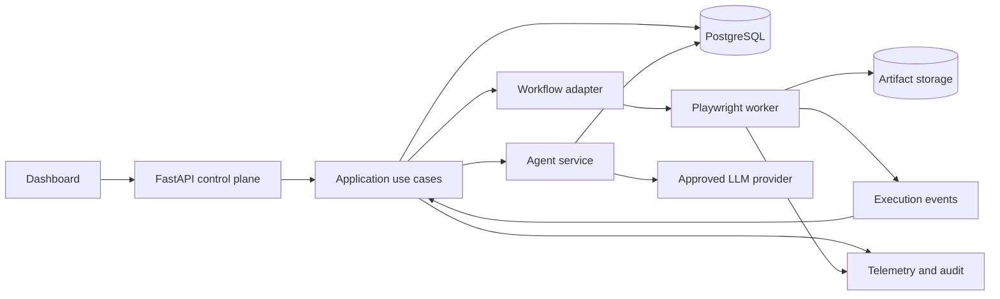
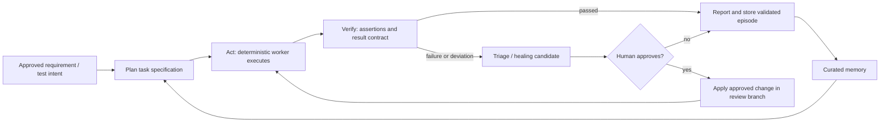
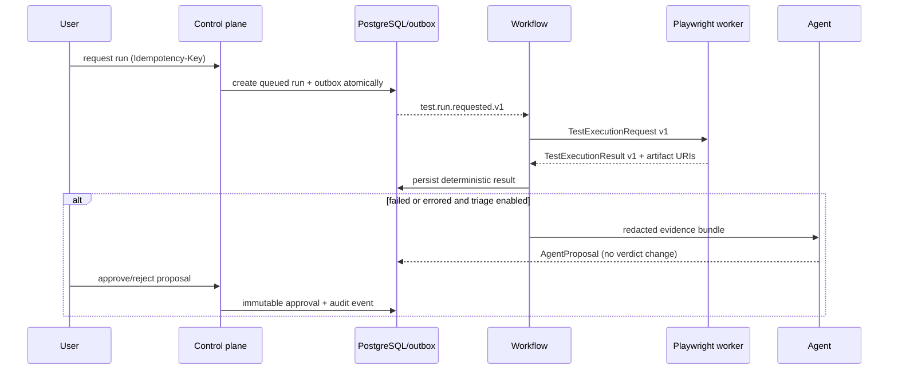

# Architecture implementation baseline

## 1. Scope and non-negotiable rules

The first implemented product slice is **Web UI test execution with AI-assisted
failure triage and reviewable healing proposals**. API and Game are extension
targets behind the same execution contract; they are not part of the thesis
benchmark's first release.

- A deterministic runner is the sole authority for a test verdict.
- Agents produce versioned proposals, never a pass/fail verdict or direct test
  mutation.
- A named human approval is required before a healing proposal can be applied.
- Every user-visible action and every asynchronous message carries a
  `correlation_id`; every retry also carries an idempotency key.
- PostgreSQL is the source of truth for business data. The workflow engine owns
  workflow history only; object storage owns binary evidence only.

## 2. Target architecture



`Workflow adapter`, `execution event transport`, and `artifact storage` are
ports. Their local implementations may use Docker Compose services, while
production implementations are chosen only after the relevant ADR decision.

### 2.1. ATA: six logical layers

The system follows an **Agentic Testing Architecture (ATA)**. These are logical
layers, rather than six independently deployed services. A component can serve
more than one layer only through an explicit port; this prevents the LLM from
gaining implicit database, browser, or approval authority.

| ATA layer | Responsibilities in Auto-AT | Implementation boundary |
| --- | --- | --- |
| 1. Perception & Context | Normalize DOM/accessibility tree, screenshots, traces, console/network events, and approved requirement inputs into an evidence bundle | `agents/perception/`, worker artifact collector |
| 2. Reasoning & Planning | Turn intents and evidence into a versioned task specification; retrieve approved similar episodes; reflect on intermediate evidence | `agents/planning/`; returns data only |
| 3. Multi-Agent Execution | Generate tests, execute deterministic steps, diagnose root cause, and propose healing | worker executes; agents issue schemas/proposals only |
| 4. Tool & Integration | Browser automation, SCM/issue tracker adapters, CI triggers, runner transport and optional MCP tool boundary | `infrastructure/` adapters behind ports |
| 5. Memory & Knowledge | Persist run history, validated locator knowledge, requirements and embeddings with provenance | PostgreSQL/object storage plus a provider-neutral retrieval port |
| 6. Reporting & Feedback | Dashboard, audit, benchmark metrics and a validated learning loop | query use cases and telemetry/export adapters |

#### Layer 1: perception and context

The Playwright worker must collect the browser accessibility snapshot, relevant
DOM fragment, current URL, screenshots, trace, console errors, network failures
and execution step history. It creates a bounded, typed `EvidenceBundle`; raw
artifacts remain in object storage. Screenshot/visual matching is a *fallback
candidate generator*, not a replacement for deterministic verification.

The requirement parser accepts explicitly authorized Jira/GitHub/Markdown input
and emits a `TestIntent` with source reference, confidence and unresolved
assumptions. It must not invent acceptance criteria. Unsupported external
integrations remain adapters until approved.

#### Layer 2: reasoning and planning

The planner produces a `TaskSpecification` rather than executable browser
commands. It contains a goal, preconditions, ordered assertions/actions,
allowed tools, risk level, evidence references and stop conditions. A
self-reflection step may revise this specification only from new evidence and
must record the old/new plan and reason. Retrieval returns only provenance-tagged
episodes; it never silently changes a test or locator.

#### Layer 3: specialized agents

| Agent | Input | Output | Authority limit |
| --- | --- | --- | --- |
| Generation | `TestIntent`, `TaskSpecification` | draft Gherkin/Playwright change proposal | no source write or merge |
| Execution | versioned test request | `TestExecutionResult` and evidence | deterministic worker, no LLM verdict |
| Self-healing | failed locator + evidence bundle | ranked `HealingProposal` candidates | requires approval and deterministic rerun |
| RCA/Triage | result + redacted evidence | root-cause category, confidence, evidence | advisory only; categories include product, test, environment and flaky |

#### Layer 4: tools and integrations

Playwright is the initial browser adapter. Selenium/Appium are future adapters
only if they implement the same execution contract. MCP can be used as a
capability-scoped tool boundary for an agent, but it must expose an allowlisted
tool set, enforce project/tenant authorization, redact tool output and emit
audit events. It must not grant arbitrary shell, browser-profile, database or
source-repository access. CI receives a signed/versioned run request and reports
the deterministic result back; an agent proposal never changes CI status from
failed to passed.

#### Layer 5: memory and knowledge

Separate memory by purpose and lifecycle:

| Store | Contents | Write rule | Retrieval rule |
| --- | --- | --- | --- |
| Transactional memory | projects, runs, approvals, audit events | application transaction only | exact, tenant-scoped query |
| Episodic memory | redacted evidence summaries, diagnosed incidents, evaluated proposals | write after deterministic result and evaluation | provenance, relevance threshold and tenant scope |
| Locator knowledge | approved selectors, accessibility/visual fingerprints, valid revision range | approval + successful deterministic rerun | candidate ranking only |
| Knowledge base | approved requirements, test data references, application glossary | authorized curator/import adapter | cite source/version in every answer |

Embeddings/vector search are an optional infrastructure implementation of
episodic retrieval; raw secrets, production PII and unredacted traces must never
be embedded. Retention, deletion and re-embedding policy require a separate ADR.

#### Layer 6: reporting and continuous feedback

The dashboard reports execution pass rate, duration, failure categories, flaky
rate, proposal acceptance, healing validation rate, false-healing rate and
coverage *when a trustworthy coverage collector is available*. The feedback loop
only promotes a locator or episode after its evidence and rerun validation are
stored. Rejected proposals are retained as negative examples with access control.

### 2.2. Closed-loop agentic operation

The system uses a bounded **Plan -> Act -> Verify -> Learn** loop:



The loop has explicit budgets: maximum retries, maximum candidate healings,
deadline, token/cost budget, confidence threshold and one final status. Its
convergence condition is defined per benchmark scenario (for example, a valid
healing must pass an independent deterministic rerun and not regress a held-out
suite). A global rule such as "coverage >95%" must not by itself mark a system
or test objective as converged.

## 3. Component responsibilities

| Component | Owns | Must not own |
| --- | --- | --- |
| Dashboard | Project/test/run/proposal views and approval UI | Business rules, secrets, direct DB access |
| API | Authentication boundary, validation, response schemas | DB queries, runner or LLM calls |
| Application | Command/query use cases and transaction boundaries | Framework-specific HTTP code |
| Domain | State transitions and approval policy | FastAPI, ORM, LLM, cloud clients |
| Infrastructure | Repositories, outbox, storage, workflow/event adapters | Domain policy |
| Workflow | Dispatch, retry, timeout, cancellation, approval wait | Source-of-truth application records |
| Worker | Version-pinned, isolated Playwright execution | Approval or agent decision making |
| Agent | Redacted evidence -> structured proposal | Test verdicts or unapproved source changes |

## 4. Repository layout to implement

```text
apps/control-plane/
  api/v1/routes/          HTTP endpoints and request/response DTOs
  application/            commands, queries, use cases
  domain/                 entities, policies, domain events, ports
  infrastructure/
    persistence/          SQLAlchemy repositories and Alembic migrations
    storage/              S3/RustFS artifact adapter
    messaging/            outbox publisher and event consumer
    workflow/             Temporal (or chosen equivalent) adapter
    observability/        tracing, metrics, structured logging
  agents/
    perception/           evidence-bundle normalization and policies
    planning/             intent parser, task specification, retrieval port
    triage/               prompt, schema validation, evaluator
    healing/              proposal-only change generation
  runners/                dispatcher and runner transport port
workers/playwright/
  src/                    contract consumer, executor, artifact uploader
  tests/                  adapter contract and end-to-end tests
packages/contracts/
  src/auto_at/contracts/  versioned execution, event, context and agent schemas
docs/research/            sourced research briefs, benchmark and results
```

## 5. Core data model

All tables include `id`, `created_at`, `updated_at`, `tenant_id` (when
multi-tenancy is enabled), and an optimistic `version` field where concurrent
updates are possible.

| Aggregate/table | Essential fields | State / invariant |
| --- | --- | --- |
| `projects` | name, repository reference, default target | belongs to one tenant |
| `test_cases` | project_id, target_type, revision, specification | revision is immutable for a run |
| `test_runs` | project_id, test_case_id, request/result JSON, status, correlation_id | terminal result comes from runner only |
| `artifacts` | run_id, kind, URI, checksum, size, retention_until | URI is not trusted until checksum verified |
| `agent_proposals` | run_id, kind, model/prompt versions, redacted input hash, proposal JSON | cannot be applied by creation |
| `approvals` | proposal_id, reviewer identity, decision, reason | one final explicit decision per proposal version |
| `audit_events` | actor, action, entity, before/after hashes, correlation_id | append-only |
| `outbox_events` | event type, payload, idempotency key, published_at | committed with business transaction |

Use JSON columns only for versioned contracts, evidence payloads and
target-specific configuration. Put filterable lifecycle fields in normal typed
columns.

## 6. Contract and event rules

Keep the existing `TestExecutionRequest` and `TestExecutionResult` as the
cross-language public contract. Add a schema/contract test suite consumed by
both Python and TypeScript before changing it.

Minimum events:

```text
test.run.requested.v1
test.run.started.v1
test.run.completed.v1
agent.triage.requested.v1
agent.proposal.created.v1
proposal.approval.recorded.v1
memory.episode.validated.v1
```

Every event includes: `event_id`, `event_type`, `schema_version`, `occurred_at`,
`correlation_id`, `causation_id`, `idempotency_key`, and `payload`. Consumers
must be at-least-once safe; duplicate events must not create duplicate runs,
proposals, or approvals.

## 7. Execution and approval sequence



Default retry policy: retry only infrastructure/transient execution errors;
never retry a known functional test failure. A retry has a bounded count,
backoff, per-step timeout and end-to-end run deadline. Cancellation must stop
future retries and notify the worker.

## 8. Security and research governance

- Do not choose an authentication provider until an ADR is approved. The API
  nevertheless exposes an `Actor`/`Principal` port from the first protected
  endpoint so local development and a later provider use the same authorization
  checks.
- Enforce tenant/project authorization in application queries, not just the UI.
- Store secrets only in runtime secret sources; never in contracts, artifacts,
  prompts, audit payloads or source control.
- Redact recursively: headers, cookies, query parameters, form fields, JSON,
  URLs and textual logs. Store a redaction policy version and input hash with
  each proposal.
- Pin model, provider, prompt/template, tool versions, evaluation dataset and
  test revision for every agent evaluation.
- Enforce request/token budgets, rate limits and a deterministic fallback:
  persist the runner result and mark triage unavailable; never alter the result.
- Define artifact retention and deletion policy by approved ADR before any
  non-local deployment.

## 9. Observability and quality gates

Adopt OpenTelemetry-compatible traces from API -> workflow -> worker -> agent;
attach `correlation_id` to all logs, spans and artifact metadata. Export metrics
for queue delay, run duration, retry count, runner failure class, artifact upload
failure, agent latency, token/cost estimate, proposal acceptance and false-heal
rate.

Required quality gates:

1. Python: `uv run ruff check .`, `uv run pytest`, static type checking.
2. TypeScript: lint, type check, Playwright adapter contract tests.
3. Integration: Compose-backed API -> worker -> RustFS happy path and failure
   path.
4. Security: secret scan, dependency scan and tests proving redaction and
   approval enforcement.
5. Reproducibility: pinned images/browser versions, lockfiles, seeded test data
   and stored benchmark manifest.

## 10. Thesis benchmark design

The benchmark is a first-class package, not an afterthought. Maintain controlled
Web UI applications, seeded fault scenarios (locator/DOM/text/timing changes),
fixed test revisions, expected root causes and a result manifest. Compare:

- deterministic Playwright baseline;
- deterministic execution + single-agent triage;
- deterministic execution + multi-agent triage/healing proposal;
- the proposed system without selected evidence sources (ablation).

Measure root-cause classification precision/recall/F1, valid-healing rate,
false-healing rate, median triage/recovery time, execution overhead, token cost,
and reproducibility across repeated runs. A healing is successful only after
human approval and a deterministic rerun; it is never successful merely because
an LLM claims so.

## 11. Implementation phases

| Phase | Deliverable | Exit criteria |
| --- | --- | --- |
| 0. Decisions | ADRs for LLM, auth, workflow, retention, deployment | user-approved choices and threat model |
| 1. Foundation | migrations, repositories, outbox, audit, run APIs | persisted run lifecycle with HTTP tests |
| 2. Web UI vertical slice | worker transport, execution, RustFS evidence | end-to-end deterministic run in Compose |
| 3. Durable orchestration | workflow, retries, cancellation, idempotency | injected duplicate/timeout tests pass |
| 4. Intelligence | redaction pipeline, triage, evaluator, approvals | proposal cannot affect verdict without approval |
| 5. Research evaluation | benchmark, baseline, ablations, experiment scripts | repeatable results and exported dataset |
| 6. Product hardening | dashboard, RBAC, telemetry, CI/CD | observability and quality gates operational |

## 12. ADRs that require user direction

Before Phase 1/3/4 production-like implementation, explicitly decide:

1. LLM provider/model, data classification, budget and rate limit.
2. Authentication provider and identity/RBAC model.
3. Temporal managed versus self-hosted deployment (or alternative workflow
   engine).
4. Cloud/deployment provider and tenant isolation model.
5. Artifact/log retention periods and deletion/legal policy.

Until these are decided, implement only local, provider-neutral ports and
adapters. Do not encode a vendor-specific dependency in domain or contracts.
