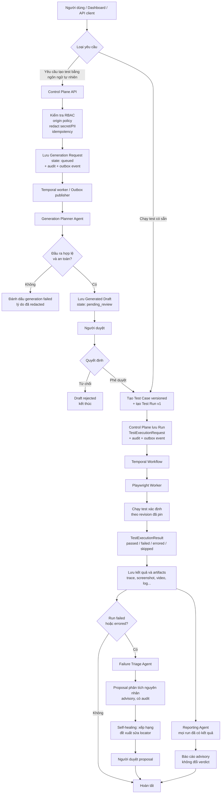

# Luồng hệ thống kiểm thử

Sơ đồ dưới đây mô tả luồng hiện tại từ khi hệ thống nhận yêu cầu đến khi một
test run và các kết quả advisory sau run kết thúc.

## Nguyên tắc kiểm soát

- Playwright Worker là thành phần duy nhất quyết định verdict của test.
- Generation, Triage và Reporting Agent chỉ tạo draft, báo cáo hoặc proposal advisory.
- Test do AI sinh và đề xuất self-healing cần được người dùng phê duyệt trước khi có hiệu lực.
- `correlation_id`, audit event và artifacts được giữ xuyên suốt để truy vết.
