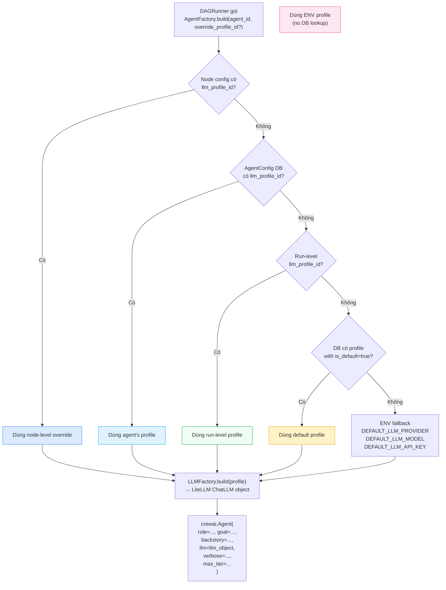
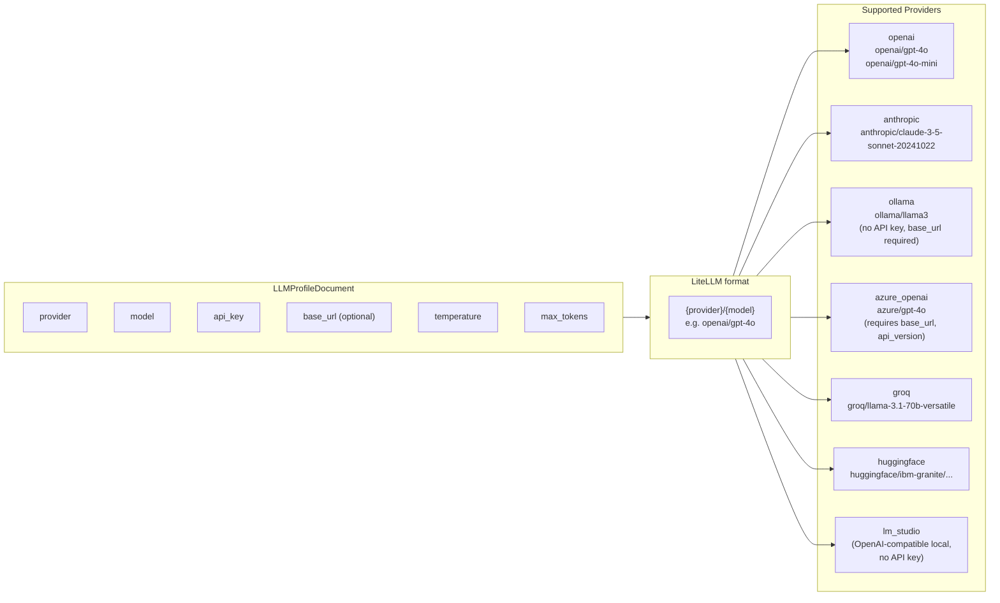
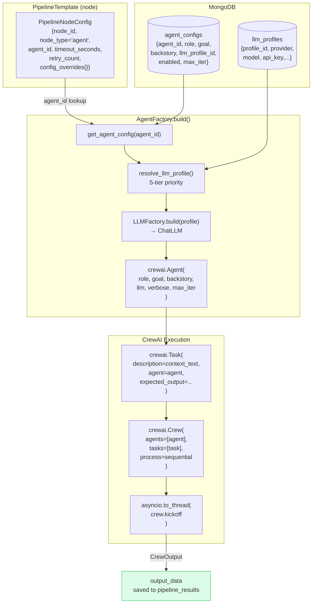
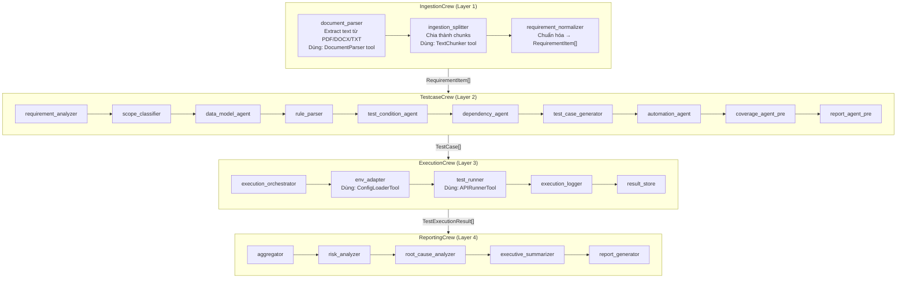
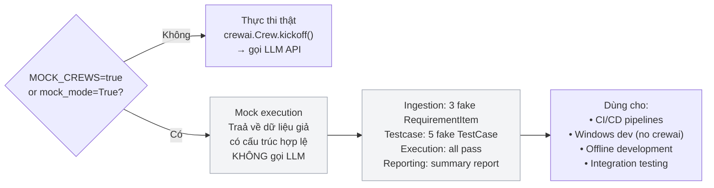

# Luồng Agent Factory & LLM Resolution

## 1. Luồng phân giải LLM Profile (5 tầng ưu tiên)

---

## 2. LLM Factory — provider matrix

---

## 3. Agent Catalog → Node → Crew execution

---

## 4. 4 Built-in Crews — cấu trúc agents

---

## 5. Mock Mode — fallback khi không có LLM

