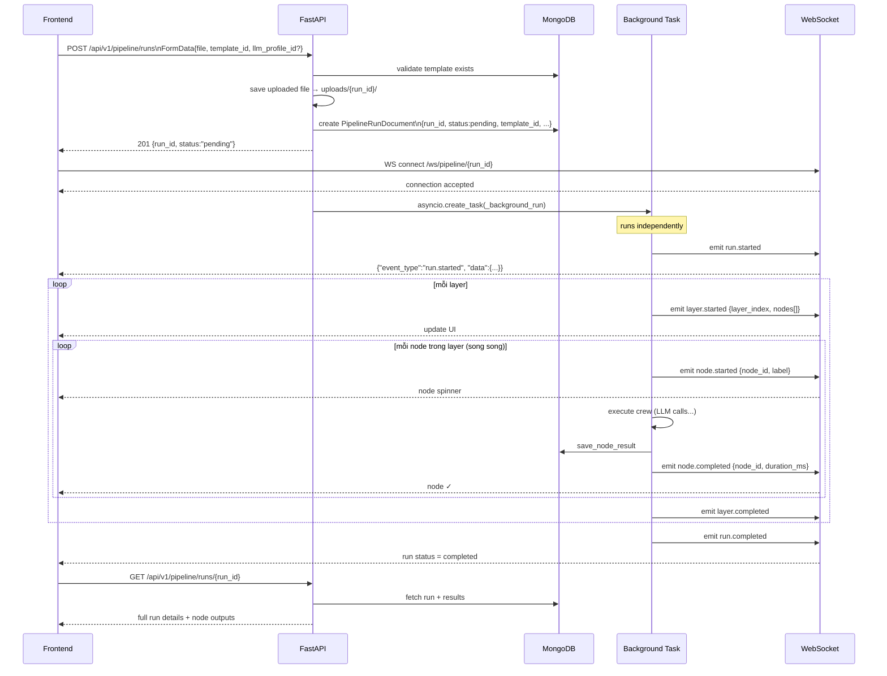
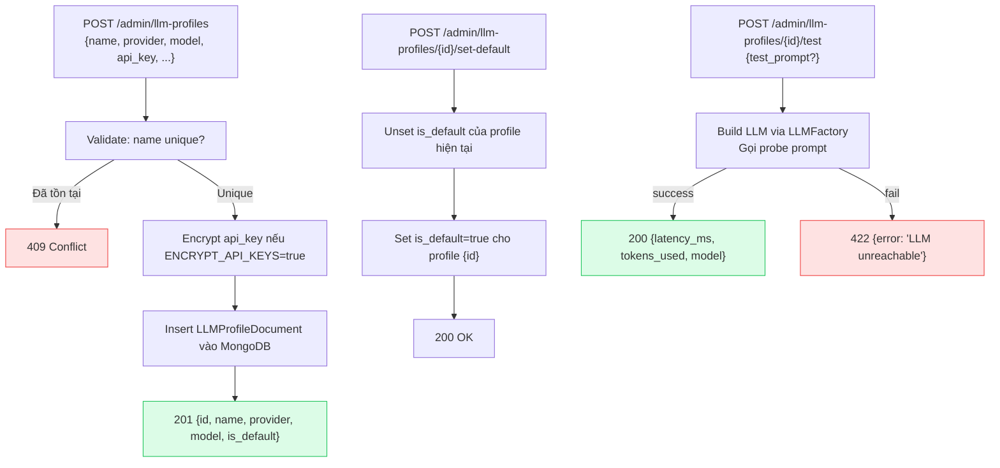
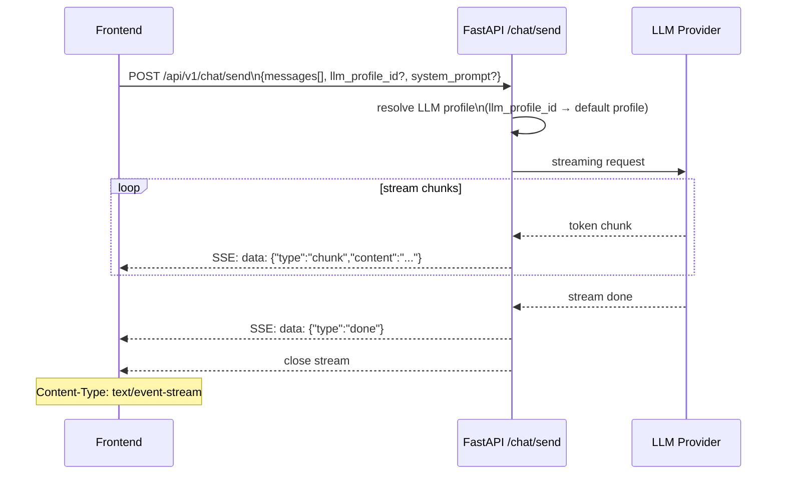
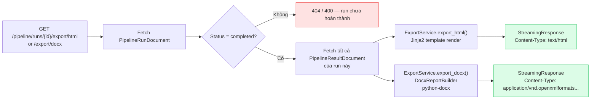
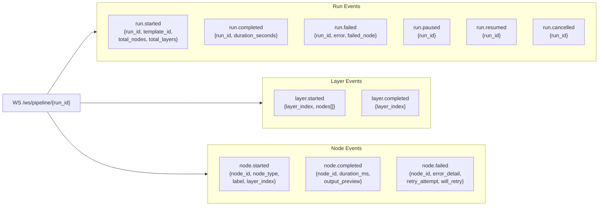

# Luồng API — Request / Response

## 1. Tổng quan các nhóm endpoint

```mermaid
mindmap
  root((Auto-AT API\n/api/v1))
    Pipeline Templates
      GET /pipeline-templates
      POST /pipeline-templates
      GET /{id}
      PUT /{id}
      DELETE /{id}
      POST /{id}/clone
      POST /{id}/archive
      POST /{id}/validate
      GET /{id}/export
      POST /import
    Pipeline Runs
      POST /pipeline/runs
      GET /pipeline/runs
      GET /pipeline/runs/{id}
      DELETE /pipeline/runs/{id}
      GET /runs/{id}/results
      GET /runs/{id}/results/{node_id}
      POST /runs/{id}/pause
      POST /runs/{id}/resume
      POST /runs/{id}/cancel
      GET /runs/{id}/export/html
      GET /runs/{id}/export/docx
    Admin
      LLM Profiles
        GET /admin/llm-profiles
        POST /admin/llm-profiles
        PUT /{id}
        DELETE /{id}
        POST /{id}/set-default
        POST /{id}/test
      Agent Configs
        GET /admin/agent-configs
        POST /admin/agent-configs
        PUT /{agent_id}
        DELETE /{agent_id}
        POST /{agent_id}/reset
        POST /reset-all
    Chat
      GET /chat/profiles
      POST /chat/send SSE
    WebSocket
      WS /ws/pipeline/{run_id}
```

---

## 2. Luồng tạo và theo dõi Pipeline Run



---

## 3. Luồng quản lý LLM Profile



---

## 4. Luồng Chat SSE



---

## 5. Luồng Export Report



---

## 6. WebSocket event types


