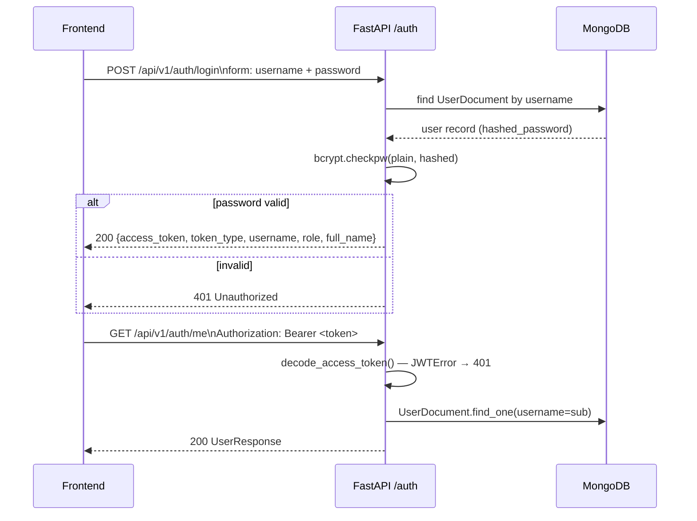
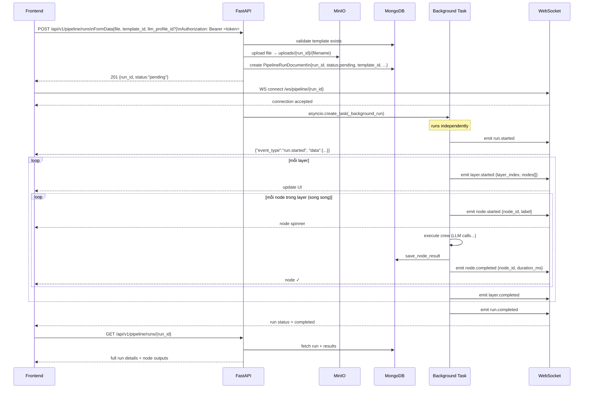
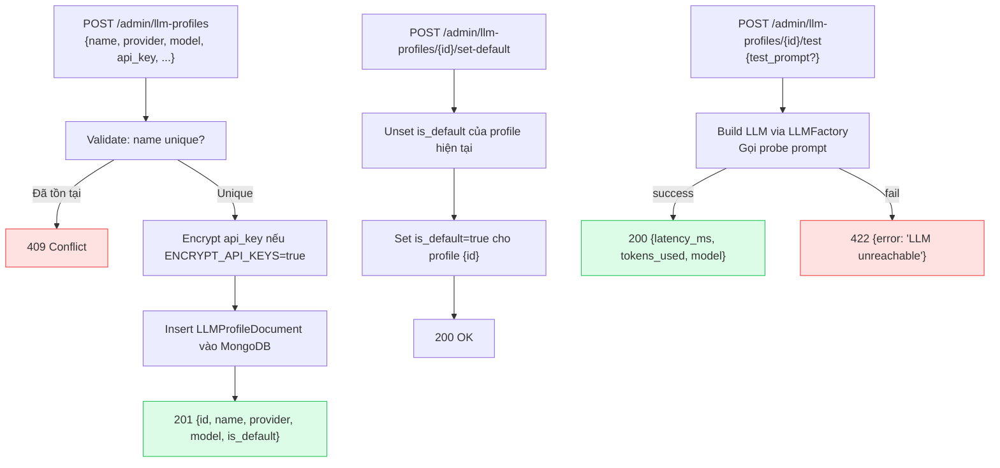
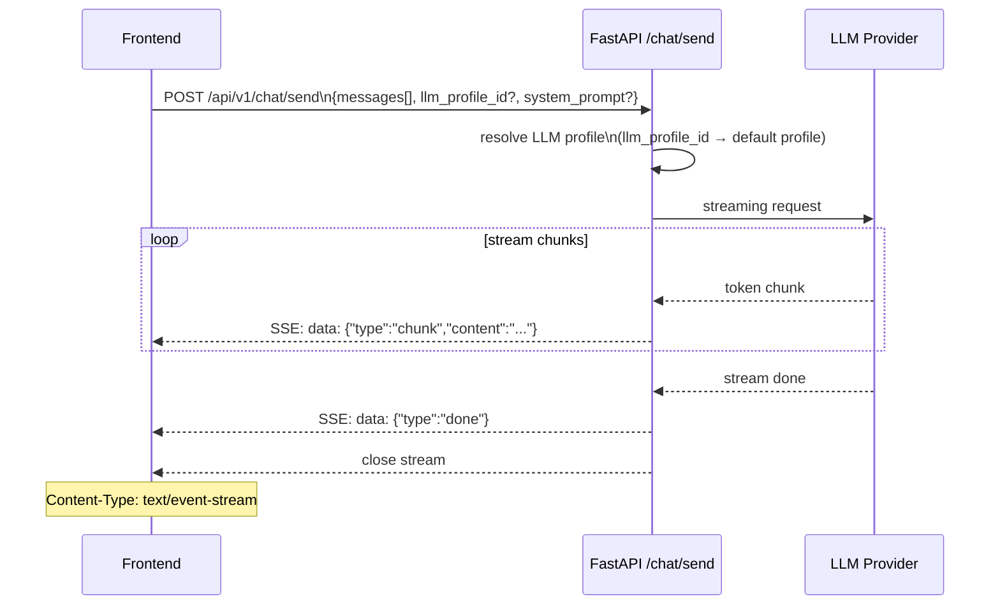
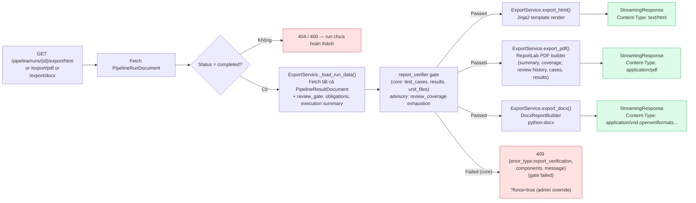
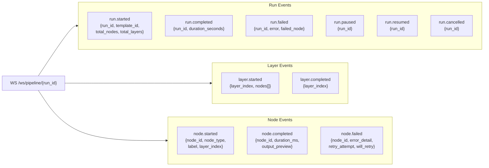

# Luồng API — Request / Response

## 1. Tổng quan các nhóm endpoint

```mermaid
mindmap
  root((Auto-AT API\n/api/v1))
    Auth
      POST /auth/login
      GET /auth/me
      POST /auth/users
      GET /auth/users
      GET /auth/users/{username}
      PUT /auth/users/{username}
      DELETE /auth/users/{username}
    Pipeline Templates
      GET /pipeline-templates
      POST /pipeline-templates
      GET /{id}
      PUT /{id}
      DELETE /{id}
      POST /{id}/clone
      POST /{id}/archive
      POST /{id}/validate
      GET /{id}/export
      POST /import
    Pipeline Runs
      POST /pipeline/run (V2 legacy)
      POST /pipeline/runs (V3 DAG)
      GET /pipeline/runs
      GET /pipeline/runs/{id}
      DELETE /pipeline/runs/{id}
      GET /runs/{id}/results
      GET /runs/{id}/results/{node_id}
      POST /runs/{id}/pause
      POST /runs/{id}/resume
      POST /runs/{id}/cancel
      GET /runs/{id}/export/html
      GET /runs/{id}/export/docx
      GET /runs/{id}/export/pdf (Phase 4)
    Admin
      LLM Profiles
        GET /admin/llm-profiles
        POST /admin/llm-profiles
        PUT /{id}
        DELETE /{id}
        POST /{id}/set-default
        POST /{id}/test
      Agent Configs
        GET /admin/agent-configs
        POST /admin/agent-configs
        PUT /{agent_id}
        DELETE /{agent_id}
        POST /{agent_id}/reset
        POST /reset-all
      Stage Configs
        GET /admin/stage-configs
        POST /admin/stage-configs
        PUT /{stage_id}
        DELETE /{stage_id}
      Tools
        GET /admin/tools
    Chat
      GET /chat/profiles
      POST /chat/send SSE
    WebSocket
      WS /ws/pipeline/{run_id}
```

---

## 2. Luồng xác thực (Auth)


```mermaid
sequenceDiagram
    participant UI as Frontend
    participant API as FastAPI /auth
    participant DB as MongoDB

    UI->>API: POST /api/v1/auth/login\nform: username + password
    API->>DB: find UserDocument by username
    DB-->>API: user record (hashed_password)
    API->>API: bcrypt.checkpw(plain, hashed)
    alt password valid
        API-->>UI: 200 {access_token, token_type, username, role, full_name}
    else invalid
        API-->>UI: 401 Unauthorized
    end

    UI->>API: GET /api/v1/auth/me\nAuthorization: Bearer <token>
    API->>API: decode_access_token() — JWTError → 401
    API->>DB: UserDocument.find_one(username=sub)
    API-->>UI: 200 UserResponse
```

---

## 3. Luồng tạo và theo dõi Pipeline Run


```mermaid
sequenceDiagram
    participant UI as Frontend
    participant API as FastAPI
    participant MINIO as MinIO
    participant DB as MongoDB
    participant BG as Background Task
    participant WS as WebSocket

    UI->>API: POST /api/v1/pipeline/runs\nFormData{file, template_id, llm_profile_id?}\nAuthorization: Bearer <token>
    API->>DB: validate template exists
    API->>MINIO: upload file → uploads/{run_id}/{filename}
    API->>DB: create PipelineRunDocument\n{run_id, status:pending, template_id, ...}
    API-->>UI: 201 {run_id, status:"pending"}

    UI->>WS: WS connect /ws/pipeline/{run_id}
    WS-->>UI: connection accepted

    API->>BG: asyncio.create_task(_background_run)
    note over BG: runs independently

    BG->>WS: emit run.started
    WS-->>UI: {"event_type":"run.started", "data":{...}}

    loop mỗi layer
        BG->>WS: emit layer.started {layer_index, nodes[]}
        WS-->>UI: update UI

        loop mỗi node trong layer (song song)
            BG->>WS: emit node.started {node_id, label}
            WS-->>UI: node spinner
            BG->>BG: execute crew (LLM calls...)
            BG->>DB: save_node_result
            BG->>WS: emit node.completed {node_id, duration_ms}
            WS-->>UI: node ✓
        end

        BG->>WS: emit layer.completed
    end

    BG->>WS: emit run.completed
    WS-->>UI: run status = completed

    UI->>API: GET /api/v1/pipeline/runs/{run_id}
    API->>DB: fetch run + results
    API-->>UI: full run details + node outputs
```

---

## 4. Luồng quản lý LLM Profile


```mermaid
flowchart TD
    A["POST /admin/llm-profiles\n{name, provider, model, api_key, ...}"]
    B["Validate: name unique?"]
    C["409 Conflict"]
    D["Encrypt api_key nếu ENCRYPT_API_KEYS=true"]
    E["Insert LLMProfileDocument vào MongoDB"]
    F["201 {id, name, provider, model, is_default}"]

    A --> B
    B -- Đã tồn tại --> C
    B -- Unique --> D --> E --> F

    G["POST /admin/llm-profiles/{id}/set-default"]
    H["Unset is_default của profile hiện tại"]
    I["Set is_default=true cho profile {id}"]
    J["200 OK"]

    G --> H --> I --> J

    K["POST /admin/llm-profiles/{id}/test\n{test_prompt?}"]
    L["Build LLM via LLMFactory\nGọi probe prompt"]
    M["200 {latency_ms, tokens_used, model}"]
    N["422 {error: 'LLM unreachable'}"]

    K --> L
    L -- success --> M
    L -- fail --> N

    style C fill:#fee2e2,stroke:#ef4444
    style N fill:#fee2e2,stroke:#ef4444
    style F fill:#dcfce7,stroke:#22c55e
    style M fill:#dcfce7,stroke:#22c55e
```

---

## 5. Luồng Chat SSE


```mermaid
sequenceDiagram
    participant UI as Frontend
    participant API as FastAPI /chat/send
    participant LLM as LLM Provider

    UI->>API: POST /api/v1/chat/send\n{messages[], llm_profile_id?, system_prompt?}
    API->>API: resolve LLM profile\n(llm_profile_id → default profile)
    API->>LLM: streaming request

    loop stream chunks
        LLM-->>API: token chunk
        API-->>UI: SSE: data: {"type":"chunk","content":"..."}
    end

    LLM-->>API: stream done
    API-->>UI: SSE: data: {"type":"done"}
    API-->>UI: close stream

    note over UI: Content-Type: text/event-stream
```

---

## 6. Luồng Export Report (HTML / PDF / DOCX)


```mermaid
flowchart LR
    A["GET /pipeline/runs/{id}/export/html\n or /export/pdf or /export/docx"]
    B["Fetch PipelineRunDocument"]
    C{"Status = completed?"}
    D["404 / 400 — run chưa hoàn thành"]
    E["ExportService._load_run_data()\nFetch tất cả PipelineResultDocument\n+ review_gate, obligations, execution summary"]
    G["report_verifier gate\n(core: test_cases, results, unit_files)\nadvisory: review_coverage exhaustion"]

    F1["ExportService.export_html()\nJinja2 template render"]
    F2["ExportService.export_pdf()\nReportLab PDF builder\n(summary, coverage, review history, cases, results)"]
    F3["ExportService.export_docx()\nDocxReportBuilder\npython-docx"]

    H1["StreamingResponse\nContent-Type: text/html"]
    H2["StreamingResponse\nContent-Type: application/pdf"]
    H3["StreamingResponse\nContent-Type: application/vnd.openxmlformats..."]

    Z["409 {error_type:report_verification,\ncomponents, message}\n(gate failed)\n\n?force=true (admin override)"]

    A --> B --> C
    C -- Không --> D
    C -- Có --> E --> G
    G -- Passed --> F1 --> H1
    G -- Passed --> F2 --> H2
    G -- Passed --> F3 --> H3
    G -- Failed (core) --> Z

    style D fill:#fee2e2,stroke:#ef4444
    style Z fill:#fee2e2,stroke:#ef4444
    style H1 fill:#dcfce7,stroke:#22c55e
    style H2 fill:#dcfce7,stroke:#22c55e
    style H3 fill:#dcfce7,stroke:#22c55e
```

**Key differences (Phase 4):**
- **Shared data source:** `_load_run_data()` resolves once; all three formats (HTML, PDF, DOCX) consume the same normalized context.
- **PDF builder (ReportLab):** Renders sections: executive summary, deterministic coverage matrix, review iteration history, selected test cases, execution results, warnings.
- **Multi-endpoint coverage:** The coverage matrix spans **every** endpoint declared in the MD spec — obligations are extracted per endpoint (responses, auth, fields/rules) plus spec-level headers once. A document with N endpoints contributes N endpoints' obligations to the denominator, so `coverage_percent` reflects the whole spec, not just the first endpoint.
- **Review coverage (advisory):** An exhausted coverage gate (`coverage_gate_exhausted=true`) does **not** fail verification; instead, it surfaces a warning that is visible in all three formats and in the FE run-detail page.
- **Header redaction:** Secret values are redacted before rendering into any export; placeholders like `Bearer ${TOKEN}` are preserved.

---

## 7. WebSocket event types


```mermaid
graph LR
    subgraph RunEvents["Run Events"]
        R1["run.started\n{run_id, template_id,\ntotal_nodes, total_layers}"]
        R2["run.completed\n{run_id, duration_seconds}"]
        R3["run.failed\n{run_id, error, failed_node}"]
        R4["run.paused\n{run_id}"]
        R5["run.resumed\n{run_id}"]
        R6["run.cancelled\n{run_id}"]
    end

    subgraph LayerEvents["Layer Events"]
        L1["layer.started\n{layer_index, nodes[]}"]
        L2["layer.completed\n{layer_index}"]
    end

    subgraph NodeEvents["Node Events"]
        N1["node.started\n{node_id, node_type,\nlabel, layer_index}"]
        N2["node.completed\n{node_id, duration_ms,\noutput_preview}"]
        N3["node.failed\n{node_id, error_detail,\nretry_attempt, will_retry}"]
    end

    WS["WS /ws/pipeline/{run_id}"] --> RunEvents
    WS --> LayerEvents
    WS --> NodeEvents
```

## Endpoint — Automation Testing API Report Verification & Exports

### GET /api/v1/pipeline/runs/{run_id}/report/verification
**Response (200 OK):**
```json
{
  "verified": true,
  "components": {
    "test_cases":      {"ok": true, "count": 23, "issues": []},
    "results":         {"ok": true, "count": 18, "issues": [], "extra": {"pass_rate": 82.0}},
    "unit_test_files": {"ok": true, "count": 8, "issues": []},
    "review_coverage": {"ok": true, "issues": [], "extra": {"coverage_percent": 90.5, "exhausted": false}}
  },
  "html_url": "runs/{run_id}/report.html",
  "pdf_url":  "runs/{run_id}/report.pdf",
  "docx_url": "runs/{run_id}/report.docx",
  "summary": "Report ready for delivery",
  "available": true
}
```

**Note:** `review_coverage` is **informational only** — an exhausted gate never fails verification. The three core components (test_cases, results, unit_test_files) remain the gating criteria.

### GET /api/v1/pipeline/runs/{run_id}/export/{html|pdf|docx}
**Success (200 OK):** File bytes with appropriate Content-Type and Content-Disposition.
- `html` → `text/html; charset=utf-8`
- `pdf` → `application/pdf`
- `docx` → `application/vnd.openxmlformats-officedocument.wordprocessingml.document`

**Gated Failure (409 Conflict):**
```json
{
  "error_type": "report_verification",
  "message": "Report components incomplete or invalid",
  "components": {
    "test_cases": {"ok": false, "issues": ["count=0"]},
    "results": {"ok": true, "issues": []},
    "unit_test_files": {"ok": true, "issues": []},
    "review_coverage": {"ok": false, "issues": ["exhausted: true"]}
  }
}
```

**Admin Override:**
```
GET /api/v1/pipeline/runs/{run_id}/export/html?force=true
```
Requires role `admin` or above. Bypasses the gate and returns the file even if verification fails.

### Structured Node Failure Events

```
WS node.failed
{
  "node_id": "at-api-md-verifier",
  "error_type": "md_spec_validation",
  "error_detail": {
    "code": "MD_SPEC_MISSING_RESPONSE_STATUS",
    "missing_sections": ["response"],
    "missing_fields": ["status_code"],
    "detail": "..."
  }
}
```

```
WS node.completed (adaptive_planner_node)
{
  "node_id": "adaptive_planner",
  "duration_ms": 45000,
  "output_preview": {
    "complexity": {"agent_count": 3, "selected_roles": ["positive", "auth_security", "boundary_data"]},
    "review_gate": {
      "final_coverage_percent": 92.0,
      "final_verdict": "approve",
      "coverage_gate_exhausted": false,
      "warnings": []
    },
    "test_case_count": 34
  }
}
```
