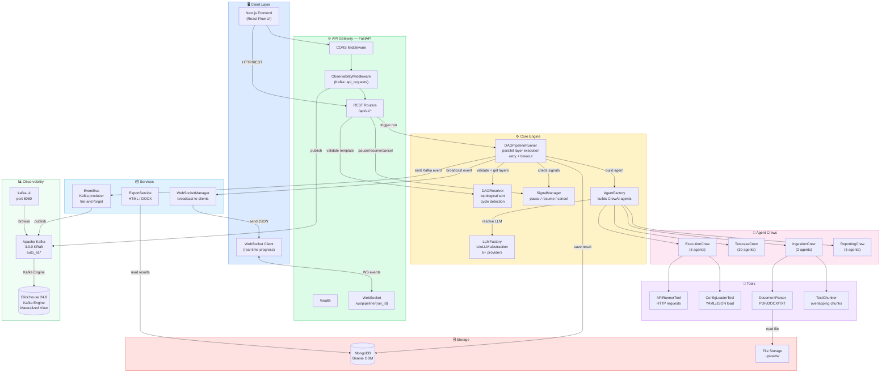
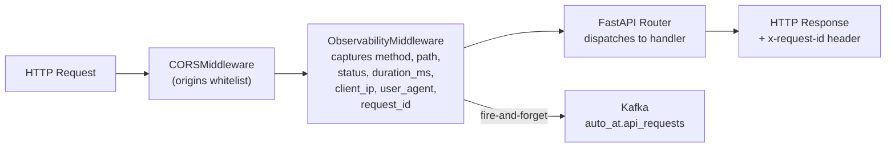
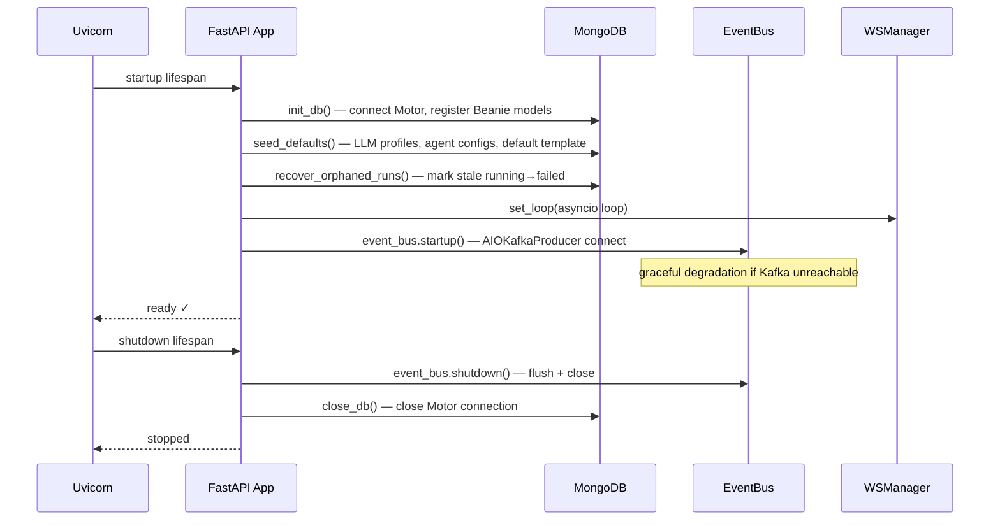
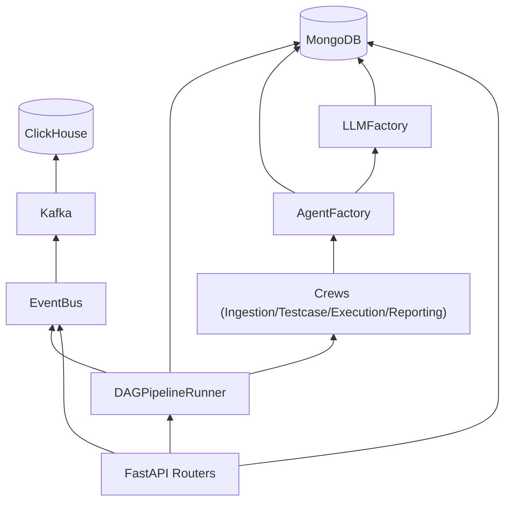

# Kiến trúc tổng thể — Auto-AT v3

## 1. Sơ đồ kiến trúc hệ thống

```mermaid
graph TB
    subgraph Client["🖥️ Client Layer"]
        direction LR
        FE["Next.js Frontend\n(React Flow UI)"]
        WS_CLIENT["WebSocket Client\n(real-time progress)"]
    end

    subgraph Gateway["🌐 API Gateway — FastAPI"]
        direction TB
        CORS["CORS Middleware"]
        OBS_MW["ObservabilityMiddleware\n(Kafka: api_requests)"]
        HEALTH["/health"]
        REST["REST Routers\n/api/v1/*"]
        WS_SERVER["WebSocket\n/ws/pipeline/{run_id}"]
    end

    subgraph Core["⚙️ Core Engine"]
        direction TB
        DAG_RESOLVER["DAGResolver\ntopological sort\ncycle detection"]
        DAG_RUNNER["DAGPipelineRunner\nparallel layer execution\nretry + timeout"]
        SIGNAL["SignalManager\npause / resume / cancel"]
        AGENT_FACTORY["AgentFactory\nbuilds CrewAI agents"]
        LLM_FACTORY["LLMFactory\nLiteLLM abstraction\n6+ providers"]
    end

    subgraph Crews["🤖 Agent Crews"]
        direction LR
        INGESTION["IngestionCrew\n(2 agents)"]
        TESTCASE["TestcaseCrew\n(10 agents)"]
        EXECUTION["ExecutionCrew\n(5 agents)"]
        REPORTING["ReportingCrew\n(5 agents)"]
    end

    subgraph Tools["🔧 Tools"]
        direction LR
        API_RUNNER["APIRunnerTool\nHTTP requests"]
        CFG_LOADER["ConfigLoaderTool\nYAML/JSON load"]
        DOC_PARSER["DocumentParser\nPDF/DOCX/TXT"]
        CHUNKER["TextChunker\noverlapping chunks"]
    end

    subgraph Services["📦 Services"]
        EXPORT["ExportService\nHTML / DOCX"]
        EVENT_BUS["EventBus\nKafka producer\nfire-and-forget"]
        WS_MGR["WebSocketManager\nbroadcast to clients"]
    end

    subgraph Storage["🗄️ Storage"]
        direction LR
        MONGO[("MongoDB\nBeanie ODM")]
        UPLOAD["File Storage\nuploads/"]
    end

    subgraph Observability["📊 Observability"]
        direction TB
        KAFKA["Apache Kafka\n3.9.0 KRaft\nauto_at.*"]
        CLICKHOUSE[("ClickHouse 24.8\nKafka Engine\nMateralized View")]
        KAFKA_UI["kafka-ui\nport 8080"]
    end

    %% Client ↔ Gateway
    FE -->|"HTTP/REST"| REST
    WS_CLIENT <-->|"WS events"| WS_SERVER

    %% Gateway internals
    FE --> CORS --> OBS_MW --> REST

    %% Gateway → Core
    REST -->|"trigger run"| DAG_RUNNER
    REST -->|"pause/resume/cancel"| SIGNAL
    REST -->|"validate template"| DAG_RESOLVER

    %% Core internals
    DAG_RUNNER -->|"validate + get layers"| DAG_RESOLVER
    DAG_RUNNER -->|"check signals"| SIGNAL
    DAG_RUNNER -->|"build agent"| AGENT_FACTORY
    AGENT_FACTORY -->|"resolve LLM"| LLM_FACTORY

    %% Core → Crews
    AGENT_FACTORY --> INGESTION
    AGENT_FACTORY --> TESTCASE
    AGENT_FACTORY --> EXECUTION
    AGENT_FACTORY --> REPORTING

    %% Crews → Tools
    INGESTION --> DOC_PARSER
    INGESTION --> CHUNKER
    EXECUTION --> API_RUNNER
    EXECUTION --> CFG_LOADER

    %% Core → Services
    DAG_RUNNER -->|"broadcast event"| WS_MGR
    DAG_RUNNER -->|"emit Kafka event"| EVENT_BUS

    %% Services → Storage
    DAG_RUNNER -->|"save result"| MONGO
    EXPORT -->|"read results"| MONGO
    DOC_PARSER -->|"read file"| UPLOAD

    %% Services → Observability
    EVENT_BUS -->|"publish"| KAFKA
    OBS_MW -->|"publish"| KAFKA
    KAFKA -->|"Kafka Engine"| CLICKHOUSE
    KAFKA_UI -->|"browse"| KAFKA

    %% WebSocket
    WS_MGR -->|"send JSON"| WS_CLIENT

    style Client fill:#dbeafe,stroke:#3b82f6
    style Gateway fill:#dcfce7,stroke:#22c55e
    style Core fill:#fef3c7,stroke:#f59e0b
    style Crews fill:#fce7f3,stroke:#ec4899
    style Tools fill:#f3e8ff,stroke:#a855f7
    style Services fill:#e0f2fe,stroke:#0ea5e9
    style Storage fill:#fee2e2,stroke:#ef4444
    style Observability fill:#f0fdf4,stroke:#16a34a
```

---

## 2. Middleware stack

```mermaid
flowchart LR
    REQ["HTTP Request"] --> CORS["CORSMiddleware\n(origins whitelist)"]
    CORS --> OBS["ObservabilityMiddleware\ncaptures method, path,\nstatus, duration_ms,\nclient_ip, user_agent,\nrequest_id"]
    OBS --> ROUTER["FastAPI Router\ndispatches to handler"]
    ROUTER --> RESP["HTTP Response\n+ x-request-id header"]
    OBS -->|"fire-and-forget"| KAFKA["Kafka\nauto_at.api_requests"]
```

---

## 3. Lifespan — startup / shutdown

```mermaid
sequenceDiagram
    participant UV as Uvicorn
    participant APP as FastAPI App
    participant DB as MongoDB
    participant EB as EventBus
    participant WS as WSManager

    UV->>APP: startup lifespan
    APP->>DB: init_db() — connect Motor, register Beanie models
    APP->>DB: seed_defaults() — LLM profiles, agent configs, default template
    APP->>DB: recover_orphaned_runs() — mark stale running→failed
    APP->>WS: set_loop(asyncio loop)
    APP->>EB: event_bus.startup() — AIOKafkaProducer connect
    note over EB: graceful degradation if Kafka unreachable
    APP-->>UV: ready ✓

    UV->>APP: shutdown lifespan
    APP->>EB: event_bus.shutdown() — flush + close
    APP->>DB: close_db() — close Motor connection
    APP-->>UV: stopped
```

---

## 4. Phân lớp dependency

```mermaid
graph BT
    MONGO[("MongoDB")]
    KAFKA["Kafka"]
    CLICKHOUSE[("ClickHouse")]

    EVENT_BUS["EventBus"] --> KAFKA
    KAFKA --> CLICKHOUSE

    DAG_RUNNER["DAGPipelineRunner"] --> MONGO
    DAG_RUNNER --> EVENT_BUS

    AGENT_FACTORY["AgentFactory"] --> MONGO
    LLM_FACTORY["LLMFactory"] --> MONGO
    AGENT_FACTORY --> LLM_FACTORY

    CREWS["Crews (Ingestion/Testcase/Execution/Reporting)"] --> AGENT_FACTORY
    DAG_RUNNER --> CREWS

    API["FastAPI Routers"] --> DAG_RUNNER
    API --> MONGO
    API --> EVENT_BUS
```
