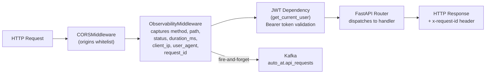
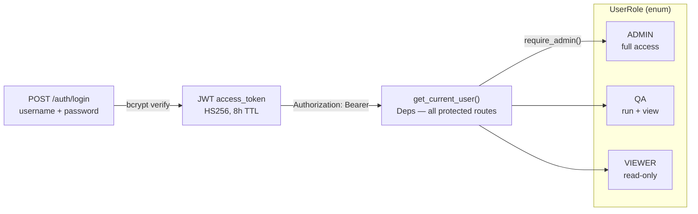
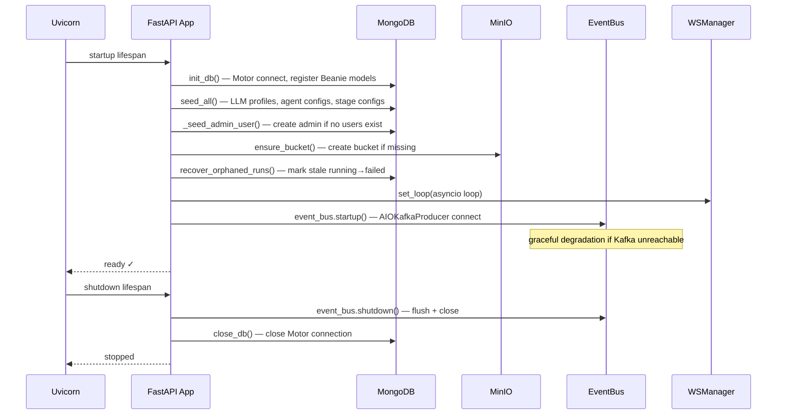
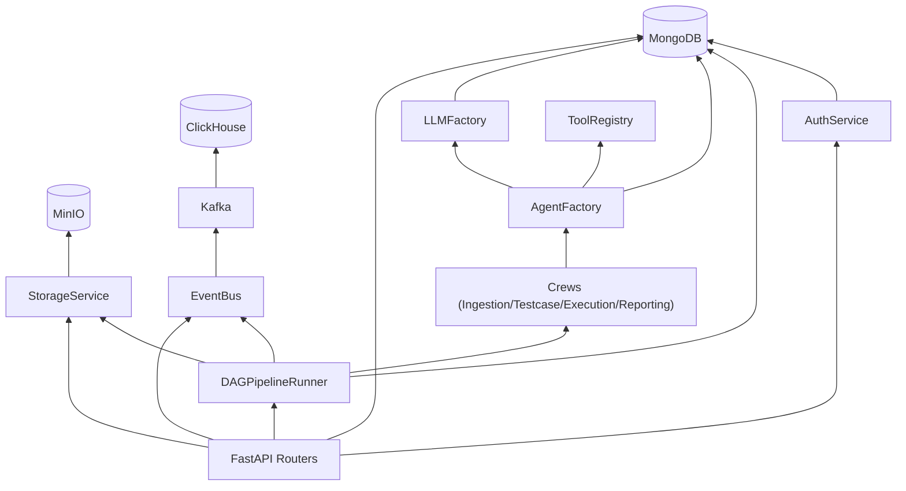

# Kiến trúc tổng thể — Auto-AT v3

## 1. Sơ đồ kiến trúc hệ thống

```mermaid
graph TB
    subgraph Client["🖥️ Client Layer"]
        direction LR
        FE["Next.js Frontend\n(React Flow UI)"]
        WS_CLIENT["WebSocket Client\n(real-time progress)"]
    end

    subgraph Gateway["🌐 API Gateway — FastAPI"]
        direction TB
        CORS["CORS Middleware"]
        OBS_MW["ObservabilityMiddleware\n(Kafka: api_requests)"]
        AUTH_MW["JWT Auth\n(Bearer token)"]
        HEALTH["/health"]
        REST["REST Routers\n/api/v1/*"]
        WS_SERVER["WebSocket\n/ws/pipeline/{run_id}"]
    end

    subgraph Core["⚙️ Core Engine"]
        direction TB
        DAG_RESOLVER["DAGResolver\ntopological sort\ncycle detection"]
        DAG_RUNNER["DAGPipelineRunner\nparallel layer execution\nretry + timeout"]
        SIGNAL["SignalManager\npause / resume / cancel"]
        AGENT_FACTORY["AgentFactory\nbuilds CrewAI agents"]
        LLM_FACTORY["LLMFactory\nLiteLLM abstraction\n7 providers"]
        TOOL_REG["ToolRegistry\nresolves tool_names → instances"]
    end

    subgraph Crews["🤖 Agent Crews"]
        direction LR
        INGESTION["IngestionCrew\n(2 agents)"]
        TESTCASE["TestcaseCrew\n(10 agents)"]
        EXECUTION["ExecutionCrew\n(5 agents)"]
        REPORTING["ReportingCrew\n(5 agents)"]
    end

    subgraph Tools["🔧 Tools (ToolRegistry)"]
        direction LR
        API_RUNNER["api_runner\nHTTP requests"]
        CFG_LOADER["config_loader\nYAML/JSON load"]
        DOC_PARSER["document_parser\nPDF/DOCX/TXT"]
        CHUNKER["text_chunker\noverlapping chunks"]
        FILE_RENDERER["test_file_renderer\nPlaywright file gen"]
    end

    subgraph Services["📦 Services"]
        AUTH_SVC["AuthService\nbcrypt + JWT"]
        EXPORT["ExportService\nHTML / DOCX"]
        EVENT_BUS["EventBus\nKafka producer\nfire-and-forget"]
        WS_MGR["WebSocketManager\nbroadcast to clients"]
        STORAGE["StorageService\nMinIO S3-compat"]
    end

    subgraph Storage["🗄️ Storage"]
        direction LR
        MONGO[("MongoDB 7\nBeanie ODM")]
        MINIO[("MinIO\nuploads/{run_id}/\nruns/{run_id}/playwright/")]
    end

    subgraph Observability["📊 Observability"]
        direction TB
        KAFKA["Apache Kafka\n3.9.0 KRaft\nauto_at.*"]
        CLICKHOUSE[("ClickHouse 24.8\nKafka Engine\nMaterialized View")]
    end

    %% Client ↔ Gateway
    FE -->|"HTTP/REST + Bearer"| REST
    WS_CLIENT <-->|"WS events"| WS_SERVER

    %% Gateway internals
    FE --> CORS --> OBS_MW --> AUTH_MW --> REST

    %% Gateway → Core
    REST -->|"trigger run"| DAG_RUNNER
    REST -->|"pause/resume/cancel"| SIGNAL
    REST -->|"validate template"| DAG_RESOLVER

    %% Auth
    REST -->|"login/users"| AUTH_SVC
    AUTH_SVC --> MONGO

    %% Core internals
    DAG_RUNNER -->|"validate + get layers"| DAG_RESOLVER
    DAG_RUNNER -->|"check signals"| SIGNAL
    DAG_RUNNER -->|"build agent"| AGENT_FACTORY
    AGENT_FACTORY -->|"resolve LLM"| LLM_FACTORY
    AGENT_FACTORY -->|"resolve tools"| TOOL_REG

    %% Core → Crews
    AGENT_FACTORY --> INGESTION
    AGENT_FACTORY --> TESTCASE
    AGENT_FACTORY --> EXECUTION
    AGENT_FACTORY --> REPORTING

    %% Crews → Tools
    INGESTION --> DOC_PARSER
    INGESTION --> CHUNKER
    EXECUTION --> API_RUNNER
    EXECUTION --> CFG_LOADER
    EXECUTION --> FILE_RENDERER

    %% Core → Services
    DAG_RUNNER -->|"broadcast event"| WS_MGR
    DAG_RUNNER -->|"emit Kafka event"| EVENT_BUS

    %% Services → Storage
    DAG_RUNNER -->|"save result"| MONGO
    EXPORT -->|"read results"| MONGO
    REST -->|"upload file"| STORAGE
    STORAGE --> MINIO

    %% Services → Observability
    EVENT_BUS -->|"publish"| KAFKA
    OBS_MW -->|"publish"| KAFKA
    KAFKA -->|"Kafka Engine"| CLICKHOUSE

    %% WebSocket
    WS_MGR -->|"send JSON"| WS_CLIENT

    style Client fill:#dbeafe,stroke:#3b82f6
    style Gateway fill:#dcfce7,stroke:#22c55e
    style Core fill:#fef3c7,stroke:#f59e0b
    style Crews fill:#fce7f3,stroke:#ec4899
    style Tools fill:#f3e8ff,stroke:#a855f7
    style Services fill:#e0f2fe,stroke:#0ea5e9
    style Storage fill:#fee2e2,stroke:#ef4444
    style Observability fill:#f0fdf4,stroke:#16a34a
```

---

## 2. Middleware stack

---

## 3. Auth & RBAC

| Endpoint group | Minimum role |
|---------------|-------------|
| `GET /pipeline/runs`, `/pipeline-templates` | VIEWER |
| `POST /pipeline/runs`, pause/resume/cancel | QA |
| `POST/PUT/DELETE /admin/*`, `/auth/users` | ADMIN |

---

## 4. Lifespan — startup / shutdown

---

## 5. Phân lớp dependency

