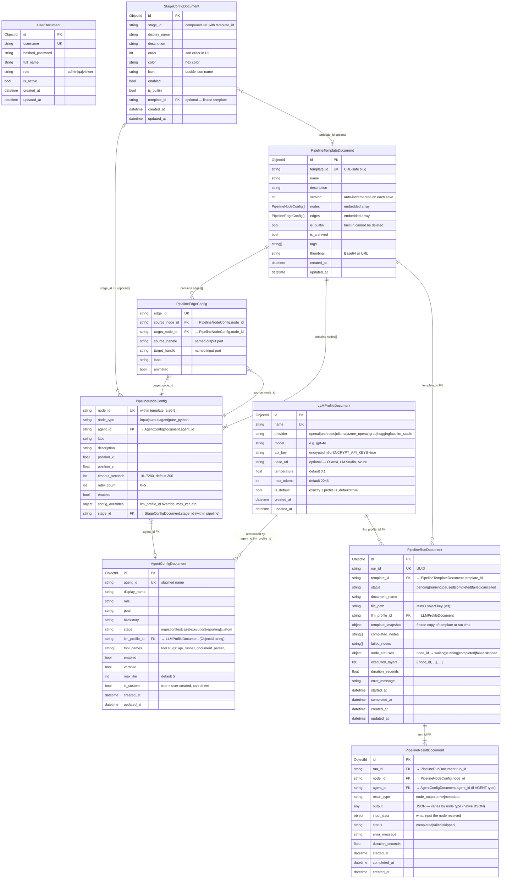
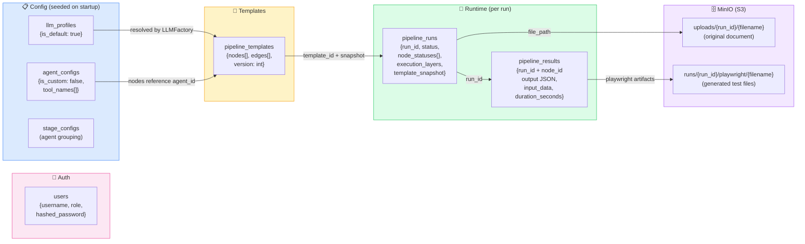
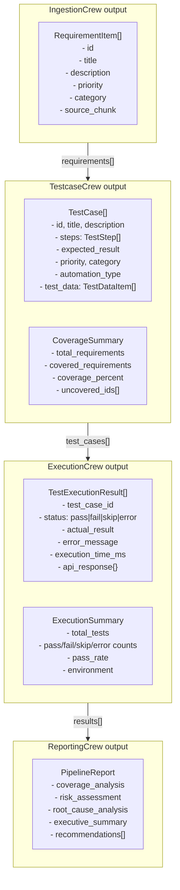

# Mô hình dữ liệu MongoDB

## 1. ER Diagram — Tất cả collections

```mermaid
erDiagram
    UserDocument {
        ObjectId id PK
        string username UK
        string hashed_password
        string full_name
        string role "admin|qa|viewer"
        bool is_active
        datetime created_at
        datetime updated_at
    }

    LLMProfileDocument {
        ObjectId id PK
        string name UK
        string provider "openai|anthropic|ollama|azure_openai|groq|huggingface|lm_studio"
        string model "e.g. gpt-4o"
        string api_key "encrypted nếu ENCRYPT_API_KEYS=true"
        string base_url "optional — Ollama, LM Studio, Azure"
        float temperature "default 0.1"
        int max_tokens "default 2048"
        bool is_default "exactly 1 profile is_default=true"
        datetime created_at
        datetime updated_at
    }

    AgentConfigDocument {
        ObjectId id PK
        string agent_id UK "slugified name"
        string display_name
        string role
        string goal
        string backstory
        string stage "ingestion|testcase|execution|reporting|custom"
        string llm_profile_id FK "→ LLMProfileDocument (ObjectId string)"
        string[] tool_names "tool slugs: api_runner, document_parser, ..."
        bool enabled
        bool verbose
        int max_iter "default 5"
        bool is_custom "true = user-created, can delete"
        datetime created_at
        datetime updated_at
    }

    StageConfigDocument {
        ObjectId id PK
        string stage_id "compound UK with template_id"
        string display_name
        string description
        int order "sort order in UI"
        string color "hex color"
        string icon "Lucide icon name"
        bool enabled
        bool is_builtin
        string template_id FK "optional — linked template"
        datetime created_at
        datetime updated_at
    }

    PipelineTemplateDocument {
        ObjectId id PK
        string template_id UK "URL-safe slug"
        string name
        string description
        int version "auto-incremented on each save"
        PipelineNodeConfig[] nodes "embedded array"
        PipelineEdgeConfig[] edges "embedded array"
        bool is_builtin "built-in cannot be deleted"
        bool is_archived
        string[] tags
        string thumbnail "Base64 or URL"
        datetime created_at
        datetime updated_at
    }

    PipelineNodeConfig {
        string node_id UK "within template, a-z0-9_-"
        string node_type "input|output|agent|pure_python"
        string agent_id FK "→ AgentConfigDocument.agent_id"
        string label
        string description
        float position_x
        float position_y
        int timeout_seconds "10–7200, default 300"
        int retry_count "0–5"
        bool enabled
        object config_overrides "llm_profile_id override, max_iter, etc."
        string stage_id FK "→ StageConfigDocument.stage_id (within pipeline)"
    }

    PipelineEdgeConfig {
        string edge_id UK
        string source_node_id FK "→ PipelineNodeConfig.node_id"
        string target_node_id FK "→ PipelineNodeConfig.node_id"
        string source_handle "named output port"
        string target_handle "named input port"
        string label
        bool animated
    }

    PipelineRunDocument {
        ObjectId id PK
        string run_id UK "UUID"
        string template_id FK "→ PipelineTemplateDocument.template_id"
        string status "pending|running|paused|completed|failed|cancelled"
        string document_name
        string file_path "MinIO object key (V3)"
        string llm_profile_id FK "→ LLMProfileDocument"
        object template_snapshot "frozen copy of template at run time"
        string[] completed_nodes
        string[] failed_nodes
        object node_statuses "node_id → waiting|running|completed|failed|skipped"
        list execution_layers "[[node_id, ...], ...]"
        float duration_seconds
        string error_message
        datetime started_at
        datetime completed_at
        datetime created_at
        datetime updated_at
    }

    PipelineResultDocument {
        ObjectId id PK
        string run_id FK "→ PipelineRunDocument.run_id"
        string node_id FK "→ PipelineNodeConfig.node_id"
        string agent_id FK "→ AgentConfigDocument.agent_id (if AGENT type)"
        string result_type "node_output|error|metadata"
        any output "JSON — varies by node type (native BSON)"
        object input_data "what input the node received"
        string status "completed|failed|skipped"
        string error_message
        float duration_seconds
        datetime started_at
        datetime completed_at
        datetime created_at
    }

    LLMProfileDocument ||--o{ AgentConfigDocument : "referenced by agent_id.llm_profile_id"
    PipelineTemplateDocument ||--|{ PipelineNodeConfig : "contains nodes[]"
    PipelineTemplateDocument ||--o{ PipelineEdgeConfig : "contains edges[]"
    PipelineNodeConfig }|--o| AgentConfigDocument : "agent_id FK"
    PipelineNodeConfig }o--o| StageConfigDocument : "stage_id FK (optional)"
    PipelineEdgeConfig }|--|| PipelineNodeConfig : "source_node_id"
    PipelineEdgeConfig }|--|| PipelineNodeConfig : "target_node_id"
    PipelineTemplateDocument ||--o{ PipelineRunDocument : "template_id FK"
    PipelineRunDocument ||--|{ PipelineResultDocument : "run_id FK"
    LLMProfileDocument ||--o{ PipelineRunDocument : "llm_profile_id FK"
    StageConfigDocument }o--o| PipelineTemplateDocument : "template_id optional"
```

---

## 2. Sơ đồ luồng dữ liệu qua các collections

```mermaid
flowchart LR
    subgraph Auth["🔐 Auth"]
        USR["users\n{username, role,\nhashed_password}"]
    end

    subgraph Config["📋 Config (seeded on startup)"]
        LLP["llm_profiles\n{is_default: true}"]
        ACP["agent_configs\n{is_custom: false,\ntool_names[]}"]
        SCP["stage_configs\n(agent grouping)"]
    end

    subgraph Templates["📐 Templates"]
        PT["pipeline_templates\n{nodes[], edges[],\nversion: int}"]
    end

    subgraph Runtime["🚀 Runtime (per run)"]
        PR["pipeline_runs\n{run_id, status,\nnode_statuses{},\nexecution_layers,\ntemplate_snapshot}"]
        RES["pipeline_results\n{run_id + node_id\noutput JSON,\ninput_data, duration_seconds}"]
    end

    subgraph MinIO["🗄️ MinIO (S3)"]
        UP["uploads/{run_id}/{filename}\n(original document)"]
        PW["runs/{run_id}/playwright/{filename}\n(generated test files)"]
    end

    LLP -->|"resolved by LLMFactory"| PT
    ACP -->|"nodes reference agent_id"| PT
    PT -->|"template_id + snapshot"| PR
    PR -->|"run_id"| RES
    PR -->|"file_path"| UP
    RES -->|"playwright artifacts"| PW

    style Auth fill:#fce7f3,stroke:#ec4899
    style Config fill:#dbeafe,stroke:#3b82f6
    style Templates fill:#fef3c7,stroke:#f59e0b
    style Runtime fill:#dcfce7,stroke:#22c55e
    style MinIO fill:#f3e8ff,stroke:#a855f7
```

---

## 3. Output schema của từng node type

```mermaid
graph TB
    subgraph IngestionOutput["IngestionCrew output"]
        I1["RequirementItem[]\n- id\n- title\n- description\n- priority\n- category\n- source_chunk"]
    end

    subgraph TestcaseOutput["TestcaseCrew output"]
        T1["TestCase[]\n- id, title, description\n- steps: TestStep[]\n- expected_result\n- priority, category\n- automation_type\n- test_data: TestDataItem[]"]
        T2["CoverageSummary\n- total_requirements\n- covered_requirements\n- coverage_percent\n- uncovered_ids[]"]
    end

    subgraph ExecutionOutput["ExecutionCrew output"]
        E1["TestExecutionResult[]\n- test_case_id\n- status: pass|fail|skip|error\n- actual_result\n- error_message\n- execution_time_ms\n- api_response{}"]
        E2["ExecutionSummary\n- total_tests\n- pass/fail/skip/error counts\n- pass_rate\n- environment"]
    end

    subgraph ReportOutput["ReportingCrew output"]
        R1["PipelineReport\n- coverage_analysis\n- risk_assessment\n- root_cause_analysis\n- executive_summary\n- recommendations[]"]
    end

    IngestionOutput -->|"requirements[]"| TestcaseOutput
    TestcaseOutput -->|"test_cases[]"| ExecutionOutput
    ExecutionOutput -->|"results[]"| ReportOutput
```
