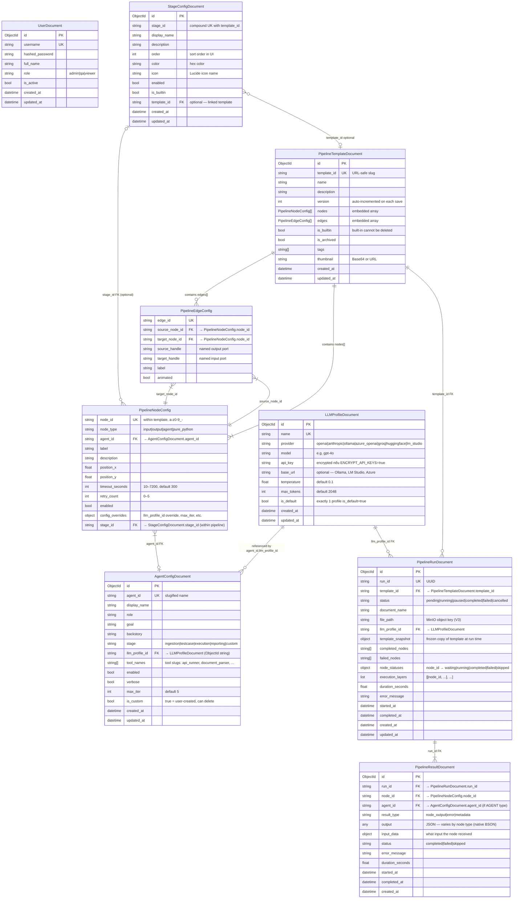
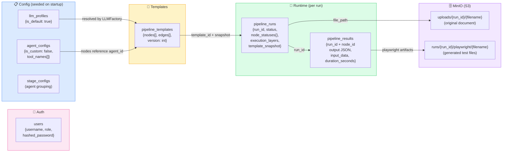
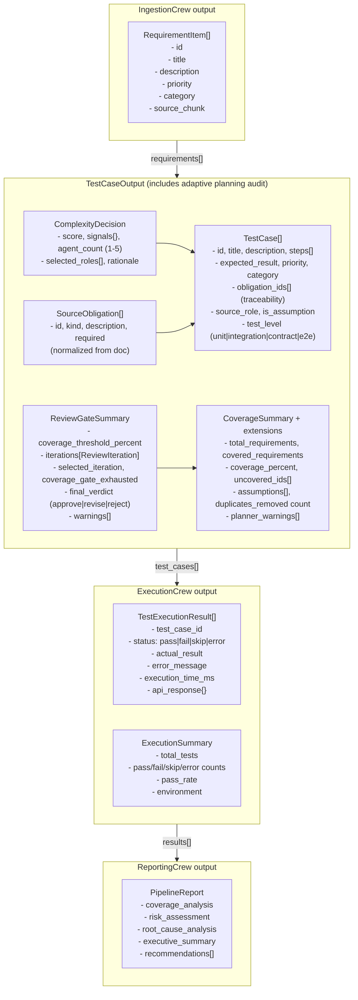

# Mô hình dữ liệu MongoDB

## 1. ER Diagram — Tất cả collections



---

## 2. Sơ đồ luồng dữ liệu qua các collections



---

## 3. Output schema của từng node type



## 4. Adaptive Planning & Review Gate Schemas (Phase 3–5)

The `automation-testing-api` pipeline (Phases 3–5) adds traceability and bounded review:

### ParsedSpec (`md_spec_parsed` — multi-endpoint)
`md_api_spec_verifier` emits this contract; it is carried forward to every
downstream node (test-case generator, complexity, planner prompts, runner).

```python
base_url: str                       # spec-level, shared by all endpoints
endpoints: list[ParsedEndpointSpec] # one entry per declared endpoint
headers: list[ParsedHeader]         # spec-level (shared)

# ParsedEndpointSpec
endpoint: ParsedEndpoint            # method, path, auth
request: ParsedRequest              # content_type, body_fields, raw_body_schema
responses: list[ParsedResponse]     # status_code, description, payload_preview
response_body: str
```

- Every declared endpoint is parsed (a document with 8 endpoints yields
  `len(endpoints) == 8`). The parser previously kept only the first endpoint,
  which produced a tiny suite and a falsely-100% coverage.
- Backward-compat: read-only `.endpoint`/`.request`/`.responses`/`.response_body`
  properties resolve to `endpoints[0]`, and the model folds legacy single-endpoint
  constructor kwargs into a one-element `endpoints` list.
- Obligation traversal order (determinism contract): spec-level headers ONCE,
  then per endpoint in document order (responses → auth → fields/rules).

### SourceObligation (per-document normalized)
```python
id: str              # OBL-001, OBL-002, … (document-scoped)
kind: str            # response | header | auth | field | rule | parameter
description: str     # Full obligation text
evidence: str        # Source quote or reference
required: bool       # True = mandatory for coverage; False = optional
```

### ComplexityDecision (per-run deterministic)
```python
score: int                          # Raw signal count (endpoints + params + responses)
signals: dict[str, int]             # Breakdown: {"endpoints": 5, "parameters": 8, …}
agent_count: int                    # Selected planner count: 1–5 (deterministic)
selected_roles: list[PlannerRole]   # [PlannerRole.POSITIVE, .AUTH_SECURITY, …]
rationale: str                      # Why this count was selected
# PlannerRole enum: POSITIVE | NEGATIVE_SCHEMA | AUTH_SECURITY | BOUNDARY_DATA | RESILIENCE_IDEMPOTENCY
```

### ReviewIteration (per planning attempt)
```python
iteration: int                           # 0 = baseline, 1+ = retry after feedback
case_count: int                          # Selected test cases in this iteration
coverage: CoverageReport                 # Numeric obligation-to-case mapping
review: SeniorReviewResult               # Qualitative verdict + feedback
accepted: bool                           # True when gate approved this iteration
feedback_applied: str                    # Feedback fed INTO this iteration (empty for baseline)
```

### CoverageReport (deterministic, never LLM-scored)
```python
total_required: int                      # Count of SourceObligation(required=true)
covered_required: int                    # Count of covered required obligations
coverage_percent: float                  # Computed: covered / total * 100
gaps: list[CoverageGap]                  # Uncovered required obligations
unknown_obligation_ids: list[str]        # Obligation IDs cited by cases but not in inventory
# Formula: vacuously 100% if total_required=0; otherwise [0, 100]
```

### ReviewGateSummary (final outcome + audit)
```python
coverage_threshold_percent: float        # Config: pass on >= (default 90)
max_review_iterations: int               # Config: max retries (default 3, range 0–5)
continue_on_review_exhaustion: bool      # Config: execute plan even if exhausted (default true)
iterations: list[ReviewIteration]        # Full audit trail (persisted in MongoDB)
selected_iteration: int                  # Which iteration was selected (0 = baseline)
final_coverage_percent: float            # Coverage of selected iteration
final_verdict: ReviewVerdict             # APPROVE | REVISE | REJECT
accepted: bool                           # True if gate passed before exhaustion
coverage_gate_exhausted: bool            # True if retries exhausted (best plan selected + warning)
warnings: list[str]                      # Visible warnings (e.g. "exhausted retries", "reviewer mocked")
# ReviewVerdict enum: APPROVE | REVISE | REJECT (senior reviewer's verdict; never blocks numeric coverage)
```

### TestCase additions (traceability)
```python
obligation_ids: list[str]                # OBL-IDs this case satisfies
source_role: str                         # "baseline" | "positive" | "negative_schema" | …
is_assumption: bool                      # True = invented edge case (not in source doc)
test_level: TestLevel                    # unit | integration | contract | e2e (enum)
executable: bool                         # True = can run in ExecutionCrew; False = skipped
depends_on: list[str]                    # TC ids that must run first (chaining order)
extract: dict[str, str]                  # variable_name → response body field to capture
```

**Request chaining.** Path-param item endpoints (`/api/tasks/:id`) do not hardcode an
id. The collection's POST create case declares `extract={"tasks_id": "id"}`; the item
case references `{tasks_id}` inside `api_endpoint` and lists the create in `depends_on`.
The runner orders producers first, captures `id` from the create's response into a
run-scoped context, and substitutes `{tasks_id}` at execution time. If the create fails
(no id captured), dependents are skipped with reason `Unresolved chained value(s): …`.
The not-found (404) case stays independent and uses a deliberately missing id.

### TestExecutionResult additions (traceability)
```python
obligation_ids: list[str]                # Obligations this result covers (from source case)
# Allows MongoDB to reconstruct: which test case (and its obligations) produced each result
```
