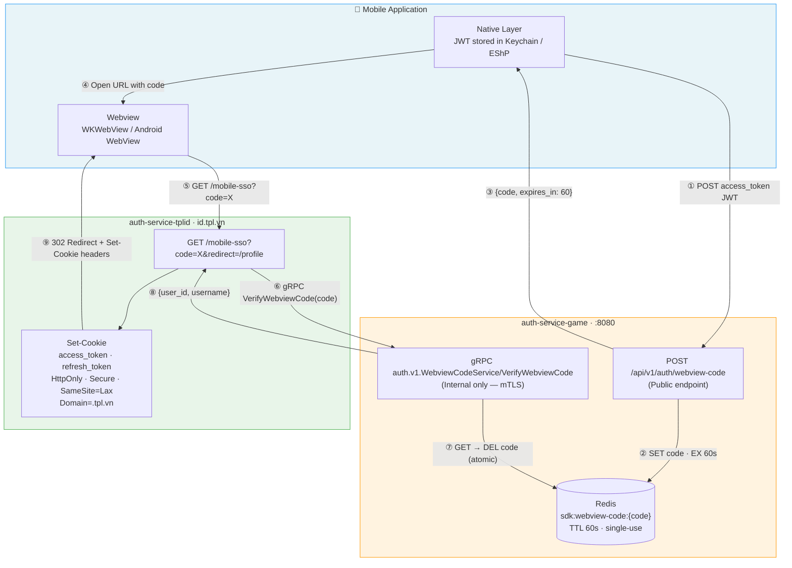
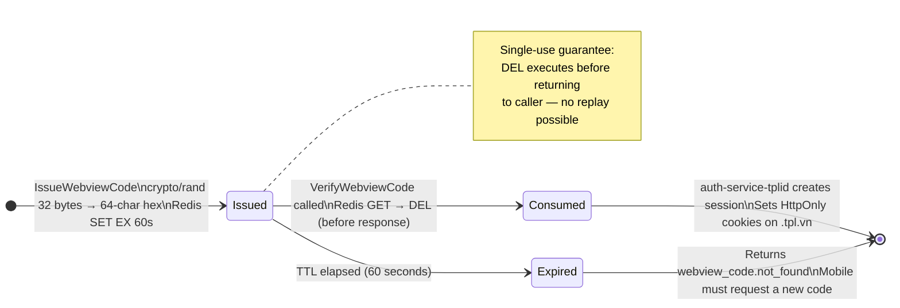
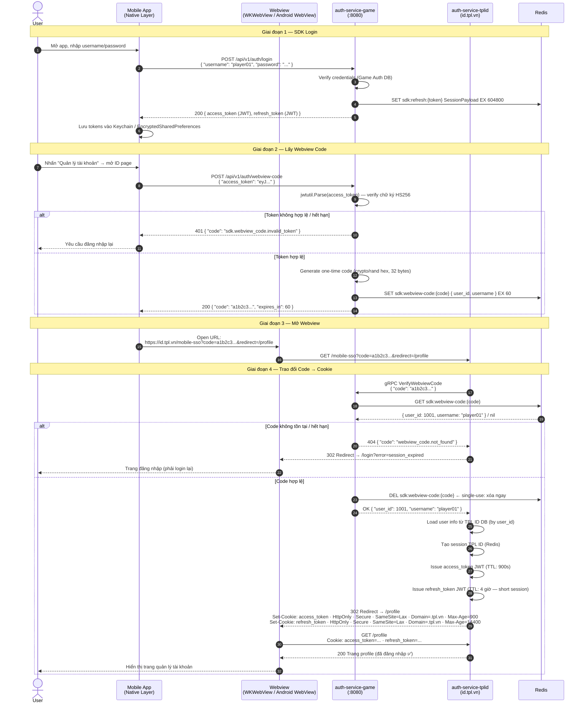
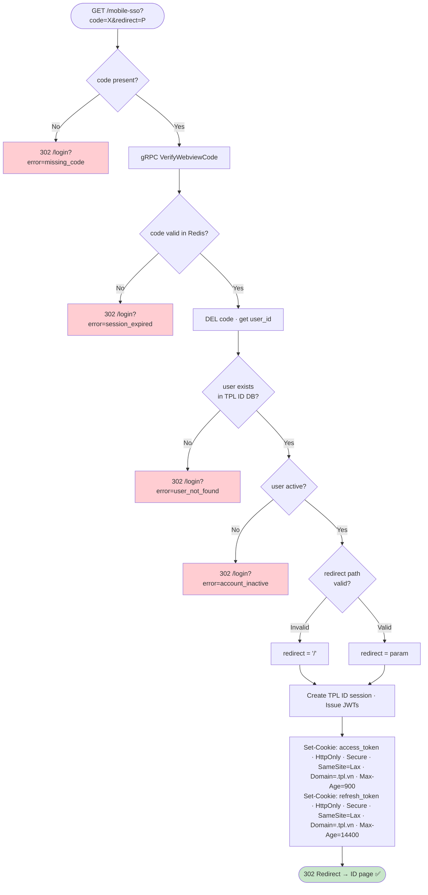

# SDK Login Flow — Mobile → Webview với Cookie (TPL ID)

## Mục lục

1. [Tổng quan & Vấn đề cần giải quyết](#1-tổng-quan--vấn-đề-cần-giải-quyết)
2. [Kiến trúc tổng thể](#2-kiến-trúc-tổng-thể)
3. [Luồng đầy đủ (4 giai đoạn)](#3-luồng-đầy-đủ-4-giai-đoạn)
4. [Sequence Diagram](#4-sequence-diagram)
5. [API Endpoints](#5-api-endpoints)
6. [Giai đoạn 1 — SDK Login trên Mobile](#6-giai-đoạn-1--sdk-login-trên-mobile)
7. [Giai đoạn 2 — Lấy Webview Code](#7-giai-đoạn-2--lấy-webview-code)
8. [Giai đoạn 3 — Mở Webview với Code](#8-giai-đoạn-3--mở-webview-với-code)
9. [Giai đoạn 4 — Trao đổi Code lấy Cookie (TPL ID)](#9-giai-đoạn-4--trao-đổi-code-lấy-cookie-tpl-id)
10. [Cookie TPL ID — Chi tiết](#10-cookie-tpl-id--chi-tiết)
11. [Redis Key Schema](#11-redis-key-schema)
12. [Error & Success Codes](#12-error--success-codes)
13. [Bảo mật](#13-bảo-mật)
14. [Tích hợp phía Mobile Client](#14-tích-hợp-phía-mobile-client)
15. [Checklist triển khai](#15-checklist-triển-khai)

---

## 1. Tổng quan & Vấn đề cần giải quyết

### Bối cảnh

Hệ sinh thái TPL có hai cơ chế xác thực song song:

| Service | Cơ chế | Token | Dùng cho |
|---|---|---|---|
| `auth-service-game` | JWT (Bearer) | `access_token` + `refresh_token` trong body/header | Mobile SDK, game client |
| `auth-service-tplid` | HttpOnly Cookie | `access_token` + `refresh_token` trong cookie `.tpl.vn` | Trình duyệt web, trang ID |

### Vấn đề

Khi mobile app (đã đăng nhập qua SDK) muốn mở một **trang web ID** (ví dụ: trang quản lý tài khoản tại `id.tpl.vn`) trong webview, nó gặp phải vấn đề:

```
Mobile App                          Webview (Trình duyệt nhúng)
───────────────────────────────     ────────────────────────────────────
✅ Có JWT access_token từ SDK       ❌ Không có cookie của TPL ID
   (lưu trong Keychain/secure)          → Bị redirect về trang login
   
Hai context hoàn toàn tách biệt:
- JWT không thể chuyển thành cookie tự động
- Webview không chia sẻ cookie với app native
- Không thể nhúng token vào URL (bảo mật)
```

### Giải pháp — Token Exchange via One-Time Code

Sử dụng mô hình **one-time short-lived code** làm cầu nối:

```
Mobile App (JWT) ──→ [Exchange] ──→ Code (60s, single-use)
                                        │
                                        ▼
                              Webview mở URL với code
                                        │
                                        ▼
                             TPL ID verify code ──→ Set HttpOnly Cookies
                                        │
                                        ▼
                              Webview có cookie → Đã đăng nhập ✅
```

---

## 2. Kiến trúc tổng thể

```
┌──────────────────────────────────────────────────────────────────────┐
│                        MOBILE APPLICATION                            │
│                                                                      │
│  ┌─────────────────────┐          ┌────────────────────────────────┐ │
│  │   Native Layer      │          │   Webview (WKWebView /         │ │
│  │                     │          │   Android WebView)             │ │
│  │  JWT access_token   │  Opens   │                                │ │
│  │  (Keychain / EShP)  │─────────▶│  id.tpl.vn/mobile-sso?code=X  │ │
│  │                     │  URL +   │                                │ │
│  │                     │  code    │  ← Cookies auto-sent by        │ │
│  └──────────┬──────────┘          │    browser engine after set    │ │
│             │                     └────────────────────────────────┘ │
└─────────────┼────────────────────────────────────────────────────────┘
              │ POST /api/v1/auth/webview-code
              │ { access_token }
              ▼
┌─────────────────────────────────────┐
│       auth-service-game             │
│                                     │
│  SdkWebviewCodeHandler              │
│  ├── Verify JWT access_token        │
│  ├── Generate one-time code         │
│  └── Store in Redis (TTL: 60s)      │
│                                     │
│  Internal Verify Service:           │
│  auth.v1.WebviewCodeService         │◀──── gRPC (internal only)
│  /VerifyWebviewCode                 │
└─────────────────────────────────────┘
              ▲
              │ Verify code (gRPC internal call)
              │
┌─────────────────────────────────────┐
│       auth-service-tplid            │
│                                     │
│  GET /mobile-sso?code=X             │
│  ├── Call auth-service-game         │
│  │   via gRPC để verify & consume   │
│  │   code                            │
│  ├── Load/Create user session       │
│  ├── Issue access + refresh tokens  │
│  └── Set-Cookie: HttpOnly cookies   │
│       on .tpl.vn domain             │
│                                     │
│  → Redirect to ID page              │
└─────────────────────────────────────┘
```

### Architecture Diagram



### Tại sao dùng one-time code thay vì truyền JWT trực tiếp?

| Phương án | Vấn đề |
|---|---|
| Truyền JWT trong URL query param | Token lộ trong browser history, server logs, Referer header |
| Truyền JWT trong POST body của webview | Webview không có cơ chế gửi body trước khi load trang đầu tiên |
| Dùng custom URL scheme deep link | Không hoạt động nếu webview trong app chứ không phải system browser |
| **One-time code (60s, single-use)** | ✅ An toàn: ngắn hạn, dùng một lần, không lộ token thật |

---

## 3. Luồng đầy đủ (4 giai đoạn)

```
Giai đoạn 1: SDK Login
──────────────────────
Mobile App
  └──▶ POST /api/v1/auth/login (auth-service-game)
         { username, password }
       ◀── { access_token (JWT), refresh_token (JWT) }
  └── Lưu tokens vào Keychain / EncryptedSharedPreferences

Giai đoạn 2: Lấy Webview Code
──────────────────────────────
Mobile App (user nhấn "Quản lý tài khoản")
  └──▶ POST /api/v1/auth/webview-code (auth-service-game)
         { access_token: "eyJ..." }
       ◀── { code: "a1b2c3d4e5f6...", expires_in: 60 }

Giai đoạn 3: Mở Webview
────────────────────────
Mobile App
  └── Open WKWebView / Android WebView tới URL:
      https://id.tpl.vn/mobile-sso?code=a1b2c3d4e5f6...&redirect=/profile

Giai đoạn 4: Trao đổi Code → Cookie
────────────────────────────────────
auth-service-tplid (nhận request từ webview)
  ├──▶ gRPC auth.v1.WebviewCodeService/VerifyWebviewCode
  │      { code: "a1b2c3d4e5f6..." }
  │    ◀── { user_id: 1001, username: "player01" }
  ├── Tạo session TPL ID cho user_id 1001
  ├── Cấp access_token + refresh_token (TPL ID JWTs)
  ├── Set-Cookie: access_token=...; HttpOnly; Secure; SameSite=Lax; Domain=.tpl.vn
  ├── Set-Cookie: refresh_token=...; HttpOnly; Secure; SameSite=Lax; Domain=.tpl.vn
  └── HTTP 302 Redirect → /profile

Webview hiển thị trang /profile với user đã đăng nhập ✅
Browser engine tự động gửi cookie trong mọi request tiếp theo.
```

### Webview Code Lifecycle



---

## 4. Sequence Diagram



---

## 5. API Endpoints

### auth-service-game — Public (Mobile SDK gọi)

| Method | Path | Mô tả | Auth |
|---|---|---|---|
| `POST` | `/api/v1/auth/webview-code` | Đổi access_token JWT lấy one-time webview code | Public (Bearer token trong body) |

### auth-service-game — Internal gRPC (auth-service-tplid gọi)

| Method | Service/Method | Mô tả | Auth |
|---|---|---|---|
| `gRPC` | `auth.v1.WebviewCodeService/VerifyWebviewCode` | Verify & consume webview code | Internal network only |

### auth-service-tplid — Browser (Webview gọi)

| Method | Path | Mô tả | Auth |
|---|---|---|---|
| `GET` | `/mobile-sso` | Nhận code, set cookie, redirect | Public (code trong query param) |

---

## 6. Giai đoạn 1 — SDK Login trên Mobile

Tham khảo đầy đủ tại [06-sdk-auth.md](./06-sdk-auth.md).

Tóm tắt kết quả sau bước này:

```
Mobile App lưu trong secure storage:
  access_token  → JWT HS256, TTL 15 phút, stateless
  refresh_token → JWT HS256, TTL 7 ngày, lưu Redis

Cả hai token đều KHÔNG phải cookie — chỉ dùng trong native layer.
```

---

## 7. Giai đoạn 2 — Lấy Webview Code

Mobile app dùng `access_token` đang có để lấy một **one-time code** dùng cho webview.

### Request

```
POST /api/v1/auth/webview-code
Content-Type: application/json
```

```json
{
  "access_token": "eyJhbGciOiJIUzI1NiIsInR5cCI6IkpXVCJ9.eyJ1aWQiOjEwMDEsInVuYW1lIjoicGxheWVyMDEiLCJ0eXAiOiJhY2Nlc3MiLCJleHAiOjE3NDg3MDAzMDAsImlhdCI6MTc0ODY5OTQwMH0.xxxx"
}
```

### Xử lý phía auth-service-game

```
SdkWebviewCodeUseCase.IssueWebviewCode(access_token):

  1. Validate: access_token không rỗng
  2. jwtutil.Parse(access_token, JWT_SECRET)
     ├── Verify chữ ký HS256
     ├── Kiểm tra exp claim (hết hạn → từ chối)
     └── Kiểm tra typ claim phải là "access" (không nhận refresh_token)
  3. Trích xuất user_id + username từ claims
  4. Generate one-time code:
     code = hex(crypto/rand.Read(32 bytes))  // 64 ký tự hex, không đoán được
  5. Lưu Redis:
     SET "sdk:webview-code:{code}" → JSON{ user_id, username, issued_at } EX 60
  6. Trả về code + expires_in
```

### Response — Thành công (HTTP 200)

```json
{
  "success": true,
  "code": "sdk.webview_code.ok",
  "data": {
    "code": "a1b2c3d4e5f6789012345678901234567890abcdef1234567890abcdef123456",
    "expires_in": 60
  }
}
```

### Response — Thất bại

```json
{ "success": false, "code": "sdk.webview_code.validation_error" }
{ "success": false, "code": "sdk.webview_code.invalid_token" }
{ "success": false, "code": "sdk.webview_code.token_expired" }
{ "success": false, "code": "internal_error" }
```

### Ghi chú

| Điểm | Chi tiết |
|---|---|
| `access_token` hết hạn | Trước khi gọi endpoint này, mobile app nên tự kiểm tra `exp` claim. Nếu hết hạn → gọi `/api/v1/auth/refresh` trước |
| Code TTL = 60s | App phải mở webview ngay sau khi nhận code. Không nên cache code |
| Code single-use | Sau khi auth-service-tplid consume, code bị xóa khỏi Redis — không dùng lại được |
| Code không phải JWT | Code là random hex string — không encode thông tin user. Chỉ là lookup key trong Redis |

---

## 8. Giai đoạn 3 — Mở Webview với Code

Mobile app nhận được code, ngay lập tức mở webview với URL chứa code.

### URL Format

```
https://id.tpl.vn/mobile-sso?code={code}&redirect={đường dẫn đích}
```

**Ví dụ:**

```
https://id.tpl.vn/mobile-sso?code=a1b2c3d4e5f6789012345678901234567890abcdef1234567890abcdef123456&redirect=%2Fprofile
```

| Query Param | Bắt buộc | Mô tả |
|---|---|---|
| `code` | ✅ | One-time code nhận từ giai đoạn 2 |
| `redirect` | | URL đích sau khi xác thực thành công. Default: `/` nếu không có. Phải URL-encode. Chỉ chấp nhận path nội bộ (không redirect ra ngoài `.tpl.vn`) |

### Platform Implementation

**iOS (WKWebView):**

```swift
let code = response.data.code
let redirectPath = "/profile".addingPercentEncoding(withAllowedCharacters: .urlQueryAllowed)!
let urlString = "https://id.tpl.vn/mobile-sso?code=\(code)&redirect=\(redirectPath)"

guard let url = URL(string: urlString) else { return }

let webView = WKWebView(frame: view.bounds)
let request = URLRequest(url: url)
webView.load(request)
```

**Android (WebView):**

```kotlin
val code = response.data.code
val redirectPath = Uri.encode("/profile")
val url = "https://id.tpl.vn/mobile-sso?code=$code&redirect=$redirectPath"

val webView = WebView(context)
webView.settings.apply {
    javaScriptEnabled = true
    domStorageEnabled = true
}
webView.loadUrl(url)
```

### Lưu ý quan trọng

- Mở webview **trong vòng 60 giây** sau khi nhận code
- Không lưu code vào persistent storage — chỉ dùng ngay
- Không log hoặc truyền code qua các kênh không bảo mật
- Nếu user thoát webview và mở lại → phải xin code mới (code cũ đã expired hoặc đã dùng)

---

## 9. Giai đoạn 4 — Trao đổi Code lấy Cookie (TPL ID)

auth-service-tplid nhận request từ webview, xác thực code với auth-service-game, rồi set cookie cho browser.

### Endpoint tại auth-service-tplid

```
GET /mobile-sso?code={code}&redirect={path}
```

### Xử lý phía auth-service-tplid

```
MobileSSOHandler (auth-service-tplid):

  1. Đọc `code` từ query param
     └── Nếu rỗng → Redirect /login?error=missing_code

    2. Gọi gRPC service của auth-service-game:
      auth.v1.WebviewCodeService/VerifyWebviewCode
      { "code": "a1b2c3..." }

     Response thành công: { user_id: 1001, username: "player01" }
     Response thất bại:   { code: "webview_code.not_found" }

  3. Nếu code không hợp lệ / hết hạn:
     → Redirect /login?error=session_expired

  4. Validate redirect param:
     └── Chỉ chấp nhận relative path (bắt đầu bằng /)
     └── Reject URL có scheme (http://, https://) hoặc domain khác (open redirect protection)
     └── Default nếu không hợp lệ: "/"

  5. Load user từ TPL ID database bằng user_id
     └── Nếu user không tồn tại → Redirect /login?error=user_not_found
     └── Nếu user bị khóa/xóa → Redirect /login?error=account_inactive

  6. Tạo TPL ID session:
     └── Tạo session mới trong Redis (session:{sessionID})
     └── remember = false (session ngắn, vì đây là mobile SSO)

  7. Cấp tokens:
     ├── access_token (JWT TPL ID, TTL: 900s)
     └── refresh_token (JWT TPL ID, TTL: 14400s / 4 giờ — short session)

  8. Set HttpOnly Cookies:
     Set-Cookie: access_token=...; HttpOnly; Secure; SameSite=Lax; Domain=.tpl.vn; Path=/; Max-Age=900
     Set-Cookie: refresh_token=...; HttpOnly; Secure; SameSite=Lax; Domain=.tpl.vn; Path=/; Max-Age=14400

  9. HTTP 302 Redirect → {redirect path}
```

### MobileSSO Decision Flow



### Internal gRPC — auth-service-game

```
service WebviewCodeService {
  rpc VerifyWebviewCode(VerifyWebviewCodeRequest) returns (VerifyWebviewCodeResponse);
}

message VerifyWebviewCodeRequest {
  string code = 1;
}

message VerifyWebviewCodeResponse {
  int64 user_id = 1;
  string username = 2;
}
```

**Xử lý:**

```
InternalWebviewVerifyCode:

  1. Validate: code không rỗng, đúng format (64 hex chars)
  2. GET Redis "sdk:webview-code:{code}"
     ├── Nil → 404 { "code": "webview_code.not_found" }
     └── Found → parse { user_id, username }
  3. DEL Redis "sdk:webview-code:{code}"  ← NGAY LẬP TỨC, trước khi trả về
     (đảm bảo single-use ngay cả khi caller timeout và retry)
  4. Return OK { "user_id": 1001, "username": "player01" }
```

**Response — Thành công (gRPC OK):**

```json
{
  "success": true,
  "code": "webview_code.ok",
  "data": {
    "user_id": 1001,
    "username": "player01"
  }
}
```

**Response — Thất bại (gRPC NotFound):**

```json
{
  "success": false,
  "code": "webview_code.not_found"
}
```

> **Lưu ý:** gRPC service `auth.v1.WebviewCodeService/VerifyWebviewCode` chỉ được expose trong internal network. Không publish ra public gateway. Xác thực bằng mTLS hoặc network policy giữa các service.

---

## 10. Cookie TPL ID — Chi tiết

Sau khi webview nhận được cookies từ auth-service-tplid, mọi request tiếp theo trong webview sẽ tự động đính kèm cookies.

### Cookies được set

| Cookie | HttpOnly | Secure | SameSite | Domain | Max-Age |
|---|---|---|---|---|---|
| `access_token` | ✅ | ✅ | Lax | `.tpl.vn` | 900s (15 phút) |
| `refresh_token` | ✅ | ✅ | Lax | `.tpl.vn` | 14400s (4 giờ) |

> **Vì sao refresh_token TTL là 4 giờ (thay vì 7 ngày)?**
> Mobile SSO session được coi là "không remember" — user đang trong một tác vụ cụ thể (xem hồ sơ, đổi mật khẩu...). Session ngắn giảm thiểu rủi ro nếu app bị compromised.

### JWT Claims trong Cookie (TPL ID format)

```json
{
  "user_id":    1001,
  "sid":        "550e8400-e29b-41d4-a716-446655440000",
  "device_id":  "mobile-sso",
  "token_type": "access",
  "iss": "id.tpl.vn",
  "sub": "1001",
  "aud": ["id.tpl.vn/api"],
  "exp": 1748700300,
  "iat": 1748699400,
  "jti": "uuid-of-this-token"
}
```

### Cookie Scope

Domain `.tpl.vn` (với dấu `.` ở đầu) nghĩa là cookie được gửi đến tất cả subdomain:

```
id.tpl.vn        ✅ Cookie được gửi
api.tpl.vn       ✅ Cookie được gửi
payment.tpl.vn   ✅ Cookie được gửi
otherdomain.com  ❌ Cookie không được gửi
```

### Webview vs System Browser

| | Webview (WKWebView / Android WebView) | System Browser (Safari / Chrome) |
|---|---|---|
| Cookie isolation | ✅ Tách biệt với system browser | Chia sẻ với nhau |
| HttpOnly protection | ✅ JS trong webview không đọc được | ✅ |
| Cookie persistence | Tồn tại trong webview data của app | Persistent theo Max-Age |
| SameSite=Lax behavior | ✅ Cookie gửi kèm top-level navigation | ✅ |

---

## 11. Redis Key Schema

### auth-service-game

| Key Pattern | Value | TTL | Ghi chú |
|---|---|---|---|
| `sdk:webview-code:{hex_code}` | JSON `WebviewCodePayload` | 60s | Tạo bởi `IssueWebviewCode`, xóa ngay khi `VerifyWebviewCode` được gọi |

`WebviewCodePayload`:

```json
{
  "user_id":    1001,
  "username":   "player01",
  "issued_at":  1748699400
}
```

### auth-service-tplid (sau khi exchange thành công)

| Key Pattern | Value | TTL | Ghi chú |
|---|---|---|---|
| `session:{sessionID}` | `Session` struct | 4 giờ | TPL ID session cho mobile SSO (remember=false) |
| `refresh_token:{jti}` | `RefreshToken` record | 4 giờ | Refresh token của webview session |

---

## 12. Error & Success Codes

### IssueWebviewCode — auth-service-game

| Code | HTTP | Khi nào |
|---|---|---|
| `sdk.webview_code.ok` | 200 | Code được tạo thành công |
| `sdk.webview_code.validation_error` | 400 | Body thiếu `access_token` |
| `sdk.webview_code.invalid_token` | 401 | JWT không hợp lệ, sai chữ ký, sai `typ` |
| `sdk.webview_code.token_expired` | 401 | JWT hợp lệ nhưng đã hết hạn |
| `internal_error` | 500 | Lỗi Redis hoặc hệ thống |

### VerifyWebviewCode Internal gRPC — auth-service-game

| Code | gRPC Status | Khi nào |
|---|---|---|
| `webview_code.ok` | OK | Code hợp lệ, user info trả về |
| `webview_code.not_found` | NotFound | Code không tồn tại (hết hạn, đã dùng, hoặc sai) |
| `internal_error` | Internal | Lỗi Redis |

### MobileSSO — auth-service-tplid

| Kết quả | HTTP | Redirect đến |
|---|---|---|
| Thành công | 302 | `{redirect}` path (có Set-Cookie) |
| `code` bị thiếu | 302 | `/login?error=missing_code` |
| Code hết hạn / không tồn tại | 302 | `/login?error=session_expired` |
| User không tồn tại trong TPL ID | 302 | `/login?error=user_not_found` |
| User bị khóa / xóa | 302 | `/login?error=account_inactive` |
| Redirect param không hợp lệ | 302 | `/` (fallback về root) |

---

## 13. Bảo mật

### Mối đe dọa & Biện pháp

| Mối đe dọa | Biện pháp |
|---|---|
| **Code bị đánh cắp qua URL leak** | Code là 64-char hex ngẫu nhiên (256 bits entropy). Không encode thông tin user. TTL 60s — window tấn công hẹp |
| **Code bị replay** | Single-use: DEL Redis key ngay sau khi verify thành công — không thể dùng lại |
| **Open redirect attack** | auth-service-tplid validate `redirect` param: chỉ chấp nhận relative path, reject URL có scheme hoặc domain khác |
| **MITM / eavesdrop code** | Toàn bộ flow qua HTTPS. Webview phải enforce HTTPS only |
| **Forge webview code** | Code được generate bằng `crypto/rand` — không đoán được. Không có pattern hay structure |
| **Race condition double-consume** | DEL trước khi gRPC response — ngay cả khi tplid gọi lại ngay sau đó, Redis sẽ trả nil |
| **Internal service bị expose** | `auth.v1.WebviewCodeService/VerifyWebviewCode` chỉ trong internal network. Không publish ra gateway public |
| **Token lộ trong app log** | Mobile app không log, không lưu code. Sử dụng ngay sau khi nhận |
| **access_token hết hạn khi request code** | App phải refresh access_token trước khi gọi webview-code nếu token sắp hết hạn |

### Luồng khi access_token sắp hết hạn

```
Mobile App cần lấy webview code:
  1. Kiểm tra exp claim của access_token hiện tại
  2. Nếu còn < 120 giây (buffer an toàn):
     → Gọi POST /api/v1/auth/refresh trước
     → Nhận access_token mới
  3. Gọi POST /api/v1/auth/webview-code với access_token mới
```

---

## 14. Tích hợp phía Mobile Client

### Luồng tổng thể (Pseudocode)

```
// Bước 1: Đảm bảo access_token còn hợp lệ
func ensureValidAccessToken() async -> String {
    let token = storage.getAccessToken()

    if token.isExpiredOrExpiringSoon(threshold: 120s) {
        let refreshToken = storage.getRefreshToken()
        let result = await authService.refresh(refreshToken)

        if result.isSuccess {
            storage.save(result.accessToken, result.refreshToken)
            return result.accessToken
        } else {
            // refresh_token cũng hết hạn → force logout
            navigateToLogin()
            throw AuthError.sessionExpired
        }
    }

    return token.value
}

// Bước 2: Lấy webview code
func getWebviewCode() async -> String {
    let accessToken = await ensureValidAccessToken()
    let result = await authService.requestWebviewCode(accessToken: accessToken)

    guard result.isSuccess else {
        throw AuthError.webviewCodeFailed(result.code)
    }

    return result.data.code
}

// Bước 3: Mở webview
func openIDPage(destinationPath: String) async {
    do {
        let code = await getWebviewCode()
        let encodedPath = destinationPath.urlEncoded()
        let url = "https://id.tpl.vn/mobile-sso?code=\(code)&redirect=\(encodedPath)"
        openWebview(url: url)
    } catch {
        showError("Không thể mở trang tài khoản. Vui lòng thử lại.")
    }
}
```

### Xử lý lỗi redirect trong Webview

Webview sẽ redirect về `/login?error=*` nếu có lỗi. Mobile app nên intercept các URL này:

**iOS (WKNavigationDelegate):**

```swift
func webView(_ webView: WKWebView,
             decidePolicyFor navigationAction: WKNavigationAction,
             decisionHandler: @escaping (WKNavigationActionPolicy) -> Void) {

    let url = navigationAction.request.url?.absoluteString ?? ""

    if url.contains("id.tpl.vn/login?error=session_expired") {
        decisionHandler(.cancel)
        retryWithNewCode()
        return
    }

    if url.contains("id.tpl.vn/login?error=account_inactive") {
        decisionHandler(.cancel)
        webView.removeFromSuperview()
        showAccountLockedAlert()
        return
    }

    decisionHandler(.allow)
}
```

**Android (WebViewClient):**

```kotlin
webView.webViewClient = object : WebViewClient() {
    override fun shouldOverrideUrlLoading(view: WebView, request: WebResourceRequest): Boolean {
        val url = request.url.toString()

        if (url.contains("id.tpl.vn/login?error=session_expired")) {
            retryWithNewCode()
            return true
        }

        if (url.contains("id.tpl.vn/login?error=account_inactive")) {
            showAccountLockedDialog()
            return true
        }

        return false
    }
}
```

### Vòng đời Webview Session

```
Webview session (cookie) kéo dài 4 giờ.
Webview tự động refresh cookie thông qua cơ chế của TPL ID
(browser gọi /api/v1/refresh khi access_token cookie hết hạn sau 15 phút).

Khi user đóng webview:
  → Cookie tồn tại trong webview data của app
  → Lần sau mở lại: nếu chưa hết 4 giờ → vẫn đăng nhập (không cần code mới)
  → Nếu đã hết 4 giờ → cần flow đầy đủ (xin code mới)

Recommendation: Tạo code mới mỗi lần user mở ID page từ native UI.
Không tái sử dụng code hay cố giữ webview session vô thời hạn.
```

---

## 15. Checklist triển khai

### auth-service-game — Cần implement

- [ ] **Endpoint mới:** `POST /api/v1/auth/webview-code`
  - [ ] Handler: `SdkWebviewCodeHandler.IssueWebviewCode()`
  - [ ] UseCase method: `IssueWebviewCode(accessToken string) (code string, expiresIn int, err error)`
  - [ ] Validate JWT: `jwtutil.Parse(access_token)` + check `typ == "access"`
  - [ ] Generate code: `crypto/rand.Read(32 bytes)` → hex encode → 64 chars
  - [ ] Redis: `SET sdk:webview-code:{code} {user_id, username, issued_at} EX 60`
  - [ ] Route đăng ký trong `router.go` (public group, không cần auth middleware)

- [ ] **gRPC method mới:** `auth.v1.WebviewCodeService/VerifyWebviewCode`
  - [ ] Handler: `InternalHandler.VerifyWebviewCode()`
  - [ ] UseCase method: `VerifyWebviewCode(code string) (userID int64, username string, err error)`
  - [ ] Redis: `GET sdk:webview-code:{code}` → parse → `DEL` ngay trước khi return
  - [ ] Proto/service đăng ký trong gRPC server của auth-service-game
  - [ ] mTLS hoặc network policy: chỉ chấp nhận request từ auth-service-tplid

- [ ] **Thêm error codes** vào `pkg/code.go`:
  ```go
  SdkWebviewCodeOK              = "sdk.webview_code.ok"
  SdkWebviewCodeValidationError = "sdk.webview_code.validation_error"
  SdkWebviewCodeInvalidToken    = "sdk.webview_code.invalid_token"
  SdkWebviewCodeTokenExpired    = "sdk.webview_code.token_expired"
  WebviewCodeOK                 = "webview_code.ok"
  WebviewCodeNotFound           = "webview_code.not_found"
  ```

- [ ] Config: Không cần biến env mới (dùng lại `JWT_SECRET` và Redis đã có)

### auth-service-tplid — Cần implement

- [ ] **Endpoint mới:** `GET /mobile-sso`
  - [ ] Handler: `MobileSSOHandler`
  - [ ] Gọi gRPC `auth.v1.WebviewCodeService/VerifyWebviewCode` của auth-service-game
  - [ ] Validate `redirect` param (chỉ chấp nhận relative path bắt đầu bằng `/`)
  - [ ] Load user từ DB bằng `user_id` trả về
  - [ ] Tạo session ngắn hạn (remember=false → 4 giờ)
  - [ ] Gọi `setAuthCookies()` với tokens mới
  - [ ] Redirect về `redirect` path (hoặc `/` nếu không có / không hợp lệ)

- [ ] **Config mới:**
  ```env
  AUTH_SERVICE_GAME_INTERNAL_GRPC_ADDR=auth-service-game:9090
  ```

### Mobile SDK Team

- [ ] Implement `POST /api/v1/auth/webview-code` call trong SDK wrapper
- [ ] Xử lý edge case: access_token sắp hết hạn → refresh trước khi xin code
- [ ] Implement webview navigation delegate để bắt redirect lỗi
- [ ] Không log hoặc lưu code vào persistent storage
- [ ] Test trên iOS (WKWebView) và Android (WebView)
- [ ] Test khi code hết 60s → webview nhận lỗi → retry với code mới

### Smoke Test sau deploy

- [ ] Happy path: Login → Lấy code → Mở webview → Trang ID hiện với user đã đăng nhập
- [ ] Code expired (đợi 61s sau khi lấy code): Mở webview → Redirect về `/login?error=session_expired`
- [ ] Code dùng lại (gọi verify hai lần với cùng code): Lần 2 → `webview_code.not_found`
- [ ] access_token hết hạn khi xin code: Nhận `sdk.webview_code.token_expired` (HTTP 401)
- [ ] Invalid access_token (chữ ký sai): Nhận `sdk.webview_code.invalid_token` (HTTP 401)
- [ ] Open redirect injection: `?redirect=https://evil.com` → bị reject, redirect về `/`
- [ ] Cookie domain: Verify `Domain=.tpl.vn` trong Set-Cookie response header
- [ ] Cookie flags: Verify `HttpOnly; Secure; SameSite=Lax` trong Set-Cookie response header
- [ ] Kiểm tra Redis: key `sdk:webview-code:{code}` tự xóa sau khi verify
