# OAuth2 Authorization Code + PKCE Flow

> Tài liệu này mô tả toàn bộ luồng OAuth2 Authorization Code + PKCE được triển khai trong hệ thống,
> bao gồm vai trò của từng thành phần: **auth-service-tplid**, **fe-tepaylink-id-v2**,
> **web-login-sdk**, và **maple-landing-page** (hoặc bất kỳ landing page nào tích hợp SDK).

---

## Table of Contents

1. [Tổng quan kiến trúc](#1-tổng-quan-kiến-trúc)
2. [Các thành phần tham gia](#2-các-thành-phần-tham-gia)
3. [Flow A: Username/Password (Chưa đăng nhập)](#3-flow-a-usernamepassword-chưa-đăng-nhập)
4. [Flow B: User đã đăng nhập vào trang TPL ID](#4-flow-b-user-đã-đăng-nhập-vào-trang-tpl-id)
5. [Flow SSO: Google / Facebook / Apple](#5-flow-sso-google--facebook--apple)
6. [Flow Token Refresh](#6-flow-token-refresh)
7. [Vai trò của Redis](#7-vai-trò-của-redis)
8. [PKCE Cryptography](#8-pkce-cryptography)
9. [API Endpoints Reference](#9-api-endpoints-reference)
10. [SDK Integration (web-login-sdk)](#10-sdk-integration-web-login-sdk)
11. [Redis Key Schema](#11-redis-key-schema)
12. [Security Model](#12-security-model)
13. [Error Reference](#13-error-reference)

---

## 1. Tổng quan kiến trúc

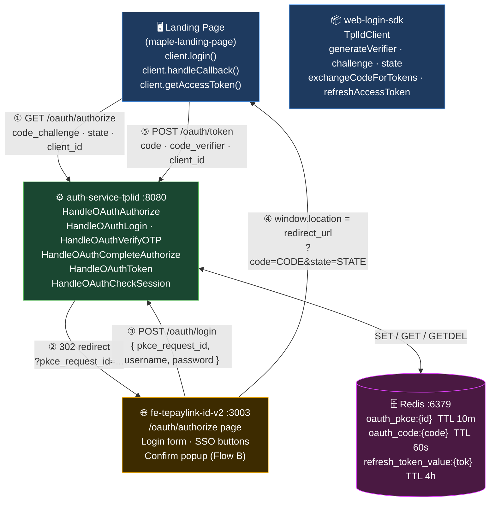

> **Không có cookie.** Toàn bộ token chỉ tồn tại trong memory (hoặc sessionStorage/localStorage
> tùy config SDK). `HttpOnly` cookie **không được** dùng trong flow này — đây là điểm khác biệt
> so với flow login thông thường của `fe-tepaylink-id-v2`.

---

## 2. Các thành phần tham gia

| Thành phần | Role | Port (local dev) |
|---|---|---|
| **maple-landing-page** | OAuth client app — tích hợp SDK, render callback page | `:3000` |
| **web-login-sdk** (`TplIdClient`) | Điều phối PKCE flow: generate verifier/challenge/state, redirect, exchange code, refresh token | (npm package) |
| **fe-tepaylink-id-v2** | Login UI — nhận `pkce_request_id`, xác thực user, gọi `/oauth/complete-authorize`; hiển thị confirm popup khi user đã đăng nhập (Flow B) | `:3003` |
| **auth-service-tplid** | OAuth Server — validate params, quản lý Redis state, phát token, kiểm tra session hiện tại | `:8080` |
| **Redis** | Ephemeral state store — lưu PKCE session (10 phút) và authorization code (60 giây) | `:6379` |

---

## 3. Flow A: Username/Password (Chưa đăng nhập)

> Đây là luồng mặc định khi user **chưa đăng nhập** vào trang TPL ID (`fe-tepaylink-id-v2`).

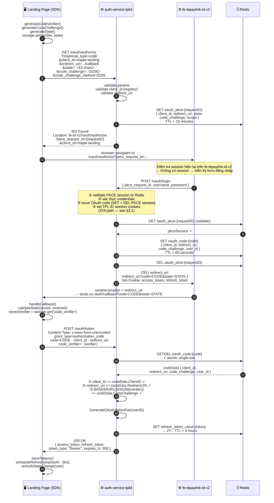

### 3.1 — 2FA Mid-Flow (OTP)

Khi `/oauth/login` phát hiện tài khoản cần OTP, endpoint trả về `require_otp: true` thay vì `redirect_url`. `fe-tepaylink-id-v2` xử lý toàn bộ vòng lặp OTP **nội bộ** và gọi `/oauth/verify-otp` để hoàn tất. SDK không nhìn thấy sự khác biệt.

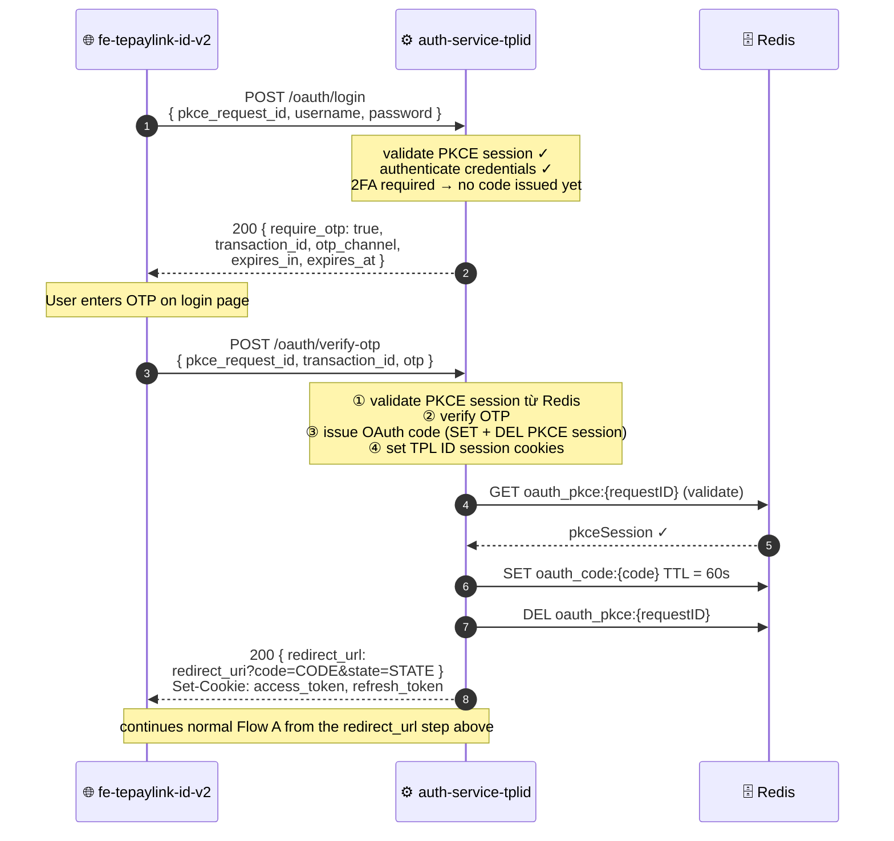

---

## 4. Flow B: User đã đăng nhập vào trang TPL ID

> Luồng này xử lý trường hợp user **đã có session đăng nhập** trên `fe-tepaylink-id-v2` (trang TPL ID)
> và sau đó truy cập vào trang event/payment rồi bấm nút đăng nhập.
>
> Thay vì hiển thị form đăng nhập, hệ thống sẽ hiển thị **popup xác nhận** để user quyết định:
> - ✅ **Đồng ý** → auto login tại trang event bằng tài khoản hiện tại
> - ❌ **Không** → quay lại trang event mà không đăng nhập
> - 🔄 **Đăng nhập bằng tài khoản khác** → đăng xuất và quay về Flow A

### 4.1 — Tổng quan Flow B

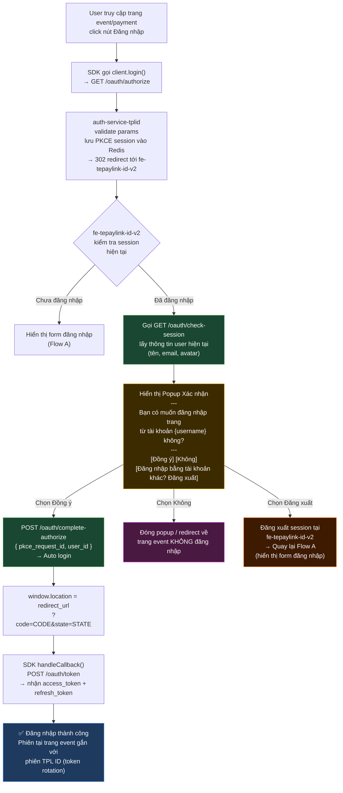

### 4.2 — Sequence Diagram: Chọn "Đồng ý" (Auto Login)

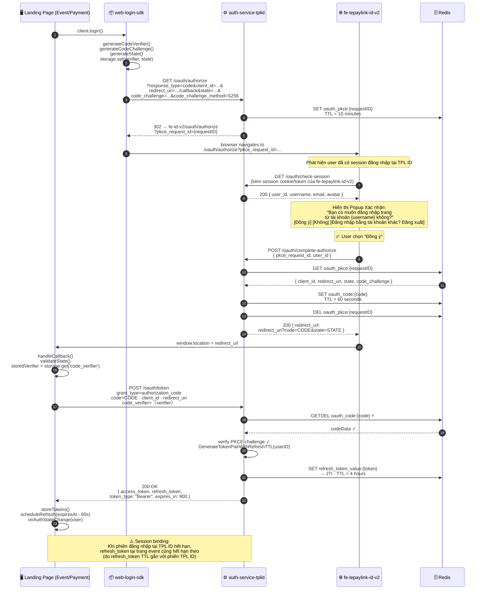

### 4.3 — Sequence Diagram: Chọn "Không" (Hủy, không đăng nhập)

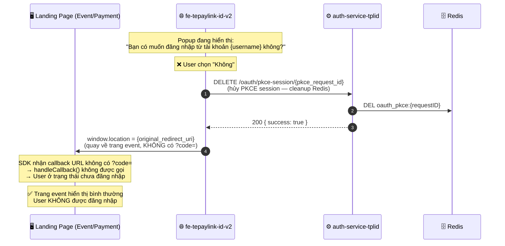

> **Lưu ý:** PKCE session trong Redis sẽ tự hết hạn sau 10 phút kể cả không bị DEL chủ động.
> Việc gọi DEL là best practice để giải phóng Redis key sớm.

### 4.4 — Sequence Diagram: Chọn "Đăng nhập bằng tài khoản khác? Đăng xuất"

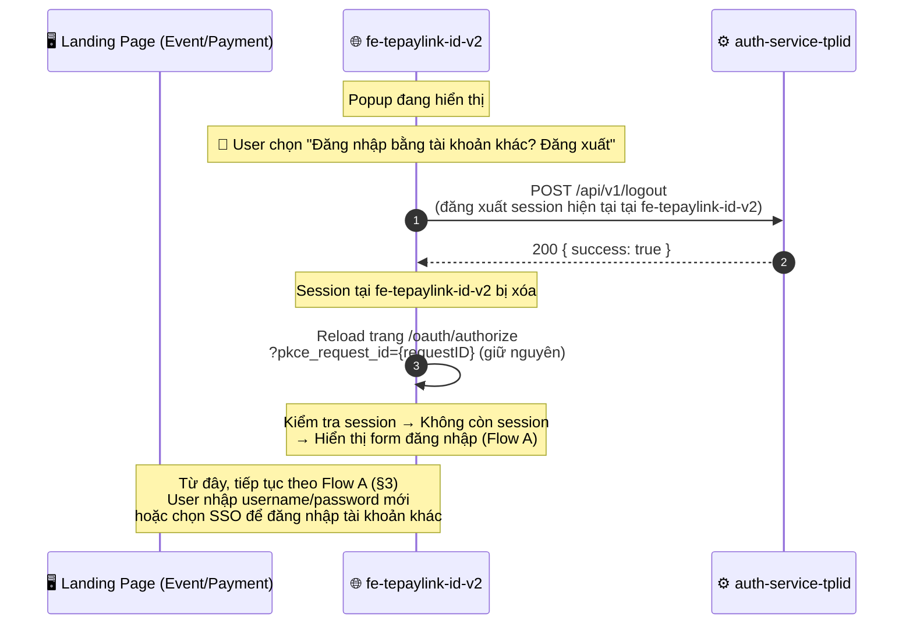

> **Lưu ý quan trọng:** `pkce_request_id` được **giữ nguyên** khi quay về Flow A. PKCE session vẫn hợp lệ trên Redis (còn TTL 10 phút), do đó user không cần khởi động lại flow từ đầu — chỉ cần đăng nhập bằng tài khoản khác.

### 4.5 — Session Binding: Khi phiên TPL ID hết hạn

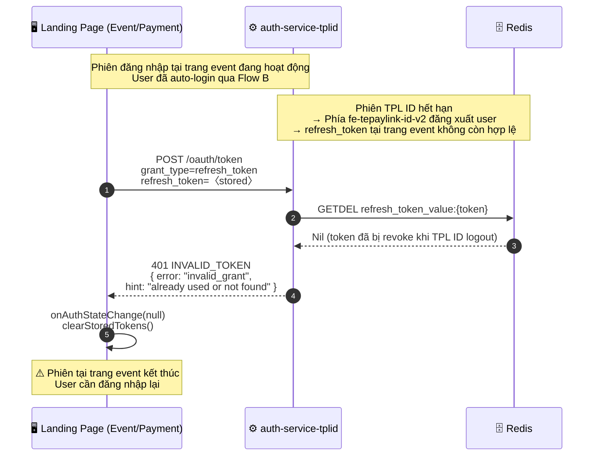

> **Cơ chế session binding:** Khi user đăng xuất khỏi TPL ID (fe-tepaylink-id-v2), hệ thống revoke tất cả `refresh_token` liên quan đến `user_id` đó trong Redis. Do đó, phiên đăng nhập tại trang event (được tạo ra thông qua Flow B) sẽ tự động kết thúc khi phiên TPL ID hết hạn.

### 4.6 — UI Component: Popup Xác nhận (fe-tepaylink-id-v2)

```
┌─────────────────────────────────────────────────┐
│                                                 │
│   Bạn có muốn đăng nhập trang từ               │
│   tài khoản  {username}  không?                 │
│                                                 │
│   ┌─────────────────────────────────────────┐   │
│   │              ✅ Đồng ý                  │   │
│   └─────────────────────────────────────────┘   │
│                                                 │
│   ┌─────────────────────────────────────────┐   │
│   │               ❌ Không                  │   │
│   └─────────────────────────────────────────┘   │
│                                                 │
│   ┌─────────────────────────────────────────┐   │
│   │  🔄 Đăng nhập bằng tài khoản khác?     │   │
│   │     Đăng xuất                           │   │
│   └─────────────────────────────────────────┘   │
│                                                 │
└─────────────────────────────────────────────────┘
```

**Logic xử lý trong `fe-tepaylink-id-v2`:**

| Hành động của User | Xử lý phía FE | Kết quả |
|---|---|---|
| Chọn **Đồng ý** | `POST /oauth/complete-authorize` với `user_id` hiện tại | Auto login, redirect về trang event với `?code=CODE&state=STATE` |
| Chọn **Không** | `DELETE /oauth/pkce-session/{id}` (cleanup) → `window.location = redirect_uri` (không kèm code) | Quay về trang event, **không đăng nhập** |
| Chọn **Đăng nhập bằng tài khoản khác? Đăng xuất** | `POST /api/v1/logout` → reload `/oauth/authorize?pkce_request_id=...` | Đăng xuất TPL ID session → hiển thị form đăng nhập (Flow A) |

---

## 5. Flow SSO: Google / Facebook / Apple

SSO sử dụng cùng PKCE Authorization Code flow ở **outer layer** (SDK ↔ auth-service-tplid). Bên trong, `fe-tepaylink-id-v2` điều phối một vòng OAuth riêng với social provider. SDK không tham gia vào phần tương tác với social provider.

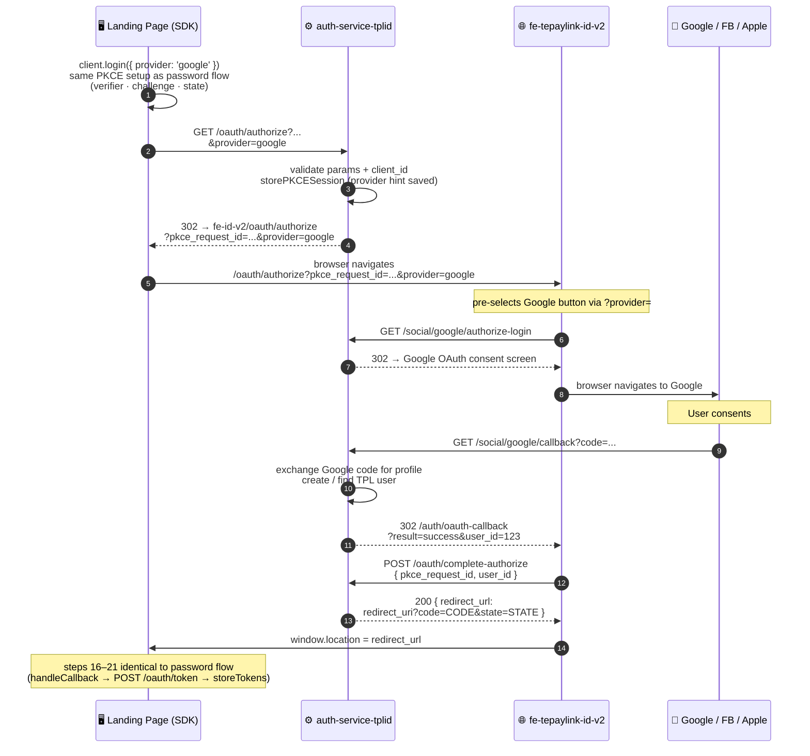

> **Lưu ý:** `provider` hint chỉ được dùng để pre-select SSO button trên FE. Auth-service lưu nó trong `pkceSession` và forward vào redirect URL đến `fe-tepaylink-id-v2`. Không có validation nào phụ thuộc vào `provider` trên auth-service.

---

## 6. Flow Token Refresh

SDK tự động schedule refresh trước khi `access_token` hết hạn (`refreshLeadTimeMs`, mặc định 60 giây).

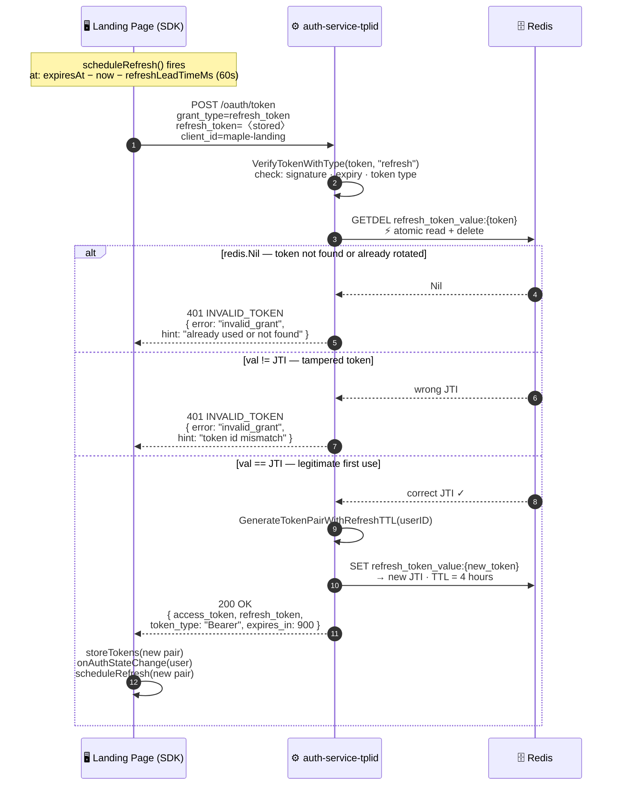

> **Token Rotation:** Mỗi lần refresh, `refresh_token` cũ bị xóa khỏi Redis bằng `GETDEL` và một `refresh_token` mới được phát. Token cũ dùng lần 2 → Redis trả `Nil` → `401`. Đây là cơ chế phát hiện token theft.

---

## 7. Vai trò của Redis

Redis là **temporary secure state store** — giải quyết vấn đề stateless HTTP server cần duy trì state ngắn hạn giữa các request không liên quan.

### Tại sao Redis, không phải DB?

| Tiêu chí | Redis | Database |
|---|---|---|
| TTL tự động | ✅ Native, key tự xóa sau N giây | ❌ Cần cron job cleanup |
| Tốc độ | ✅ In-memory, < 1ms | ❌ Disk I/O |
| Atomic single-use | ✅ `GETDEL` trong một lệnh | ❌ Cần transaction + row lock |
| Data lifespan | ✅ Ephemeral — không cần persistent | ❌ Persistent — lãng phí storage |
| Multi-pod support | ✅ Shared across all pods | ✅ Shared nhưng chậm hơn |

### Lifecycle của 3 Redis key trong một login flow

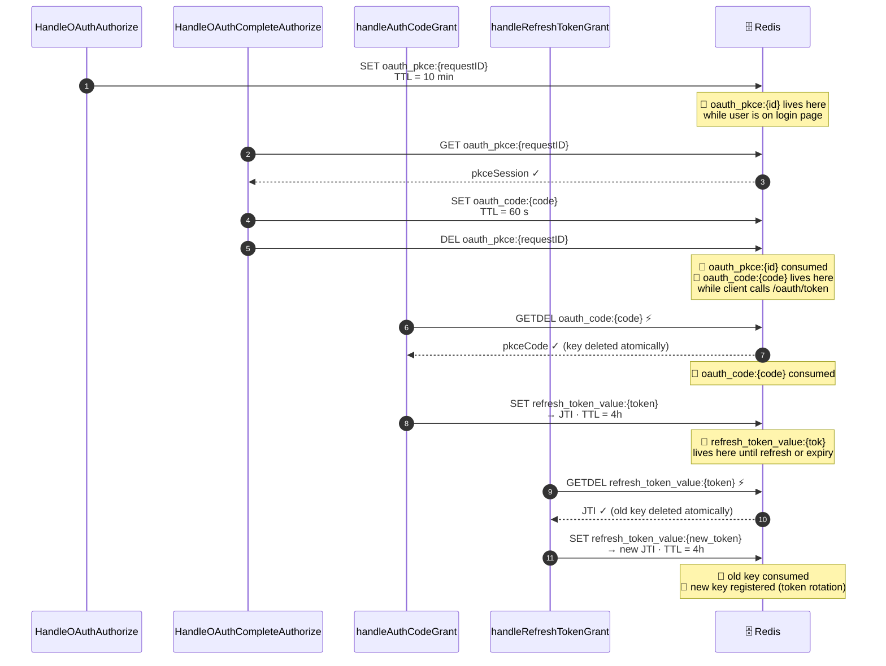

### GETDEL — Tại sao atomic quan trọng

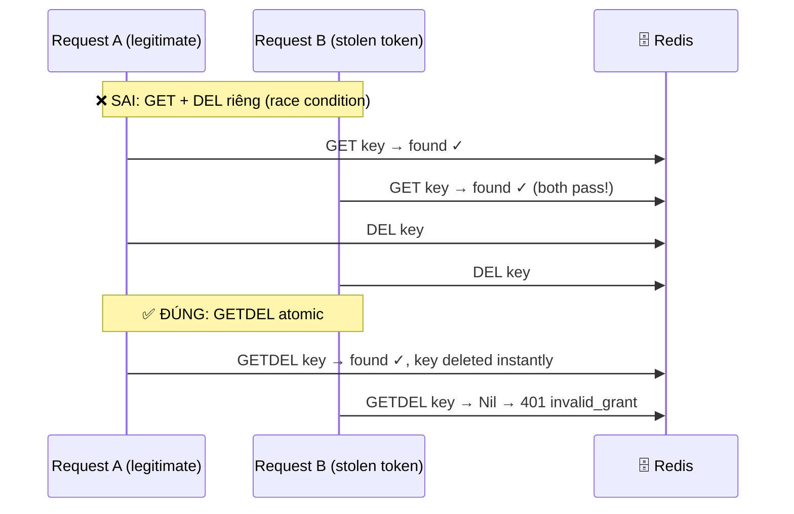

---

## 8. PKCE Cryptography

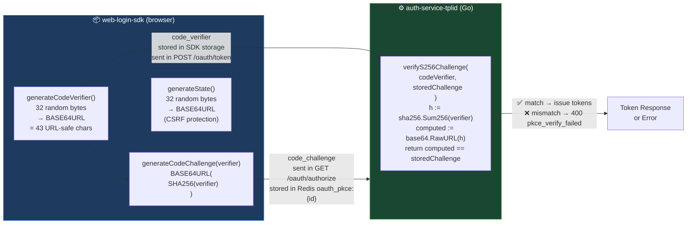

**Tại sao PKCE ngăn authorization code interception:**

- Attacker bắt được `?code=CODE` trên redirect URL (qua Referer header, browser history, network log)
- Nhưng không có `code_verifier` → không thể tính ngược `code_challenge`
- `POST /oauth/token` với code đúng nhưng verifier sai → `400 oauth2.pkce_verify_failed`
- Code đã bị `GETDEL` → không thể thử lại với verifier khác

---

## 9. API Endpoints Reference

### `GET /oauth/authorize`

Khởi động PKCE flow. Được gọi bởi SDK (qua browser redirect).

**Query parameters:**

| Param | Required | Mô tả |
|---|---|---|
| `response_type` | ✅ | Phải là `"code"` |
| `client_id` | ✅ | Registered OAuth client ID |
| `redirect_uri` | ✅ | URI nhận authorization code (phải khớp registry) |
| `state` | ✅ | Random string chống CSRF |
| `code_challenge` | ✅ | `BASE64URL(SHA256(verifier))` |
| `code_challenge_method` | ✅ | Phải là `"S256"` |
| `scope` | ❌ | Ví dụ: `"openid profile email"` |
| `provider` | ❌ | SSO hint: `"google"` \| `"facebook"` \| `"apple"` |

**Response:** `302 Found` → `{frontend_base}/oauth/authorize?pkce_request_id=...&client_id=...`

**Errors:**

| Condition | HTTP | Code |
|---|---|---|
| Missing required params | `400` | `oauth2.invalid_request` |
| Unknown/invalid `client_id` | `401` | `oauth2.invalid_client` |
| `redirect_uri` not registered | `401` | `oauth2.invalid_client` |
| `code_challenge` missing | `400` | `oauth2.pkce_required` |
| `code_challenge_method != S256` | `400` | `oauth2.pkce_method_invalid` |
| Redis unavailable | `500` | `oauth2.server_error` |

---

### `POST /oauth/login`

Atomic login cho OAuth flow. Được gọi bởi `fe-tepaylink-id-v2` thay thế cho combo `/api/v1/login` + `/oauth/complete-authorize`.

**Request body (JSON):**
```json
{
  "pkce_request_id": "aB3xY...",
  "username": "nguyenvana",
  "password": "secret",
  "device_id": "optional-fingerprint",
  "remember": false
}
```

**Response (200 — no 2FA, success):**
```json
{
  "success": true,
  "code": "OAUTH2_CODE_ISSUED",
  "data": {
    "redirect_url": "https://maple.tpl.vn/auth/callback?code=Kj9m...&state=aZ1w..."
  }
}
```
> Kèm theo `Set-Cookie: access_token=...; refresh_token=...` — user đồng thời được đăng nhập vào TPL ID.

**Response (200 — 2FA required):**
```json
{
  "success": true,
  "code": "OTP_SENT",
  "data": {
    "require_otp": true,
    "transaction_id": "txn_abc123",
    "otp_channel": "email",
    "expires_in": 300,
    "expires_at": 1720001800,
    "created_at": 1720001500
  }
}
```

**Errors:**

| Condition | HTTP | Code |
|---|---|---|
| Missing `username`, `password`, or `pkce_request_id` | `400` | `oauth2.invalid_request` |
| `pkce_request_id` not found / expired | `400` | `oauth2.session_not_found` |
| Invalid credentials | `401` | `LOGIN_FAILED` |
| Account locked / suspended | `401` | `ACCOUNT_LOCKED` |
| Redis unavailable | `500` | `oauth2.server_error` |

---

### `POST /oauth/verify-otp`

Atomic 2FA verification cho OAuth flow. Được gọi sau khi `/oauth/login` trả về `require_otp: true`.

**Request body (JSON):**
```json
{
  "pkce_request_id": "aB3xY...",
  "transaction_id": "txn_abc123",
  "otp": "123456"
}
```

**Response (200 — success):**
```json
{
  "success": true,
  "code": "OAUTH2_CODE_ISSUED",
  "data": {
    "redirect_url": "https://maple.tpl.vn/auth/callback?code=Kj9m...&state=aZ1w..."
  }
}
```
> Kèm theo `Set-Cookie: access_token=...; refresh_token=...` — user đồng thời được đăng nhập vào TPL ID.

**Errors:**

| Condition | HTTP | Code |
|---|---|---|
| Missing `transaction_id`, `otp`, or `pkce_request_id` | `400` | `oauth2.invalid_request` |
| `pkce_request_id` not found / expired | `400` | `oauth2.session_not_found` |
| Invalid or expired OTP | `400` | `OTP_INVALID` |
| Redis unavailable | `500` | `oauth2.server_error` |

---

### `GET /oauth/check-session`

> **Dùng trong Flow B.** Được gọi bởi `fe-tepaylink-id-v2` để kiểm tra user hiện tại đang đăng nhập tại TPL ID.

**Headers:** Session token/cookie của `fe-tepaylink-id-v2` (internal only).

**Response (200 — có session):**
```json
{
  "success": true,
  "data": {
    "user_id":  123,
    "username": "nguyenvana",
    "email":    "nguyenvana@example.com",
    "avatar":   "https://cdn.tpl.vn/avatars/123.jpg"
  }
}
```

**Response (401 — không có session):**
```json
{
  "success": false,
  "code":    "UNAUTHORIZED",
  "message": "No active session"
}
```

> **Notes:** Endpoint này **chỉ dùng nội bộ** giữa `fe-tepaylink-id-v2` và `auth-service-tplid`. Kết quả được dùng để hiển thị thông tin tài khoản trong popup xác nhận (tên, email, avatar).

---

### `DELETE /oauth/pkce-session/{pkce_request_id}`

> **Dùng trong Flow B — khi user chọn "Không".** Cleanup PKCE session khỏi Redis.

**Path parameter:** `pkce_request_id` — ID của PKCE session cần hủy.

**Response (200):**
```json
{
  "success": true,
  "code": "PKCE_SESSION_CANCELLED"
}
```

**Errors:**

| Condition | HTTP | Code |
|---|---|---|
| Session not found / already expired | `404` | `oauth2.session_not_found` |
| Redis unavailable | `500` | `oauth2.server_error` |

---

### `POST /oauth/complete-authorize`

Được gọi bởi `fe-tepaylink-id-v2` sau khi user login thành công. **Không phải public endpoint** — chỉ FE nội bộ gọi.

**Request body (JSON):**
```json
{
  "pkce_request_id": "aB3xY...",
  "user_id": 123
}
```

**Response (200):**
```json
{
  "success": true,
  "code": "OAUTH2_CODE_ISSUED",
  "data": {
    "redirect_url": "https://maple.tpl.vn/auth/callback?code=Kj9m...&state=aZ1w..."
  }
}
```

**Notes:**
- CORS headers được set để cho phép cross-origin call từ FE (`:3003` → `:8080` trong local dev)
- Key là `redirect_url` (không phải `redirect_uri`) — FE dùng `window.location = redirect_url`
- Được gọi ở cả **Flow A** (sau khi user nhập username/password) lẫn **Flow B** (sau khi user xác nhận "Đồng ý" trong popup)

**Errors:**

| Condition | HTTP | Code |
|---|---|---|
| Missing `pkce_request_id` or `user_id` | `400` | `oauth2.invalid_request` |
| `pkce_request_id` not found / expired | `400` | `oauth2.session_not_found` |
| Redis unavailable | `500` | `oauth2.server_error` |

---

### `POST /oauth/token`

Exchange authorization code → tokens, hoặc rotate refresh token.

**Content-Type:** `application/x-www-form-urlencoded` (preferred) hoặc `application/json`

**Response format:** Raw RFC 6749 JSON — **không** wrap trong `{"success":true,"data":...}` envelope.

#### grant_type=authorization_code

**Request:**
```
grant_type=authorization_code
&code=Kj9m...
&client_id=maple-landing
&redirect_uri=https://maple.tpl.vn/auth/callback
&code_verifier=dBj2...
```

**Response (200):**
```json
{
  "access_token":  "eyJhbGciOiJIUzI1NiIsInR5cCI6IkpXVCJ9...",
  "refresh_token": "eyJhbGciOiJIUzI1NiIsInR5cCI6IkpXVCJ9...",
  "token_type":    "Bearer",
  "expires_in":    900
}
```

#### grant_type=refresh_token

**Request:**
```
grant_type=refresh_token
&refresh_token=eyJhbGci...
&client_id=maple-landing
```

**Response (200):** Same shape as above — new token pair.

**Errors:**

| Condition | HTTP | Code |
|---|---|---|
| Missing required params | `400` | `oauth2.invalid_request` |
| Unknown `client_id` | `401` | `oauth2.invalid_client` |
| Code not found / expired | `400` | `oauth2.code_not_found` |
| `client_id` mismatch | `400` | `oauth2.invalid_client` |
| `redirect_uri` mismatch | `400` | `oauth2.invalid_grant` |
| PKCE verification failed | `400` | `oauth2.pkce_verify_failed` |
| Refresh token invalid | `401` | `INVALID_TOKEN` |
| Refresh token already used | `401` | `INVALID_TOKEN` |
| Unsupported `grant_type` | `400` | `oauth2.unsupported_grant` |

---

### `GET /.well-known/jwks.json`

Trả về JSON Web Key Set. Vì service dùng HS256 (symmetric), không có public key để publish — trả `{"keys":[]}`.

### `GET /.well-known/openid-configuration`

OpenID Connect Discovery document. Consumers có thể tự discover các endpoints.

```json
{
  "issuer": "https://id.tpl.vn",
  "authorization_endpoint": "https://id.tpl.vn/oauth/authorize",
  "token_endpoint": "https://id.tpl.vn/oauth/token",
  "jwks_uri": "https://id.tpl.vn/.well-known/jwks.json",
  "response_types_supported": ["code"],
  "grant_types_supported": ["authorization_code", "refresh_token"],
  "code_challenge_methods_supported": ["S256"],
  "scopes_supported": ["openid", "profile", "email"],
  "id_token_signing_alg_values_supported": ["HS256"]
}
```

---

## 10. SDK Integration (web-login-sdk)

### Khởi tạo client

```typescript
// src/lib/tplid-auth.ts  (maple-landing-page)
import { TplIdClient } from '@tplid/web-login-sdk';

let _client: TplIdClient | null = null;

export function getTplIdClient(): TplIdClient {
  if (!_client) {
    _client = new TplIdClient({
      issuer:      process.env.NEXT_PUBLIC_TPLID_ISSUER ?? 'https://id.tpl.vn',
      clientId:    process.env.NEXT_PUBLIC_TPLID_CLIENT_ID ?? 'maple-landing',
      redirectUri: window.location.origin + '/auth/callback',
      scopes:      ['openid', 'profile', 'email'],
      storage:     'sessionStorage',  // 'memory' | 'sessionStorage' | 'localStorage'
    });
  }
  return _client;
}
```

### Login (redirect)

```typescript
const client = getTplIdClient();

// Username/password — FE login page tự handle form
await client.login();

// SSO — pre-select provider trên FE login page
await client.login({ provider: 'google' });
```

### Callback page

```typescript
// src/app/auth/callback/page.tsx
'use client';
import { useEffect } from 'react';
import { useRouter } from 'next/navigation';
import { getTplIdClient } from '@/lib/tplid-auth';

export default function AuthCallbackPage() {
  const router = useRouter();

  useEffect(() => {
    getTplIdClient()
      .handleCallback()
      .then((user) => {
        // user.accessToken  ← dùng để call API
        // user.sub          ← user ID
        // user.username     ← từ JWT payload
        router.replace('/event');
      })
      .catch((err: Error) => {
        console.error('[TplId] Callback error:', err.message);
      });
  }, []);
}
```

### Sử dụng token

```typescript
const client = getTplIdClient();

// getAccessToken() tự động refresh nếu token gần hết hạn
const token = await client.getAccessToken();

const res = await fetch('/api/protected', {
  headers: { Authorization: `Bearer ${token}` },
});
```

### Token storage modes

| Mode | Persist qua reload | XSS risk | Use case |
|---|---|---|---|
| `memory` (default) | ❌ | Thấp nhất | Apps cần bảo mật cao |
| `sessionStorage` | ❌ (tab) | Thấp | Hầu hết use cases |
| `localStorage` | ✅ | Trung bình | Khi cần persist qua browser restart |

> **maple-landing-page** dùng `sessionStorage` — token bị xóa khi đóng tab, nhưng tồn tại qua F5.

### SDK Internal: STORAGE_KEYS

SDK lưu 5 key vào storage được chọn:

| Key | Mô tả | Vòng đời |
|---|---|---|
| `access_token` | JWT access token | Đến khi logout hoặc refresh |
| `refresh_token` | JWT refresh token — **không bao giờ expose ra caller** | Đến khi logout |
| `expires_at` | Unix timestamp ms của access token expiry | Đến khi refresh |
| `code_verifier` | PKCE verifier — dùng để exchange code | Xóa ngay sau `handleCallback()` |
| `state` | CSRF state — dùng để validate callback | Xóa ngay sau `handleCallback()` |

---

## 11. Redis Key Schema

| Key pattern | Stored by | Read/Deleted by | TTL |
|---|---|---|---|
| `oauth_pkce:{requestID}` | `HandleOAuthAuthorize` | `HandleOAuthLogin` / `HandleOAuthVerifyOTP` / `HandleOAuthCompleteAuthorize` (GET + DEL); `HandleOAuthCancelPKCESession` (DEL — Flow B "Không") | 10 phút |
| `oauth_code:{code}` | `HandleOAuthLogin` / `HandleOAuthVerifyOTP` / `HandleOAuthCompleteAuthorize` | `handleAuthCodeGrant` (GETDEL atomic) | 60 giây |
| `refresh_token_value:{token}` | `handleAuthCodeGrant`, `handleRefreshTokenGrant` | `handleRefreshTokenGrant` (GETDEL atomic); `HandleLogout` revoke all (Flow B session binding) | 4 giờ |

### pkceSession JSON schema

```json
{
  "client_id":             "maple-landing",
  "redirect_uri":          "https://maple.tpl.vn/auth/callback",
  "state":                 "aZ1w...",
  "code_challenge":        "E9Mvedge...",
  "code_challenge_method": "S256",
  "scope":                 "openid profile email",
  "created_at":            1720000000
}
```

### pkceCode JSON schema

```json
{
  "client_id":             "maple-landing",
  "redirect_uri":          "https://maple.tpl.vn/auth/callback",
  "code_challenge":        "E9Mvedge...",
  "code_challenge_method": "S256",
  "user_id":               123,
  "scope":                 "openid profile email"
}
```

---

## 12. Security Model

| Threat | Mitigation |
|---|---|
| **Authorization code interception** (Referer, browser history, logs) | PKCE S256 — code vô dụng nếu không có `code_verifier` tương ứng |
| **CSRF trên callback** | `state` được verify client-side trong `validateState()` trước khi exchange code |
| **XSS token theft** | Default `memory` storage không accessible qua `document.cookie` hay `localStorage`; `sessionStorage` bị xóa khi đóng tab |
| **Authorization code replay** | Single-use: `GETDEL` atomic — code tự xóa khi dùng lần đầu |
| **Refresh token replay / theft** | Token rotation + `GETDEL` atomic: dùng lần 2 → `redis.Nil` → 401; JTI mismatch → 401 |
| **`redirect_uri` hijacking** | Server enforce exact-match validation với registered client URI |
| **`client_id` spoofing** | `oauth_clients` registry — unknown `client_id` bị reject trước khi làm bất cứ điều gì |
| **Token leakage trong URL** | `access_token` không bao giờ đặt trong URL; chỉ `code` xuất hiện trên redirect URL — và code vô dụng không có `code_verifier` |
| **Session fixation** | `pkce_request_id` là random 32-byte → không đoán được |
| **Race condition trên refresh** | `GETDEL` đóng race window: 2 concurrent request cùng token → chỉ 1 pass |
| **PKCE downgrade (plain method)** | Server chỉ chấp nhận `code_challenge_method=S256`; plain bị reject với `oauth2.pkce_method_invalid` |
| **Flow B — giả mạo "Đồng ý"** | `POST /oauth/complete-authorize` yêu cầu `pkce_request_id` hợp lệ từ Redis; không thể forge `user_id` vì endpoint chỉ nhận từ fe-tepaylink-id-v2 (internal) sau khi verify session |
| **Flow B — Session orphan** | Khi user đăng xuất khỏi TPL ID, tất cả `refresh_token` liên quan bị revoke; phiên tại trang event tự động kết thúc |

---

## 13. Error Reference

### Error codes (auth-service-tplid → apperrors/codes.go)

| Code | HTTP | Ý nghĩa |
|---|---|---|
| `oauth2.invalid_request` | `400` | Missing hoặc malformed OAuth2 params |
| `oauth2.invalid_client` | `401` | Unknown hoặc inactive `client_id`, hoặc `redirect_uri` không match |
| `oauth2.invalid_grant` | `400` | Code expired / `redirect_uri` mismatch |
| `oauth2.unsupported_grant` | `400` | `grant_type` không được hỗ trợ |
| `oauth2.pkce_required` | `400` | `code_challenge` bị thiếu |
| `oauth2.pkce_method_invalid` | `400` | `code_challenge_method` không phải `S256` |
| `oauth2.pkce_verify_failed` | `400` | `code_verifier` không match `code_challenge` |
| `oauth2.session_not_found` | `400` | `pkce_request_id` không tồn tại hoặc đã hết hạn (> 10 phút) |
| `oauth2.code_not_found` | `400` | Authorization code không tồn tại hoặc đã dùng / hết hạn (> 60 giây) |
| `oauth2.server_error` | `500` | Internal error (Redis unavailable, JWT generation failed...) |
| `INVALID_TOKEN` | `401` | Refresh token invalid, expired, already rotated, hoặc JTI mismatch |
| `PKCE_SESSION_CANCELLED` | `200` | PKCE session đã bị hủy thành công (Flow B — user chọn "Không") |

### SDK errors (web-login-sdk)

| Error message | Nguyên nhân |
|---|---|
| `State mismatch. Possible CSRF attack.` | `state` trong callback URL không khớp với `state` đã lưu trước khi redirect |
| `No authorization code found in callback URL.` | URL callback không có `?code=` param |
| `No code_verifier found in storage.` | `handleCallback()` được gọi mà không có `login()` trước đó |
| `OAuth error: <error> — <error_description>` | Auth server trả về lỗi trên redirect URL (ví dụ user denied consent) |
| `Token exchange failed: 400 invalid_grant` | Code đã hết hạn hoặc đã dùng rồi |
| `No refresh token available.` | `refreshTokens()` gọi khi chưa login |

---

## Appendix: Environment Variables

### maple-landing-page

| Variable | Ví dụ | Mô tả |
|---|---|---|
| `NEXT_PUBLIC_TPLID_ISSUER` | `https://id.tpl.vn` | Base URL của auth-service-tplid |
| `NEXT_PUBLIC_TPLID_CLIENT_ID` | `maple-landing` | OAuth client ID đã đăng ký |
| `NEXT_PUBLIC_APP_URL` | `https://maple.tpl.vn` | Base URL của app (dùng build `redirectUri`) |

### auth-service-tplid (liên quan đến OAuth)

| Config key | Mô tả |
|---|---|
| `frontend.base_url` | Base URL của `fe-tepaylink-id-v2` — dùng để build redirect URL trong `HandleOAuthAuthorize` |
| `app.base_url` | Base URL của auth-service — dùng trong OIDC Discovery `issuer` field |
| `DefaultSessionRefreshTTLShort` | TTL của refresh token (constant: `4 * 3600` giây) |
| `DefaultJWTAccessTTL` | TTL của access token (constant, mặc định `900` giây = 15 phút) |
