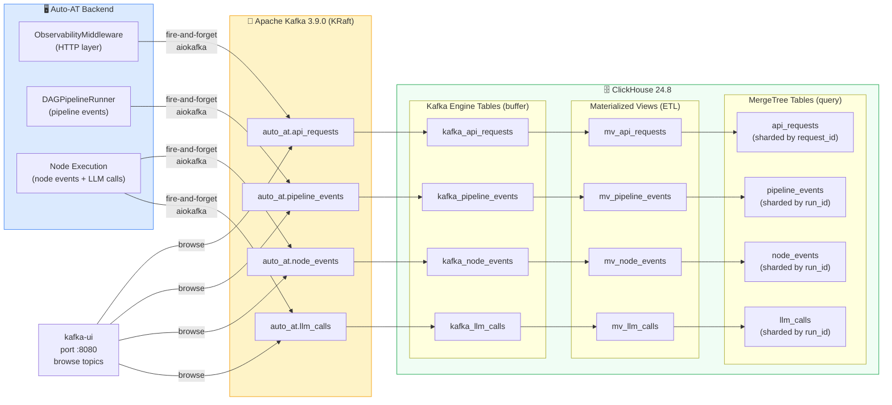
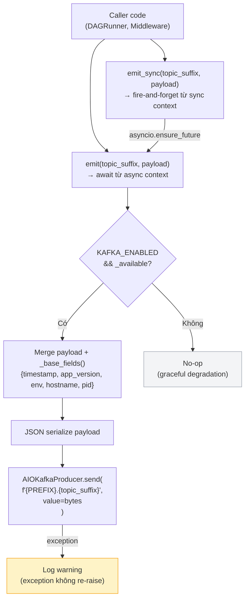
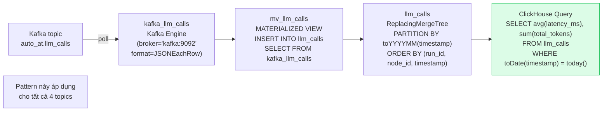
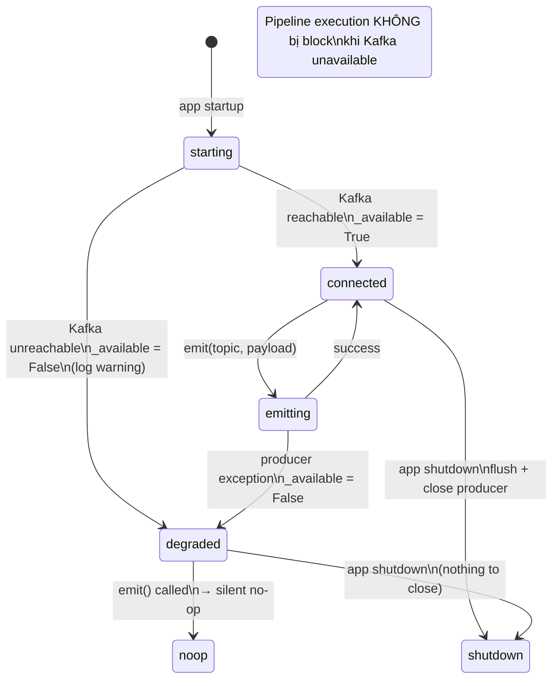

# Observability — Kafka + ClickHouse

## 1. Kiến trúc observability tổng thể

---

## 2. EventBus — luồng emit

---

## 3. Schema các Kafka topics

### `auto_at.pipeline_events`

| Field | Type | Mô tả |
|-------|------|-------|
| `event_type` | String | `run.started` \| `run.completed` \| `run.failed` \| `run.paused` \| `run.cancelled` |
| `run_id` | String | UUID của pipeline run |
| `template_id` | String | UUID của template |
| `document_name` | String | Tên file upload |
| `total_nodes` | Int32 | Số node trong template |
| `total_layers` | Int32 | Số layer thực thi |
| `duration_seconds` | Float32 | Thời gian tổng (chỉ có khi completed/failed) |
| `error` | String | Error message (nếu failed) |
| `failed_node` | String | node_id fail đầu tiên |
| `data` | String | JSON blob — thông tin bổ sung |
| `app_version` | String | APP_VERSION từ config |
| `env` | String | APP_ENV (development/production) |
| `hostname` | String | Tên máy chủ |
| `pid` | Int32 | Process ID |
| `timestamp` | DateTime | ISO-8601 UTC |

### `auto_at.node_events`

| Field | Type | Mô tả |
|-------|------|-------|
| `event_type` | String | `node.started` \| `node.completed` \| `node.failed` |
| `run_id` | String | UUID của run |
| `node_id` | String | node_id trong template |
| `node_type` | String | `agent` \| `input` \| `output` \| `pure_python` |
| `agent_id` | String | agent_id (nếu là agent node) |
| `label` | String | Display label của node |
| `status` | String | `running` \| `done` \| `error` |
| `duration_ms` | Int64 | Thời gian thực thi node (ms) |
| `retry_attempt` | UInt8 | Lần retry (0 = lần đầu) |
| `will_retry` | UInt8 | 1 nếu sẽ retry |
| `error_detail` | String | Chi tiết lỗi |
| `output_preview` | String | 300 ký tự đầu của output |
| `parent_node_ids` | String | JSON array node cha |
| `app_version`, `env`, `hostname`, `pid`, `timestamp` | — | Base fields |

### `auto_at.llm_calls`

| Field | Type | Mô tả |
|-------|------|-------|
| `run_id` | String | UUID của run |
| `node_id` | String | node đang gọi LLM |
| `agent_id` | String | agent đang gọi |
| `model` | String | Full model string, e.g. `openai/gpt-4o` |
| `provider` | String | Phần prefix trước `/`, e.g. `openai` |
| `latency_ms` | Int64 | Thời gian chờ LLM response (ms) |
| `prompt_tokens` | Int32 | Tokens input |
| `completion_tokens` | Int32 | Tokens output |
| `total_tokens` | Int32 | Tổng tokens |
| `success` | UInt8 | 1 = OK, 0 = error |
| `error_type` | String | Exception class name |
| `error_message` | String | Exception message |
| `task_description_len` | Int32 | Độ dài task description (chars) |
| `task_description_preview` | String | 200 ký tự đầu của task |
| `app_version`, `env`, `hostname`, `pid`, `timestamp` | — | Base fields |

### `auto_at.api_requests`

| Field | Type | Mô tả |
|-------|------|-------|
| `method` | String | HTTP method (GET/POST/...) |
| `path` | String | Request path |
| `status_code` | Int32 | HTTP status code |
| `duration_ms` | Int64 | Thời gian xử lý (ms) |
| `client_ip` | String | IP client (X-Forwarded-For first) |
| `user_agent` | String | User-Agent header |
| `request_id` | String | X-Request-ID hoặc UUID4 generated |
| `content_length` | Int64 | Request body size |
| `app_version`, `env`, `hostname`, `pid`, `timestamp` | — | Base fields |

---

## 4. ClickHouse — schema pattern

---

## 5. Graceful degradation

