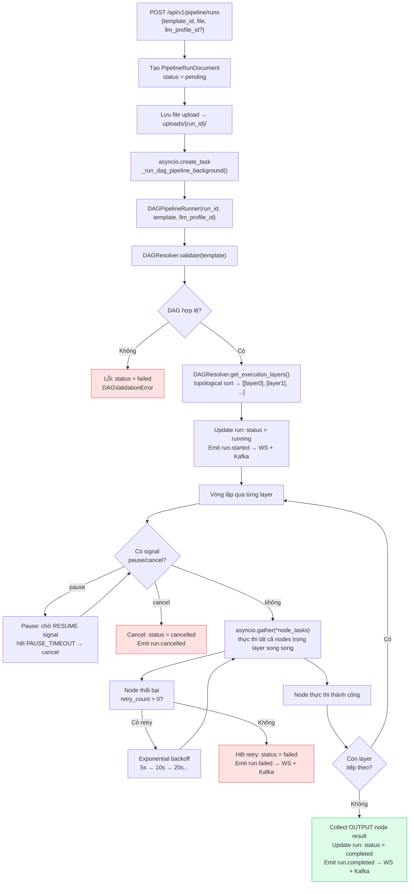
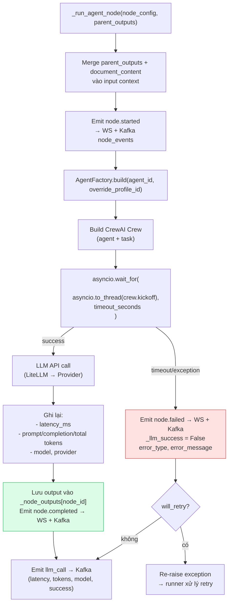
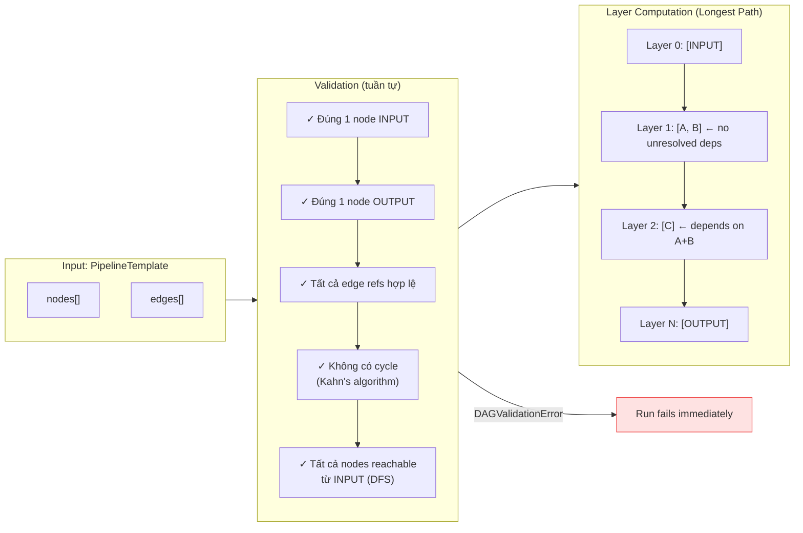
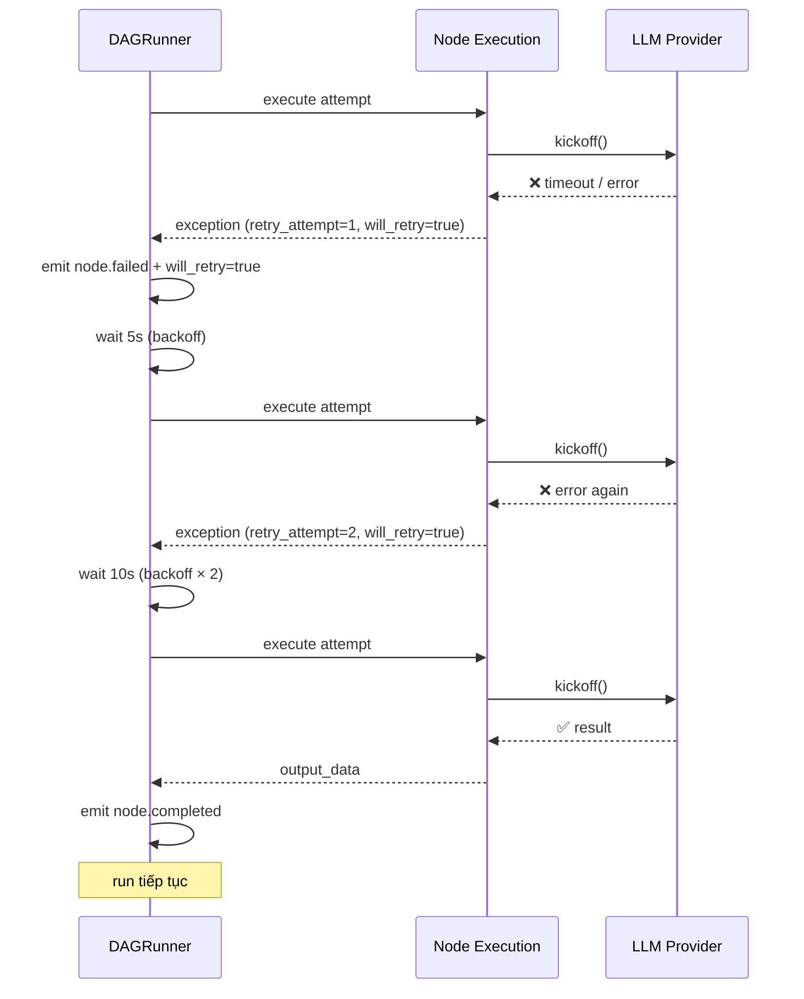
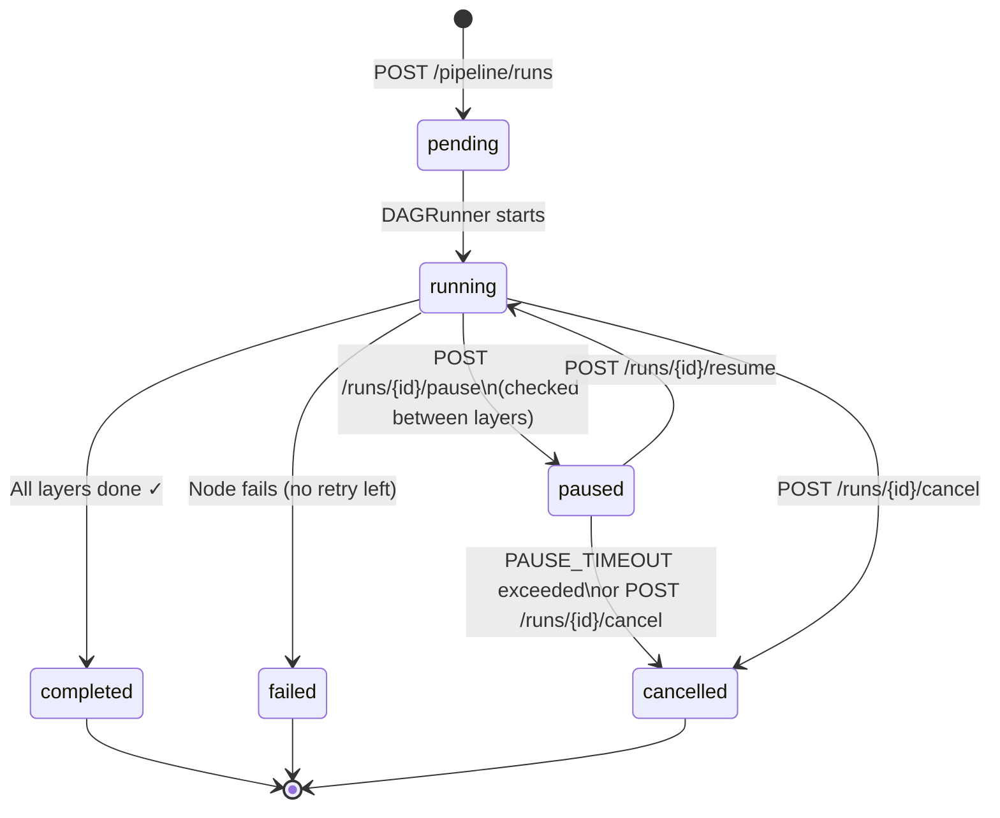
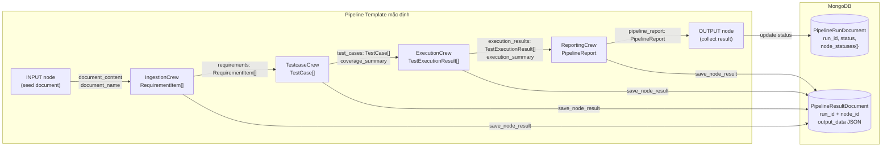

# Luồng thực thi Pipeline (DAG)

## 1. Luồng tổng quan — từ API call đến kết quả

---

## 2. Thực thi từng node (AgentNode)

---

## 3. DAG Resolver — Validation & Layer computation

---

## 4. Cơ chế Retry và Backoff

---

## 5. Luồng Pause / Resume / Cancel

---

## 6. Luồng dữ liệu giữa các node

