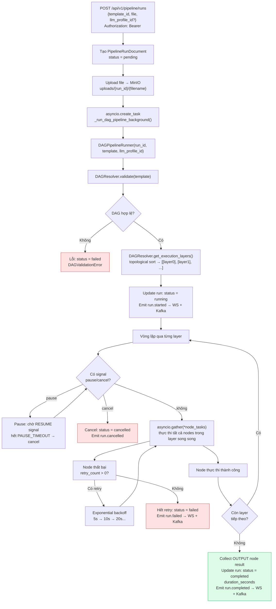
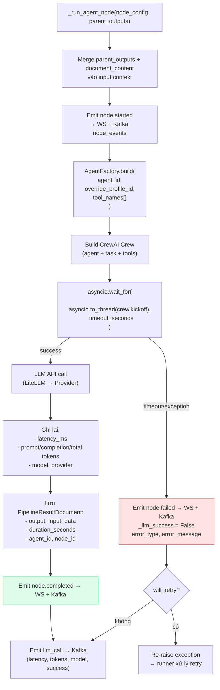
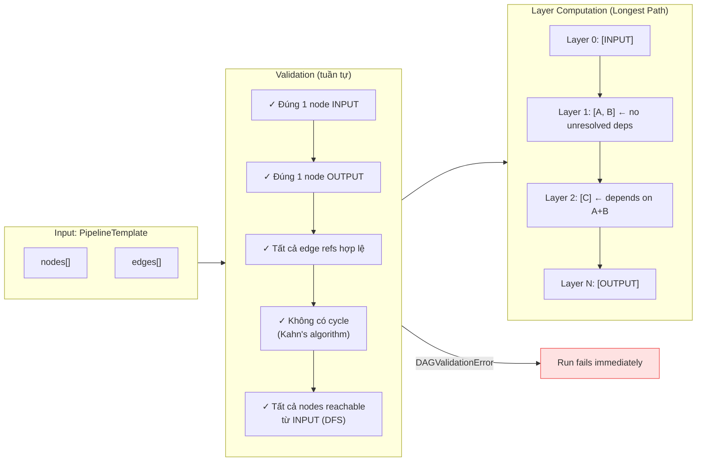
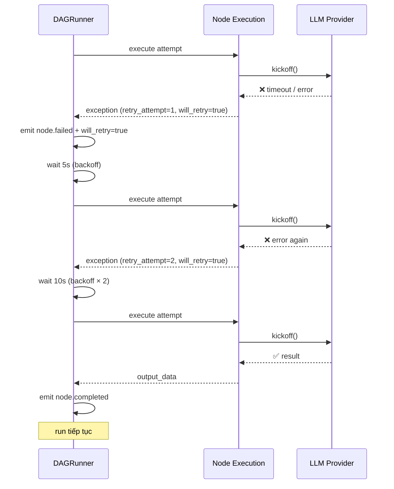
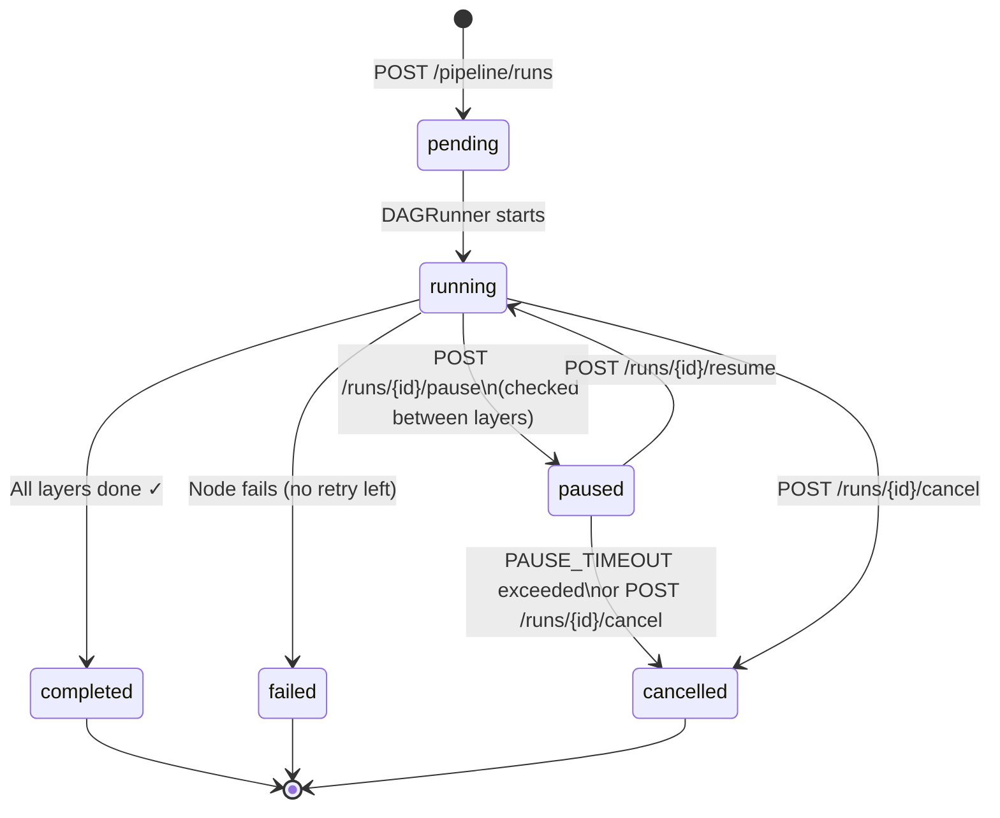
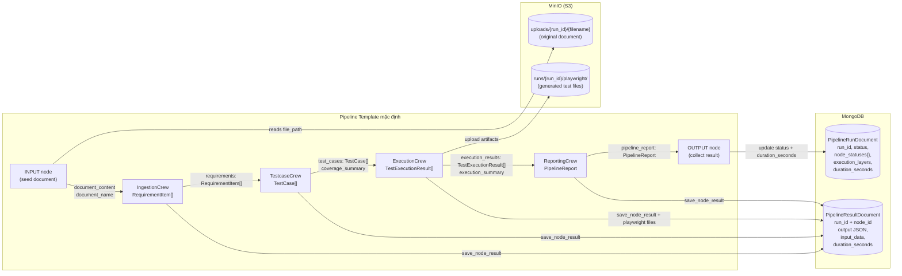
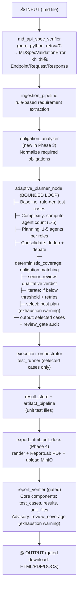

# Luồng thực thi Pipeline (DAG)

## 1. Luồng tổng quan — từ API call đến kết quả


```mermaid
flowchart TD
    A["POST /api/v1/pipeline/runs\n{template_id, file, llm_profile_id?}\nAuthorization: Bearer <token>"]
    B["Tạo PipelineRunDocument\nstatus = pending"]
    C["Upload file → MinIO\nuploads/{run_id}/{filename}"]
    D["asyncio.create_task\n_run_dag_pipeline_background()"]
    E["DAGPipelineRunner(run_id, template, llm_profile_id)"]
    F["DAGResolver.validate(template)"]
    G{DAG hợp lệ?}
    H["Lỗi: status = failed\nDAGValidationError"]
    I["DAGResolver.get_execution_layers()\ntopological sort → [[layer0], [layer1], ...]"]
    J["Update run: status = running\nEmit run.started → WS + Kafka"]
    K["Vòng lặp qua từng layer"]
    L{"Có signal\npause/cancel?"}
    M["Pause: chờ RESUME signal\nhết PAUSE_TIMEOUT → cancel"]
    N["Cancel: status = cancelled\nEmit run.cancelled"]
    O["asyncio.gather(*node_tasks)\nthực thi tất cả nodes trong layer song song"]
    P["Node thực thi thành công"]
    Q["Node thất bại\nretry_count > 0?"]
    R["Exponential backoff\n5s → 10s → 20s..."]
    S["Hết retry: status = failed\nEmit run.failed → WS + Kafka"]
    T{"Còn layer\ntiếp theo?"}
    U["Collect OUTPUT node result\nUpdate run: status = completed\nduration_seconds\nEmit run.completed → WS + Kafka"]

    A --> B --> C --> D --> E --> F --> G
    G -- Không --> H
    G -- Có --> I --> J --> K --> L
    L -- pause --> M --> L
    L -- cancel --> N
    L -- không --> O --> P --> T
    O --> Q -- Có retry --> R --> O
    Q -- Không --> S
    T -- Có --> K
    T -- Không --> U

    style H fill:#fee2e2,stroke:#ef4444
    style N fill:#fee2e2,stroke:#ef4444
    style S fill:#fee2e2,stroke:#ef4444
    style U fill:#dcfce7,stroke:#22c55e
```

---

## 2. Thực thi từng node (AgentNode)


```mermaid
flowchart TD
    START["_run_agent_node(node_config, parent_outputs)"]
    MERGE["Merge parent_outputs + document_content\nvào input context"]
    EMIT_START["Emit node.started\n→ WS + Kafka node_events"]
    BUILD_AGENT["AgentFactory.build(\n  agent_id,\n  override_profile_id,\n  tool_names[]\n)"]
    BUILD_CREW["Build CrewAI Crew\n(agent + task + tools)"]
    TIMEOUT["asyncio.wait_for(\n  asyncio.to_thread(crew.kickoff),\n  timeout_seconds\n)"]
    LLM_CALL["LLM API call\n(LiteLLM → Provider)"]
    TRACK["Ghi lại:\n- latency_ms\n- prompt/completion/total tokens\n- model, provider"]
    SAVE["Lưu PipelineResultDocument:\n- output, input_data\n- duration_seconds\n- agent_id, node_id"]
    SUCCESS["Emit node.completed → WS + Kafka"]
    LLM_EMIT["Emit llm_call → Kafka\n(latency, tokens, model, success)"]
    FAIL["Emit node.failed → WS + Kafka\n_llm_success = False\nerror_type, error_message"]
    RETRY_CHECK{"will_retry?"}
    RAISE["Re-raise exception\n→ runner xử lý retry"]

    START --> MERGE --> EMIT_START --> BUILD_AGENT --> BUILD_CREW --> TIMEOUT
    TIMEOUT -->|success| LLM_CALL --> TRACK --> SAVE --> SUCCESS --> LLM_EMIT
    TIMEOUT -->|timeout/exception| FAIL --> RETRY_CHECK
    RETRY_CHECK -- có --> RAISE
    RETRY_CHECK -- không --> LLM_EMIT

    style SUCCESS fill:#dcfce7,stroke:#22c55e
    style FAIL fill:#fee2e2,stroke:#ef4444
```

---

## 3. DAG Resolver — Validation & Layer computation


```mermaid
flowchart LR
    subgraph INPUT["Input: PipelineTemplate"]
        N["nodes[]"]
        E["edges[]"]
    end

    subgraph VALIDATION["Validation (tuần tự)"]
        V1["✓ Đúng 1 node INPUT"]
        V2["✓ Đúng 1 node OUTPUT"]
        V3["✓ Tất cả edge refs hợp lệ"]
        V4["✓ Không có cycle\n(Kahn's algorithm)"]
        V5["✓ Tất cả nodes reachable\ntừ INPUT (DFS)"]
        V1 --> V2 --> V3 --> V4 --> V5
    end

    subgraph LAYERS["Layer Computation (Longest Path)"]
        L0["Layer 0: [INPUT]"]
        L1["Layer 1: [A, B] ← no unresolved deps"]
        L2["Layer 2: [C] ← depends on A+B"]
        LN["Layer N: [OUTPUT]"]
        L0 --> L1 --> L2 --> LN
    end

    INPUT --> VALIDATION --> LAYERS
    VALIDATION -->|"DAGValidationError"| ERR["Run fails immediately"]

    style ERR fill:#fee2e2,stroke:#ef4444
```

---

## 4. Cơ chế Retry và Backoff


```mermaid
sequenceDiagram
    participant R as DAGRunner
    participant N as Node Execution
    participant LLM as LLM Provider

    R->>N: execute attempt #1
    N->>LLM: kickoff()
    LLM-->>N: ❌ timeout / error
    N-->>R: exception (retry_attempt=1, will_retry=true)
    R->>R: emit node.failed + will_retry=true
    R->>R: wait 5s (backoff)

    R->>N: execute attempt #2
    N->>LLM: kickoff()
    LLM-->>N: ❌ error again
    N-->>R: exception (retry_attempt=2, will_retry=true)
    R->>R: wait 10s (backoff × 2)

    R->>N: execute attempt #3
    N->>LLM: kickoff()
    LLM-->>N: ✅ result
    N-->>R: output_data
    R->>R: emit node.completed
    note over R: run tiếp tục
```

---

## 5. Luồng Pause / Resume / Cancel


```mermaid
stateDiagram-v2
    [*] --> pending: POST /pipeline/runs
    pending --> running: DAGRunner starts
    running --> paused: POST /runs/{id}/pause\n(checked between layers)
    paused --> running: POST /runs/{id}/resume
    paused --> cancelled: PAUSE_TIMEOUT exceeded\nor POST /runs/{id}/cancel
    running --> cancelled: POST /runs/{id}/cancel
    running --> completed: All layers done ✓
    running --> failed: Node fails (no retry left)
    completed --> [*]
    failed --> [*]
    cancelled --> [*]
```

---

## 6. Luồng dữ liệu giữa các node


```mermaid
graph LR
    subgraph Template["Pipeline Template mặc định"]
        INPUT["INPUT node\n(seed document)"]
        INGEST["IngestionCrew\nRequirementItem[]"]
        TESTCASE["TestcaseCrew\nTestCase[]"]
        EXECUTE["ExecutionCrew\nTestExecutionResult[]"]
        REPORT["ReportingCrew\nPipelineReport"]
        OUTPUT["OUTPUT node\n(collect result)"]

        INPUT -->|"document_content\ndocument_name"| INGEST
        INGEST -->|"requirements: RequirementItem[]"| TESTCASE
        TESTCASE -->|"test_cases: TestCase[]\ncoverage_summary"| EXECUTE
        EXECUTE -->|"execution_results: TestExecutionResult[]\nexecution_summary"| REPORT
        REPORT -->|"pipeline_report: PipelineReport"| OUTPUT
    end

    subgraph MongoDB["MongoDB"]
        RUN[("PipelineRunDocument\nrun_id, status,\nnode_statuses{},\nexecution_layers,\nduration_seconds")]
        RESULT[("PipelineResultDocument\nrun_id + node_id\noutput JSON,\ninput_data,\nduration_seconds")]
    end

    subgraph MinIO["MinIO (S3)"]
        UP[("uploads/{run_id}/{filename}\n(original document)")]
        PW[("runs/{run_id}/playwright/\n(generated test files)")]
    end

    INGEST -->|"save_node_result"| RESULT
    TESTCASE -->|"save_node_result"| RESULT
    EXECUTE -->|"save_node_result + playwright files"| RESULT
    EXECUTE -->|"upload artifacts"| PW
    REPORT -->|"save_node_result"| RESULT
    OUTPUT -->|"update status + duration_seconds"| RUN
    INPUT -->|"reads file_path"| UP
```

## 5. Template `automation-testing-api` (Adaptive MD-API Pipeline, Phases 3-5)

`automation-testing-api` extends the baseline rule-based pipeline with adaptive multi-agent planning, a bounded senior-review coverage gate, and deterministic verification.


```mermaid
flowchart TD
    A["📥 INPUT (.md file)"]
    B["md_api_spec_verifier\n(pure_python, retry=0)\n→ MDSpecValidationError\n  khi thiếu Endpoint/Request/Response"]
    C["ingestion_pipeline\nrule-based requirement extraction"]
    D["obligation_analyzer\n(new in Phase 3)\nNormalize required obligations"]
    E["adaptive_planner_node (BOUNDED LOOP)\n├─ Baseline: rule-gen test cases\n├─ Complexity: compute agent count (1-5)\n├─ Planning: 1-5 agents per roles\n├─ Consolidate: dedup + debate\n├─ deterministic_coverage: obligation matching\n├─ senior_review: qualitative verdict\n├─ iterate: if below threshold + retries\n├─ select: best plan (exhaustion warning)\n└─ output: selected cases + review_gate audit"]
    F["execution_orchestrator\ntest_runner (selected cases only)"]
    G["result_store + artifact_pipeline\n(unit test files)"]
    H["export_html_pdf_docx (Phase 4)\nrender + ReportLab PDF + upload MinIO"]
    I["report_verifier (gated)\nCore components: test_cases, results, unit_files\nAdvisory: review_coverage (exhaustion warning)"]
    J["📤 OUTPUT (gated download: HTML/PDF/DOCX)"]

    A --> B --> C --> D --> E --> F --> G --> H --> I --> J
```

**Adaptive Planner Loop (inside node E):**

| Stage | Input | Decision/Action | Output |
|-------|-------|-----------------|--------|
| Baseline | Document + obligations | Rule-based generator | Initial test cases |
| Complexity | Doc signals (endpoints, params, responses) | Deterministic scoring → 1–5 agents | Agent count + selected roles |
| Planning | Obligations + feedback (if retry) | 1–5 CrewAI planners debate | Consolidated candidate cases |
| Coverage | Cases + obligations | Obligation-to-case mapping | Coverage %, gaps list |
| Senior Review | Plan + coverage + gaps | Qualitative assessment (approve/revise/reject) | Verdict + targeted feedback |
| Iterate? | Coverage < threshold + retries left | Feed gaps back to planning | → Loop or select |
| Select | All iterations (audit persisted) | Best-scoring iteration (no LLM choice) | Selected plan + exhausted flag |

**Configuration (template node `config_overrides`, per-run `run_params` override):**

```python
min_planner_agents       = 1       # Range 1–5
max_planner_agents       = 5       # Range 1–5, >= min
coverage_threshold_percent = 90    # Range 0–100; gate passes on >=
max_review_iterations    = 3       # Range 0–5; retry attempts after baseline
continue_on_review_exhaustion = true # Continue with best plan + warning
```

### Deterministic Coverage

Coverage is **never an LLM self-score**. It is computed from:
1. **Obligations inventory** — normalized from source document (`SourceObligation.id`, `kind`, `required`).
2. **Test case mappings** — each case lists `obligation_ids` it satisfies (traceability).
3. **Formula** — `coverage_percent = covered_required / total_required * 100` (only `required=true` count).

**Example:** If doc lists 10 required obligations and a consolidated plan cites 9 of them across its cases, coverage is 90%. Optional obligations (e.g., non-required headers) never inflate the score.

### Header Redaction (Phase 4)

Secret header **values** are redacted before persistence and export (MongoDB, WebSocket, logs, HTML, PDF); placeholders like `Bearer ${TOKEN}` are preserved for API executability.

### Fail-fast Guarantees

| Tình huống | Hành vi |
|------------|---------|
| MD thiếu section → `MDSpecValidationError` | Runner mark `failed`, **skip retry** (xem `is_structured_pipeline_error`); `error_message` là JSON `{error_type, code, missing_sections, missing_fields, detail}`; WS event `node.failed` mang `error_type` để FE render structured alert. |
| Base URL resolution (api_test_runner) | Runner ưu tiên `md_spec_parsed.base_url` (đã validate, chấp nhận dạng bullet `- Base URL:`) làm `base_url_override`; chỉ scrape lại từ raw document khi `md_spec_parsed` vắng mặt. Tránh skip toàn bộ case khi base_url khai báo dưới dạng bullet. |
| Request chaining (api_test_runner) | Case path-param (`/api/tasks/:id`) không hardcode id: POST create khai `extract`, case item dùng placeholder `{var}` + `depends_on`. Runner sắp xếp producer chạy trước, bắt `id` từ response create vào context, thay `{var}` lúc chạy. Create fail → dependent bị **skip** với lý do `Unresolved chained value(s)`. Case 404 độc lập, dùng id không tồn tại. |
| Coverage gate exhausted → `coverage_gate_exhausted=true` | Best-scoring iteration selected; run **continues** with warning. Report verifier flags as **advisory** — does not block PDF/HTML/DOCX download. Visible in FE run-detail page. |
| Report thiếu component → `ReportVerificationError` (core only) | Mark `failed` không retry; FE GET `/report/verification` thấy `verified=false` + `issues[]` (test_cases, results, unit_files); nút Download HTML/DOCX disabled. **Review coverage** warning is advisory. |
| Admin cần lấy file để debug | `GET /export/{html\|pdf\|docx}?force=true` (yêu cầu role admin) bỏ qua gate. |
