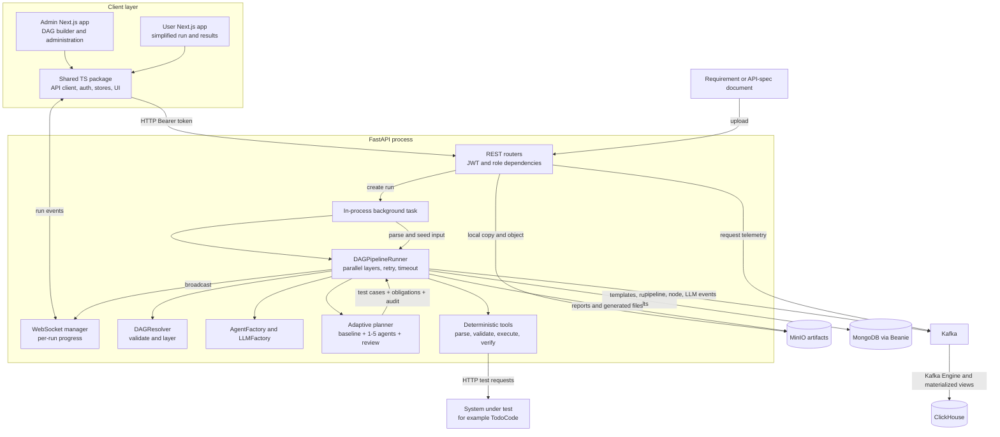

# Auto-AT Project Thesis Analysis

**Repository:** `D:\CV\auto-at`  
**Analysis date:** 2026-06-24  
**Committed baseline:** `d22da7bcaf3836045868b1d3b5c4b4278d42373d` (`d22da7b`, 2026-06-20)  
**Analyzed state:** current working tree, including uncommitted work  
**Evidence notation:** **[Fact]** is directly supported by repository evidence; **[Inference]** is a reasoned interpretation; **[Missing]** identifies evidence not found.

## Executive summary

**[Fact]** Auto-AT v3 is a monorepo for converting requirement documents—especially Markdown API specifications—into generated test cases, executable API tests, persisted results, and downloadable reports. It combines a visual Next.js DAG builder, a simplified end-user run interface, a FastAPI backend, CrewAI/LiteLLM agents, deterministic Python tools, MongoDB, MinIO, Kafka, ClickHouse, REST, and WebSocket progress events (`README.md:1-40`; `README.md:44-62`; `backend/pyproject.toml:1-32`).

**[Fact]** Its central execution abstraction is a validated directed acyclic graph. `DAGResolver` uses Kahn's topological-sort algorithm, checks exactly one input and output, dangling edges, cycles, and input reachability, then groups nodes by longest-path depth for layer-parallel execution (`backend/app/core/dag_resolver.py:31-182`). `DAGPipelineRunner` executes each layer with `asyncio.gather`, checks pause/cancel signals between layers, persists every node result, retries transient failures using exponential backoff, enforces per-node timeouts, and emits WebSocket/Kafka events (`backend/app/core/dag_pipeline_runner.py:183-435`; `backend/app/core/dag_pipeline_runner.py:441-488`; `backend/app/core/dag_pipeline_runner.py:490-575`; `backend/app/core/dag_pipeline_runner.py:752-856`).

**[Fact]** The newest and most thesis-relevant capability is currently uncommitted: an adaptive API-test planner that always creates a deterministic baseline, selects one to five specialized planners from a deterministic complexity score, runs them concurrently, conducts a critique round, consolidates and deduplicates proposals, maps cases to source obligations, computes reproducible coverage, and runs a bounded senior-review loop (`backend/app/crews/adaptive_api_test_planner_crew.py:1-17`; `backend/app/services/api_test_planning/complexity.py:23-145`; `backend/app/services/api_test_planning/coverage.py:1-99`; `backend/app/services/api_test_planning/review_loop.py:1-252`). The implementation explicitly treats LLM output as advisory while deterministic validation and coverage control acceptance (`plans/260620-2257-adaptive-api-testing-pipeline/plan.md:19-23`; `plans/260620-2257-adaptive-api-testing-pipeline/plan.md:69-77`).

**[Inference]** The strongest master's-thesis contribution is not merely “LLMs generate tests.” It is a hybrid governance architecture for stochastic multi-agent generation: deterministic complexity-based resource allocation, deterministic baseline preservation, obligation-level traceability, bounded feedback, reproducible acceptance metrics, and fail-soft behavior. This is concrete enough to study experimentally, but the repository does not yet contain the benchmark corpus, baselines, repeated-trial protocol, statistical analysis, human assessment, or cost/quality study required for an academic evaluation.

**[Fact]** The current snapshot is not release-ready. The worktree contains 44 modified and 22 untracked paths; many modern backend tests are ignored by `backend/.gitignore` (`backend/.gitignore:39-41`). Focused adaptive-pipeline tests pass 99/99, but full backend collection fails because four tracked V1 tests still import removed SQLAlchemy. Excluding those files yields 397 passed, 12 failed, and 3 skipped; shared UI tests yield 23 passed and 3 failed. The failures expose conversion-repair, legacy export, template-contract, and stale UI-mock drift. These results were observed on 2026-06-24 and are operational evidence, not committed CI evidence.

**Proposed thesis title:**

> **Deterministic Governance of Adaptive Multi-Agent LLM Pipelines for API Test Generation and Execution**

## 1. Analysis method, scope, and confidence

### 1.1 Systematic checklist

- [x] Read repository instructions, `README.md`, development rules, architecture docs, implementation plans, and decision journal.
- [x] Check CodeGraph: `.codegraph/` is absent, so CodeGraph was correctly skipped.
- [x] Refresh and inspect GitNexus: rebuild completed with 10,711 nodes, 18,587 edges, 358 clusters, and 237 flows; concept search still reported a missing FTS index, so graph-query results were treated as degraded rather than authoritative.
- [x] Inventory top-level, backend, frontend, shared package, infrastructure, tests, prototype, and target application.
- [x] Trace core symbols with GitNexus and verify them against line-numbered source.
- [x] Inspect schemas, persistence, APIs, preprocessing, agent/LLM construction, execution, observability, auth, storage, and deployment.
- [x] Inspect Git history, plans, changelog, journal, review reports, and dirty-worktree state.
- [x] Execute focused and broad backend tests and shared frontend tests without changing source.
- [x] Separate confirmed facts, inferences, and missing research evidence.

### 1.2 Snapshot caveat

**[Fact]** `HEAD` has 89 commits, beginning with `07ca2be` (“init project,” 2026-01-25) and ending at `d22da7b` in the analyzed branch. The working tree contains the adaptive planner, review loop, multi-endpoint fixes, PDF export, header redaction, UI summaries, and tests that are not all committed. Therefore:

- Citations to tracked files at `HEAD` describe committed evidence.
- Citations to modified/untracked files describe the current experimental snapshot.
- Commit identifiers describe evolution, not necessarily the current file content.
- Test results describe this machine and snapshot, not a reproducible CI run.

## 2. Project purpose, problem, scope, and users

### 2.1 Purpose and problem statement

**[Fact]** The root README defines Auto-AT as a multi-agent system that automatically creates and executes test cases from requirement documents such as API specifications and PRDs (`README.md:1-4`). The backend package describes itself as “Multi-Agent Testing Automation Backend” (`backend/pyproject.toml:1-6`).

**[Inference]** The implemented problem statement is:

> Manual conversion of heterogeneous requirement documents into traceable, executable tests is slow and inconsistent; unconstrained LLM generation is also non-deterministic and may miss requirements, invent behavior, or fail silently. Auto-AT attempts to combine configurable LLM agents with deterministic validation, orchestration, coverage, persistence, and report gates.

This formulation is supported by strict source-contract validation and structured failures (`docs/changelog.md:1-17`), deterministic obligation coverage (`backend/app/services/api_test_planning/coverage.py:4-20`), baseline preservation during LLM failure (`backend/app/crews/adaptive_api_test_planner_crew.py:8-17`), and bounded review (`backend/app/services/api_test_planning/review_loop.py:6-23`).

### 2.2 Functional scope

**[Fact]** Current implemented scope includes:

- Uploading requirement documents, with extension and 50 MB size checks, local persistence, and MinIO upload (`backend/app/config.py:53-55`; `backend/app/api/v1/pipeline/_helpers.py:233-309`).
- Visual creation and validation of reusable pipeline DAGs in the admin frontend (`README.md:28-40`; `apps/admin-app/package.json:11-26`).
- Document parsing, chunking, requirement extraction, API-spec validation, deterministic and agent-based test planning, API execution, artifacts, reporting, and report verification (`backend/app/core/dag_pipeline_runner.py:815-856`; `backend/app/core/dag_pipeline_runner.py:1169-1387`).
- Run history, derived/checkpoint runs, node-level persistence, comparisons, exports, and real-time progress (`backend/app/core/dag_pipeline_runner.py:1043-1110`; commit `5123f70`; commit `51fa663`).
- A bundled TodoCode Go/SQLite application used as a concrete system under test, exposing task, goal, and statistics APIs (`TodoCode/backend/main.go:18-54`; `TodoCode/api_spec.md:1-8`).

**[Fact]** The adaptive-pipeline plan explicitly excludes multiple API documents per run, arbitrary OpenAPI import, unbounded autonomous debate, and code-coverage measurement (`plans/260620-2257-adaptive-api-testing-pipeline/plan.md:25-29`). A later multi-endpoint fix expands one document to multiple endpoints, not multiple documents (`plans/260621-2011-multi-endpoint-api-test-pipeline-fix/plan.md:28-39`).

### 2.3 Intended users

**[Fact]** The current source defines three roles: `ADMIN`, `QA`, and `DEV`. Admin has full access, QA cannot use LLM chat, and DEV cannot create pipeline templates (`backend/app/db/models.py:481-500`; `backend/app/api/v1/deps.py:94-118`). The shared frontend mirrors these capabilities (`packages/shared/src/auth/auth-context.tsx:15-35`; `packages/shared/src/auth/auth-context.tsx:110-125`).

**[Fact]** The two frontends separate personas: the admin app exposes pipeline building and configuration, while the user app exposes a simplified run-centric flow (`README.md:44-53`). The decision journal says end users should upload a document, run, and see results without choosing an LLM profile or using pause/cancel controls (`docs/journals/2026-06-02-simplify-user-pipeline-run-ux.md:8-35`).

**[Fact: documentation drift]** `README.md:37` and `docs/architecture.md:150-171` claim roles `ADMIN/QA/VIEWER`, while the implementation uses `ADMIN/QA/DEV`. Thesis text should use the source-defined roles and explicitly document this inconsistency.

## 3. System architecture, modules, and relationships

### 3.1 Architectural style

**[Fact]** Auto-AT is an npm-workspace monorepo with two Next.js applications, a shared TypeScript package, a Python backend, Docker Compose infrastructure, documentation/plans, a legacy prototype, and a bundled target application (`package.json:1-16`; `README.md:44-62`).

| Layer/module | Responsibility | Evidence |
|---|---|---|
| `apps/admin-app` | Admin UI, React Flow pipeline builder, agents, LLM profiles, users, run inspection | `docs/codebase-summary.md:26-46`; `apps/admin-app/package.json:11-26` |
| `apps/user-app` | Simplified pipeline list/run/history/result experience | `docs/codebase-summary.md:48-51`; decision `1842778` |
| `packages/shared` | Shared API client, auth, hooks, stores, UI, run/result components and types | `packages/shared/package.json:1-26`; `docs/codebase-summary.md:121-123` |
| `backend/app/api/v1` | REST and WebSocket transport; auth dependencies; admin and run APIs | `docs/codebase-summary.md:58-67`; `backend/app/main.py:196-234` |
| `backend/app/core` | DAG resolution/runner, signals, agent and LLM factories | `docs/codebase-summary.md:69-76` |
| `backend/app/crews` | Built-in and dynamic CrewAI orchestration units | `docs/codebase-summary.md:78-91` |
| `backend/app/tools` | Deterministic parsers, validators, generators, executors, redaction, renderers | `docs/codebase-summary.md:93-104` |
| `backend/app/services` | Auth, storage, event bus, exports, adaptive planning services | `backend/app/services/auth_service.py:1-49`; `backend/app/services/storage_service.py:1-11` |
| `backend/app/db` | Beanie documents, MongoDB connection, CRUD, seeds and startup migrations | `backend/app/db/database.py:39-123`; `backend/app/db/models.py:1-17` |
| `infra/clickhouse` | Kafka-engine ingestion, materialized views, MergeTree observability tables | `infra/clickhouse/init/01_create_tables.sql:1-83`; `infra/clickhouse/init/01_create_tables.sql:92-307` |
| `TodoCode` | Go/Gin/GORM/SQLite target API and requirements fixture | `TodoCode/backend/main.go:1-54`; `TodoCode/backend/go.mod:1-10` |
| `code` | Early Colab-exported prototype; not integrated production code | `code/automationtestingmultiagent.py:1-17`; `code/automationtestingmultiagent.py:217-260` |

### 3.2 Component and data-flow diagram



### 3.3 Important architectural boundaries

**[Fact]** REST handlers create a run record and schedule FastAPI `BackgroundTasks`; the background function reloads the template, parses the document, constructs `DAGPipelineRunner`, and executes it in the same application process (`backend/app/api/v1/pipeline/runs.py:293-323`; `backend/app/api/v1/pipeline/_background.py:132-217`).

**[Fact]** The system separates deterministic `pure_python` nodes from CrewAI `agent` nodes. Built-in handlers are selected by `agent_id`; agent nodes are configured through MongoDB and dynamically receive tools and an LLM (`backend/app/core/dag_pipeline_runner.py:815-856`; `backend/app/core/agent_factory.py:70-140`).

**[Fact]** Template definitions embed nodes and edges, while runs store a template snapshot and node results are stored separately. This supports audit and derived-run inheritance (`backend/app/db/models.py:220-310`; `backend/app/core/dag_pipeline_runner.py:1043-1110`; `backend/app/api/v1/pipeline/runs.py:293-304`).

## 4. Technologies, dependencies, databases, APIs, and infrastructure

### 4.1 Backend and AI stack

**[Fact]** Python 3.11+ dependencies include FastAPI/Uvicorn, Beanie and the PyMongo async client, Pydantic, CrewAI, LiteLLM, aiokafka, MinIO, bcrypt/JWT, httpx, pdfplumber, python-docx, ReportLab, openpyxl, Jinja2, cryptography, pytest, and pytest-asyncio (`backend/pyproject.toml:1-39`). `lancedb==0.30.0` is pinned for Windows compatibility (`backend/pyproject.toml:26-27`; `backend/README.md:633-657`).

**[Fact]** The LLM layer supports provider mappings for OpenAI, Anthropic, Ollama, Hugging Face, Azure OpenAI, Groq, and LM Studio-compatible use, with local providers not requiring API keys (`backend/app/core/llm_factory.py:56-77`; `backend/app/core/llm_factory.py:134-171`). Agent LLM resolution is five-tier: node/one-off override, per-agent profile, per-run profile, global default DB profile, then environment fallback (`backend/app/core/agent_factory.py:70-86`; `backend/app/core/agent_factory.py:230-290`).

**[Fact]** No model is trained in this repository. “Models” are external/local generative LLMs selected at runtime, plus deterministic Pydantic/Beanie data models. There are no training scripts, checkpoints, gradient-based optimization, or learned project-specific weights in the main application.

### 4.2 Frontend stack

**[Fact]** Both applications use Next.js 15, React 19, TypeScript, TanStack Query, React Flow (`@xyflow/react`), Axios, React Hook Form, Zod, Zustand, Tailwind CSS, and shared workspace code (`apps/admin-app/package.json:11-36`; `apps/user-app/package.json:11-36`). Shared component tests use Vitest, jsdom, and Testing Library (`packages/shared/package.json:16-25`).

### 4.3 Persistence and infrastructure

**[Fact]** MongoDB 7 stores operational data through Beanie; MinIO stores uploads, generated tests, and reports; Kafka carries four telemetry topics; ClickHouse stores their analytical projections (`docker-compose.yml:1-18`; `docker-compose.yml:91-203`; `infra/clickhouse/init/01_create_tables.sql:24-307`).

**[Fact]** Docker Compose defines MongoDB, FastAPI, MinIO plus bucket initialization, Kafka in single-node KRaft mode, ClickHouse, Kafka UI, admin app, and user app (`docker-compose.yml:1-252`). The frontend ports are 3001/3002 and backend port is 8000 (`docker-compose.yml:19-89`; `docker-compose.yml:205-246`).

### 4.4 External and internal APIs

**[Fact]** The backend provides auth/user, pipeline-run, pipeline-template, agent-config, LLM-profile, stage-config, tool, chat, conversion, artifact/export, and WebSocket APIs through `/api/v1` and `/ws/pipeline/{run_id}` (`backend/app/main.py:196-234`; `backend/app/api/v1/websocket.py:183-223`). API execution against the system under test uses `httpx` (`backend/pyproject.toml:20-21`; `backend/app/tools/api_runner.py`).

## 5. Workflows, algorithms, data flows, and decisions

### 5.1 Run lifecycle

1. **[Fact]** A user chooses a template and optionally uploads a document. The API validates the profile, concurrency limit, template, upload extension/size, and template-specific Markdown preflight before creating the run (`backend/app/api/v1/pipeline/runs.py:182-323`; `backend/app/api/v1/pipeline/_helpers.py:233-365`).
2. **[Fact]** A background task parses the document into text and seeds run parameters (`backend/app/api/v1/pipeline/_background.py:193-217`).
3. **[Fact]** The resolver validates the DAG and computes layers (`backend/app/core/dag_resolver.py:62-182`).
4. **[Fact]** Each layer executes concurrently; results are persisted per node. Any unrecoverable node failure fails the run (`backend/app/core/dag_pipeline_runner.py:241-407`; `backend/app/core/dag_pipeline_runner.py:490-569`).
5. **[Fact]** WebSocket events support live UI progress and Kafka events support later analysis (`backend/app/core/dag_pipeline_runner.py:930-1013`; `backend/app/api/v1/websocket.py:183-260`).
6. **[Fact]** Reports and generated test files are uploaded to MinIO; final run and result records remain in MongoDB (`backend/app/services/storage_service.py:75-151`; `backend/app/core/dag_pipeline_runner.py:1190-1234`).

### 5.2 DAG algorithm

**[Fact]** `DAGResolver` builds adjacency and in-degree structures, uses Kahn's algorithm to obtain an order and detect cycles, uses breadth-first search for reachability, and sets each node's depth to one plus the maximum parent depth. Nodes of equal depth form an execution layer (`backend/app/core/dag_resolver.py:43-60`; `backend/app/core/dag_resolver.py:112-141`; `backend/app/core/dag_resolver.py:143-182`; `backend/app/core/dag_resolver.py:192-231`).

**[Fact]** Multiple-parent data is both namespaced and shallow-merged; later parent outputs win on key collisions (`backend/app/core/dag_pipeline_runner.py:862-909`). **[Inference]** This is simple and flexible but creates an implicit, order-sensitive data contract. Typed ports or explicit merge policies would reduce ambiguity for research reproducibility.

### 5.3 Retry, timeout, control, and checkpoints

**[Fact]** Node retry count is bounded 0–5 and timeout 10–7200 seconds (`backend/app/db/models.py:242-250`). Retry uses delays `1, 2, 4, …` seconds; structured validation errors bypass retry because they are not transient (`backend/app/core/dag_pipeline_runner.py:441-488`). CrewAI calls and pure-Python handlers run with `asyncio.wait_for` (`backend/app/core/dag_pipeline_runner.py:752-764`; `backend/app/core/dag_pipeline_runner.py:843-856`).

**[Fact]** Pause/cancel signals are in-memory and checked between layers. A pause waits up to the configured timeout and then becomes cancellation (`backend/app/core/signal_manager.py:26-96`; `backend/app/core/dag_pipeline_runner.py:249-290`). Derived runs may load earlier node outputs from a parent and mark them inherited (`backend/app/core/dag_pipeline_runner.py:1043-1110`).

### 5.4 Adaptive multi-agent planning algorithm

**[Fact]** The adaptive planner's resource-allocation score is a weighted sum:

```text
score = response_count
      + parameter_count
      + 2 × validation_rule_count
      + 2 × header_auth_count
      + 3 × state_changing
```

Score bands 0/3/6/10/15 map to 1/2/3/4/5 planners, clamped by configured bounds. Roles are selected in fixed order: positive, negative/schema, auth/security, boundary/data, resilience/idempotency (`backend/app/services/api_test_planning/complexity.py:23-54`; `backend/app/services/api_test_planning/complexity.py:57-145`).

**[Fact]** The algorithm then:

- Generates a deterministic baseline.
- Extracts normalized source obligations.
- Runs selected planners concurrently, capped at five.
- Isolates failing planners.
- Runs a peer-critique round when multiple planners succeed.
- Consolidates baseline and proposals, with the baseline winning duplicate conflicts.
- Persists complexity, obligations, provenance, assumptions, duplicate count, warnings, and review audit (`backend/app/crews/adaptive_api_test_planner_crew.py:98-265`; `backend/app/crews/adaptive_api_test_planner_crew.py:299-359`; `backend/app/schemas/pipeline_io.py:244-282`).

**[Fact]** The senior-review gate accepts only if deterministic coverage reaches the configured threshold and the reviewer does not reject. It permits at most `max_review_iterations + 1` plans, stops early on acceptance or no progress, feeds concrete gaps into the next attempt, and deterministically selects the best iteration on exhaustion (`backend/app/services/api_test_planning/review_loop.py:53-91`; `backend/app/services/api_test_planning/review_loop.py:104-145`; `backend/app/services/api_test_planning/review_loop.py:148-252`).

### 5.5 Prompt and output control

**[Fact]** Agent task construction can replace role/goal/backstory with a node task instruction, truncates document text to 15,000 characters and metadata to 12,000 characters, repeats the instruction after document content, requests JSON-only output, and parses direct/fenced/embedded JSON with raw-text fallback (`backend/app/core/dag_pipeline_runner.py:622-750`; `backend/app/core/dag_pipeline_runner.py:1112-1163`).

**[Inference]** These are pragmatic prompt-control measures, not a complete defense against prompt injection from uploaded documents. An academic evaluation should explicitly test adversarial requirements text and instruction-following robustness.

## 6. Data sources, schemas, preprocessing, models, and evaluation

### 6.1 Data sources

**[Fact]** Primary runtime data sources are user-uploaded requirement documents and API specifications. The general parser supports PDF, DOC/DOCX, XLS/XLSX, TXT, Markdown, and CSV (`backend/app/tools/document_parser.py:228-277`). PDF pages receive page markers; DOCX body paragraphs and table cells are preserved; spreadsheets are rendered by sheet and row (`backend/app/tools/document_parser.py:71-225`).

**[Fact]** The adaptive API pipeline expects a repository-defined Markdown contract. A concrete TodoCode API specification and multiple OAuth/mobile documents exist under `TodoCode/` and `docs/document_test/` (`TodoCode/api_spec.md:1-121`; `docs/Flow/automation-testing-api-md-contract.md`). These are fixtures/examples, not a documented benchmark corpus.

### 6.2 Preprocessing

**[Fact]** Generic text chunking prefers paragraph, line, sentence, and word boundaries before hard cutting, uses overlapping windows, drops tiny tails, and can retain positional metadata (`backend/app/tools/text_chunker.py:69-190`). Default ingestion configuration is 2,000 characters with 200-character overlap (`backend/app/config.py:86-88`). Token count is only a four-characters-per-token estimate, not tokenizer-accurate (`backend/app/tools/text_chunker.py:193-230`).

**[Fact]** Strict API-spec preprocessing parses spec-level base URL and headers plus multiple endpoint/request/response sections; the multi-endpoint change was introduced after a documented bug where only the first endpoint was retained and coverage became falsely 100% (`plans/260621-2011-multi-endpoint-api-test-pipeline-fix/plan.md:14-39`).

### 6.3 Operational schemas

**[Fact]** MongoDB collections include:

| Collection | Core content | Evidence |
|---|---|---|
| `llm_profiles` | Provider, model, key, base URL, sampling settings, default flag | `backend/app/db/models.py:44-90` |
| `agent_configs` | Role, goal, backstory, LLM profile, enabled flag, iterations, tools | `backend/app/db/models.py:98-155` |
| `stage_configs` | UI grouping/categorization, not execution order | `backend/app/db/models.py:163-203` |
| `pipeline_templates` | Versioned nodes and edges | `backend/app/db/models.py:220-310` |
| `pipeline_runs` | Template snapshot, document, status, node state, timing, derived-run metadata | `backend/app/db/models.py:318-418` |
| `pipeline_results` | Per-node input/output, status, timing, LLM profile, inheritance provenance | `backend/app/db/models.py:421-473` |
| `users` | Username, bcrypt hash, role, active flag | `backend/app/db/models.py:481-500` |

**[Fact]** Pipeline I/O schemas cover requirements, test steps/cases, pre-generation coverage, automation readiness, adaptive complexity and obligations, review iterations, execution results and timing, post-execution requirement coverage, root-cause records, reports, and artifacts (`backend/app/schemas/pipeline_io.py:95-288`; `backend/app/schemas/pipeline_io.py:296-443`; `backend/app/schemas/pipeline_io.py:451-594`; `backend/app/schemas/pipeline_io.py:635-675`).

### 6.4 Evaluation methods and metrics already implemented

**[Fact]** Implemented operational metrics include:

- Required-obligation coverage: `covered_required / total_required × 100`; unknown IDs are diagnosed but not counted (`backend/app/services/api_test_planning/coverage.py:11-20`; `backend/app/services/api_test_planning/coverage.py:35-81`).
- Requirement coverage and validation percentages before and after execution (`backend/app/schemas/pipeline_io.py:217-233`; `backend/app/schemas/pipeline_io.py:533-555`).
- Test counts by category/type/priority, uncovered requirements, and coverage gaps (`backend/app/schemas/pipeline_io.py:217-227`).
- Runnable-subset pass rate, passed/failed/skipped/error counts, skipped reasons, min/max/average/p95 latency, and failure patterns (`backend/app/schemas/pipeline_io.py:451-525`).
- Run/node duration, retry attempts, LLM latency and token counts, HTTP latency and status (`backend/app/core/dag_pipeline_runner.py:415-427`; `backend/app/core/dag_pipeline_runner.py:779-809`; `infra/clickhouse/init/01_create_tables.sql:170-238`; `infra/clickhouse/init/01_create_tables.sql:250-303`).
- Report verification of test-case data, execution results, and unit-test files; review coverage is advisory (`backend/app/tools/report_verifier.py:60-109`; `backend/app/tools/report_verifier.py:126-147`).

**[Missing]** No repository evidence establishes academic validity for these metrics. Missing items include a labeled gold-standard dataset, mutation score, branch/statement coverage, defect-detection recall, test oracle accuracy, human expert ratings, inter-rater agreement, cost normalization, latency distribution across repeated LLM runs, statistical significance tests, or comparisons against established tools and fixed-agent baselines.

## 7. Installation, configuration, execution, testing, deployment, and operations

### 7.1 Installation and local execution

**[Fact]** Documented prerequisites are Docker Desktop, Node.js 18+, Python 3.11+, and `uv`. The complete stack starts with `docker compose up -d`; direct development uses `uv sync`, Uvicorn on 8000, admin Next.js on 3001, and user Next.js on 3002 (`README.md:68-99`). The backend image installs locked non-development dependencies and starts Uvicorn (`backend/Dockerfile:1-19`).

**[Fact: documentation drift]** `README.md:82-83` and `README.md:60-61` refer to `start.bat` and `stop.bat`, but neither file exists in the analyzed snapshot. `backend/.env.example` exists, although it is ignored by the broad `.env.*` rule and is not listed by normal Git inventory. It includes `NODE_DEFAULT_TIMEOUT` and `MAX_PARALLEL_NODES`, but those settings are absent from `backend/app/config.py:69-88`.

### 7.2 Configuration

**[Fact]** Pydantic Settings loads `.env`, supports application, MongoDB, LLM, upload, security, seeding, telemetry, pipeline, Kafka, ClickHouse, MinIO, and JWT settings (`backend/app/config.py:8-159`). The application starts MongoDB, optional seeds, default admin, MinIO bucket, orphan cleanup, WebSocket loop, and Kafka producer; Kafka and MinIO failures degrade rather than necessarily stop startup (`backend/app/main.py:44-160`).

### 7.3 Testing evidence

**[Fact]** `pyproject.toml` configures pytest and asyncio (`backend/pyproject.toml:34-47`). The current filesystem has 22 backend `test_*.py` files, but only six are tracked; `backend/.gitignore:39-41` ignores the entire tests directory, hiding new regression tests from normal Git status.

**Observed on 2026-06-24:**

| Command/scope | Result | Interpretation |
|---|---:|---|
| Focused adaptive/coverage/multi-endpoint/execution/export/validator suites | **99 passed**, 5 warnings | Core new research path is locally coherent |
| Full backend suite | Collection stopped on 4 files | Tracked V1 tests import SQLAlchemy, removed from current dependencies |
| Backend excluding 4 obsolete collectors | **397 passed, 12 failed, 3 skipped** | Strong breadth but unresolved conversion, export, and template-contract drift |
| Shared Vitest suite | **23 passed, 3 failed** | Three `PipelineRunPage` tests omit a newly required `useCancelPipeline` mock |

Relevant regression assertions directly test deterministic complexity, obligation extraction, deduplication, baseline fallback, concurrent debate, agent-failure isolation, bounded review, no-progress termination, unknown obligation IDs, multi-endpoint parsing, dependency chaining, and base-URL resolution (`backend/tests/test_adaptive_api_test_planner.py:66-278`; `backend/tests/test_senior_coverage_review_loop.py:77-337`; `backend/tests/test_multi_endpoint_pipeline.py:86-258`).

### 7.4 Deployment and operations

**[Fact]** Docker Compose is the only complete deployment definition found. It has health checks, persistent named volumes, restart policies, and dependency health ordering (`docker-compose.yml:1-18`; `docker-compose.yml:70-89`; `docker-compose.yml:248-252`). No GitHub Actions, other CI workflow, Kubernetes, Helm, Terraform, production reverse proxy, TLS termination, backup policy, or disaster-recovery runbook was found.

**[Fact]** The Compose backend uses `APP_ENV=development`, source bind mounts, and Uvicorn `--reload`; frontend images use development targets (`docker-compose.yml:25-69`; `docker-compose.yml:205-246`). **[Inference]** This is a development environment, not a production deployment specification.

## 8. Quality attributes

### 8.1 Security and privacy

**Confirmed strengths**

- Passwords use bcrypt and access tokens are signed JWTs with expiration (`backend/app/services/auth_service.py:16-49`).
- Protected REST routes resolve the current user from MongoDB and enforce role dependencies (`backend/app/api/v1/deps.py:61-118`).
- CORS origins are configured, API keys are masked in API responses, and optional encryption exists (`backend/app/config.py:33-33`; `backend/app/api/v1/llm_profiles.py:70-97`; `backend/app/config.py:57-60`).
- CrewAI external telemetry is disabled by default before importing CrewAI (`backend/app/config.py:64-67`; `backend/app/main.py:15-20`).
- Adaptive planning introduces header redaction and avoids storing full cases in review iterations; a code review found the leakage model mostly sound (`plans/reports/from-code-reviewer-260621-phase34-adaptive-pipeline-backend-review.md:79-93`).

**Confirmed risks/gaps**

- Development defaults include known JWT, admin, MongoDB, and MinIO credentials; API-key encryption defaults off (`backend/app/config.py:58-60`; `backend/app/config.py:105-119`; `docker-compose.yml:7-9`; `docker-compose.yml:39-50`).
- Compose makes the MinIO bucket anonymously downloadable, uses HTTP and `MINIO_USE_SSL=false`, and Kafka uses PLAINTEXT (`docker-compose.yml:39-44`; `docker-compose.yml:117-123`; `docker-compose.yml:131-148`).
- JWTs and user data are stored in browser `localStorage`, exposing them to successful XSS (`packages/shared/src/auth/auth-context.tsx:55-71`; `packages/shared/src/auth/auth-context.tsx:97-105`).
- The WebSocket route accepts a `run_id` and calls `accept()` without token or role validation (`backend/app/api/v1/websocket.py:52-57`; `backend/app/api/v1/websocket.py:183-223`).
- Upload validation checks filename extension and size, not content signature, malware, archive expansion, or document sanitization (`backend/app/api/v1/pipeline/_helpers.py:233-287`).
- Node events send a 500-character output preview into the event path, creating a possible sensitive-data telemetry channel (`backend/app/core/dag_pipeline_runner.py:554-560`; `backend/app/core/dag_pipeline_runner.py:988-1009`).
- A current code-review report identifies auth-placeholder over-redaction, stale verifier-result selection, and ambiguous exhaustion behavior (`plans/reports/from-code-reviewer-260621-phase34-adaptive-pipeline-backend-review.md:20-62`).

**[Missing]** No threat model, privacy policy, retention/deletion schedule, tenant model, secrets-management integration, audit-log access policy, dependency vulnerability scan, penetration test, or ethics/IRB treatment of uploaded requirements was found.

### 8.2 Performance and scalability

**[Fact]** Positive measures include layer parallelism, planner concurrency capped at five, per-node timeouts, a configured maximum of three concurrent runs, database indexes, Kafka batching, and ClickHouse partition/order keys (`backend/app/core/dag_pipeline_runner.py:303-336`; `backend/app/crews/adaptive_api_test_planner_crew.py:56-58`; `backend/app/config.py:74-97`; `backend/app/db/models.py:466-473`; `infra/clickhouse/init/01_create_tables.sql:78-80`).

**Confirmed limits**

- All nodes in a layer are passed to `asyncio.gather`; the documented `MAX_PARALLEL_NODES` bound is not implemented (`backend/app/core/dag_pipeline_runner.py:303-336`; `backend/README.md:227-230`).
- Run-count enforcement is a count-then-create check, so it is not an atomic distributed semaphore (`backend/app/api/v1/pipeline/runs.py:240-304`).
- Background work, signals, and WebSocket connections are process-local, constraining horizontal scaling (`backend/app/api/v1/pipeline/_background.py:132-217`; `backend/app/core/signal_manager.py:26-38`; `backend/app/api/v1/websocket.py:20-37`).
- Upload code accumulates the complete file in `raw_bytes` while also writing it, doubling memory pressure up to the limit (`backend/app/api/v1/pipeline/_helpers.py:262-287`).
- LLM prompt context is truncated rather than retrieved or hierarchically summarized (`backend/app/core/dag_pipeline_runner.py:676-710`).

**[Missing]** No load test, throughput target, capacity model, queueing system, distributed worker design, LLM cost budget, or measured scaling curve was found.

### 8.3 Reliability and observability

**[Fact]** Retries, timeouts, health checks, persisted node results, derived-run inheritance, graceful Kafka/MinIO degradation, WebSocket keepalives, and four Kafka→ClickHouse telemetry streams improve recoverability and diagnosis (`backend/app/core/dag_pipeline_runner.py:441-488`; `backend/app/main.py:64-75`; `backend/app/api/v1/websocket.py:225-260`; `infra/clickhouse/init/01_create_tables.sql:24-307`).

**[Fact: terminology issue]** “Orphan recovery” does not resume work. Startup marks pending/running runs failed (`backend/app/db/crud.py:1250-1284`). This conflicts with the root README wording “automatically recover interrupted runs” (`README.md:40`) and should be described as orphan cleanup/failure finalization.

**[Fact]** The `/health` endpoint checks MongoDB only, not MinIO, Kafka, ClickHouse, LLM providers, or the target API (`backend/app/main.py:245-263`).

### 8.4 Accessibility

**[Fact]** Frontend code contains meaningful accessibility work: labels, `aria-label`, `aria-expanded`, `aria-controls`, `aria-live`, alert/status roles, screen-reader-only text, focus rings, and responsive breakpoints; examples include `apps/admin-app/src/components/admin/agents/AgentList.tsx:114-120`, `apps/admin-app/src/components/admin/agents/ManageStagesDialog.tsx:250-364`, and `apps/admin-app/src/components/admin/agents/StageRow.tsx:116-213`.

**[Missing]** No automated axe/pa11y test, keyboard-only DAG-builder test, screen-reader audit, contrast report, reduced-motion policy, or WCAG conformance statement was found. React Flow drag/drop accessibility and graph editing are research/engineering gaps.

## 9. Git history and project evolution

### 9.1 Evolutionary stages

| Period/commit evidence | Evolution | Repository evidence |
|---|---|---|
| `07ca2be` (2026-01-25) | Initial project | Git history |
| `518b92c`, `e0312a2` (2026-03-31) | Multi-agent phases and first working implementation | Git history |
| `a26506a`, `9034e86`, `36fa92f` (2026-04-05) | WebSocket/logging, chat, V2 phases | Git history |
| `89cf144`–`db5c619` (2026-04-06) | V3 phase implementation | Git history |
| `b5f6ba0` (2026-04-23) | Large-file decomposition | Git history |
| `d30fb2a` (2026-05-21) | API pipeline validators, crews, errors, classifier, verifier | Commit adds 1,500 lines across 8 new backend files |
| `e46bda0` (2026-06-01) | Removed duplicated legacy frontend after monorepo split | Commit deletes 94 files / 29,402 lines |
| `5123f70`, `51fa663` (2026-06-01) | DAG checkpoints, persisted state, enhanced run UI | Commit stats show 270 and 420 inserted lines |
| `1842778`, `534ac57` (2026-06-02) | Simplified user UX and hidden node details | `docs/journals/2026-06-02-simplify-user-pipeline-run-ux.md:8-37`; `:87-105` |
| `d22da7b` (2026-06-20) | Strict API document-contract phase and adaptive-plan documents | Commit adds 843 and removes 163 lines |
| Current uncommitted snapshot | Adaptive planners, review gate, PDF, redaction, multi-endpoint repair, UI/test harness | `plans/260620-2257-adaptive-api-testing-pipeline/plan.md:59-87`; dirty worktree |

### 9.2 Decision evidence

**[Fact]** The changelog shows a transition from generic generation to a guarded API pipeline: Markdown-only validation, structured errors, test-level classification, executable filtering, report verification, and gated exports (`docs/changelog.md:1-23`).

**[Fact]** The June journal records a deliberate shared-component strategy: optional props with safe defaults rather than frontend forks, while acknowledging missing live smoke tests and a previously undetected TypeScript configuration failure (`docs/journals/2026-06-02-simplify-user-pipeline-run-ux.md:45-74`).

**[Fact]** The adaptive plan remains marked `pending` even though phases 2–5 are marked complete and its validation counts are now stale (`plans/260620-2257-adaptive-api-testing-pipeline/plan.md:1-13`; `:59-94`). This is documentation-state drift.

## 10. Limitations, technical debt, and research gaps

### 10.1 High-priority engineering limitations

1. **Uncommitted and ignored research implementation.** The core adaptive planner and many tests are untracked; the test directory is ignored (`backend/.gitignore:39-41`). Reproducibility is impossible until the experiment code and tests are versioned.
2. **Broken aggregate test signal.** Full pytest cannot collect obsolete SQLAlchemy tests; broad remaining tests have 12 failures; shared tests have 3 failures. There is no CI.
3. **Development-only deployment posture.** Compose uses default credentials, public MinIO reads, plaintext traffic, hot reload, and `latest` tags (`docker-compose.yml:25-69`; `:91-123`; `:205-246`).
4. **Single-process orchestration.** Background runs, signals, and WebSocket state are in-memory; no durable queue or distributed coordination exists (`backend/app/core/signal_manager.py:26-38`; `backend/app/api/v1/websocket.py:20-37`).
5. **No layer concurrency bound.** Documentation claims a bound that code does not implement (`backend/README.md:227-230`; `backend/app/core/dag_pipeline_runner.py:303-336`).
6. **Security gaps.** Unauthenticated WebSockets, localStorage JWTs, anonymous artifact downloads, default secrets, and incomplete upload/content defenses need resolution.
7. **Configuration semantics bug.** `continue_on_exhaustion=false` still returns the best plan; it only adds a warning (`backend/app/services/api_test_planning/review_loop.py:242-246`).
8. **Known correctness issues.** Current review evidence identifies auth-placeholder redaction and stale report-verifier selection (`plans/reports/from-code-reviewer-260621-phase34-adaptive-pipeline-backend-review.md:20-62`).
9. **Documentation drift.** Role names, “orphan recovery,” version numbers, start/stop scripts, DAG algorithm wording (docs say DFS while source uses Kahn), config keys, and test counts conflict across docs and source (`docs/architecture.md:150-171`; `backend/README.md:538-540`; `backend/app/core/dag_resolver.py:31-36`; `package.json:2-4`; `backend/pyproject.toml:1-4`; `backend/app/config.py:27-33`).
10. **Prototype residue.** `code/automationtestingmultiagent.py` is a Colab export containing notebook `!pip` syntax and an older independent architecture (`code/automationtestingmultiagent.py:1-17`). It should be labeled historical, archived, or converted into reproducible notebooks.

### 10.2 Research limitations

**[Missing]** The following must be added before strong thesis claims can be made:

- A fixed, legally usable corpus of diverse API specifications with train/dev/test separation if any tuning occurs.
- Ground-truth obligations, expected valid tests, seeded defects, and expert review protocol.
- Baselines: deterministic generator only, one general planner, fixed five planners, adaptive planners without debate, adaptive planners without review, and external tools/models.
- Repeated trials per LLM/configuration to quantify stochastic variance.
- Mutation testing or controlled fault seeding to measure defect-detection effectiveness.
- Precision/recall of obligation mapping and validity/executability rates, not only self-contained coverage.
- Token cost, wall-clock latency, API-call count, and failure/recovery measurements.
- Statistical tests, effect sizes, confidence intervals, and threat-to-validity analysis.
- Prompt-injection, secret-leakage, and adversarial-spec evaluation.
- Human-expert rubric and inter-rater reliability for test usefulness and false assumptions.

**[Fact]** `docs/Ref/` contains candidate background literature and thesis-format material (`2010.11929v2.pdf`, `Building-Browser-Agent.pdf`, `HxAgent-FSE-2026.pdf`, `SimpleMem.pdf`, `SmolDocling.pdf`, `WebAgentSurvey.pdf`, `WorldGUI.pdf`, and a thesis template), but the repository does not contain a literature matrix linking those sources to Auto-AT's claims. Their presence is not evidence that the implementation reproduces or validates their methods.

## 11. Potential research contributions and thesis topics

### 11.1 Recommended central contribution

**[Inference]** Frame the thesis around deterministic governance of adaptive multi-agent test generation. The implementation supports four potentially novel or practically valuable mechanisms:

1. **Complexity-adaptive orchestration:** deterministic structural signals allocate one to five specialized agents (`backend/app/services/api_test_planning/complexity.py:23-145`).
2. **Hybrid deterministic/stochastic planning:** a rule-based baseline survives LLM outages and bounds quality regression (`backend/app/crews/adaptive_api_test_planner_crew.py:8-17`).
3. **Traceable coverage governance:** every generated case maps to source obligations and coverage is independently recomputed (`backend/app/services/api_test_planning/coverage.py:35-81`).
4. **Bounded reflective improvement:** a senior reviewer provides qualitative feedback, but a deterministic gate controls acceptance and terminates predictably (`backend/app/services/api_test_planning/review_loop.py:104-252`).

### 11.2 Alternative thesis topics

| Topic | Research angle | Implementation anchor |
|---|---|---|
| Adaptive vs fixed multi-agent allocation | Quality/cost/latency trade-off | complexity score and selected roles |
| Deterministic coverage gates for LLM artifacts | Reproducibility and hallucination control | obligation inventory and coverage loop |
| Resilient LLM test generation | Graceful degradation under agent/model failures | baseline retention and planner isolation |
| Provenance-aware automated testing | Traceability from requirements to cases and results | obligation IDs, node results, inherited runs |
| DAG orchestration for agentic software engineering | Parallelism, checkpoints, control, observability | resolver, runner, signal manager, Kafka |
| Security of LLM-generated executable tests | Prompt injection, secret handling, unsafe HTTP actions | redaction, upload/prompt path, API runner |
| Human-centered explainability for agentic test systems | Whether coverage/review summaries aid QA decisions | `PlanningReviewSummary`, run UI, audit schemas |

## 12. Proposed title, research questions, and objectives

### Proposed title

**Deterministic Governance of Adaptive Multi-Agent LLM Pipelines for API Test Generation and Execution**

### Research questions

- **RQ1:** Does deterministic complexity-adaptive selection of 1–5 specialized LLM agents improve obligation coverage, executable-test validity, and defect detection per unit cost compared with deterministic-only, single-agent, and fixed multi-agent baselines?
- **RQ2:** How much does a bounded senior-review feedback loop improve obligation coverage and reduce unsupported assumptions, and after how many iterations do returns diminish?
- **RQ3:** Does retaining a deterministic baseline improve availability and minimum output quality under planner timeouts, invalid outputs, and LLM-provider failure?
- **RQ4:** How reproducible are generated plans and gate decisions across repeated runs, models, and temperatures when numeric acceptance is based on persisted obligation mappings rather than LLM self-evaluation?
- **RQ5:** What security and privacy risks arise when requirement documents drive executable API tests, and how effective are prompt controls, redaction, validation, and sandboxing mitigations?

### Objectives

1. Formalize the Auto-AT adaptive planning and deterministic-gate architecture.
2. Build a versioned benchmark of API specifications, obligations, and seeded faults.
3. Implement controlled ablations for agent count, role specialization, debate, review, baseline, and threshold.
4. Measure coverage, validity, executability, defect detection, duplicate rate, unsupported assumptions, latency, token/API cost, and failure recovery.
5. Quantify stochastic variability and statistical significance across repeated trials.
6. Conduct a security/privacy evaluation and document ethical handling of proprietary requirements.
7. Produce reproducible artifacts: pinned code, prompts/configuration, dataset manifest, experiment runner, raw results, and analysis scripts.

## 13. Suggested thesis chapter outline

1. **Introduction**
   - Motivation, problem statement, scope, contributions, and research questions.
2. **Background and Related Work**
   - Automated test generation, API testing, LLM agents, multi-agent debate/review, workflow DAGs, requirement traceability, and evaluation methodology.
3. **Research Methodology**
   - Design-science framing, hypotheses, benchmark construction, baselines, ablations, metrics, repeated-trial design, statistics, ethics, and threats to validity.
4. **System Requirements and Architecture**
   - User roles, monorepo architecture, DAG model, persistence, APIs, infrastructure, and security boundaries.
5. **Adaptive Multi-Agent Test Planning Method**
   - Complexity score, agent roles, deterministic baseline, concurrent planning, critique, consolidation, obligation extraction, and bounded review.
6. **Implementation**
   - FastAPI/CrewAI/LiteLLM integration, schemas, runner, MongoDB/MinIO, WebSocket/Kafka/ClickHouse, UI, configuration, and operational controls.
7. **Experimental Design**
   - Dataset, subject APIs, fault seeding, baselines, independent/dependent variables, execution environment, and reproducibility controls.
8. **Results**
   - Coverage/quality, defect detection, cost/latency, robustness, reproducibility, usability, and security findings.
9. **Discussion**
   - Interpretation, trade-offs, generalizability, failure modes, limitations, and threats to validity.
10. **Conclusion and Future Work**
    - Answers to RQs, contributions, deployment implications, and research extensions.

## 14. Thesis claims mapped to repository evidence

| Candidate thesis claim | Status | Evidence | What is still needed |
|---|---|---|---|
| Auto-AT transforms requirement/API documents into generated and executed tests | Confirmed implementation fact | `README.md:1-4`; `backend/app/core/dag_pipeline_runner.py:1255-1387` | Empirical effectiveness |
| Pipelines are reusable DAGs executed in dependency layers | Confirmed | `backend/app/db/models.py:220-310`; `backend/app/core/dag_resolver.py:31-182` | Performance comparison |
| Same-layer nodes execute concurrently | Confirmed | `backend/app/core/dag_pipeline_runner.py:303-336` | Measured speedup and safe bound |
| Structural complexity deterministically selects 1–5 planners | Confirmed, uncommitted | `backend/app/services/api_test_planning/complexity.py:23-145`; tests `:66-88` | Validate weights/bands externally |
| A deterministic baseline remains when LLM planning fails | Confirmed, uncommitted | `backend/app/crews/adaptive_api_test_planner_crew.py:8-17`; tests `:128-141`, `:184-199` | Outage experiments |
| Coverage is reproducible and not an LLM self-score | Confirmed, uncommitted | `backend/app/services/api_test_planning/coverage.py:4-20`; tests `test_senior_coverage_review_loop.py:77-112` | Mapping accuracy against experts |
| Review feedback is bounded and cannot form an infinite DAG cycle | Confirmed | `backend/app/services/api_test_planning/review_loop.py:12-23`; `:165-221` | Stress/property tests |
| The review loop improves coverage | Not established | Mechanism at `review_loop.py:176-221` | Controlled before/after experiments |
| Adaptive allocation is better than fixed agent counts | Not established | Allocation implementation only | Baselines, repeated trials, statistics |
| Outputs are traceable to source obligations | Partly confirmed | `backend/app/schemas/pipeline_io.py:187-210`; `:319-333`; result carry-forward `:451-471` | End-to-end provenance audit and accuracy |
| Test execution metrics use runnable cases as denominator | Confirmed | `backend/app/schemas/pipeline_io.py:474-497`; `docs/changelog.md:9-13` | Compare with standard metrics |
| The system is resilient to transient node failure | Mechanism confirmed | retries/timeouts `dag_pipeline_runner.py:441-488`, `:752-856` | Fault-injection reliability results |
| Runs are restart-resumable | Contradicted | Startup marks runs failed: `backend/app/db/crud.py:1250-1284` | Durable queue/checkpoint resumption |
| The system is horizontally scalable | Not supported | Process-local signals/WS/background tasks | Distributed architecture and tests |
| The system is production secure | Not supported | Defaults/public bucket/unauthenticated WS | Threat model, fixes, security tests |
| Observability captures run, node, LLM, and API telemetry | Confirmed | `event_bus.py:176-309`; `01_create_tables.sql:24-307` | Dashboards, SLOs, retention |
| Admin and end-user experiences are separated | Confirmed | `README.md:44-53`; journal `:8-35` | User study/accessibility audit |
| Current adaptive path has regression coverage | Locally confirmed | 99 focused tests passed on 2026-06-24 | Commit tests and add CI |

## 15. Glossary

| Term | Meaning in this project |
|---|---|
| Auto-AT | Automated testing system analyzed here. |
| DAG | Directed acyclic graph of input, output, agent, and pure-Python nodes. |
| Execution layer | Nodes with equal dependency depth that may execute concurrently. |
| Pipeline template | Reusable, versioned embedded node/edge definition in MongoDB. |
| Pipeline run | One execution of a template against a document and parameters. |
| Node result | Persisted input/output, status, timing, LLM profile, and inheritance metadata for one node. |
| Crew | CrewAI orchestration unit containing one or more role-configured LLM agents/tasks. |
| Agent catalog | MongoDB-configured roles, goals, backstories, tools, and LLM overrides available to templates. |
| Pure-Python node | Deterministic backend handler executed without an LLM. |
| Adaptive planner | Baseline plus complexity-selected specialized planners, critique, consolidation, and review gate. |
| Complexity decision | Deterministic score, signals, agent count, selected roles, and rationale. |
| Source obligation | Normalized requirement derived from response, header, auth, field, rule, or parameter evidence. |
| Obligation coverage | Percentage of required obligations cited by at least one consolidated test case. |
| Review gate | Bounded plan→coverage→senior-review loop with persisted per-iteration audit. |
| Gate exhaustion | No iteration passed before the configured bound; best valid plan is selected with warnings. |
| Deterministic baseline | Rule-generated test suite retained independently of LLM success. |
| Derived run/checkpoint | New run that inherits selected upstream node results from a parent run. |
| Structured pipeline error | Machine-readable validation/report error that bypasses retry and can be rendered by the UI. |
| LLM profile | Provider/model/API-key/base-URL/generation configuration stored in MongoDB. |
| Five-tier LLM resolution | Node override → agent profile → run profile → DB default → environment fallback. |
| TodoCode | Bundled Go/Gin/GORM/SQLite application used as an example system under test. |
| EventBus | Fail-soft Kafka producer for pipeline, node, LLM, and API telemetry. |
| Orphan cleanup | Startup transition of interrupted pending/running runs to failed; not true resumption. |

## 16. Prioritized questions to answer before writing the thesis

### Critical—define the research claim

1. What single claim will the thesis test: adaptive allocation, deterministic governance, review-loop effectiveness, robustness, or the complete system?
2. What is the unit of evaluation: API endpoint, source obligation, generated test case, seeded fault, pipeline run, or API specification?
3. Which baselines are mandatory, and which external academic/industrial tools are feasible to run under equal conditions?
4. What constitutes a “correct” test case, an “unsupported assumption,” and a detected defect, and who labels them?
5. Is the default `>=90%` coverage threshold theoretically justified, tuned empirically, or merely a product default?

### Critical—make experiments reproducible

6. Which model versions, temperatures, prompts, seeds, and provider settings will be frozen?
7. How many repeated runs per condition are needed to estimate stochastic variance and support statistical inference?
8. What benchmark corpus can be legally published, and how will gold obligations and seeded faults be created?
9. Will the current uncommitted adaptive implementation and ignored tests be committed and tagged before experiments?
10. What hardware, network, rate limits, model pricing date, and target-service state will be controlled?

### High—resolve semantics and correctness

11. Should `continue_on_exhaustion=false` halt execution, mark the run degraded, or remain advisory?
12. Should interrupted runs truly resume, or should documentation consistently say they are marked failed?
13. How should parent-output key collisions be resolved and documented?
14. How will the known header-placeholder redaction and latest-verifier-result issues be resolved before evaluation?
15. Are API tests allowed to mutate real services, and what sandbox/reset/isolation policy prevents harmful side effects?

### High—security, privacy, and ethics

16. May proprietary requirement documents or credentials be sent to external LLM providers? What consent, redaction, residency, and retention rules apply?
17. How will WebSocket authorization, artifact access control, secret management, and prompt-injection defenses be tested?
18. Is ethics-board/IRB review required for human expert ratings or proprietary artifacts?

### Medium—engineering and reporting

19. Which failures are considered legacy technical debt versus threats to the experimental results?
20. Will a durable worker queue and per-layer concurrency bound be implemented, or explicitly excluded from thesis scope?
21. What accessibility target applies to the admin DAG editor and result views?
22. Which artifacts will accompany the thesis: dataset, Docker image, commit tag, experiment scripts, raw events, notebooks, and statistical analysis?

## 17. Recommended next work, in order

1. Freeze and commit the research implementation, remove the blanket test ignore, and establish a green CI baseline.
2. Resolve known correctness/security issues and document the exact experimental version.
3. Write a formal experiment protocol before tuning weights, thresholds, or prompts.
4. Build and independently label the benchmark; include multi-endpoint, auth, schema, boundary, resilience, and adversarial cases.
5. Add experiment-mode provenance: model/version, temperature, prompt hash, code commit, template snapshot, token/cost, seed if available, and target reset ID.
6. Implement baselines and ablation switches without changing unrelated production paths.
7. Run pilot studies to estimate variance and sample size, then freeze the protocol.
8. Execute the full evaluation and retain raw MongoDB/Kafka/ClickHouse outputs for audit.
9. Conduct human and security evaluations separately from operational unit tests.
10. Reconcile documentation with source before citing the repository in the final thesis.

## 18. Unresolved questions and missing repository information

- No explicit thesis proposal, supervisor-approved problem statement, hypothesis, or institutional formatting requirements were found.
- No license file was found, although `backend/README.md:794-796` claims MIT; publication/reuse rights need confirmation.
- No authoritative production deployment or production data-retention policy was found.
- No current model/provider configuration or actual experiment output dataset is committed.
- No evidence establishes whether the current dirty worktree is intended to be committed as one feature, split, or discarded.
- GitNexus rebuilt successfully but its MCP concept search remained FTS-degraded; source inspection compensated for this, but graph-derived completeness cannot be claimed.

---

**Bottom line:** The repository contains a substantial, researchable artifact for adaptive multi-agent API testing. Its most defensible thesis angle is the deterministic control plane around stochastic agent planning. The architecture and local tests establish feasibility; they do not yet establish superiority, generalizability, security, or production readiness. Those must become explicit experimental questions rather than assumed claims.
