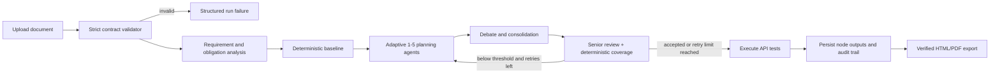

# Adaptive API Testing Pipeline

## Overview

Extend the current `automation-testing-api` template; do not build a second pipeline. Reuse the existing API-spec validator, `DAGPipelineRunner`, rule-based generator, `PipelineResultDocument`, report verification, MinIO, and HTML export. Validate synchronously before creating a run for immediate user feedback, then keep the validator DAG node as defense in depth.

Core design: generate a deterministic baseline, then run 1-5 CrewAI planning agents selected by document complexity. Agents critique and merge candidate cases. One senior agent reviews the consolidated plan. A deterministic obligation matrix calculates coverage; the gate passes when coverage meets the configured threshold (default assumption: `>= 90%`). If rejected, feed gaps back into the planner for at most `max_review_iterations`; then continue with the best plan and mark it `coverage_gate_exhausted=true`.

The review loop runs inside one orchestration node. The DAG remains acyclic; normal node retry is reserved for transient failures and cannot substitute for review-feedback iterations.

## Scope

- In: one uploaded API-spec document; strict required fields; adaptive planning; review evidence; bounded retries; API execution; MongoDB persistence; HTML/PDF downloads; user-visible structured failures.
- Out: multiple API documents in one run, arbitrary OpenAPI import, unbounded autonomous debate, code coverage measurement, DOCX removal, new database collection.

## Architecture

## Configuration Contract

| Key | Default | Rule |
|---|---:|---|
| `min_planner_agents` | 1 | Range 1-5 |
| `max_planner_agents` | 5 | Range 1-5 and `>= min` |
| `coverage_threshold_percent` | 90 | Range 0-100; pass on `>=` |
| `max_review_iterations` | 3 | Range 0-5; review attempts after initial plan |
| `continue_on_review_exhaustion` | true | Continue with best-scoring plan, but expose warning |

Store defaults in the built-in template node `config_overrides`; allow per-run overrides through validated `run_params`. Snapshot resolved values in the run result for reproducibility.

## Phases

| Phase | Name | Status |
|-------|------|--------|
| 1 | [Strengthen API document contract](./phase-01-strengthen-api-document-contract.md) | Pending |
| 2 | [Build adaptive multi-agent test planner](./phase-02-build-adaptive-multi-agent-test-planner.md) | Complete |
| 3 | [Add senior coverage review loop](./phase-03-add-senior-coverage-review-loop.md) | Complete |
| 4 | [Extend execution persistence and exports](./phase-04-extend-execution-persistence-and-exports.md) | Complete |
| 5 | [Integrate UI and end-to-end validation](./phase-05-integrate-ui-and-end-to-end-validation.md) | Complete |

## Dependencies and Risks

- No overlap with unfinished project plan `260315-1458-adopt-superpowers-remaining`.
- GitNexus impact: `validate_md_api_spec` HIGH; preserve non-strict mode and update all direct tests/crew consumer.
- API-impact check: `/runs` handler is LOW risk but participates in five flows; preflight must be template-scoped and leave no orphan upload/run on 422.
- GitNexus impact: shared `ResultsViewer` CRITICAL; extend existing export controls and client methods without changing its public props.
- Current seed is skip-if-present; ship a fingerprint/version-guarded migration so deployed v4 templates receive the new node without overwriting user-customized DAGs.
- LLM output is advisory. Required-field validation and numeric coverage remain deterministic.
- Limit concurrency and iterations to cap token cost, latency, and duplicate cases.

## Definition of Done

- [ ] Invalid documents stop before analysis and return all missing required fields in one structured error. (Phase 1 — pending; FE checklist + structured payload ready in Phase 5)
- [x] Complexity selects 1-5 planner agents deterministically and records the decision.
- [x] Debate produces a deduplicated, traceable test plan.
- [x] Senior review and deterministic obligation coverage are persisted per iteration.
- [x] Below-threshold plans retry up to configured `n`, then continue with an explicit exhausted-gate warning.
- [x] Executed test results remain queryable from MongoDB and downloadable as verified HTML or PDF.
- [x] Backend (376 pass), shared component tests (19 pass), admin/user typecheck clean. (Pre-existing legacy/sqlalchemy + kafka-startup test failures untouched.)

## Validation Log

- Evidence: README and architecture/data-flow docs reviewed; existing validator, generator, DAG template, models, export API, and shared export UI located.
- GitNexus refreshed to 9,393 nodes/16,197 edges; full-text rebuild later degraded, so exact new-symbol locations must be rechecked before implementation.
- Verification tier: Full (5 phases). Existing paths/symbols cited here were checked; future symbols are explicit creates.
- Whole-plan consistency sweep: six files reread; preflight and template-migration deltas propagated; zero unresolved contradictions.
- Task hydration skipped: session exposes no Claude Task tools; phase checklists remain the persistent source of truth.

## Unresolved Questions

1. Confirm whether `90%` passes (`>= 90`) or coverage must be strictly greater than `90%`. Plan assumes `>= 90`.
2. Confirm whether continuing after review exhaustion should execute tests or only store/export the best plan. Plan assumes execute and show a warning.
3. Confirm whether required headers mean header names/schema only or literal values. Plan treats secret values as runtime credentials and never requires them in the document.
